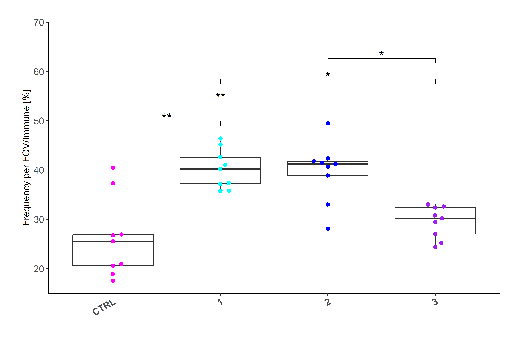
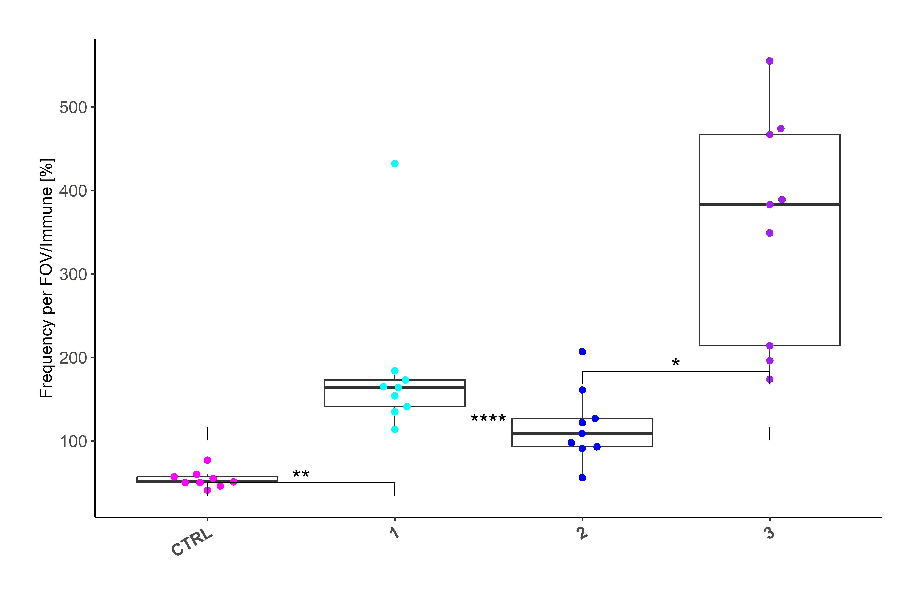
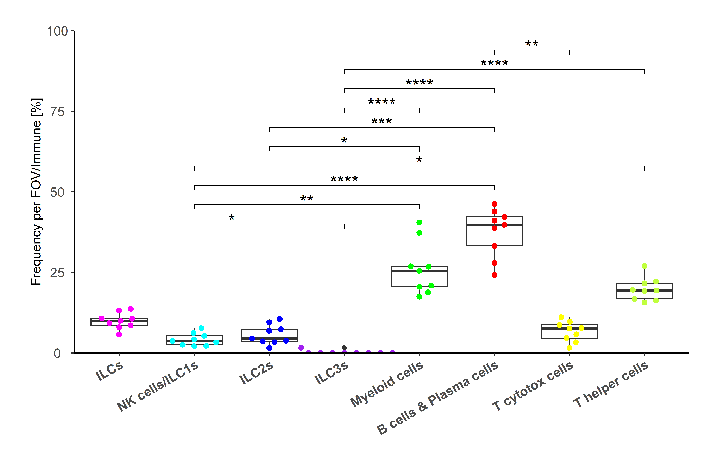

## Libraries


``` r
library(moments)
library(rstatix)
library(Seurat)
library(SeuratObject)
library(dplyr)
library(ggplot2)
library(here)
library(ggbeeswarm)
library(ggpubr)
# library(stringr)
# library(glue)
# library(here)
library(readr)
# library(lubridate)
# library(data.table)
# library(clustree)
# library(magrittr)
# library(ggpubr)
# library(ggrepel)
# library(readxl)
# library(openxlsx)
```

## Parameters


``` r
set.seed(123)

input_dir <- here::here("data")

output_dir <- here::here("1_data_tidying", "Lung_SI_all_cells_all_ALs_files")
dir.create(output_dir)


main_markers <- c(
  "EpCAM", "EMCN", "LYVE1", "PDPN", "PDGFRa", "CD8a", "CD4",
  "CD45", "CD3", "IRF4", "Kappa", "CD11c", "CD127", "GATA3eGFP", "RORgt"
)

immune_markers <- c(
 "CD3", "CD4", "CD8a", "Kappa", "IRF4", "CD11c",
  "CD127", "CD90", "EOMES", "GATA3eGFP", "RORgt", "Ki67",  "KLRG1", "NKp46", "CD117", "Areg", "CCR6", "CD44", "MHCII", "Sca1"
)

ilc_markers <- c(
  "CD3", "CD4", "CD8a",
  "CD127", "CD90", "EOMES", "GATA3eGFP", "RORgt", "KLRG1", "NKp46", "CD117", "CCR6", "MHCII", "Ki67", "Areg", "IRF4", "Sca1", "CD44"
)


cols_nat <- c("magenta", "cyan", "blue", "purple", "green", 
                       "red", "yellow", "olivedrab1", "slateblue1", 
                       "darkcyan", "gold","indianred1", "seagreen", "deeppink", 
                       "orange", "brown", "violet",
                       "deeppink4", "pink", 
                       "grey", "black", "lightgreen", 
                       "#FF0066",  
                       "lightblue", "#FFCC99", "#CC00FF", 
                       "blueviolet",  "goldenrod4", 
                       "navy", "olivedrab", "lightcyan", "seagreen2", "darkviolet", "lightpink", "slateblue4", "olivedrab2")

colfunc <- colorRampPalette(c("darkcyan", "green", "yellow", "magenta", "purple"))
```

# Load data

## SI


``` r
SO.si <- readRDS(paste0(input_dir, "/SO_arcsinh_si_imputed__allALs_allCells.rds"))

SO.si@meta.data$Tissue.area <- gsub("Crypts", "Villi", SO.si@meta.data$Tissue.area)
SO.si <- subset(SO.si, subset = AL2 != "Unresolved")
# SO.villi <- subset(SO.si, subset = Tissue.area == "Villi")
```

Combine Mesenchymal cells I with Fibroblasts and rename mesenchymal cells II


``` r
SO.si$AL2 <- gsub("Epithelia", "Epithelia I" , SO.si$AL2)
SO.si$AL3 <- gsub("Epithelia", "Epithelia I" , SO.si$AL3)

SO.si$AL2 <- gsub("Mesenchymal stromal cells II", "Epithelia II" , SO.si$AL2)
SO.si$AL3 <- gsub("Mesenchymal stromal cells II", "Epithelia II" , SO.si$AL3)

SO.si$AL2 <- gsub("Mesenchymal stromal cells I", "Fibroblasts" , SO.si$AL2)
SO.si$AL3 <- gsub("Mesenchymal stromal cells I", "Fibroblasts" , SO.si$AL3)

SO.si$AL1 <- gsub("Epithelia & stroma", "Epithelia" , SO.si$AL1)

df_si <- FetchData(SO.si, c(
  "nCount_MELC",
  "nFeature_MELC",
  "Location_Center_X",
  "Location_Center_Y",
  "Treatment",
  "FOV",
  "Experiment",
  "Organ",
  "MELC.machine",
  "Tissue.area",
  "Dataset",
  "CellID",
  "AL1",
  "AL2",
  "AL3",
  nrow(SO.si)
))

# adapt order
df_si$AL1 <- factor(df_si$AL1, c(
  "Immune cells", "Vessels & stroma", "Epithelia"
))

df_si$AL2 <- factor(df_si$AL2, c(
  "ILCs",
  "CD8+ CD3- IEL",
  "T helper cells",
  "T cytotox. cells",
  "Myeloid cells",
  "B cells",
  "Plasma cells",
  "Fibroblasts",
  "Blood vessels",
  "Lymphatics",
  "Epithelia I",
  "Epithelia II"
))

df_si$AL3 <- factor(df_si$AL3, c(
  "ILC2s",
  "NK cells/ILC1s/ILC3s",
  "CD8+ CD3- IEL",
  "T helper cells",
  "T cytotox. cells",
  "Myeloid cells",
  "B cells",
  "Plasma cells",
  "Fibroblasts",
  "Blood vessels",
  "Lymphatics",
  "Epithelia I",
  "Epithelia II"
))
```

### SI villi

Quantification proportions


``` r
# info of AL is in long format
df_al1 <- df_si %>%
  reshape2::dcast(., Treatment + Dataset + Tissue.area ~ AL1) %>%
  mutate(TotalCellCountFOV = `Immune cells`+ `Vessels & stroma` + `Epithelia`) %>%
  select(Dataset, Treatment, Tissue.area, TotalCellCountFOV, 
         `Immune cells`, `Vessels & stroma`, `Epithelia`) %>%
  as.data.frame()


df_al2 <- df_si %>%
  reshape2::dcast(., Dataset ~ AL2) %>%
  as.data.frame()


df_al3 <- df_si %>%
  reshape2::dcast(., Dataset ~ AL3)%>%
  select(Dataset, `ILC2s`, `NK cells/ILC1s/ILC3s`) %>%
  as.data.frame()

# combine all ALs together
df_al <- merge(df_al1, df_al2, by = "Dataset")
df_al <- merge(df_al, df_al3, by = "Dataset")

# Treatment
df_al$Treatment <- factor(df_al$Treatment, 
                              levels = c("CTRL", "1", "3"))

# Convert to numeric
df_al[, c(4:length(colnames(df_al)))] <- lapply(df_al[, c(4:length(colnames(df_al)))], as.numeric)

# Check right formats
head(df_al)
```

```
##              Dataset Treatment Tissue.area TotalCellCountFOV Immune cells Vessels & stroma Epithelia ILCs CD8+ CD3- IEL T helper cells T cytotox. cells Myeloid cells B cells Plasma cells Fibroblasts Blood vessels Lymphatics Epithelia I Epithelia II ILC2s NK cells/ILC1s/ILC3s
## 1 CTRL_FOV1_20210706      CTRL       Villi              1341          870              106       365  100            11             18              168           365     158           50          38            24         44         203          162    79                   21
## 2 CTRL_FOV1_20210709      CTRL         ILF              3811         3094              230       487  396            22            190              492          1550     293          151         103            52         75         293          194   137                  259
## 3 CTRL_FOV1_20210730      CTRL       Villi              2348         1409              234       705  140            50             13              195           624     271          116          95           116         23         262          443    46                   94
## 4 CTRL_FOV1_20210810      CTRL       Villi              6218         5289              240       689  414            51            436              815          1802    1329          442          84            98         58         448          241   150                  264
## 5 CTRL_FOV2_20210706      CTRL       Villi              1739         1072               82       585  129            14             35              187           340     257          110          52            15         15         410          175    97                   32
## 6 CTRL_FOV2_20210709      CTRL         ILF              4116         3257              148       711  381            54            155              519          1565     363          220          54            29         65         315          396   248                  133
```


``` r
# Proportion of total cell count per FOV
for (element in c(colnames(df_al)[5:length(colnames(df_al))])) {
  number <- paste0("Prop_", element, "_perTotalCountFOV")
  df_al[number] <- round(df_al[element]/df_al["TotalCellCountFOV"]*100, 1)
}

# Proportion of total immune count per FOV
for (element in c(colnames(df_al)[8:14])) {
  number <- paste0("Prop_", element, "_perTotalImmuneFOV")
  df_al[number] <- round(df_al[element]/df_al["Immune cells"]*100, 1)
}
round(rowSums(df_al[39:length(colnames(df_al))], na.rm = TRUE), 0)
```

```
##  [1] 100 100 100 100 100 100 100 100 100 100 100 100 100 100 100 100 100 100 100 100 100 100 100 100 100 100 100
```

``` r
# Proportion of total immune count per FOV
for (element in c(colnames(df_al)[20:21])) {
  number <- paste0("Prop_", element, "_perTotalImmuneFOV")
  df_al[number] <- round(df_al[element]/df_al["Immune cells"]*100, 1)
}

# Proportion of total ILC count per FOV
for (element in c(colnames(df_al)[20:21])) {
  number <- paste0("Prop_", element, "_perTotalILCsFOV")
  df_al[number] <- round(df_al[element]/df_al["ILCs"]*100, 1)
}
round(rowSums(df_al[48:49], na.rm = TRUE), 0)
```

```
##  [1] 100 100 100 100 100 100 100 100 100 100 100 100 100 100 100 100 100 100 100 100 100 100 100 100 100 100 100
```

``` r
colnames(df_al)
```

```
##  [1] "Dataset"                                     "Treatment"                                   "Tissue.area"                                 "TotalCellCountFOV"                           "Immune cells"                                "Vessels & stroma"                            "Epithelia"                                   "ILCs"                                        "CD8+ CD3- IEL"                               "T helper cells"                              "T cytotox. cells"                            "Myeloid cells"                               "B cells"                                     "Plasma cells"                                "Fibroblasts"                                 "Blood vessels"                               "Lymphatics"                                  "Epithelia I"                                 "Epithelia II"                                "ILC2s"                                       "NK cells/ILC1s/ILC3s"                        "Prop_Immune cells_perTotalCountFOV"          "Prop_Vessels & stroma_perTotalCountFOV"      "Prop_Epithelia_perTotalCountFOV"             "Prop_ILCs_perTotalCountFOV"                  "Prop_CD8+ CD3- IEL_perTotalCountFOV"        
## [27] "Prop_T helper cells_perTotalCountFOV"        "Prop_T cytotox. cells_perTotalCountFOV"      "Prop_Myeloid cells_perTotalCountFOV"         "Prop_B cells_perTotalCountFOV"               "Prop_Plasma cells_perTotalCountFOV"          "Prop_Fibroblasts_perTotalCountFOV"           "Prop_Blood vessels_perTotalCountFOV"         "Prop_Lymphatics_perTotalCountFOV"            "Prop_Epithelia I_perTotalCountFOV"           "Prop_Epithelia II_perTotalCountFOV"          "Prop_ILC2s_perTotalCountFOV"                 "Prop_NK cells/ILC1s/ILC3s_perTotalCountFOV"  "Prop_ILCs_perTotalImmuneFOV"                 "Prop_CD8+ CD3- IEL_perTotalImmuneFOV"        "Prop_T helper cells_perTotalImmuneFOV"       "Prop_T cytotox. cells_perTotalImmuneFOV"     "Prop_Myeloid cells_perTotalImmuneFOV"        "Prop_B cells_perTotalImmuneFOV"              "Prop_Plasma cells_perTotalImmuneFOV"         "Prop_ILC2s_perTotalImmuneFOV"                "Prop_NK cells/ILC1s/ILC3s_perTotalImmuneFOV" "Prop_ILC2s_perTotalILCsFOV"                  "Prop_NK cells/ILC1s/ILC3s_perTotalILCsFOV"
```

Separate by tissue area:


``` r
# separate by tissue area
df_villi <- df_al %>%
  filter(Tissue.area == "Villi")
df_ilf <- df_al %>%
  filter(Tissue.area == "ILF")
```

## Lung


``` r
df <- read_csv(paste0(input_dir, "/20230808_SO_33M_arcsinh_lung_0.04_imputed_quantification_all_cells.csv"), 
    col_types = cols(...1 = col_skip()))

colnames(df) <- gsub("annotation_lvl", "AL", colnames(df))
df$AL3 <- gsub("EMCN CD31 ", "", df$AL3)
df$AL3 <- gsub("LYVE1 CD90 ", "", df$AL3)

CellIDs <- rownames(df)
# 2 TRANSPOSE DF -----
markers <- colnames(df)[12:43]
df_markers <- df %>%
  select(markers)
df_markers <- sapply(df_markers, as.numeric)
df_t <- t(df_markers)
colnames(df_t) <- CellIDs 
df_meta <- df %>%
  select(-markers) 
rownames(df_meta) <- CellIDs 
df_meta$Experiment <- as.factor(df_meta$Experiment)
df_meta$Dataset <- as.factor(df_meta$Dataset)
df_meta$CellID <- as.numeric(df_meta$CellID)
df_meta$Location_Center_X <- as.numeric(df_meta$Location_Center_X)
df_meta$Location_Center_Y <- as.numeric(df_meta$Location_Center_Y)
df_meta$UMAP_1 <- as.numeric(df_meta$UMAP_1)
df_meta$UMAP_2 <- as.numeric(df_meta$UMAP_2)
df_meta$AL1 <- as.factor(df_meta$AL1)
df_meta$AL2 <- as.factor(df_meta$AL2)
df_meta$AL3 <- as.factor(df_meta$AL3)
df_meta$AL4 <- as.factor(df_meta$AL4)

df_meta$max_features <- NULL

SO.lung <- CreateSeuratObject(
  counts = df_t,
  assay = "MELC",
  names.field = 0,
  names.delim = "_",
  meta.data = df_meta,
  project = "SeuratProject"
)


SO.lung@meta.data$AL3 <- factor(SO.lung@meta.data$AL3, levels = c(
  "NK cells/ILC1s", 
  "ILC2s", 
  "ILC3s", 
  "T helper cells", 
  "T cytotox cells", 
  "B cells & Plasma cells", 
  "Myeloid cells", 
  "Blood vessels", 
  "Lymphatics", 
  "LYVE1 CD31 vessels", 
  "Epithelia"
))

new.cluster.ids <- SO.lung@meta.data$AL3
```

Quantification


``` r
df_lung <- read_csv(here::here("data", "20230808_SO_33M_arcsinh_lung_0.04_imputed_quantification_all_ALs_counts.csv"), 
    col_types = cols(...1 = col_skip()))

# Tidying
df_lung <- df_lung %>% 
  rename(`Endothelial blood cells` = `EMCN CD31 Blood vessels`, 
         `Endothelia & stroma` = `Vessels`, 
         `Lymphatics` = `LYVE1 CD90 Lymphatics`) %>%
  select(-c(`ILC2s A`, `ILC2s B`))

# AL1
for (element in c(colnames(df_lung)[6:8])) {
  number <- paste0("Prop_", element, "_perTotalCountFOV")
  df_lung[number] <- round(df_lung[element]/df_lung["TotalCellCountFOV"]*100, 1)
}
round(rowSums(df_lung[20:22], na.rm = TRUE), 0)
```

```
##  [1] 100 100 100 100 100 100 100 100 100 100 100 100 100 100 100 100 100 100 100 100 100 100 100 100 100 100 100 100 100 100 100 100 100 100 100 100
```

``` r
# AL2
for (element in c(colnames(df_lung)[12:19])) {
  number <- paste0("Prop_", element, "_perTotalImmuneFOV")
  df_lung[number] <- round(df_lung[element]/df_lung["Immune cells"]*100, 1)
}
round(rowSums(df_lung[23:27], na.rm = TRUE), 0)
```

```
##  [1] 100 100 100 100 100 100 100 100 100 100 100 100 100 100 100 100 100 100 100 100 100 100 100 100 100 100 100 100 100 100 100 100 100 100 100 100
```

``` r
# AL3
for (element in c(colnames(df_lung)[17:19])) {
  number <- paste0("Prop_", element, "_perTotalILCsFOV")
  df_lung[number] <- round(df_lung[element]/df_lung["ILCs"]*100, 1)
}
round(rowSums(df_lung[31:33], na.rm = TRUE), 0)
```

```
##  [1] 100 100 100 100 100 100 100 100 100 100 100 100 100 100 100 100 100 100 100 100 100 100 100 100 100 100 100 100 100 100 100 100 100 100 100 100
```

``` r
df_lung$`Tissue area` <- "Lung"
df_lung$Organ <- "Lung"

head(df_lung)
```

```
## # A tibble: 6 × 35
##   Dataset    Experiment   FOV Treatment TotalCellCountFOV `Endothelia & stroma` `Immune cells` Epithelia `Endothelial blood cells` `LYVE1 CD31 vessels` Lymphatics `Myeloid cells` `B cells & Plasma cells`  ILCs `T cytotox cells` `T helper cells` `NK cells/ILC1s` ILC2s ILC3s `Prop_Endothelia & stroma_perTotalCountFOV` `Prop_Immune cells_perTotalCountFOV` Prop_Epithelia_perTotalCountFOV `Prop_Myeloid cells_perTotalImmuneFOV` `Prop_B cells & Plasma cells_perTotalImmuneFOV` Prop_ILCs_perTotalImmuneFOV `Prop_T cytotox cells_perTotalImmuneFOV` `Prop_T helper cells_perTotalImmuneFOV` `Prop_NK cells/ILC1s_perTotalImmuneFOV` Prop_ILC2s_perTotalImmuneFOV Prop_ILC3s_perTotalImmuneFOV `Prop_NK cells/ILC1s_perTotalILCsFOV` Prop_ILC2s_perTotalILCsFOV Prop_ILC3s_perTotalILCsFOV `Tissue area` Organ
##   <chr>           <dbl> <dbl> <chr>                 <dbl>                 <dbl>          <dbl>     <dbl>                     <dbl>                <dbl>      <dbl>           <dbl>                    <dbl> <dbl>             <dbl>            <dbl>            <dbl> <dbl> <dbl>                                       <dbl>                                <dbl>                           <dbl>                                  <dbl>                                           <dbl>                       <dbl>                                    <dbl>                                   <dbl>                                   <dbl>                        <dbl>                        <dbl>                                 <dbl>                      <dbl>                      <dbl> <chr>         <chr>
## 1 20210910_1   20210910     1 CTRL                   1107                   816            244        47                       681                   81         54              46                      103    21                27               47               13     8     0                                        73.7                                 22                               4.2                                   18.9                                            42.2                         8.6                                     11.1                                    19.3                                     5.3                          3.3                          0                                    61.9                       38.1                          0 Lung          Lung 
## 2 20210914_1   20210914     1 CTRL                   1201                   847            243       111                       730                   64         53              50                       94    26                19               54               15    11     0                                        70.5                                 20.2                             9.2                                   20.6                                            38.7                        10.7                                      7.8                                    22.2                                     6.2                          4.5                          0                                    57.7                       42.3                          0 Lung          Lung 
## 3 20210922_1   20210922     1 CTRL                    625                   362            190        73                       290                   30         42              77                       53    25                 3               32                4    18     3                                        57.9                                 30.4                            11.7                                   40.5                                            27.9                        13.2                                      1.6                                    16.8                                     2.1                          9.5                          1.6                                  16                         72                           12 Lung          Lung 
## 4 20210910_2   20210910     2 CTRL                   1149                   732            216       201                       586                  104         42              55                       86    23                10               42                8    15     0                                        63.7                                 18.8                            17.5                                   25.5                                            39.8                        10.6                                      4.6                                    19.4                                     3.7                          6.9                          0                                    34.8                       65.2                          0 Lung          Lung 
## 5 20210914_2   20210914     2 CTRL                   1350                   959            286       105                       848                   64         47              50                      132    23                25               56               12    11     0                                        71                                   21.2                             7.8                                   17.5                                            46.2                         8                                        8.7                                    19.6                                     4.2                          3.8                          0                                    52.2                       47.8                          0 Lung          Lung 
## 6 20210922_2   20210922     2 CTRL                    640                   456            153        31                       358                   66         32              57                       37    21                 5               33                5    16     0                                        71.2                                 23.9                             4.8                                   37.3                                            24.2                        13.7                                      3.3                                    21.6                                     3.3                         10.5                          0                                    23.8                       76.2                          0 Lung          Lung
```

``` r
unique(df_lung$`Tissue area`)
```

```
## [1] "Lung"
```

``` r
df_lung[, c(1:4)] <- lapply(df_lung[, c(1:4)], as.character)

nrow(df_lung)
```

```
## [1] 36
```

``` r
colnames(df_lung)
```

```
##  [1] "Dataset"                                       "Experiment"                                    "FOV"                                           "Treatment"                                     "TotalCellCountFOV"                             "Endothelia & stroma"                           "Immune cells"                                  "Epithelia"                                     "Endothelial blood cells"                       "LYVE1 CD31 vessels"                            "Lymphatics"                                    "Myeloid cells"                                 "B cells & Plasma cells"                        "ILCs"                                          "T cytotox cells"                               "T helper cells"                                "NK cells/ILC1s"                                "ILC2s"                                         "ILC3s"                                         "Prop_Endothelia & stroma_perTotalCountFOV"     "Prop_Immune cells_perTotalCountFOV"            "Prop_Epithelia_perTotalCountFOV"               "Prop_Myeloid cells_perTotalImmuneFOV"          "Prop_B cells & Plasma cells_perTotalImmuneFOV"
## [25] "Prop_ILCs_perTotalImmuneFOV"                   "Prop_T cytotox cells_perTotalImmuneFOV"        "Prop_T helper cells_perTotalImmuneFOV"         "Prop_NK cells/ILC1s_perTotalImmuneFOV"         "Prop_ILC2s_perTotalImmuneFOV"                  "Prop_ILC3s_perTotalImmuneFOV"                  "Prop_NK cells/ILC1s_perTotalILCsFOV"           "Prop_ILC2s_perTotalILCsFOV"                    "Prop_ILC3s_perTotalILCsFOV"                    "Tissue area"                                   "Organ"
```

Visualize frequencies:


``` r
df_freq <- df_lung %>%
  select(1, 4, 23:30)

# frequency of myeloid cells at different conditions -----------------------------
df_plot <-   df_freq %>%
  select(Dataset, Treatment, `Prop_Myeloid cells_perTotalImmuneFOV`) %>%
  mutate(Condition = Treatment, 
         value = `Prop_Myeloid cells_perTotalImmuneFOV`, 
         Condition = factor(Condition, levels = c(
           "CTRL", "1", "2", "3"
         )))

# Testing for normal distribution
shapiro.test(df_plot$value)
```

```
## 
## 	Shapiro-Wilk normality test
## 
## data:  df_plot$value
## W = 0.96916, p-value = 0.403
```

``` r
moments::kurtosis(df_plot$value)
```

```
## [1] 2.122535
```

``` r
moments::jarque.test(df_plot$value)
```

```
## 
## 	Jarque-Bera Normality Test
## 
## data:  df_plot$value
## JB = 1.4368, p-value = 0.4875
## alternative hypothesis: greater
```

``` r
# Kruskal-Wallis-test to check for significance between tested groups and effect size
res.kruskal <- df_plot %>% kruskal_test(`value` ~ Condition)
res.kruskal
```

```
## # A tibble: 1 × 6
##   .y.       n statistic    df        p method        
## * <chr> <int>     <dbl> <int>    <dbl> <chr>         
## 1 value    36      20.7     3 0.000122 Kruskal-Wallis
```

``` r
df_plot %>% kruskal_effsize(`value` ~ Condition)
```

```
## # A tibble: 1 × 5
##   .y.       n effsize method  magnitude
## * <chr> <int>   <dbl> <chr>   <ord>    
## 1 value    36   0.553 eta2[H] large
```

``` r
# Pairwise comparisons using Dunn's test
pwc <- df_plot %>% 
  dunn_test(`value` ~ Condition, p.adjust.method = "bonferroni") 
pwc
```

```
## # A tibble: 6 × 9
##   .y.   group1 group2    n1    n2 statistic        p   p.adj p.adj.signif
## * <chr> <chr>  <chr>  <int> <int>     <dbl>    <dbl>   <dbl> <chr>       
## 1 value CTRL   1          9     9    3.49   0.000482 0.00289 **          
## 2 value CTRL   2          9     9    3.48   0.000503 0.00302 **          
## 3 value CTRL   3          9     9    0.593  0.553    1       ns          
## 4 value 1      2          9     9   -0.0112 0.991    1       ns          
## 5 value 1      3          9     9   -2.90   0.00376  0.0226  *           
## 6 value 2      3          9     9   -2.89   0.00390  0.0234  *
```

``` r
# add N to plot
tab <- data.frame(xtabs(~ Condition, data = df_plot))
head(tab)
```

```
##   Condition Freq
## 1      CTRL    9
## 2         1    9
## 3         2    9
## 4         3    9
```

``` r
# Add cell number per cluster to cluster labels
Labels = paste0("n = ", tab$Freq, "")


# Visualization: box plots with p-values
pwc <- pwc %>% add_xy_position(x = "Condition")

ggplot(df_plot, aes(x = Condition, y = value, fill = "Condition"))+
  geom_boxplot(fill="white")+
  geom_beeswarm(aes(color = Condition), size = 2, cex = 2)+
  scale_color_manual(values = cols_nat)+
  theme_classic2()+
  theme(plot.margin=margin(1,0.5,1,1,"cm"),
        axis.text.x = element_text(angle = 30, 
                                   vjust = 1, size = 12, hjust = 1, face = "bold"),
        axis.text.y = element_text(hjust = 0.5, size = 12),
        axis.title.x = element_text(size = 12),
        axis.title.y = element_text(size = 12),
        plot.title = element_text(size =14, hjust = 0.5),
        legend.title = element_text(size =14),
        legend.text = element_text(size =12))+
  stat_pvalue_manual(pwc,
                       hide.ns = TRUE, size = 6,
                       step.increase = 0.13, y.position = 50) +
  xlab(NULL)+
  ylab("Frequency per FOV/Immune [%]")+
  scale_y_continuous(expand = c(0, 0), limits = c(15,70))+
  NoLegend()
```



``` r
df_plot %>%
  group_by(Condition) %>%
  summarise(median = median(value))
```

```
## # A tibble: 4 × 2
##   Condition median
##   <fct>      <dbl>
## 1 CTRL        25.5
## 2 1           40.2
## 3 2           41.2
## 4 3           30.2
```

``` r
# total count of myeloid cells at different conditions -----------------------------
df_plot <-   df_lung %>%
  select(Dataset, Treatment, `Myeloid cells`) %>%
  mutate(Condition = Treatment, 
         value = `Myeloid cells`, 
         Condition = factor(Condition, levels = c(
           "CTRL", "1", "2", "3"
         )))

# Testing for normal distribution
shapiro.test(df_plot$value)
```

```
## 
## 	Shapiro-Wilk normality test
## 
## data:  df_plot$value
## W = 0.81941, p-value = 4.053e-05
```

``` r
moments::kurtosis(df_plot$value)
```

```
## [1] 3.488854
```

``` r
moments::jarque.test(df_plot$value)
```

```
## 
## 	Jarque-Bera Normality Test
## 
## data:  df_plot$value
## JB = 9.9302, p-value = 0.006977
## alternative hypothesis: greater
```

``` r
# Kruskal-Wallis-test to check for significance between tested groups and effect size
res.kruskal <- df_plot %>% kruskal_test(`value` ~ Condition)
res.kruskal
```

```
## # A tibble: 1 × 6
##   .y.       n statistic    df          p method        
## * <chr> <int>     <dbl> <int>      <dbl> <chr>         
## 1 value    36      28.6     3 0.00000271 Kruskal-Wallis
```

``` r
df_plot %>% kruskal_effsize(`value` ~ Condition)
```

```
## # A tibble: 1 × 5
##   .y.       n effsize method  magnitude
## * <chr> <int>   <dbl> <chr>   <ord>    
## 1 value    36   0.800 eta2[H] large
```

``` r
# Pairwise comparisons using Dunn's test
pwc <- df_plot %>% 
  dunn_test(`value` ~ Condition, p.adjust.method = "bonferroni") 
pwc
```

```
## # A tibble: 6 × 9
##   .y.   group1 group2    n1    n2 statistic           p      p.adj p.adj.signif
## * <chr> <chr>  <chr>  <int> <int>     <dbl>       <dbl>      <dbl> <chr>       
## 1 value CTRL   1          9     9      3.40 0.000672    0.00403    **          
## 2 value CTRL   2          9     9      2.04 0.0418      0.251      ns          
## 3 value CTRL   3          9     9      5.17 0.000000236 0.00000142 ****        
## 4 value 1      2          9     9     -1.36 0.172       1          ns          
## 5 value 1      3          9     9      1.77 0.0771      0.463      ns          
## 6 value 2      3          9     9      3.13 0.00173     0.0104     *
```

``` r
# add N to plot
tab <- data.frame(xtabs(~ Condition, data = df_plot))
head(tab)
```

```
##   Condition Freq
## 1      CTRL    9
## 2         1    9
## 3         2    9
## 4         3    9
```

``` r
# Add cell number per cluster to cluster labels
Labels = paste0("n = ", tab$Freq, "")


# Visualization: box plots with p-values
pwc <- pwc %>% add_xy_position(x = "Condition")

ggplot(df_plot, aes(x = Condition, y = value, fill = "Condition"))+
  geom_boxplot(fill="white")+
  geom_beeswarm(aes(color = Condition), size = 2, cex = 2)+
  scale_color_manual(values = cols_nat)+
  theme_classic2()+
  theme(plot.margin=margin(1,0.5,1,1,"cm"),
        axis.text.x = element_text(angle = 30, 
                                   vjust = 1, size = 12, hjust = 1, face = "bold"),
        axis.text.y = element_text(hjust = 0.5, size = 12),
        axis.title.x = element_text(size = 12),
        axis.title.y = element_text(size = 12),
        plot.title = element_text(size =14, hjust = 0.5),
        legend.title = element_text(size =14),
        legend.text = element_text(size =12))+
  stat_pvalue_manual(pwc,
                       hide.ns = TRUE, size = 6,
                       step.increase = 0.13, y.position = 50) +
  xlab(NULL)+
  ylab("Frequency per FOV/Immune [%]")+
  # scale_y_continuous(expand = c(0, 0), limits = c(15,70))+
  NoLegend()
```



``` r
df_plot %>%
  group_by(Condition) %>%
  summarise(median = median(value))
```

```
## # A tibble: 4 × 2
##   Condition median
##   <fct>      <dbl>
## 1 CTRL          51
## 2 1            164
## 3 2            109
## 4 3            383
```

``` r
# frequency of different celltypes under homeostatic conditions -----------------
df_plot <-   df_freq %>%
  filter(Treatment == "CTRL") %>%
  tidyr::pivot_longer(cols = -c(Dataset, Treatment), names_to = "CellType") %>%
  mutate(CellType = gsub("Prop_|_perTotalImmuneFOV", "", CellType), 
         CellType = factor(CellType, levels = c(
           "ILCs",
           "NK cells/ILC1s",
           "ILC2s",
           "ILC3s",
           "Myeloid cells",
           "B cells & Plasma cells",
           "T cytotox cells",
           "T helper cells"
         ))
  )

# Testing for normal distribution
shapiro.test(df_plot$value)
```

```
## 
## 	Shapiro-Wilk normality test
## 
## data:  df_plot$value
## W = 0.87294, p-value = 2.952e-06
```

``` r
moments::kurtosis(df_plot$value)
```

```
## [1] 2.972862
```

``` r
moments::jarque.test(df_plot$value)
```

```
## 
## 	Jarque-Bera Normality Test
## 
## data:  df_plot$value
## JB = 11.966, p-value = 0.002521
## alternative hypothesis: greater
```

``` r
# Kruskal-Wallis-test to check for significance between tested groups and effect size
res.kruskal <- df_plot %>% kruskal_test(`value` ~ CellType)
res.kruskal
```

```
## # A tibble: 1 × 6
##   .y.       n statistic    df        p method        
## * <chr> <int>     <dbl> <int>    <dbl> <chr>         
## 1 value    72      63.9     7 2.47e-11 Kruskal-Wallis
```

``` r
df_plot %>% kruskal_effsize(`value` ~ CellType)
```

```
## # A tibble: 1 × 5
##   .y.       n effsize method  magnitude
## * <chr> <int>   <dbl> <chr>   <ord>    
## 1 value    72   0.890 eta2[H] large
```

``` r
# Pairwise comparisons using Dunn's test
pwc <- df_plot %>% 
  dunn_test(`value` ~ CellType, p.adjust.method = "bonferroni") 
pwc
```

```
## # A tibble: 28 × 9
##    .y.   group1         group2                    n1    n2 statistic        p   p.adj p.adj.signif
##  * <chr> <chr>          <chr>                  <int> <int>     <dbl>    <dbl>   <dbl> <chr>       
##  1 value ILCs           NK cells/ILC1s             9     9    -1.83  0.0670   1       ns          
##  2 value ILCs           ILC2s                      9     9    -1.36  0.174    1       ns          
##  3 value ILCs           ILC3s                      9     9    -3.30  0.000959 0.0269  *           
##  4 value ILCs           Myeloid cells              9     9     2.05  0.0408   1       ns          
##  5 value ILCs           B cells & Plasma cells     9     9     2.94  0.00333  0.0931  ns          
##  6 value ILCs           T cytotox cells            9     9    -0.975 0.330    1       ns          
##  7 value ILCs           T helper cells             9     9     1.49  0.135    1       ns          
##  8 value NK cells/ILC1s ILC2s                      9     9     0.473 0.636    1       ns          
##  9 value NK cells/ILC1s ILC3s                      9     9    -1.47  0.141    1       ns          
## 10 value NK cells/ILC1s Myeloid cells              9     9     3.88  0.000106 0.00296 **          
## # ℹ 18 more rows
```

``` r
# add N to plot
tab <- data.frame(xtabs(~ CellType, data = df_plot))
head(tab)
```

```
##                 CellType Freq
## 1                   ILCs    9
## 2         NK cells/ILC1s    9
## 3                  ILC2s    9
## 4                  ILC3s    9
## 5          Myeloid cells    9
## 6 B cells & Plasma cells    9
```

``` r
# Add cell number per cluster to cluster labels
Labels = paste0("n = ", tab$Freq, "")


# Visualization: box plots with p-values
pwc <- pwc %>% add_xy_position(x = "CellType")

ggplot(df_plot, aes(x = CellType, y = value, fill = "CellType"))+
  geom_boxplot(fill="white")+
  geom_beeswarm(aes(color = CellType), size = 2, cex = 2)+
  scale_color_manual(values = cols_nat)+
  theme_classic2()+
  theme(plot.margin=margin(1,0.5,1,1,"cm"),
        axis.text.x = element_text(angle = 30, 
                                   vjust = 1, size = 12, hjust = 1, face = "bold"),
        axis.text.y = element_text(hjust = 0.5, size = 12),
        axis.title.x = element_text(size = 12),
        axis.title.y = element_text(size = 12),
        plot.title = element_text(size =14, hjust = 0.5),
        legend.title = element_text(size =14),
        legend.text = element_text(size =12))+
  stat_pvalue_manual(pwc,
                       hide.ns = TRUE, size = 6,
                       step.increase = 0.13, y.position = 40) +
  xlab(NULL)+
  ylab("Frequency per FOV/Immune [%]")+
  scale_y_continuous(expand = c(0, 0), limits = c(0,100))+
  NoLegend()
```



``` r
df_lung %>%
  select(Dataset, Treatment, `Myeloid cells`) %>%
  mutate(Condition = Treatment, 
         value = `Myeloid cells`, 
         Condition = factor(Condition, levels = c(
           "CTRL", "1", "2", "3"
         ))) %>%
  group_by(Condition) %>%
  summarise(median = median(value))
```

```
## # A tibble: 4 × 2
##   Condition median
##   <fct>      <dbl>
## 1 CTRL          51
## 2 1            164
## 3 2            109
## 4 3            383
```

``` r
df_lung %>%
  select(Dataset, Treatment, `Myeloid cells`, TotalCellCountFOV) %>%
  mutate(Condition = Treatment, 
         value = `Myeloid cells`/TotalCellCountFOV*100, 
         Condition = factor(Condition, levels = c(
           "CTRL", "1", "2", "3"
         ))) %>%
  group_by(Condition) %>%
  summarise(median = median(value))
```

```
## # A tibble: 4 × 2
##   Condition median
##   <fct>      <dbl>
## 1 CTRL        4.79
## 2 1           9.28
## 3 2          10.2 
## 4 3          10.3
```

``` r
df_lung %>%
  select(Dataset, Treatment, `Myeloid cells`, `Immune cells`) %>%
  mutate(Condition = Treatment, 
         value = `Myeloid cells`/`Immune cells`*100, 
         Condition = factor(Condition, levels = c(
           "CTRL", "1", "2", "3"
         ))) %>%
  group_by(Condition) %>%
  summarise(median = median(value))
```

```
## # A tibble: 4 × 2
##   Condition median
##   <fct>      <dbl>
## 1 CTRL        25.5
## 2 1           40.2
## 3 2           41.2
## 4 3           30.2
```

# Save data

## Session Information


``` r
write.csv(df_lung, paste0(output_dir, "/lung_proportions.csv"))
write.csv(df_si, paste0(output_dir, "/si_all_cells_all_ALs.csv"))
write.csv(df_villi, paste0(output_dir, "/si_villi_proportions.csv"))
write.csv(df_ilf, paste0(output_dir, "/si_ilf_proportions.csv"))
saveRDS(SO.si, paste0(output_dir, "/si_all_cells_all_ALs.rds"))
saveRDS(SO.lung, paste0(output_dir, "/lung_all_cells_all_ALs.rds"))
save.image(paste0(output_dir, "/environment.RData"))
sessionInfo()
```

```
## R version 4.4.2 (2024-10-31 ucrt)
## Platform: x86_64-w64-mingw32/x64
## Running under: Windows 10 x64 (build 19045)
## 
## Matrix products: default
## 
## 
## locale:
## [1] LC_COLLATE=English_Germany.utf8  LC_CTYPE=English_Germany.utf8    LC_MONETARY=English_Germany.utf8 LC_NUMERIC=C                     LC_TIME=English_Germany.utf8    
## 
## time zone: Europe/Berlin
## tzcode source: internal
## 
## attached base packages:
## [1] stats     graphics  grDevices utils     datasets  methods   base     
## 
## other attached packages:
##  [1] readr_2.1.5        ggpubr_0.6.0       ggbeeswarm_0.7.2   here_1.0.1         ggplot2_3.5.2      dplyr_1.1.4        Seurat_5.2.1       SeuratObject_5.1.0 sp_2.2-0           rstatix_0.7.2      moments_0.14.1    
## 
## loaded via a namespace (and not attached):
##   [1] RColorBrewer_1.1-3     rstudioapi_0.17.1      jsonlite_1.9.1         magrittr_2.0.3         spatstat.utils_3.1-3   farver_2.1.2           rmarkdown_2.29         vctrs_0.6.5            ROCR_1.0-11            spatstat.explore_3.4-2 htmltools_0.5.8.1      broom_1.0.8            Formula_1.2-5          sass_0.4.10            sctransform_0.4.1      parallelly_1.45.0      KernSmooth_2.23-24     bslib_0.9.0            htmlwidgets_1.6.4      ica_1.0-3              plyr_1.8.9             plotly_4.11.0          zoo_1.8-13             cachem_1.1.0           igraph_2.1.4           mime_0.13              lifecycle_1.0.4        pkgconfig_2.0.3        Matrix_1.7-1           R6_2.6.1               fastmap_1.2.0          fitdistrplus_1.2-2     future_1.58.0          shiny_1.10.0           digest_0.6.37          colorspace_2.1-1       patchwork_1.3.1        rprojroot_2.0.4        tensor_1.5.1           RSpectra_0.16-2        irlba_2.3.5.1          labeling_0.4.3         progressr_0.15.1       spatstat.sparse_3.1-0  httr_1.4.7             polyclip_1.10-7        abind_1.4-8            compiler_4.4.2         bit64_4.6.0-1          withr_3.0.2            backports_1.5.0       
##  [52] carData_3.0-5          fastDummies_1.7.5      ggsignif_0.6.4         MASS_7.3-61            tools_4.4.2            vipor_0.4.7            lmtest_0.9-40          beeswarm_0.4.0         httpuv_1.6.15          future.apply_1.20.0    goftest_1.2-3          glue_1.8.0             nlme_3.1-166           promises_1.3.2         grid_4.4.2             Rtsne_0.17             cluster_2.1.6          reshape2_1.4.4         generics_0.1.4         gtable_0.3.6           spatstat.data_3.1-6    tzdb_0.4.0             tidyr_1.3.1            hms_1.1.3              data.table_1.17.0      utf8_1.2.6             car_3.1-3              spatstat.geom_3.3-6    RcppAnnoy_0.0.22       ggrepel_0.9.6          RANN_2.6.2             pillar_1.10.2          stringr_1.5.1          vroom_1.6.5            spam_2.11-1            RcppHNSW_0.6.0         later_1.4.1            splines_4.4.2          lattice_0.22-6         bit_4.6.0              survival_3.7-0         deldir_2.0-4           tidyselect_1.2.1       miniUI_0.1.2           pbapply_1.7-2          knitr_1.50             gridExtra_2.3          scattermore_1.2        xfun_0.51              matrixStats_1.5.0      stringi_1.8.4         
## [103] lazyeval_0.2.2         yaml_2.3.10            evaluate_1.0.4         codetools_0.2-20       tibble_3.2.1           cli_3.6.3              uwot_0.2.3             xtable_1.8-4           reticulate_1.42.0      jquerylib_0.1.4        Rcpp_1.0.14            globals_0.18.0         spatstat.random_3.3-3  png_0.1-8              spatstat.univar_3.1-2  parallel_4.4.2         dotCall64_1.2          listenv_0.9.1          viridisLite_0.4.2      scales_1.4.0           ggridges_0.5.6         crayon_1.5.3           purrr_1.0.4            rlang_1.1.5            cowplot_1.1.3
```
