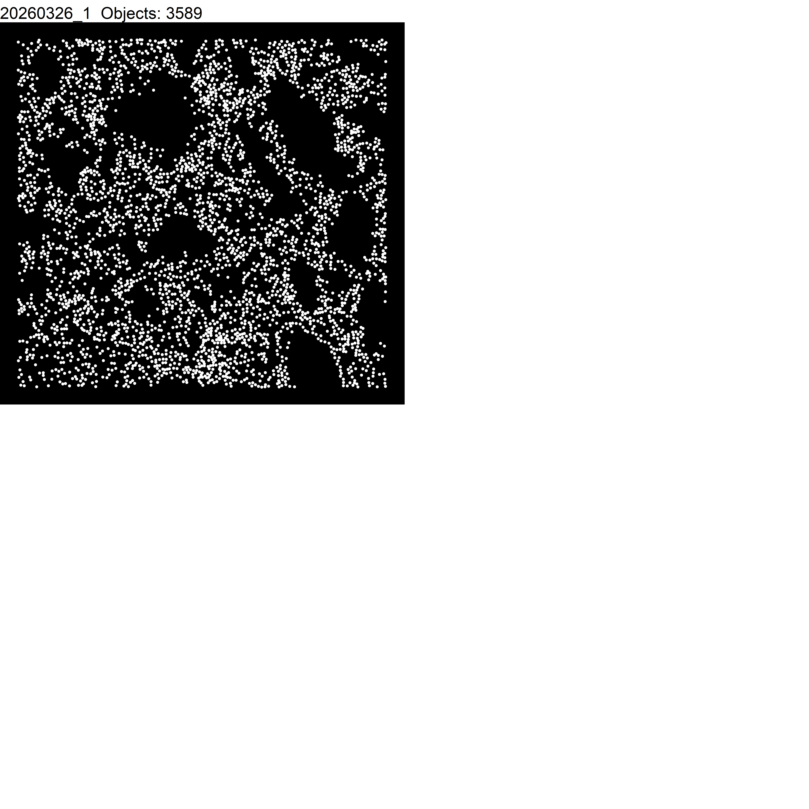

## Libraries


``` r
library(readr) 
library(tidyverse) 
library(tidyr) 
library(dplyr) 
library(here) 
library(ggpubr)
library(readxl)
```

## Parameters


``` r
set.seed(8) 

cols_treat <- c("darkcyan", "gold", "deeppink", "slateblue")  

cols_fov <- c("slateblue1",              
              "darkcyan",                         
              "seagreen2")   

cols_exp <- c("darkcyan", "seagreen2", "lightgreen",     
              "gold", "yellow", "olivedrab1",            
              "deeppink","#FF0066", "magenta",           
              "slateblue", "blueviolet", "purple")   

cols_nat <- c("darkcyan", "seagreen2", "lightgreen",              
              "gold", "yellow", "olivedrab1",              
              "deeppink","#FF0066", "magenta",           
              "slateblue", "blueviolet", "purple",               
              "cyan", "blue", "navyblue",               
              "brown", "red", "orange", "grey")  
```

# Import data

## Define directories


``` r
# define path to general data main directory
data_dir_main <- here("data")

# define path to input directory
input_dir <- here("data", "Feature_extraction_python")

# define output folder for saing the environment etc. 
output_env_dir <- here("1_revisions", "1_Data_loading_merging_tidying_files") 
dir.create(output_env_dir)
```

## Load csv output files from python feature extraction

Define function to automatically extract file information:


``` r
#' get file name ----
get_file_name = function(cells_csv){
  cells <- read.csv(paste0(input_dir, "/", cells_csv), header=TRUE) # read the cells csv file
  filename <- gsub(".*/", "", cells_csv) # remove anything before the last underscore; removes "cell.csv"
  filename <- gsub("_cell_masks.csv", "", filename)
  return(filename)
  
}
```


``` r
my_data_list <- list.files(path = input_dir, pattern = "membrane.csv") # creates a list with all the cell.csv files
my_data_list
```

```
## [1] "20260326_1_segmentation_label_cell_membrane.csv"
```

``` r
file <- my_data_list[1]

df_raw_mean <- data.frame()
df_raw_median <- data.frame()

filename <- gsub(".csv", "", file)
# opens the nuclei csv file
df_samp <- read.csv(paste0(input_dir, "/", file), header=TRUE) 
df_samp$Experiment_ID <- gsub("_segmentation_label_cell_membrane", "", filename)

# filter data for mean
df_samp_mean <- df_samp %>%
  # delete everything after the first dot
  mutate(Label = gsub("Vimentin", "VIM", Label), 
         Label = gsub("Fibronectin", "FN", Label), 
         Label = gsub("aGFP", "GATA3eGFP", Label), 
         Label = gsub("Emcn", "EMCN", Label), 
         Label = gsub("\\..*", "", Label), 
         Loc_X = X, 
         Loc_Y = Y
         ) %>%
  select(Label, Mean, Loc_X, Loc_Y, Experiment_ID, Area) %>%
  # change long format to wide format
  pivot_wider(names_from = Label, values_from = c(Mean))

# filter data for median
df_samp_median <- df_samp %>%
  # delete everything after the first dot
  mutate(Label = gsub("Vimentin", "VIM", Label), 
         Label = gsub("Fibronectin", "FN", Label), 
         Label = gsub("aGFP", "GATA3eGFP", Label), 
         Label = gsub("Emcn", "EMCN", Label), 
         Label = gsub("\\..*", "", Label), 
         Loc_X = X, 
         Loc_Y = Y
         ) %>%
  select(Label, Median, Loc_X, Loc_Y, Experiment_ID, Area) %>%
  # change long format to wide format
  pivot_wider(names_from = Label, values_from = c(Median))

df_raw_mean <- data.table::rbindlist(list(df_raw_mean, df_samp_mean), 
                                     fill = TRUE)
df_raw_median <- data.table::rbindlist(list(df_raw_median, df_samp_median), 
                                       fill = TRUE)


# # loop for loading all files and combining them
# for (file in my_data_list) {
#   filename <- gsub(".csv", "", file)
#   # opens the nuclei csv file
#   df_samp <- read.csv(paste0(input_dir, "/", file), header=TRUE) 
#   df_samp$MELC_ID <- filename
#   
#   # filter data for mean
#   df_samp_mean <- df_samp %>%
#     # delete everything after the first dot
#     mutate(Label = gsub("ICAM1", "ICAM", Label), 
#            Label = gsub("ICAM", "ICAM1", Label), 
#            Label = gsub("\\..*", "", Label), 
#            Loc_X = X, 
#            Loc_Y = Y
#            ) %>%
#     select(Label, Mean, Loc_X, Loc_Y, MELC_ID, Area) %>%
#     # change long format to wide format
#     pivot_wider(names_from = Label, values_from = c(Mean))
#   
#   # filter data for median
#   df_samp_median <- df_samp %>%
#     # delete everything after the first dot
#     mutate(Label = gsub("ICAM1", "ICAM", Label), 
#            Label = gsub("ICAM", "ICAM1", Label), 
#            Label = gsub("\\..*", "", Label), 
#            Loc_X = X, 
#            Loc_Y = Y
#            ) %>%
#     select(Label, Median, Loc_X, Loc_Y, MELC_ID, Area) %>%
#     # change long format to wide format
#     pivot_wider(names_from = Label, values_from = c(Median))
#   
#   df_raw_mean <- data.table::rbindlist(list(df_raw_mean, df_samp_mean), 
#                                        fill = TRUE)
#   df_raw_median <- data.table::rbindlist(list(df_raw_median, df_samp_median), 
#                                          fill = TRUE)
# 
# }
```

# Tidying data

The data is one data frame but in a long format. Names are tidied and the format is changed to the wide format.


``` r
# change order of columns, so that all markers first, followed by Loc_X and Loc_Y
df_raw_mean <- df_raw_mean %>%
  select(5:length(colnames(df_raw_mean)), 1:4)

df_raw_median <- df_raw_median %>%
  select(5:length(colnames(df_raw_median)), 1:4)

# create individual cell ID
df_raw_mean$CellID <- rownames(df_raw_mean)
df_raw_median$CellID <- rownames(df_raw_median)
```

## Visualize data

Depict nuclei in x and y:


``` r
melced_samples <- unique(df_raw_mean$Experiment_ID)
x_co <- 2048
y_co <- 2048

plot_list <- lapply(melced_samples, function(sample) {
  df_samp <- df_raw_mean %>%
    filter(Experiment_ID == sample)
  
  n_cells <- nrow(df_samp)
  
  ggplot(df_samp, aes(x = Loc_X, y = Loc_Y)) +
    geom_point(size = 1, shape = 20, color = "white") +
    theme_void() +
    theme(legend.title = element_blank()) +
    theme(panel.background = element_rect(fill = 'black', color = 'black', size = 0)) +
    ggtitle(paste(sample, " Objects:", n_cells))
})

ggarrange(plotlist = plot_list, ncol = 2, nrow = 2)
```



## Load meta data


``` r
df_meta <- read_excel(paste0(data_dir_main, "/GATA3eGFP_sample_list.xlsx"), 
    sheet = "MELC experiments")

df_meta <- df_meta %>%
  mutate(Run = Run_ID, 
         MELC_ID = paste0(Experiment_ID, "_", Condition)) %>%
  as.data.frame()

head(df_meta)
```

```
##   Experiment_ID   Run_ID Sample Condition  Reporter Machine comment      Run         MELC_ID
## 1    20260212_1 20260212     94        D3 GATA3eGFP Juergen      NA 20260212   20260212_1_D3
## 2    20260212_2 20260212     96        D3 GATA3eGFP Juergen      NA 20260212   20260212_2_D3
## 3    20260212_3 20260212     72      CTRL GATA3eGFP Juergen      NA 20260212 20260212_3_CTRL
## 4    20260304_1 20260304     94        D3 GATA3eGFP Juergen      NA 20260304   20260304_1_D3
## 5    20260304_2 20260304     96        D3 GATA3eGFP Juergen      NA 20260304   20260304_2_D3
## 6    20260304_3 20260304     72      CTRL GATA3eGFP Juergen      NA 20260304 20260304_3_CTRL
```

Combine metadata and feature data:


``` r
df_raw_mean <- merge(df_raw_mean, df_meta, by = "Experiment_ID")
df_raw_mean <- df_raw_mean %>%
  select(-Experiment_ID, everything(), Experiment_ID) %>%
  # introduce a column to store the extracted fluorescence information
  mutate(extracted_fluorescence = "mean")

df_raw_median <- merge(df_raw_median, df_meta, by = "Experiment_ID")
df_raw_median <- df_raw_median %>%
  select(-Experiment_ID, everything(), Experiment_ID) %>%
  # introduce a column to store the extracted fluorescence information
  mutate(extracted_fluorescence = "median")

head(df_raw_mean)
```

```
## Key: <Experiment_ID>
##     B220    CD105 CD11b    CD11c    CD127    CD138      CD146    CD163 CD169  CD19     CD200   CD3     CD31      CD4      CD44         CD45     CD49a  CD68  CD80  CD8a      CD90      DAPI EOMES  EMCN    EpCAM       FN  GZMA   Gr1       ICOS    KLRG1    Kappa     Ki67    LYVE1  Ly6G     MHCII  Mac2      PD1   PDGFRa      PDPN  PRF1 RORgt      SMA      ST2        Sca1 SiglecF  TBET TCRab         VIM GATA3eGFP    Loc_X    Loc_Y  Area CellID   Run_ID Sample Condition  Reporter Machine comment      Run       MELC_ID Experiment_ID extracted_fluorescence
##    <num>    <num> <num>    <num>    <num>    <num>      <num>    <num> <num> <num>     <num> <num>    <num>    <num>     <num>        <num>     <num> <num> <num> <num>     <num>     <num> <num> <num>    <num>    <num> <num> <num>      <num>    <num>    <num>    <num>    <num> <num>     <num> <num>    <num>    <num>     <num> <num> <num>    <num>    <num>       <num>   <num> <num> <num>       <num>     <num>    <num>    <num> <int> <char>    <num> <char>    <char>    <char>  <char>  <lgcl>    <num>        <char>        <char>                 <char>
## 1:     0 5910.621     0 0.000000   0.0000    0.000   361.2879    0.000     0     0  5688.273     0 636.7273    0.000    0.0000     0.000000  6298.985     0     0     0     0.000  3854.803     0     0     0.00     0.00     0     0    0.00000   0.0000  0.00000 0.000000 299.5454     0   0.00000     0  0.00000 3822.197 7305.8032     0     0     0.00  0.00000 12767.39355       0     0     0    25.69697         0 1351.000 2.106061    66      1 20260326     96        D3 GATA3eGFP   Jutta      NA 20260326 20260326_1_D3    20260326_1                   mean
## 2:     0    0.000     0 0.000000   0.0000    0.000 34198.9180    0.000     0     0 13251.765     0   0.0000    0.000 1324.0294     8.110294  3815.088     0     0     0 27611.471  3068.978     0     0     0.00 13145.18     0     0    0.00000 653.1691 12.41177 0.000000   0.0000     0  34.54412     0 22.80882 1514.610  569.3162     0     0 14038.79 89.25735    18.22059       0     0     0  2733.09570         0 1446.603 2.764706   136      2 20260326     96        D3 GATA3eGFP   Jutta      NA 20260326 20260326_1_D3    20260326_1                   mean
## 3:     0    0.000     0 0.000000   0.0000    0.000  6997.4775 3023.179     0     0     0.000     0   0.0000    0.000    0.0000     0.000000  9073.149     0     0     0  1493.716  3279.358     0     0     0.00     0.00     0     0    0.00000   0.0000  0.00000 0.000000   0.0000     0   0.00000     0  0.00000 1256.149    0.0000     0     0 45108.34  0.00000     0.00000       0     0     0  1582.25378         0 1883.522 2.701493    67      3 20260326     96        D3 GATA3eGFP   Jutta      NA 20260326 20260326_1_D3    20260326_1                   mean
## 4:     0 3576.706     0 0.000000   0.0000    0.000   110.8693    0.000     0     0  7434.732     0 619.4445    0.000    0.0000     0.000000 17363.379     0     0     0     0.000 11608.189     0     0     0.00     0.00     0     0    0.00000   0.0000  0.00000 0.000000 735.9346     0   0.00000     0  0.00000 3704.000 1664.7974     0     0     0.00  0.00000  6014.59473       0     0     0   126.66666         0 1369.118 3.222222   153      4 20260326     96        D3 GATA3eGFP   Jutta      NA 20260326 20260326_1_D3    20260326_1                   mean
## 5:     0    0.000     0 0.000000   0.0000 8350.433     0.0000    0.000     0     0     0.000     0   0.0000    0.000  135.6757     0.000000     0.000     0     0     0     0.000  1641.892     0     0 28119.97     0.00     0     0   46.93243   0.0000  0.00000 2.594594   0.0000     0   0.00000     0  0.00000    0.000    0.0000     0     0     0.00  0.00000     0.00000       0     0     0     0.00000         0 1532.635 3.256757    74      5 20260326     96        D3 GATA3eGFP   Jutta      NA 20260326 20260326_1_D3    20260326_1                   mean
## 6:     0    0.000     0 3.017647 254.1471    0.000     0.0000    0.000     0     0     0.000     0   0.0000 6770.741  233.3529 10736.653320  9607.041     0     0     0 10579.023  3886.688     0     0     0.00     0.00     0     0 1572.77063   0.0000  0.00000 0.000000   0.0000     0 261.90588     0  0.00000    0.000    0.0000     0     0 40228.92  0.00000     0.00000       0     0     0 23503.04688         0 1991.047 3.482353   170      6 20260326     96        D3 GATA3eGFP   Jutta      NA 20260326 20260326_1_D3    20260326_1                   mean
```

``` r
head(df_raw_median)
```

```
## Key: <Experiment_ID>
##     B220 CD105 CD11b CD11c CD127 CD138 CD146 CD163 CD169  CD19   CD200   CD3  CD31    CD4  CD44  CD45   CD49a  CD68  CD80  CD8a    CD90   DAPI EOMES  EMCN EpCAM    FN  GZMA   Gr1  ICOS KLRG1 Kappa  Ki67 LYVE1  Ly6G MHCII  Mac2   PD1 PDGFRa  PDPN  PRF1 RORgt   SMA   ST2  Sca1 SiglecF  TBET TCRab   VIM GATA3eGFP    Loc_X    Loc_Y  Area CellID   Run_ID Sample Condition  Reporter Machine comment      Run       MELC_ID Experiment_ID extracted_fluorescence
##    <num> <num> <num> <num> <num> <num> <num> <num> <num> <num>   <num> <num> <num>  <num> <num> <num>   <num> <num> <num> <num>   <num>  <num> <num> <num> <num> <num> <num> <num> <num> <num> <num> <num> <num> <num> <num> <num> <num>  <num> <num> <num> <num> <num> <num> <num>   <num> <num> <num> <num>     <num>    <num>    <num> <int> <char>    <num> <char>    <char>    <char>  <char>  <lgcl>    <num>        <char>        <char>                 <char>
## 1:     0  5153     0     0     0     0     0     0     0     0  5073.5     0     0    0.0     0     0  5799.5     0     0     0     0.0 2492.5     0     0     0     0     0     0     0     0     0     0     0     0     0     0     0   2629  8142     0     0     0     0 10671       0     0     0     0         0 1351.000 2.106061    66      1 20260326     96        D3 GATA3eGFP   Jutta      NA 20260326 20260326_1_D3    20260326_1                 median
## 2:     0     0     0     0     0     0 33321     0     0     0 14760.0     0     0    0.0     0     0  2161.5     0     0     0 28264.5  800.0     0     0     0  8642     0     0     0     0     0     0     0     0     0     0     0      0     0     0     0 13110     0     0       0     0     0     0         0 1446.603 2.764706   136      2 20260326     96        D3 GATA3eGFP   Jutta      NA 20260326 20260326_1_D3    20260326_1                 median
## 3:     0     0     0     0     0     0  6039  1948     0     0     0.0     0     0    0.0     0     0 10109.0     0     0     0  1614.0 1781.0     0     0     0     0     0     0     0     0     0     0     0     0     0     0     0      0     0     0     0 47761     0     0       0     0     0   975         0 1883.522 2.701493    67      3 20260326     96        D3 GATA3eGFP   Jutta      NA 20260326 20260326_1_D3    20260326_1                 median
## 4:     0  3230     0     0     0     0     0     0     0     0  7642.0     0     0    0.0     0     0 14906.0     0     0     0     0.0 9480.0     0     0     0     0     0     0     0     0     0     0   270     0     0     0     0    207     0     0     0     0     0  6388       0     0     0     0         0 1369.118 3.222222   153      4 20260326     96        D3 GATA3eGFP   Jutta      NA 20260326 20260326_1_D3    20260326_1                 median
## 5:     0     0     0     0     0  5590     0     0     0     0     0.0     0     0    0.0     0     0     0.0     0     0     0     0.0 1504.5     0     0 28075     0     0     0     0     0     0     0     0     0     0     0     0      0     0     0     0     0     0     0       0     0     0     0         0 1532.635 3.256757    74      5 20260326     96        D3 GATA3eGFP   Jutta      NA 20260326 20260326_1_D3    20260326_1                 median
## 6:     0     0     0     0     0     0     0     0     0     0     0.0     0     0 4153.5     0  6829 11633.5     0     0     0  7596.5 2590.5     0     0     0     0     0     0     0     0     0     0     0     0     0     0     0      0     0     0     0 39430     0     0       0     0     0 10433         0 1991.047 3.482353   170      6 20260326     96        D3 GATA3eGFP   Jutta      NA 20260326 20260326_1_D3    20260326_1                 median
```

``` r
length(unique(df_raw_mean$MELC_ID))
```

```
## [1] 1
```

``` r
length(unique(df_raw_median$MELC_ID))
```

```
## [1] 1
```

# Save data


``` r
# export the merged data frame for mean and median after tidying
write.csv(df_raw_mean, file = paste0(output_env_dir, "/", 
                        # params$extraction_parameter, "_", 
                        # params$mask_parameter, 
                        "df_mean_merged_raw_tidied.csv"))


write.csv(df_raw_median, 
          file = paste0(output_env_dir, "/", 
                        # params$extraction_parameter, "_", 
                        # params$mask_parameter, 
                        "df_median_merged_raw_tidied.csv"))


# save the environment
save.image(paste0(output_env_dir, "/environment.RData"))

sessionInfo()
```

```
## R version 4.5.2 (2025-10-31 ucrt)
## Platform: x86_64-w64-mingw32/x64
## Running under: Windows 11 x64 (build 26200)
## 
## Matrix products: default
##   LAPACK version 3.12.1
## 
## locale:
## [1] LC_COLLATE=German_Germany.utf8  LC_CTYPE=German_Germany.utf8    LC_MONETARY=German_Germany.utf8 LC_NUMERIC=C                    LC_TIME=German_Germany.utf8    
## 
## time zone: Europe/Berlin
## tzcode source: internal
## 
## attached base packages:
## [1] stats     graphics  grDevices utils     datasets  methods   base     
## 
## other attached packages:
##  [1] readxl_1.4.5    ggpubr_0.6.2    here_1.0.2      lubridate_1.9.4 forcats_1.0.1   stringr_1.6.0   dplyr_1.1.4     purrr_1.2.0     tidyr_1.3.1     tibble_3.3.0    ggplot2_4.0.1   tidyverse_2.0.0 readr_2.1.6    
## 
## loaded via a namespace (and not attached):
##  [1] sass_0.4.10        generics_0.1.4     rstatix_0.7.3      stringi_1.8.7      hms_1.1.4          digest_0.6.38      magrittr_2.0.4     evaluate_1.0.5     grid_4.5.2         timechange_0.3.0   RColorBrewer_1.1-3 fastmap_1.2.0      cellranger_1.1.0   rprojroot_2.1.1    jsonlite_2.0.0     backports_1.5.0    Formula_1.2-5      scales_1.4.0       jquerylib_0.1.4    abind_1.4-8        cli_3.6.5          rlang_1.1.6        cowplot_1.2.0      withr_3.0.2        cachem_1.1.0       yaml_2.3.10        otel_0.2.0         tools_4.5.2        tzdb_0.5.0         ggsignif_0.6.4     broom_1.0.12       vctrs_0.6.5        R6_2.6.1           lifecycle_1.0.5    car_3.1-5          pkgconfig_2.0.3    pillar_1.11.1      bslib_0.10.0       gtable_0.3.6       data.table_1.17.8  glue_1.8.0         xfun_0.56          tidyselect_1.2.1   rstudioapi_0.18.0  knitr_1.51         dichromat_2.0-0.1  farver_2.1.2       htmltools_0.5.8.1  labeling_0.4.3     carData_3.0-6      rmarkdown_2.30     compiler_4.5.2     S7_0.2.0
```
