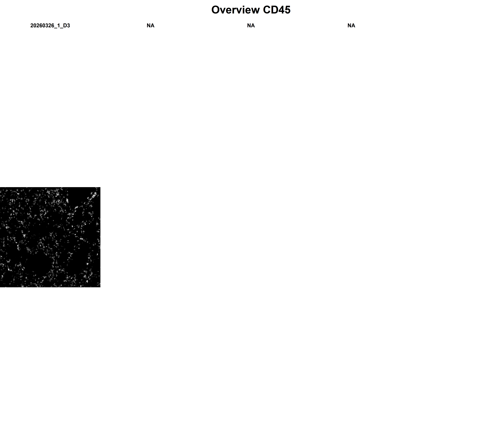
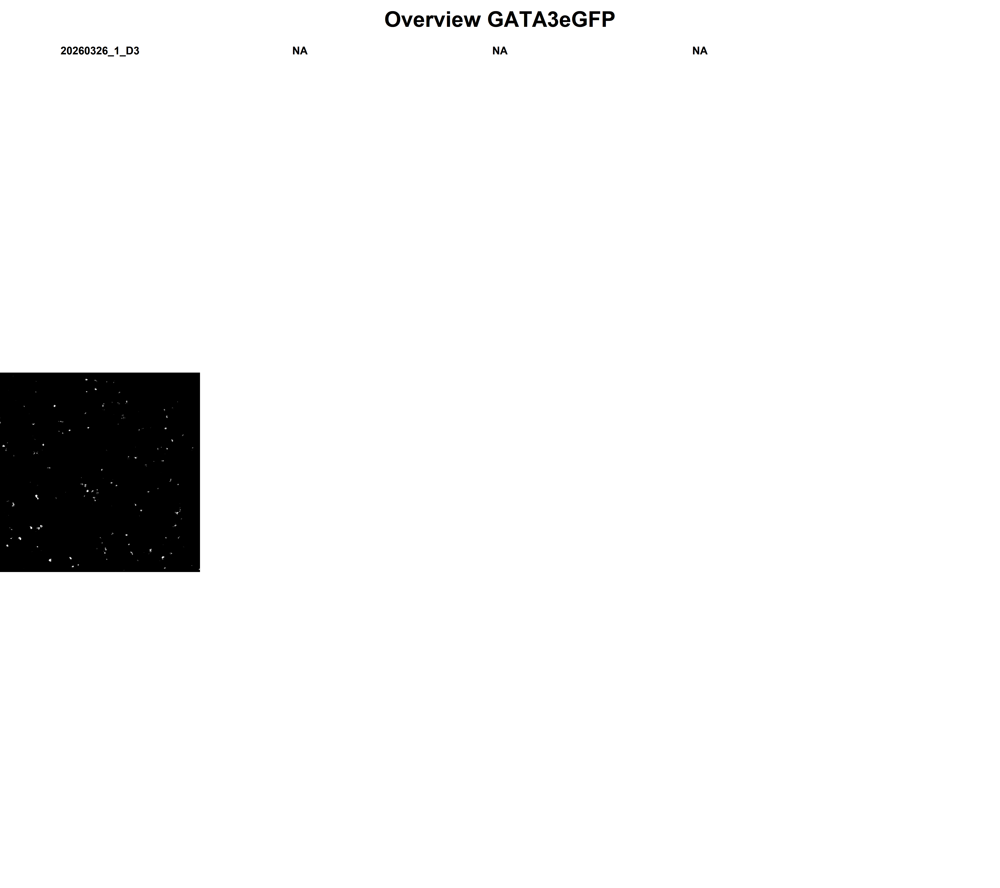
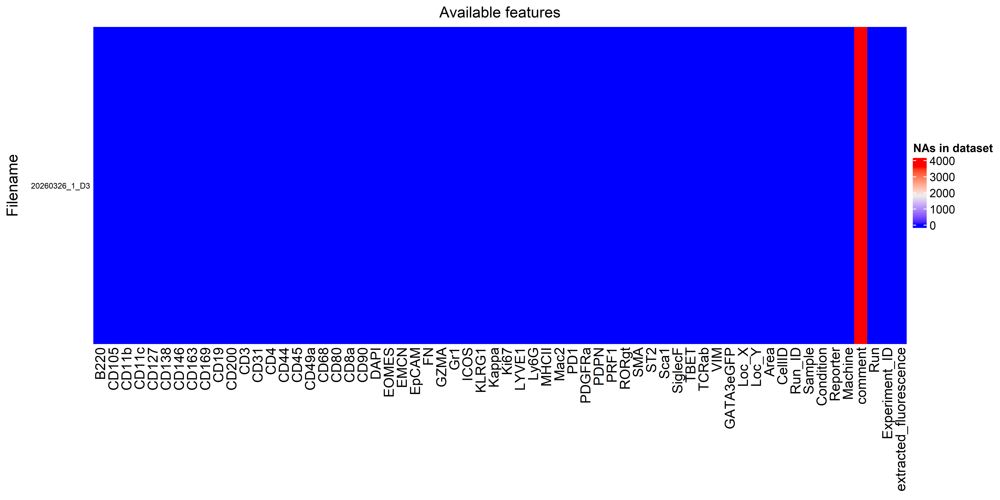
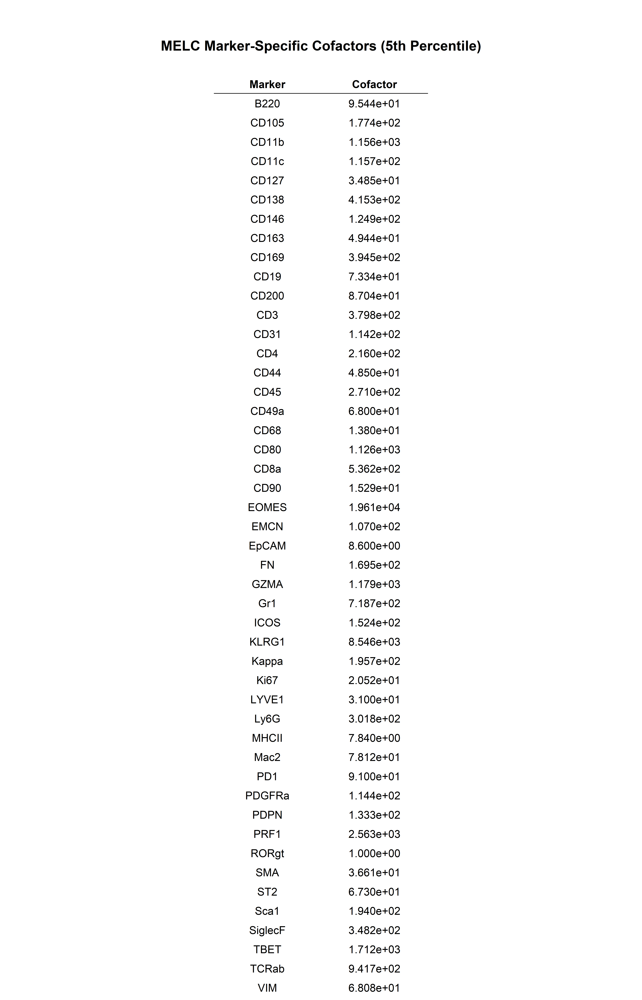
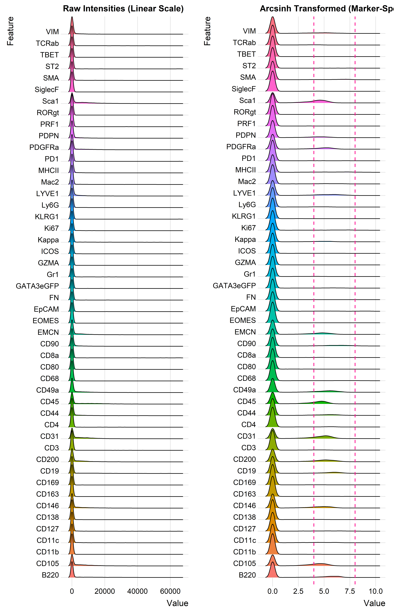
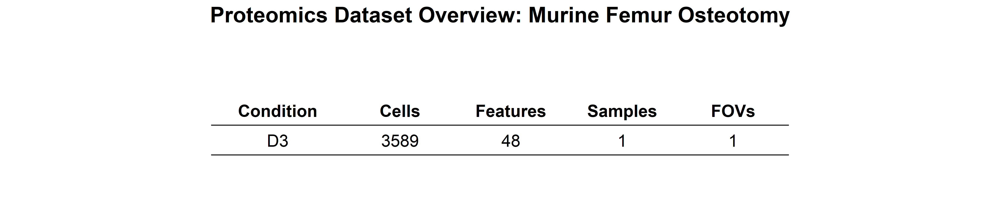

## Libraries


``` r
library(here)
library(readr)
library(dplyr)
library(ggridges)
library(ggplot2)
library(ggpubr)
library(readxl)
library(tidyr)
```

## Parameters


``` r
set.seed(8) 

cols_treat <- c("darkcyan", "gold", "deeppink", "slateblue")  

cols_fov <- c("slateblue1",              
              "darkcyan",                         
              "seagreen2")   

cols_exp <- c("darkcyan", "seagreen2", "lightgreen",     
              "gold", "yellow", "olivedrab1",            
              "deeppink","#FF0066", "magenta",           
              "slateblue", "blueviolet", "purple")   

cols_nat <- c("darkcyan", "seagreen2", "lightgreen",              
              "gold", "yellow", "olivedrab1",              
              "deeppink","#FF0066", "magenta",           
              "slateblue", "blueviolet", "purple",               
              "cyan", "blue", "navyblue",               
              "brown", "red", "orange", "grey") 
```

# Load data

## Directories


``` r
# define path to general data main directory
data_dir_main <- here::here("data")

# define path to input directory
input_dir <- here::here("1_revisions", "1_Data_loading_merging_tidying_files")

# define output folder for saing the environment etc. 
output_env_dir <- here::here("1_revisions", "2_feature_selection_arcsinh_transformation_median_files") 
dir.create(output_env_dir)
```

## Data


``` r
df_raw <- read_csv(paste0(input_dir, "/", 
                        # params$extraction_parameter, "_", 
                        # params$mask_parameter, 
                        # "_", 
                        # params$fluorescence_parameter, 
                        "df_median_merged_raw_tidied.csv"), 
    col_types = cols(...1 = col_skip()))

features <- colnames(df_raw[ , c(1:(match("Loc_X", colnames(df_raw)))-1)])
features
```

```
##  [1] "B220"      "CD105"     "CD11b"     "CD11c"     "CD127"     "CD138"     "CD146"     "CD163"     "CD169"     "CD19"      "CD200"     "CD3"       "CD31"      "CD4"       "CD44"      "CD45"      "CD49a"     "CD68"      "CD80"      "CD8a"      "CD90"      "DAPI"      "EOMES"     "EMCN"      "EpCAM"     "FN"        "GZMA"      "Gr1"       "ICOS"      "KLRG1"     "Kappa"     "Ki67"      "LYVE1"     "Ly6G"      "MHCII"     "Mac2"      "PD1"       "PDGFRa"    "PDPN"      "PRF1"      "RORgt"     "SMA"       "ST2"       "Sca1"      "SiglecF"   "TBET"      "TCRab"     "VIM"       "GATA3eGFP"
```

``` r
unique(df_raw$MELC_ID)
```

```
## [1] "20260326_1_D3"
```

``` r
length(unique(df_raw$MELC_ID))
```

```
## [1] 1
```

# Marker inspection

Define arrangement of plots:


``` r
library(tidyverse)
library(magick)
library(grid)
library(gridExtra)

# 1. Base path
base_path <- "D:/Repositories/2025_Kroh_et_al/Murine_ILC_niches_lung_SI_IL-33/data/MELC_data/Revision/MELC_images_renamed"

# 2. Extract and organize MELC_IDs
fov_info <- data.frame(MELC_ID = unique(df_raw$MELC_ID)) %>%
  mutate(Derived_Cond = sub(".*_", "", MELC_ID))

# 3. Create the specific column-wise order
ctrl_ids <- fov_info %>% filter(Derived_Cond == "CTRL") %>% pull(MELC_ID)
d3_ids   <- fov_info %>% filter(Derived_Cond == "D3")   %>% pull(MELC_ID)

target_rows <- 1
pad_list <- function(x, len) { c(x, rep(list(NULL), max(0, len - length(x)))) }

col1 <- pad_list(ctrl_ids, target_rows)
col2 <- pad_list(d3_ids[1:4], target_rows)

ordered_ids <- as.vector(t(matrix(c(col2), ncol = 1)))
```

## Single marker overviews


``` r
# Define features to iterate through
features_of_interest <- c("CD45", #"CD31", "EMCN", "CD146", "CD105", 
                          # "FN", "Sca1", "PDPN", "COL1", 
                          # # myeloid markers
                          # "CD11b", #pan-myeloid
                          # "SiglecF", #Eosinophils
                          # "CD11c", #DCs
                          # "Ly6G", # Neutrophils
                          # "Ly6C", # Monocytes
                          # "CCR2", # inflammatory Monocytes
                          # "CD68", "F480", # macrophages
                          # #pro-inflammatory
                          # "Mac2", "CD80", "iNOS", "MHCII", 
                          # #antiinflammatory 
                          # "CD206", "CD163", 
                          "GATA3eGFP") 


# 4. Modified loading function: Plots ID even if image is missing
load_fov_image_fixed <- function(melc_id, feature) {
  if (is.null(melc_id)) return(ggplot() + theme_void())
  
  img_path <- file.path(base_path, melc_id, paste0(feature, ".png"))
  
  if (file.exists(img_path)) {
    img <- image_read(img_path)
    img_grob <- rasterGrob(as.raster(img))
    
    ggplot() + 
      annotation_custom(img_grob) + 
      theme_void() +
      labs(title = melc_id) + 
      theme(plot.title = element_text(size = 7, hjust = 0.5, face = "bold"))
  } else {
    # Plot the MELC_ID title over a blank space if image is missing
    ggplot() + 
      theme_void() + 
      labs(title = melc_id) +
      theme(plot.title = element_text(size = 7, hjust = 0.5, face = "bold", color = "black"))
  }
}

# 5. Loop through features and generate grids
for (feat in features_of_interest) {
  
  plot_list <- map(ordered_ids, ~load_fov_image_fixed(.x, feat))
  
  grid_title <- textGrob(paste("Overview", feat), 
                         gp = gpar(fontsize = 14, fontface = "bold"))
  
  final_grid <- grid.arrange(
    grobs = plot_list, 
    ncol = 5, 
    top = grid_title,
    padding = unit(1, "line")
  )
  
  grid.draw(final_grid)
}
```



## Marker overlays

Two color overlay of EMCN and CD31 for Type H-vessels:


Thee color overlay of CD45, DAPI, and CD68:


Three color composite of endothelial markers:


# Feature selection

Here we check which markers will be excluded from the dataset:


``` r
library(data.table)
library(dplyr)
library(ComplexHeatmap)

# Assuming df_raw is your dataframe with columns: MELC_ID (Filename) and features
df_ov <- data.table(df_raw)
df_ov <- df_ov[, lapply(.SD, function(x) sum(is.na(x))), by = list(MELC_ID)]

# Convert integer columns to numeric (if needed)
df_ov <- df_ov %>%
  mutate_if(is.integer, as.numeric)

# Extract Filenames (MELC_ID) for row names
row_names <- df_ov$MELC_ID

# Create the heatmap matrix (exclude MELC_ID column)
heatmap_data <- as.matrix(df_ov[, -"MELC_ID"])

# Assign row names to the matrix
rownames(heatmap_data) <- row_names

# Plot the heatmap with Filenames on the left
Heatmap(
  heatmap_data,
  name = "NAs in dataset",  # Title of legend
  column_title = "Available features", 
  row_title = "Filename",
  row_names_side = "left",  # Display row names on the left
  row_names_gp = gpar(fontsize = 7),  # Adjust text size
  # Optional: Cluster rows/columns if needed
  cluster_rows = FALSE,
  cluster_columns = FALSE
)
```



Exclude the features that are not available in at least 75% of the runs per condition or the nuclei markers etc. that should not be included in the downstream analysis. We will do this for each condition.

First exclude markers that are not relevant anyways and should be excluded:


``` r
# Add your manual exclusion list
manual_excluded_markers <- c("DAPI")

df_selected <- df_raw %>%
  select(-manual_excluded_markers)
```


``` r
# Define which columns are “metadata” (they are *not* markers)
meta_cols <- colnames(df_raw[(which(colnames(df_raw) == "Loc_X"):(length(colnames(df_raw))))])

# Get the marker names (everything else in df_raw)
marker_cols <- colnames(df_raw)[1:match("Loc_X",
       colnames(df_raw))-1]

# How many FOVs per condition?
fov_per_cond <- df_raw %>%
  distinct(Condition, MELC_ID) %>%
  group_by(Condition) %>%
  summarise(n_fov = n(), .groups = "drop")

# Count NAs per marker, per Condition/FOV
missing_counts <- df_raw %>%
  # keep only metadata + markers
  select(all_of(c(meta_cols, marker_cols))) %>%
  # for each marker, flag TRUE if NA in that FOV
  mutate(across(all_of(marker_cols), ~ is.na(.), .names = "miss_{col}")) %>%
  # collapse to one row per Condition/MELC_ID (a FOV)
  group_by(Condition, MELC_ID) %>%
  summarise(across(starts_with("miss_"), ~ any(.), .names = "miss_{col}"),
            .groups = "drop") %>%
  # now count how many FOVs miss each marker in each condition
  pivot_longer(cols = starts_with("miss_"),
               names_to = "marker",
               names_prefix = "miss_",
               values_to = "missed") %>%
  group_by(Condition, marker) %>%
  summarise(n_missing = sum(missed),
            n_fov      = n(),
            .groups    = "drop") %>%
  left_join(fov_per_cond, by = c("Condition", "n_fov")) %>%
  mutate(pct_missing = n_missing / n_fov)


# Keep markers that are present in ≥75% of the FOVs of each condition ----
threshold <- 0.25
kept_markers_by_cond <- missing_counts %>%
  group_by(Condition) %>%
  summarise(kept     = list(marker[pct_missing <= threshold]),
            discarded = list(marker[pct_missing  > threshold]),
            .groups   = "drop")
```

# Arcsinh data transformation

## Formula

The following formula[^1] is used to perform inverse hyperbolic arcsinh transformation on the feature values:

[^1]: [Arcsinh transformation](https://mathworld.wolfram.com/InverseHyperbolicSine.html)

    [Arcsinh transformation for flow](https://wiki.centenary.org.au/display/SPECTRE/Data+transformation)

$$ arcsinh(x) = ln( \frac{x}{cofactor}+ \sqrt{1+( \frac{x}{cofactor} )^2} $$

using a cofactor of 0.2.


``` r
# function used
arcsinh_transform <- function(x, cofactor = 0.002){
  log((x/cofactor)+ sqrt(1+(x/cofactor)^2))
}
```

## **Calculate marker-specific cofactors**

### **Why Calculate Marker-Specific Cofactors?**

-   **Antibody Variability:** Different antibodies have unique binding affinities and background noise levels; a structural marker like LYVE1 may have a baseline fluorescence orders of magnitude higher than a transcription factor like TBET.

-   **Noise Floor Normalization:** A single global cofactor assumes the “noise floor” is identical for every channel, which can lead to over-squashing dim markers (losing signal) or under-squashing bright ones (leaving high background).

-   **Distance-Based Accuracy:** Clustering algorithms (e.g., PhenoGraph or Louvain) rely on Euclidean distance; marker-specific cofactors ensure that a “positive” shift in a dim marker carries the same mathematical weight as a shift in a bright marker.

-   **Dynamic Range Alignment:** It brings all markers into a comparable numeric scale (typically 0–10), preventing high-intensity markers from disproportionately influencing the clustering results.

### **Why Use the 5th Percentile?**

-   **Empirical Noise Estimation:** The bottom 5% of non-zero intensity values generally represents the “background” or “negative” population of cells for that specific staining run.

-   **Defining the Linear-to-Log Transition:** In the arcsinh formula, the cofactor determines the point where the transformation switches from linear (preserving the structure of negative cells) to logarithmic (compressing the positive dynamic range).

-   **Population Separation:** By setting the transition point at the edge of the background noise, you maximize the visual and mathematical “gap” between marker-negative and marker-positive cells.

-   **Outlier Resilience:** Using a low percentile rather than a mean or median ensures that the transformation is sensitive to the actual signal while ignoring tiny amounts of extreme background or technical artifacts.


``` r
library(grid)

# 1. Define features (columns before Loc_X)
features <- colnames(df_selected)[1:(match("Loc_X", colnames(df_selected)) - 1)]

# 2. Calculate Marker-Specific Cofactors
# Start with a complete data frame of all features to ensure none are ever dropped
cofactors_per_marker <- data.frame(Marker = features) %>%
  left_join(
    df_selected %>%
      pivot_longer(cols = all_of(features), names_to = "Marker", values_to = "Value") %>%
      filter(!is.na(Value) & Value > 0) %>%
      group_by(Marker) %>%
      summarise(Cofactor = quantile(Value, 0.01, na.rm = TRUE), .groups = 'drop'),
    by = "Marker"
  ) %>%
  # 🛡️ THE FIX: If a marker (like RORgt) was completely empty, it becomes NA. 
  # Replace it with 1 so the downstream math doesn't crash.
  mutate(Cofactor = replace_na(Cofactor, 1))


# 3. Create the Marker Table and Title separately
marker_table_base <- cofactors_per_marker %>%
  mutate(Cofactor = formatC(Cofactor, format = "e", digits = 3)) %>%
  ggtexttable(
    rows = NULL, 
    theme = ttheme("light", base_size = 11),
    widths = unit(c(1.5, 1.5), "inch") 
  )

title_grob <- text_grob(
  "MELC Marker-Specific Cofactors (5th Percentile)", 
  face = "bold", 
  size = 14
)

# Arrange the title and table vertically using ggarrange
marker_table_final <- ggarrange(
  title_grob, 
  marker_table_base, 
  ncol = 1, 
  heights = c(0.1, 1) # Give the title a small portion of the vertical space
)

# Print the table
print(marker_table_final)
```



## Transformation


``` r
library(dplyr)
library(tidyr)
library(ggplot2)
library(ggpubr)
library(tibble) # Required for deframe()


# 4. Apply Arcsinh Transformation with specific cofactors
# Convert table to named vector for lookup
marker_cofactors_vec <- deframe(cofactors_per_marker)

df_trans_selected <- df_selected %>%
  mutate(across(all_of(features), 
                ~ asinh(.x / marker_cofactors_vec[[cur_column()]])))


# 5. Prepare data for "Before vs After" visualization
df_feat_before <- df_selected %>%
  select(all_of(features)) %>%
  pivot_longer(cols = everything(), names_to = "Feature", values_to = "Value")

df_trans_stacked <- df_trans_selected %>%
  select(all_of(features)) %>%
  pivot_longer(cols = everything(), names_to = "Feature", values_to = "Value")

# 6. Create Comparison Plots
before_plot <- df_feat_before %>%
  ggplot(aes(x = Value, y = Feature, fill = Feature)) +
  geom_density_ridges(na.rm = TRUE) +
  theme_ridges() +
  theme(legend.position = "none") +
  labs(title = "Raw Intensities (Linear Scale)")

after_plot <- df_trans_stacked %>%
  ggplot(aes(x = Value, y = Feature, fill = Feature)) +
  geom_density_ridges(na.rm = TRUE) +
  theme_ridges() +
  theme(legend.position = "none") +
  geom_vline(color = "deeppink", xintercept = c(4, 8), linetype = "dashed") +
  labs(title = "Arcsinh Transformed (Marker-Specific)")

# Display plots side-by-side
ggarrange(before_plot, after_plot, ncol = 2)
```



# Data imputation

# Thresholding


# Data overview

We will plot an overview table to see how many cells, samples and acquired FOVs per conditions are included in the dataset:


``` r
library(tidyverse)
library(ggpubr)

# 1. Define a helper function to extract stats from each dataframe
get_stats <- function(df, condition_name) {
  # Identify feature columns (everything before Loc_X)
  loc_x_idx <- which(colnames(df) == "Loc_X")
  n_features <- loc_x_idx - 1
  
  data.frame(
    Condition = condition_name,
    Cells = nrow(df),
    Features = n_features,
    Samples = n_distinct(df$Sample),
    FOVs = n_distinct(df$MELC_ID)
  )
}

# 2. Combine stats for all three conditions
summary_df <- bind_rows(
  get_stats(df_trans_selected, unique(df_trans_selected$Condition)))

# 3. Create the Table Grob
summary_table_base <- summary_df %>%
  ggtexttable(
    rows = NULL, 
    theme = ttheme("light", base_size = 11),
    # Adjusting widths for the 5 columns
    widths = unit(c(1.2, 1, 1, 1, 1), "inch") 
  )

# 4. Create the Title Grob
title_grob <- text_grob(
  "Proteomics Dataset Overview: Murine Femur Osteotomy", 
  face = "bold", 
  size = 14
)

# 5. Arrange the title and table vertically
summary_table_final <- ggarrange(
  title_grob, 
  summary_table_base, 
  ncol = 1, 
  heights = c(0.15, 1) 
)

# 6. Display
print(summary_table_final)
```



We will plot the markers that are common between the different conditions:


Depict all common markers for each FOV:


Get an overview of the additional markers available per condition:


# Save data


``` r
# selected marker data ------------------------------------------------
write.csv(df_selected, file = paste0(
  output_env_dir, "/", params$extraction_parameter, "_",
  params$fluorescence_parameter, "_",
  tolower(unique(df_selected$Condition)),
  "_selected.csv"))

# arcsinh transformed data --------------------------------------------
write.csv(df_trans_selected, file = paste0(
  output_env_dir, "/", params$extraction_parameter, "_",
  params$fluorescence_parameter, "_",
  tolower(unique(df_trans_selected$Condition)),
  "_selected_arcsinh.csv"))
```

## Session info and environment


``` r
# save the environment
save.image(paste0(output_env_dir, "/environment.RData"))

sessionInfo()
```

```
## R version 4.5.2 (2025-10-31 ucrt)
## Platform: x86_64-w64-mingw32/x64
## Running under: Windows 11 x64 (build 26200)
## 
## Matrix products: default
##   LAPACK version 3.12.1
## 
## locale:
## [1] LC_COLLATE=German_Germany.utf8  LC_CTYPE=German_Germany.utf8    LC_MONETARY=German_Germany.utf8 LC_NUMERIC=C                    LC_TIME=German_Germany.utf8    
## 
## time zone: Europe/Berlin
## tzcode source: internal
## 
## attached base packages:
## [1] grid      stats     graphics  grDevices utils     datasets  methods   base     
## 
## other attached packages:
##  [1] ComplexHeatmap_2.26.1 data.table_1.17.8     gridExtra_2.3         magick_2.9.0          lubridate_1.9.4       forcats_1.0.1         stringr_1.6.0         purrr_1.2.0           tibble_3.3.0          tidyverse_2.0.0       tidyr_1.3.1           readxl_1.4.5          ggpubr_0.6.2          ggplot2_4.0.1         ggridges_0.5.7        dplyr_1.1.4           readr_2.1.6           here_1.0.2           
## 
## loaded via a namespace (and not attached):
##  [1] tidyselect_1.2.1    farver_2.1.2        S7_0.2.0            fastmap_1.2.0       digest_0.6.38       timechange_0.3.0    lifecycle_1.0.5     cluster_2.1.8.1     Cairo_1.7-0         magrittr_2.0.4      compiler_4.5.2      rlang_1.1.6         sass_0.4.10         tools_4.5.2         yaml_2.3.10         knitr_1.51          ggsignif_0.6.4      labeling_0.4.3      bit_4.6.0           RColorBrewer_1.1-3  abind_1.4-8         withr_3.0.2         BiocGenerics_0.56.0 stats4_4.5.2        colorspace_2.1-2    scales_1.4.0        iterators_1.0.14    dichromat_2.0-0.1   cli_3.6.5           rmarkdown_2.30      crayon_1.5.3        generics_0.1.4      otel_0.2.0          rstudioapi_0.18.0   tzdb_0.5.0          rjson_0.2.23        cachem_1.1.0        parallel_4.5.2      cellranger_1.1.0    matrixStats_1.5.0   vctrs_0.6.5         jsonlite_2.0.0      carData_3.0-6       car_3.1-5           IRanges_2.44.0      hms_1.1.4           GetoptLong_1.1.0    S4Vectors_0.48.0    bit64_4.6.0-1       rstatix_0.7.3       clue_0.3-67         Formula_1.2-5       foreach_1.5.2       jquerylib_0.1.4     glue_1.8.0          codetools_0.2-20    cowplot_1.2.0       shape_1.4.6.1       stringi_1.8.7      
## [60] gtable_0.3.6        pillar_1.11.1       htmltools_0.5.8.1   circlize_0.4.17     R6_2.6.1            doParallel_1.0.17   rprojroot_2.1.1     vroom_1.7.0         evaluate_1.0.5      png_0.1-8           backports_1.5.0     broom_1.0.12        bslib_0.10.0        Rcpp_1.1.0          xfun_0.56           pkgconfig_2.0.3     GlobalOptions_0.1.3
```
