## Libraries


``` r
library(SeuratObject)
library(dplyr)
library(rstatix)

# remove.packages("rlang")
# remove.packages("dplyr")
# install.packages("rlang")
# install.packages("dplyr")
library(rlang)
library(dplyr)

if (!requireNamespace("Giotto", quietly = TRUE))
  devtools::install_github("drieslab/Giotto@suite")
if (!requireNamespace("VoltRon", quietly = TRUE))
#  devtools::install_github("Artur-man/VoltRon")
  devtools::install_github("BIMSBbioinfo/VoltRon@dev")

if (!requireNamespace("Seurat", quietly = TRUE))
  install.packages("Seurat")
library(Giotto)
library(Seurat)
library(VoltRon)
library(ggplot2)
library(ggpubr)
library(readr)
library(ggbeeswarm)
library(stringr)
```

## Parameters


``` r
set.seed(123)

output_dir <- here::here("2_visualizations_for_figures", "Additional_visualizations_files")
dir.create(output_dir)


main_markers <- c(
  "EpCAM", "EMCN", "LYVE1", "PDPN", "PDGFRa", "CD8a", "CD4",
  "CD45", "CD3", "IRF4", "Kappa", "CD11c", "CD127", "GATA3eGFP", "RORgt"
)


immune_markers <- c(
 "CD3", "CD4", "CD8a", "Kappa", "IRF4", "CD11c",
  "CD127", "CD90", "EOMES", "GATA3eGFP", "RORgt", "Ki67",  "KLRG1", "NKp46", "CD117", "Areg", "CCR6", "CD44", "MHCII", "Sca1"
)

ilc_markers <- c(
  "CD3", "CD4", "CD8a",
  "CD127", "CD90", "EOMES", "GATA3eGFP", "RORgt", "KLRG1", "NKp46", "CD117", "CCR6", "MHCII", "Ki67", "Areg", "IRF4", "Sca1", "CD44"
)


cols_nat <- c("magenta", "cyan", "blue", "purple", "green", 
                       "red", "yellow", "olivedrab1", "slateblue1", 
                       "darkcyan", "gold","indianred1", "seagreen", "deeppink", 
                       "orange", "brown", "violet",
                       "deeppink4", "pink", 
                       "grey", "black", "lightgreen", 
                       "#FF0066",  
                       "lightblue", "#FFCC99", "#CC00FF", 
                       "blueviolet",  "goldenrod4", 
                       "navy", "olivedrab", "lightcyan", "seagreen2", "darkviolet", "lightpink", "slateblue4", "olivedrab2")

colfunc <- colorRampPalette(c("darkcyan", "green", "yellow", "magenta", "purple"))

cols_ilcs_lung <- c("darkcyan", "seagreen2", "deeppink4")

cols_treat <- c("CTRL"  = "darkcyan", 
              "1"  = "gold",
              "2"  = "deeppink", 
              "3"  = "slateblue", 
              "D1"  = "gold",
              "D2"  = "deeppink", 
              "D3"  = "slateblue")


# colorblind-friendly palette for conditions
cols_con <- cols_treat
ColorsCellType_conditions <- cols_con

cols_heat <- c(
               "#648FFF", "white", "#FFB000")

celltype_order_al4 <- c(
    "NK cells/ILC1s",
    "ILC2s",
    "ILC3s",
    "Th1"       ,
    "Th2"  ,
    "Th17"      ,
    "Other Th" ,
    "Tc2"     ,
    "Other Tc",
    "B cells & P cells",
    "Myeloid cells",
    "Lymphatics",
    "LYVE1 CD31 vessels",
    "Blood vessels",
    "Epithelia"
)
```

# Load data

Load spatial objects of Giotto and VoltRon for AL2:


``` r
set.seed(8)

# from import_Giotto.Rmd
gio_list <- readRDS("D:/Repositories/2025_Kroh_et_al/Murine_ILC_niches_lung_SI_IL-33/1_spatial_setup/import_Giotto_Lung_AL4_files/Giotto_data_lung_AL4.rds")

# from import_VoltRon.Rmd
vr_list <- readRDS("D:/Repositories/2025_Kroh_et_al/Murine_ILC_niches_lung_SI_IL-33/1_spatial_setup/import_VoltRon_Lung_AL4_files/VoltRon_data_lung_AL4.rds")

# original data - CellTypes are AL2
metadatax <- read_csv("D:/Repositories/2025_Kroh_et_al/Murine_ILC_niches_lung_SI_IL-33/1_spatial_setup/import_VoltRon_Lung_AL4_files/MELC_data_murine_lung_CTRL_D1_D2_D3_withfolders_AL4.csv")
metadatax <- metadatax %>%
  filter(Sample != "20210906_3_lu_d3") %>%
  mutate(CellType = gsub("EMCN CD31 |LYVE1 CD90 |lasma", "", CellType)) %>%
  mutate(CellType = factor(CellType, levels = c(
    "NK cells/ILC1s",
    "ILC2s",
    "ILC3s",
    "Th1"       ,
    "Th2"  ,
    "Th17"      ,
    "Other Th" ,
    "Tc2"     ,
    "Other Tc",
    "B cells & P cells",
    "Myeloid cells",
    "Lymphatics",
    "LYVE1 CD31 vessels",
    "Blood vessels",
    "Epithelia"
  )),
  Filename = FullInfo, 
  AL4 = CellType)

unique(metadatax$CellType)
```

```
##  [1] Epithelia          Blood vessels      LYVE1 CD31 vessels Lymphatics         Myeloid cells      B cells & P cells  NK cells/ILC1s     ILC3s              Other Tc           Tc2                Th17               Other Th           Th2                Th1                ILC2s             
## Levels: NK cells/ILC1s ILC2s ILC3s Th1 Th2 Th17 Other Th Tc2 Other Tc B cells & P cells Myeloid cells Lymphatics LYVE1 CD31 vessels Blood vessels Epithelia
```

``` r
vr_list_names <- unique(metadatax$Sample)


cell_proximities_list <- list()
for(samp in vr_list_names){
  print(samp)
  cell_proximities_list[[samp]] <-cellProximityEnrichment(
    gobject = gio_list[[samp]],
    cluster_column = 'CellType',
    spatial_network_name = 'Delaunay_network',
    adjust_method = 'fdr',
    number_of_simulations = 1000)
  cell_proximities_list[[samp]] <- cell_proximities_list[[samp]]$enrichm_res
}
```

```
## [1] "20210910_1_lu_ctrl"
## [1] "20210914_1_lu_ctrl"
## [1] "20210922_1_lu_ctrl"
## [1] "20210910_2_lu_ctrl"
## [1] "20210914_2_lu_ctrl"
## [1] "20210922_2_lu_ctrl"
## [1] "20210910_3_lu_ctrl"
## [1] "20210914_3_lu_ctrl"
## [1] "20210922_3_lu_ctrl"
## [1] "20220311_1"
## [1] "20220316_1"
## [1] "20220321_1"
## [1] "20220311_2"
## [1] "20220316_2"
## [1] "20220321_2"
## [1] "20220311_3"
## [1] "20220316_3"
## [1] "20220321_3"
## [1] "20220325_1"
## [1] "20220421_1"
## [1] "20220502_1"
## [1] "20220325_2"
## [1] "20220421_2"
## [1] "20220502_2"
## [1] "20220325_3"
## [1] "20220421_3"
## [1] "20220502_3"
## [1] "20210902_1_lu_d3"
## [1] "20210906_1_lu_d3"
## [1] "20210928_1_lu_d3"
## [1] "20210902_2_lu_d3"
## [1] "20210906_2_lu_d3"
## [1] "20210928_2_lu_d3"
## [1] "20210902_3_lu_d3"
## [1] "20210928_3_lu_d3"
```

``` r
vr_merged <- merge(vr_list[[1]], vr_list[-1])
vrImageNames(vr_merged)
```

```
## [1] "image_1"
```

``` r
unique(vr_merged$CellType)
```

```
##  [1] "Epithelia"          "Blood vessels"      "LYVE1 CD31 vessels" "Lymphatics"         "Myeloid cells"      "B cells & P cells"  "NK cells/ILC1s"     "Other Tc"           "Tc2"                "Th17"               "Other Th"           "Th2"                "ILC2s"              "Th1"                "ILC3s"
```

Calculate co-enrichment scores and plot them:


``` r
set.seed(8)

# FOVs for representative overview images
fovs <- vr_list_names

set_alpha <- 0.35
set_ptsize <- 2
set_nrows <- 1
set_ncols <- 3
cell_shape <- 20


cols_con <- c("darkcyan", "gold", "deeppink", 
                "slateblue")

cols_fov <- c("darkcyan", "gold", "deeppink", 
                "slateblue")

ColorsCellType <-  list(
  #`NK cells/ILC1s/ILC3s` = "cyan", 
  `ILC2s` = "magenta",
  #`ILC3s` = "magenta", 
  `EMCN CD31 Blood vessels` = "green")

uni_celltypes <- unique(vr_merged$CellType)
backgroundlist <- list("EpCAM","CD31","LYVE1","LYVE1","CD11c","B220","CD45", "CD8a", "GATA3eGFP", "RORgt", "CD4", "GATA3eGFP", "GATA3eGFP", "TBET", "RORgt")
names(backgroundlist) <- uni_celltypes
```

# Visualization

## Coenrichment plots


``` r
library(ComplexHeatmap)
library(circlize)
library(dplyr)
library(tidyr)
library(ggplotify)
library(ggplot2)

# --- 1. Data Gathering (Remains the same) ---
all_interactions <- data.frame()
# We'll also capture the unique cell types here to use for our loop later
all_found_cell_types <- c() 

for (vr_name in vr_list_names) {
  cur_cell_proximities <- cell_proximities_list[[vr_name]]
  if(is.null(cur_cell_proximities) || nrow(cur_cell_proximities) == 0) next
  
  vr_samp <- subset(vr_merged, samples = vr_name)
  vr_meta <- Metadata(vr_samp)
  condition <- paste(unique(vr_meta$Condition), collapse = ", ")
  
  # Capture the cell types available in this dataset
  all_found_cell_types <- unique(c(all_found_cell_types, unique(vr_meta$CellType)))
  
  temp_df <- data.frame(
    Interaction = cur_cell_proximities$unified_int,
    Enrichment = cur_cell_proximities$enrichm,
    FOV = vr_name,
    Condition = condition
  )
  all_interactions <- rbind(all_interactions, temp_df)
}

# --- 2. Initialize Storage ---
all_heatmaps <- list()
target_cell_types <- sort(all_found_cell_types) # Loop through these

# --- 3. START THE LOOP ---
for (ct in target_cell_types) {
  
  # Filter for the current cell type in the loop
  wide_data <- all_interactions %>%
    filter(grepl(ct, Interaction)) %>%
    select(Interaction, FOV, Enrichment) %>%
    pivot_wider(names_from = FOV, values_from = Enrichment, values_fill = 0, values_fn = mean) 
  
  # Skip if this cell type has no interactions recorded
  if(nrow(wide_data) == 0) {
    message(paste("Skipping", ct, "- No interactions found."))
    next
  }

  # Convert to matrix
  enrichmat_global <- as.matrix(wide_data[, -1])
  rownames(enrichmat_global) <- wide_data$Interaction

  # Sync Annotations: Only keep FOVs that are present for THIS cell type
  anno_df_sub <- unique(all_interactions[, c("FOV", "Condition")])
  rownames(anno_df_sub) <- anno_df_sub$FOV
  anno_df_sub <- anno_df_sub[colnames(enrichmat_global), , drop = FALSE]

  # Create Annotation
  ha_top <- HeatmapAnnotation(
    Condition = anno_df_sub$Condition,
    col = list(Condition = cols_treat),
    annotation_name_side = "left"
  )

  # Create Heatmap Object
  curr_heatmap <- Heatmap(
    enrichmat_global,
    col = circlize::colorRamp2(c(-1, 0, 1), cols_heat),
    name = "Enrichment\nScore",
    heatmap_legend_param = list(direction = "vertical"),
    
    column_split = anno_df_sub$Condition,
    cluster_column_slices = FALSE, 
    cluster_columns = FALSE,        
    cluster_rows = TRUE,           
    
    row_title = "Interactions",
    row_title_gp = gpar(fontsize = 11),
    show_column_names = FALSE,
    row_names_gp = gpar(fontsize = 9),
    show_row_dend = TRUE,
    
    top_annotation = ha_top,
    column_title = paste("Neighborhood Enrichment:", ct),
    column_title_gp = gpar(fontsize = 12, fontface = "bold")
  )

  # Convert to ggplot
  heat_grob <- grid::grid.grabExpr(
    draw(curr_heatmap, 
         heatmap_legend_side = "right",     
         annotation_legend_side = "right",  
         merge_legend = TRUE,
         padding = unit(c(0.1, 0.1, 0.1, 0.1), "cm"))
  )

  final_plot <- as.ggplot(heat_grob) + 
    labs(x = "FOV") + 
    theme(
      axis.title.x = element_text(size = 11, margin = margin(t = 10), hjust = 0.37)
    )

  # Store and Print
  all_heatmaps[[ct]] <- final_plot
  print(final_plot)
}
```

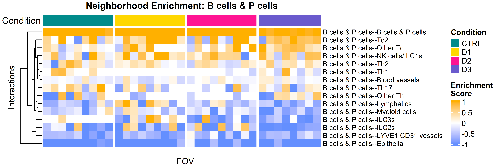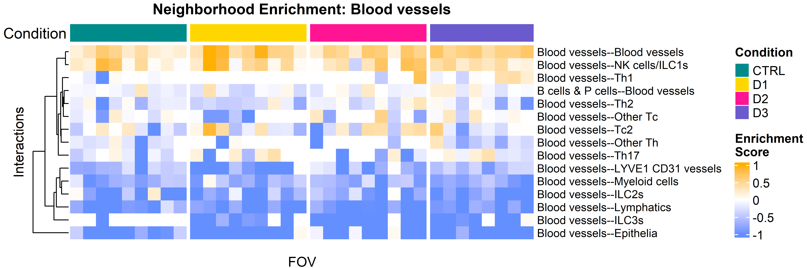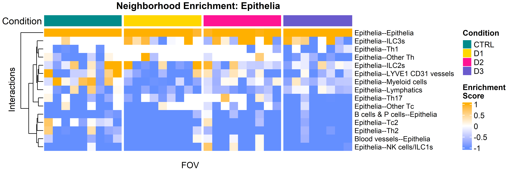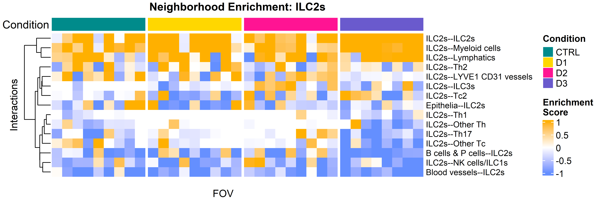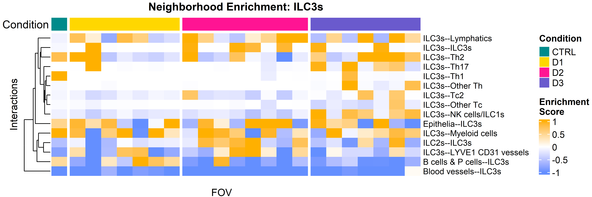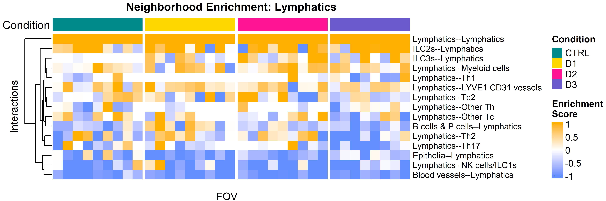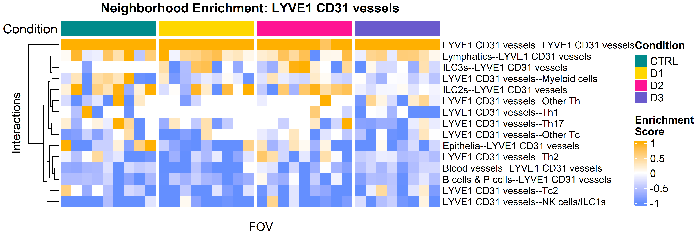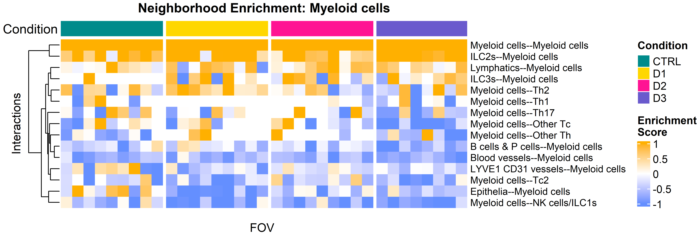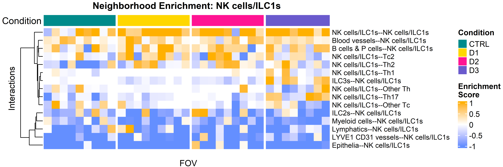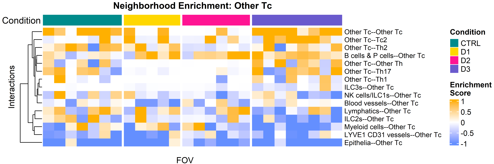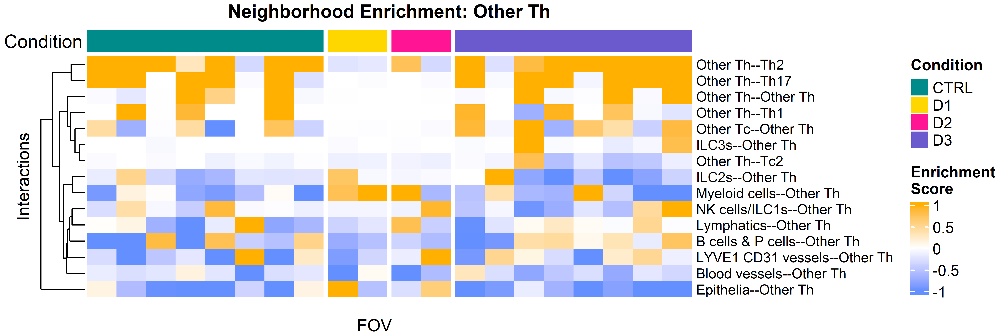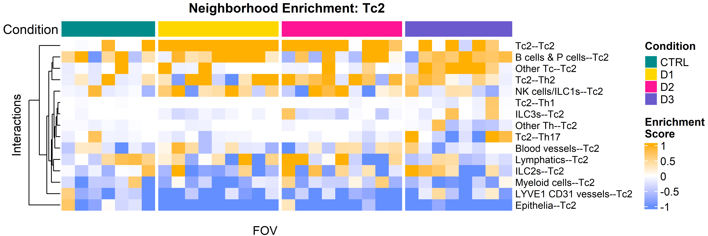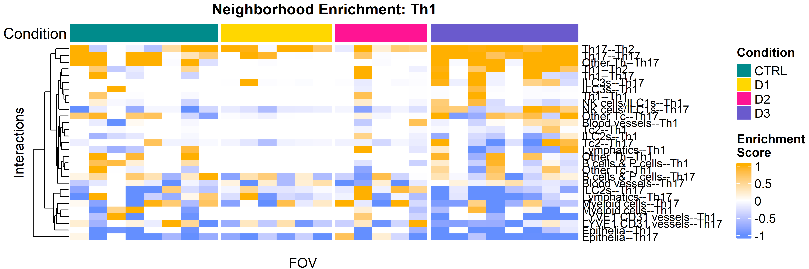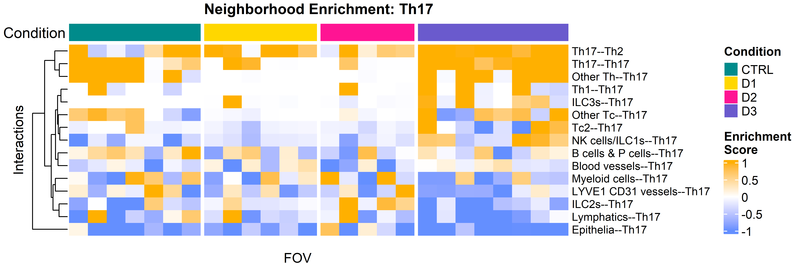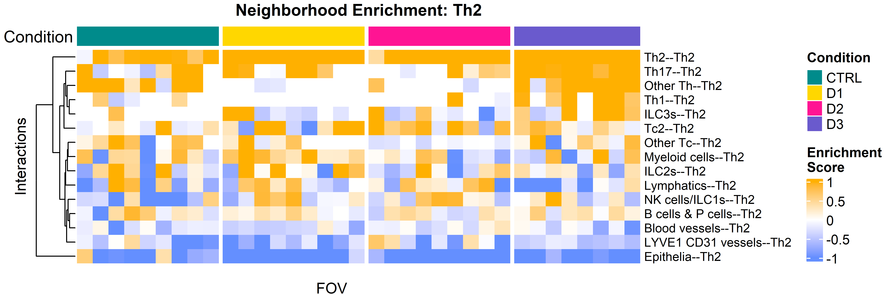

Coenrichment barplots


``` r
# FOVs for representative overview images
fovs <- vr_list_names

set_alpha <- 0.35
set_ptsize <- 2
set_nrows <- 1
set_ncols <- 3
cell_shape <- 20


cols_con <- c("darkcyan", "gold", "deeppink", 
                "slateblue")

cols_fov <- c("darkcyan", "gold", "deeppink", 
                "slateblue")

ColorsCellTypeSingle <-  list(
  #`NK cells/ILC1s/ILC3s` = "cyan", 
  `ILC2s` = "magenta",
  #`ILC3s` = "magenta", 
  `EMCN CD31 Blood vessels` = "green")

uni_celltypes <- unique(vr_merged$CellType)
backgroundlist <- list("EpCAM","CD31","LYVE1","LYVE1","CD11c","B220","EOMES", "CD8a", "CD8a", "CD4","CD4", "CD4", "CD4", "GATA3eGFP", "CD4", "RORgt")
names(backgroundlist) <- uni_celltypes
uni_celltypes <- uni_celltypes[!uni_celltypes %in% "ILC2s"]
```


``` r
library(ggplot2)
library(dplyr)

# --- 1. Data Preparation Loop ---
interactions <- "ILC2s--Lymphatics"
interaction_celltypes <- NULL

for(samp in vr_list_names){
    # Extract proximity data for current sample
    cur_cell_proximities <- cell_proximities_list[[samp]]
    cur_cell_proximities <- cur_cell_proximities[cur_cell_proximities$unified_int %in% interactions, ]
    
    # Get metadata info
    sample_info <- unique(metadatax$FullInfo[metadatax$Sample == samp])
    
    # Filter and bind (excluding the specific outlier FOV mentioned)
    if(nrow(cur_cell_proximities) > 0 && sample_info != "20210906_FOV3_D3"){
        # Split string for metadata columns
        info_split <- strsplit(sample_info, split = "_")[[1]]
        
        tmp_df <- data.frame(
            cur_cell_proximities,
            experiment = info_split[1],
            fov        = info_split[2],
            condition  = info_split[3]
        )
        interaction_celltypes <- rbind(interaction_celltypes, tmp_df)
    }
}

# --- 2. Statistical Labeling (Fixed: Assigning to Dataframe) ---
interaction_celltypes <- interaction_celltypes %>%
  mutate(
    # Determine p-value based on enrichment direction
    p.adj = ifelse(enrichm > 0, p.adj_higher, p.adj_lower),
    # Create significance label column
    sig_label = ifelse(p.adj < 0.1, "*", "")
  )

# --- 3. Plotting ---
plot_coenrichment_lymp <- ggplot(interaction_celltypes, 
                                 aes(x = condition, y = enrichm, fill = condition, group = fov)) +
  # Draw bars
  geom_bar(stat = "identity", 
           position = position_dodge2(width = 0.9, preserve = "single"), 
           color = "black", 
           linewidth = 0.2) +
  # Draw asterisks (Fixed: Positioned per FOV and Condition)
  geom_text(aes(label = sig_label), 
            position = position_dodge2(width = 0.9, preserve = "single"), 
            vjust = -0.2, # Sits slightly above the bar
            size = 4, 
            fontface = "bold") +
  # Faceting logic
  facet_grid(. ~ condition, scales = "free_x") +
  # Limits and Colors
  ylim(-2, 4) +
  scale_fill_manual(values = cols_fov) +
  # Titles and Labels
  ggtitle(gsub("LYVE1 CD90 ", "", interactions)) +
  ylab("Enrichment Score") +
  theme_classic() +
  theme(axis.text.x = element_text(#angle = 50,
                                   vjust = 1, size = 9, hjust = 0.5
                                   ),
        axis.text.y = element_text(hjust = 0.5, size = 9),
        axis.title.x = element_blank(),
        axis.title.y = element_blank(),
        plot.title = element_text(size =10, hjust = 0.5, face = "bold"),
        plot.margin = margin(0.1, 0.1, 0.1, 0.1, "cm"),
        legend.position = "none",
        strip.background=element_blank(),
        strip.background.x= element_blank(),
        strip.text.x = element_text(size = 1, color = "white"),
        panel.grid.major.y = element_line())

print(plot_coenrichment_lymp)
```

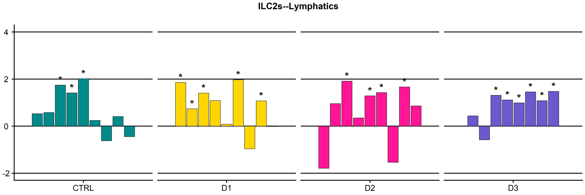

``` r
# --- SECTION 1: ILC2s around ILC2s ---
interactions_ilc2 <- "ILC2s--ILC2s"
interaction_ilc2_df <- NULL

for(samp in vr_list_names){
    cur_cell_proximities <- cell_proximities_list[[samp]]
    cur_cell_proximities <- cur_cell_proximities[cur_cell_proximities$unified_int %in% interactions_ilc2,]
    sample_info <- unique(metadatax$FullInfo[metadatax$Sample==samp])
    
    if(nrow(cur_cell_proximities) > 0 && sample_info != "20210906_FOV3_D3"){
        info_split <- strsplit(sample_info, split = "_")[[1]]
        interaction_ilc2_df <- rbind(interaction_ilc2_df,
                                     data.frame(cur_cell_proximities, 
                                                experiment = info_split[1], 
                                                fov = info_split[2], 
                                                condition = info_split[3]))
    }
}

interaction_ilc2_df <- interaction_ilc2_df %>%
  mutate(p.adj = ifelse(enrichm > 0, p.adj_higher, p.adj_lower),
         sig_label = ifelse(p.adj < 0.1, "*", ""))

plot_coenrichment_ilc2 <- ggplot(interaction_ilc2_df, aes(x = condition, y = enrichm, fill = condition, group = fov)) +
  geom_bar(stat = "identity", position = position_dodge2(width=0.9, preserve = "single"), color = "black", linewidth = 0.2) +
  geom_text(aes(label=sig_label), position=position_dodge2(width=0.9, preserve = "single"), vjust = -0.2, size = 4, fontface = "bold") +
  facet_grid(.~condition, scales = "free_x") +
  ylim(-2, 4) +
  scale_fill_manual(values = cols_fov) +
  theme_classic() +
  ggtitle("ILC2s -- ILC2s") +
  theme(axis.text.x = element_text(#angle = 50,
                                   vjust = 1, size = 9, hjust = 0.5
                                   ),
        axis.text.y = element_text(hjust = 0.5, size = 9),
        axis.title.x = element_blank(),
        axis.title.y = element_blank(),
        plot.title = element_text(size =10, hjust = 0.5, face = "bold"),
        plot.margin = margin(0.1, 0.1, 0.1, 0.1, "cm"),
        legend.position = "none",
        strip.background=element_blank(),
        strip.background.x= element_blank(),
        strip.text.x = element_text(size = 1, color = "white"),
        panel.grid.major.y = element_line())

# --- SECTION 2: ILC2s around Myeloid cells ---
interactions_my <- "ILC2s--Myeloid cells"
interaction_my_df <- NULL

for(samp in vr_list_names){
    cur_cell_proximities <- cell_proximities_list[[samp]]
    cur_cell_proximities <- cur_cell_proximities[cur_cell_proximities$unified_int %in% interactions_my,]
    sample_info <- unique(metadatax$FullInfo[metadatax$Sample==samp])
    
    if(nrow(cur_cell_proximities) > 0 && sample_info != "20210906_FOV3_D3"){
        info_split <- strsplit(sample_info, split = "_")[[1]]
        interaction_my_df <- rbind(interaction_my_df,
                                   data.frame(cur_cell_proximities, 
                                              experiment = info_split[1], 
                                              fov = info_split[2], 
                                              condition = info_split[3]))
    }
}

interaction_my_df <- interaction_my_df %>%
  mutate(p.adj = ifelse(enrichm > 0, p.adj_higher, p.adj_lower),
         sig_label = ifelse(p.adj < 0.1, "*", ""))

plot_coenrichment_my <- ggplot(interaction_my_df, aes(x = condition, y = enrichm, fill = condition, group = fov)) +
  geom_bar(stat = "identity", position = position_dodge2(width=0.9, preserve = "single"), color = "black", linewidth = 0.2) +
  geom_text(aes(label=sig_label), position=position_dodge2(width=0.9, preserve = "single"), vjust = -0.2, size = 4, fontface = "bold") +
  facet_grid(.~condition, scales = "free_x") +
  ylim(-2, 4) +
  scale_fill_manual(values = cols_fov) +
  theme_classic() +
  ggtitle("ILC2s -- Myeloid") +
  theme(axis.text.x = element_text(#angle = 50,
                                   vjust = 1, size = 9, hjust = 0.5
                                   ),
        axis.text.y = element_text(hjust = 0.5, size = 9),
        axis.title.x = element_blank(),
        axis.title.y = element_blank(),
        plot.title = element_text(size =10, hjust = 0.5, face = "bold"),
        plot.margin = margin(0.1, 0.1, 0.1, 0.1, "cm"),
        legend.position = "none",
        strip.background=element_blank(),
        strip.background.x= element_blank(),
        strip.text.x = element_text(size = 1, color = "white"),
        panel.grid.major.y = element_line())


# --- SECTION 4: ILC2s around T helper cells ---
# Updated interaction string
interactions_ilc2_th <- "ILC2s--Th2"
interaction_ilc2_th_df <- NULL

for(samp in vr_list_names){
    cur_cell_proximities <- cell_proximities_list[[samp]]
    # Filter for the ILC2-Th interaction
    cur_cell_proximities <- cur_cell_proximities[cur_cell_proximities$unified_int %in% interactions_ilc2_th, ]
    sample_info <- unique(metadatax$FullInfo[metadatax$Sample == samp])
    
    if(nrow(cur_cell_proximities) > 0 && sample_info != "20210906_FOV3_D3"){
        info_split <- strsplit(sample_info, split = "_")[[1]]
        
        interaction_ilc2_th_df <- rbind(interaction_ilc2_th_df,
                                        data.frame(cur_cell_proximities, 
                                                   experiment = info_split[1], 
                                                   fov = info_split[2], 
                                                   condition = info_split[3]))
    }
}

# --- Statistical Labeling ---
interaction_ilc2_th_df <- interaction_ilc2_th_df %>%
  mutate(p.adj = ifelse(enrichm > 0, p.adj_higher, p.adj_lower),
         sig_label = ifelse(p.adj < 0.1, "*", ""))

# --- Plotting ---
plot_coenrichment_th <- ggplot(interaction_ilc2_th_df, 
                                    aes(x = condition, y = enrichm, fill = condition, group = fov)) +
  geom_bar(stat = "identity", 
           position = position_dodge2(width = 0.9, preserve = "single"), 
           color = "black", 
           linewidth = 0.2) +
  geom_text(aes(label = sig_label), 
            position = position_dodge2(width = 0.9, preserve = "single"), 
            vjust = -0.2, 
            size = 4, 
            fontface = "bold") +
  facet_grid(. ~ condition, scales = "free_x") +
  ylim(-2, 4) +
  scale_fill_manual(values = cols_fov) +
  theme_classic() +
  ggtitle("ILC2s -- Th2") +
  theme(axis.text.x = element_text(#angle = 50,
                                   vjust = 1, size = 9, hjust = 0.5
                                   ),
        axis.text.y = element_text(hjust = 0.5, size = 9),
        axis.title.x = element_blank(),
        axis.title.y = element_blank(),
        plot.title = element_text(size =10, hjust = 0.5, face = "bold"),
        plot.margin = margin(0.1, 0.1, 0.1, 0.1, "cm"),
        legend.position = "none",
        strip.background=element_blank(),
        strip.background.x= element_blank(),
        strip.text.x = element_text(size = 1, color = "white"),
        panel.grid.major.y = element_line())

print(plot_coenrichment_th)
```

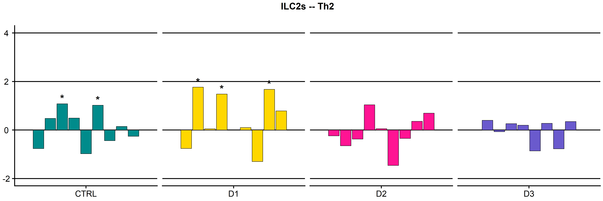

``` r
# --- SECTION 3: Final Arrangement ---
# (Assumes plot_coenrichment_lymp was created using the same corrected logic previously)

coenrichment_fig <- ggarrange(plot_coenrichment_ilc2, 
                              plot_coenrichment_my, 
                              plot_coenrichment_lymp, 
                              ncol = 3, nrow = 1)

coenrichment_fig_ann <- annotate_figure(coenrichment_fig, 
                                        left = text_grob("Coenrichment score", 
                                                         color = "black", rot = 90, size = 9))

print(coenrichment_fig_ann)
```

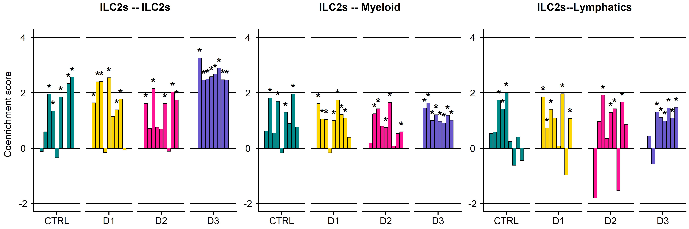


``` r
coenrichment_fig <- ggarrange(plot_coenrichment_ilc2, 
                              plot_coenrichment_my, 
                              plot_coenrichment_lymp, 
                              plot_coenrichment_th, 
                              ncol = 2, nrow = 2)

coenrichment_fig_ann_tcells <- annotate_figure(coenrichment_fig, 
                left = text_grob("Coenrichment score", color = "black", rot = 90, 
                                 size = 11))

coenrichment_fig_ann_tcells
```

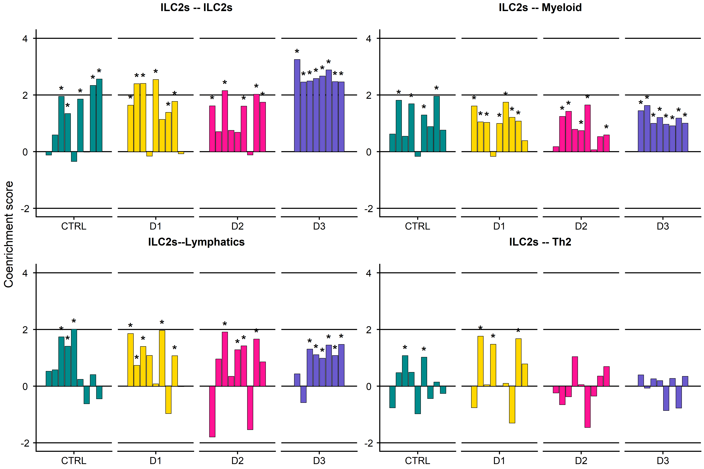

Quantification


``` r
library(dplyr)
library(tidyr)
library(ggplot2)
library(ggbeeswarm)
library(ggpubr)
library(rstatix)

# 1. Define your target list of cell types
target_cells <- c("Th1", "Th2", "Th17", "Other Th", "Tc2", "Other Tc", 
                  "NK cells/ILC1s", "ILC2s", "ILC3s")

# 2. Summarize counts per FOV
# Replace 'AL4' with the actual column name where you stored the Th1/Th2 labels
df_counts <- metadatax %>%
  filter(AL4 %in% target_cells) %>%
  mutate(Filename = FullInfo) %>%
  group_by(Filename, Condition, AL4) %>%
  summarise(Count = n(), .groups = "drop") %>%
  # Fill in zeros for FOVs where a specific cell type was missing
  complete(nesting(Filename, Condition), AL4 = target_cells, fill = list(Count = 0))

# 3. Set factor levels for plotting order
df_counts$Condition <- factor(df_counts$Condition, levels = c("CTRL", "D1", "D2", "D3"))
df_counts$AL4 <- factor(df_counts$AL4, levels = target_cells)

# --- 1. STATISTICAL TESTING (FIXED) ---
stat.test <- df_counts %>%
  group_by(AL4) %>%
  wilcox_test(Count ~ Condition, ref.group = "CTRL") %>%
  add_significance() %>%
  # CRITICAL: data = df_counts must be provided here!
  add_xy_position(x = "Condition", data = df_counts, step.increase = 0.1)

# --- 2. DYNAMICALLY DETECT THE SIG COLUMN ---
# This prevents the "can't find label variable" error
sig_label <- if("p.adj.signif" %in% colnames(stat.test)) "p.adj.signif" else "p.signif"

# --- 3. THE PLOT ---
plot_counts <- ggplot(df_counts, aes(x = Condition, y = Count)) +
  geom_boxplot(fill = "white", outlier.colour = NA, alpha = 0.5) +
  geom_beeswarm(aes(color = Condition), size = 2, cex = 3) +
  
  # Use the sig_label variable here
  stat_pvalue_manual(stat.test, 
                     y.position = 120,
                     hide.ns = TRUE, 
                     size = 4, 
                     step.increase = 0.1, 
                     label = sig_label) + 
  
  facet_wrap(~ AL4, scales = "free_y", ncol = 3) +
  scale_color_manual(values = cols_treat) +
  scale_y_continuous(expand = c(0, 0.5), limits = c(0,200))+
  xlab(NULL) +
  ylab("Count per FOV [#]") +
  theme_classic2() +
  theme(
    # plot.margin = margin(1, 0.5, 1, 1, "cm"),
    axis.text.x = element_text(angle = 30, vjust = 1, size = 10, hjust = 1, face = "bold"),
    axis.text.y = element_text(hjust = 0.5, size = 10),
    strip.background = element_blank(),
    strip.text = element_text(face = "bold", size = 11),
    legend.position = "none"
  )

print(plot_counts)
```

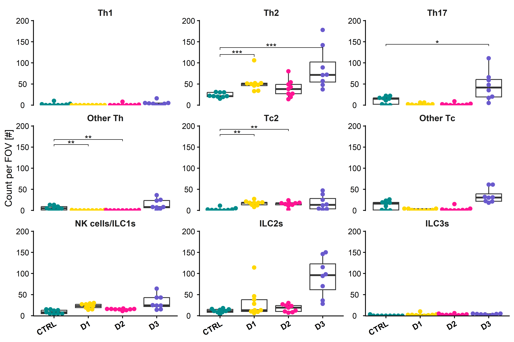


``` r
library(dplyr)
library(tidyr)
library(ggpubr)

# 2. Calculate the Median Counts per FOV
median_table_data <- metadatax %>%
  # Use the column that contains your new sub-types (AL4)
  group_by(Filename, AL4) %>%
  summarise(Count = n(), .groups = "drop") %>%
  # Ensure every FOV has a row for every cell type in your list
  complete(Filename, AL4 = celltype_order_al4, fill = list(Count = 0)) %>%
  # Calculate Median across FOVs
  group_by(AL4) %>%
  summarise(
    Median_Count = median(Count),
    Mean_Count = round(mean(Count), 1),
    Max_Count = max(Count)
  ) %>%
  # Apply the custom order
  mutate(AL4 = factor(AL4, levels = celltype_order_al4)) %>%
  arrange(AL4) %>%
  rename(`Cell Type` = AL4, `Median [#]` = Median_Count, `Mean [#]` = Mean_Count, `Max [#]` = Max_Count)

# 3. Plot the Table
table_plot <- ggtexttable(median_table_data, 
                          rows = NULL
                          )

print(table_plot)
```

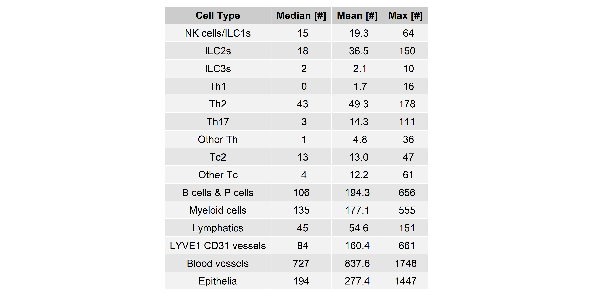


``` r
# Calculate the Median Counts per FOV
median_table_data <- metadatax %>%
  # 1. Filter for the immune compartment first
  filter(AL1 == "Immune cells") %>%
  
  group_by(Filename, AL4) %>%
  summarise(Count = n(), .groups = "drop") %>%
  
  # 2. Fill in missing immune cells with 0
  complete(Filename, AL4 = celltype_order_al4, fill = list(Count = 0)) %>%
  
  group_by(AL4) %>%
  summarise(
    Median_Count = median(Count),
    Mean_Count = round(mean(Count), 1),
    Max_Count = max(Count)
  ) %>%
  
  # 3. THE FIX: Remove rows that have a Max_Count of 0 
  # (These are the Epithelia/Vessel rows that were filtered out in Step 1)
  filter(Max_Count > 0) %>%
  
  mutate(AL4 = factor(AL4, levels = celltype_order_al4)) %>%
  arrange(AL4) %>%
  rename(`Cell Type` = AL4, `Median [#]` = Median_Count, `Mean [#]` = Mean_Count, `Max [#]` = Max_Count)

# Plot the Table
table_plot <- ggtexttable(median_table_data, rows = NULL)

print(table_plot)
```

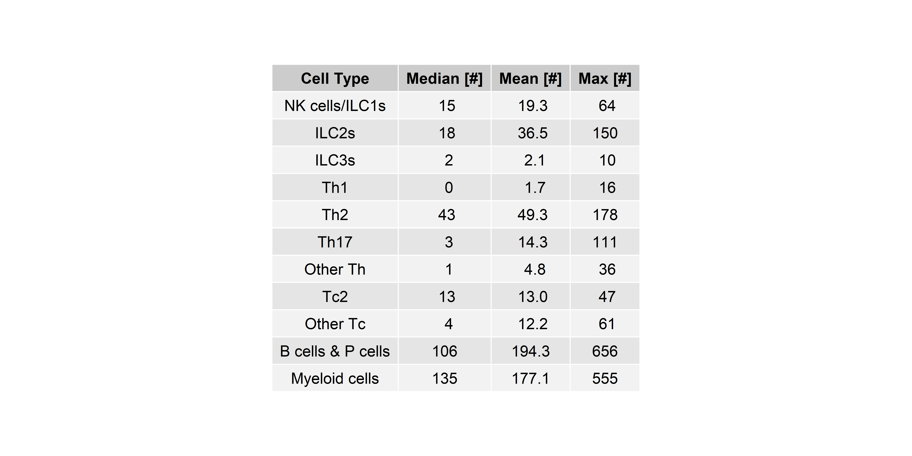


``` r
library(dplyr)
library(tidyr)
library(ggpubr)

# 1. Calculate statistics per FOV and then aggregate
median_table_data <- metadatax %>%
  # Filter for the immune compartment
  filter(AL1 == "Immune cells") %>%
  
  # Count cells per FOV and Subtype
  group_by(Filename, AL4) %>%
  summarise(Count = n(), .groups = "drop") %>%
  
  # Fill in zeros for missing immune cells in specific FOVs
  complete(Filename, AL4 = celltype_order_al4, fill = list(Count = 0)) %>%
  
  # Calculate Frequency per FOV
  group_by(Filename) %>%
  mutate(Total_Immune_in_FOV = sum(Count)) %>%
  mutate(Frequency = (Count / Total_Immune_in_FOV) * 100) %>%
  ungroup() %>%
  
  # 2. Aggregate statistics across all Filenames
  group_by(AL4) %>%
  summarise(
    Median_Count = median(Count),
    SD_Count     = round(sd(Count), 1),
    Median_Freq  = paste(round(median(Frequency), 1), "%"),
    Max_Count    = max(Count),
    .groups = "drop"
  ) %>%
  
  # 3. Clean up: Remove non-immune rows (those with 0 counts)
  filter(Max_Count > 0) %>%
  select(-Max_Count) %>%
  
  # Apply biological ordering and rename for the final table
  mutate(AL4 = factor(AL4, levels = celltype_order_al4)) %>%
  arrange(AL4) %>%
  rename(
    `Cell Type`        = AL4, 
    `Median [#]`       = Median_Count, 
    `SD (Count) [#]`       = SD_Count,
    `Median Freq [%]`  = Median_Freq
  )

# 4. Plot the Table
table_plot <- ggtexttable(median_table_data, 
                          rows = NULL)

print(table_plot)
```

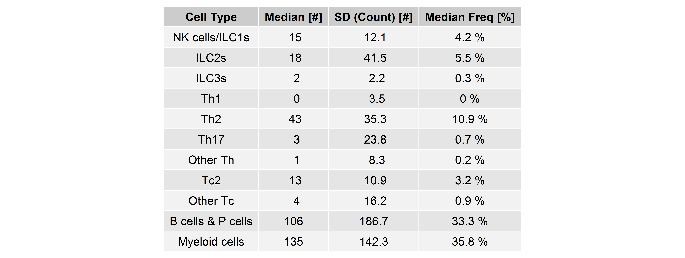

## Combine plots for figure

Additional plots

Frequency of cell types per FOV/condition:


``` r
library(ggpubr)
library(janitor)
library(dplyr)

# 1. Generate the transposed tabyl
# Swapping CellType and Condition makes the table vertical (narrower)
df_freq_transposed <- metadatax %>%
  select(CellType, Condition) %>%
  janitor::tabyl(CellType, Condition) %>%
  # Calculate percentages per Column (Condition)
  janitor::adorn_percentages("col") %>% 
  janitor::adorn_totals(c('row', 'col')) %>%
  janitor::adorn_pct_formatting(digits = 2) %>%
  # Optional: Rename the first column for clarity
  rename(`Cell Type` = CellType) %>%
  select(-Total)

# 2. Plot as ggtexttable
# Vertical tables fit much better on a standard page/slide
table_plot_vertical <- ggtexttable(df_freq_transposed, 
                                  rows = NULL, 
                                  theme = ttheme(base_size = 10)) %>%
  tab_add_title(text = "AL4 - Cell Type Distribution per Condition", 
                face = "bold", size = 12)

# 3. Print
print(table_plot_vertical)
```

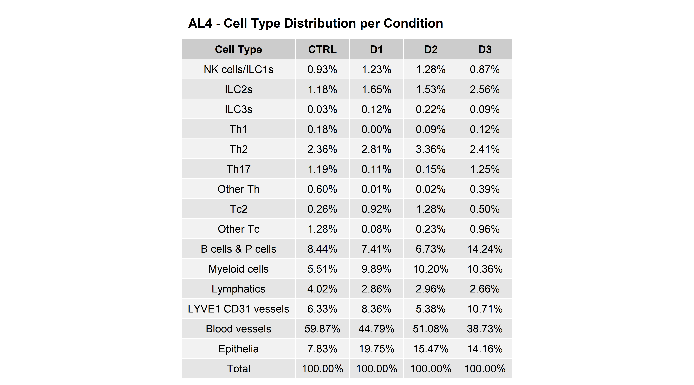


``` r
library(ggpubr)
library(janitor)
library(dplyr)

# 1. Generate the transposed tabyl
# Swapping CellType and Condition makes the table vertical (narrower)
df_freq_transposed <- metadatax %>%
  mutate(CellType = AL3) %>%
  select(CellType, Condition) %>%
  janitor::tabyl(CellType, Condition) %>%
  # Calculate percentages per Column (Condition)
  janitor::adorn_percentages("col") %>% 
  janitor::adorn_totals(c('row', 'col')) %>%
  janitor::adorn_pct_formatting(digits = 2) %>%
  # Optional: Rename the first column for clarity
  rename(`Cell Type` = CellType) %>%
  select(-Total)

# 2. Plot as ggtexttable
# Vertical tables fit much better on a standard page/slide
table_plot_vertical <- ggtexttable(df_freq_transposed, 
                                  rows = NULL, 
                                  theme = ttheme(base_size = 10)) %>%
  tab_add_title(text = "AL3 - Cell Type Distribution per Condition", 
                face = "bold", size = 12)

# 3. Print
print(table_plot_vertical)
```

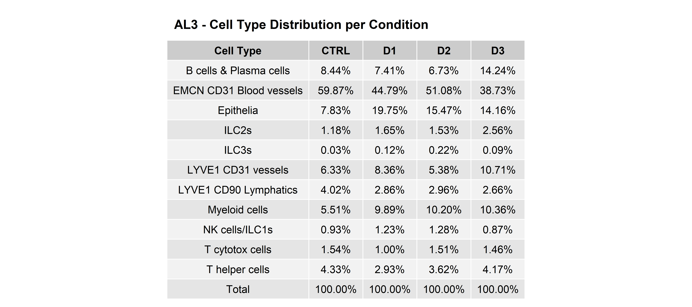

## Session Information


``` r
save.image(paste0(output_dir, "/environment.RData"))
sessionInfo()
```

```
## R version 4.5.2 (2025-10-31 ucrt)
## Platform: x86_64-w64-mingw32/x64
## Running under: Windows 11 x64 (build 26200)
## 
## Matrix products: default
##   LAPACK version 3.12.1
## 
## locale:
## [1] LC_COLLATE=German_Germany.utf8  LC_CTYPE=German_Germany.utf8    LC_MONETARY=German_Germany.utf8 LC_NUMERIC=C                    LC_TIME=German_Germany.utf8    
## 
## time zone: Europe/Berlin
## tzcode source: internal
## 
## attached base packages:
## [1] grid      stats     graphics  grDevices utils     datasets  methods   base     
## 
## other attached packages:
##  [1] janitor_2.2.1         ggplotify_0.1.3       tidyr_1.3.1           circlize_0.4.17       ComplexHeatmap_2.26.1 stringr_1.6.0         ggbeeswarm_0.7.3      readr_2.1.6           ggpubr_0.6.2          ggplot2_4.0.1         VoltRon_0.2.3         Seurat_5.3.1          Giotto_4.2.2          GiottoClass_0.4.10    rlang_1.1.6           rstatix_0.7.3         dplyr_1.1.4           SeuratObject_5.2.0    sp_2.2-0             
## 
## loaded via a namespace (and not attached):
##   [1] fs_1.6.6                    matrixStats_1.5.0           spatstat.sparse_3.1-0       bitops_1.0-9                lubridate_1.9.4             EBImage_4.52.0              doParallel_1.0.17           httr_1.4.8                  RColorBrewer_1.1-3          tools_4.5.2                 sctransform_0.4.2           backports_1.5.0             R6_2.6.1                    lazyeval_0.2.2              uwot_0.2.4                  GetoptLong_1.1.0            withr_3.0.2                 gridExtra_2.3               GiottoUtils_0.2.5           progressr_0.18.0            cli_3.6.5                   Biobase_2.70.0              Cairo_1.7-0                 spatstat.explore_3.5-3      fastDummies_1.7.5           shinyjs_2.1.1               labeling_0.4.3              sass_0.4.10                 S7_0.2.0                    spatstat.data_3.1-9         ggridges_0.5.7              pbapply_1.7-4               yulab.utils_0.2.4           dichromat_2.0-0.1           parallelly_1.45.1           rstudioapi_0.18.0           gridGraphics_0.5-1          shape_1.4.6.1               generics_0.1.4              vroom_1.7.0                 gtools_3.9.5                ica_1.0-3                  
##  [43] spatstat.random_3.4-2       car_3.1-5                   Matrix_1.7-4                S4Vectors_0.48.0            abind_1.4-8                 terra_1.8-93                lifecycle_1.0.5             scatterplot3d_0.3-45        yaml_2.3.10                 snakecase_0.11.1            carData_3.0-6               SummarizedExperiment_1.40.0 gplots_3.3.0                SparseArray_1.10.1          Rtsne_0.17                  promises_1.5.0              crayon_1.5.3                miniUI_0.1.2                lattice_0.22-7              beachmat_2.26.0             cowplot_1.2.0               magick_2.9.0                pillar_1.11.1               knitr_1.51                  GenomicRanges_1.62.0        rjson_0.2.23                future.apply_1.20.2         codetools_0.2-20            glue_1.8.0                  spatstat.univar_3.1-4       data.table_1.17.8           vctrs_0.6.5                 png_0.1-8                   ids_1.0.1                   spam_2.11-1                 gtable_0.3.6                cachem_1.1.0                xfun_0.56                   S4Arrays_1.10.0             mime_0.13                   tidygraph_1.3.1             Seqinfo_1.0.0              
##  [85] survival_3.8-3              SingleCellExperiment_1.32.0 iterators_1.0.14            bluster_1.20.0              rgl_1.3.34                  fitdistrplus_1.2-6          ROCR_1.0-12                 colorsGen_1.0.0             nlme_3.1-168                bit64_4.6.0-1               RcppAnnoy_0.0.22            rprojroot_2.1.1             bslib_0.10.0                irlba_2.3.5.1               vipor_0.4.7                 KernSmooth_2.23-26          otel_0.2.0                  colorspace_2.1-2            BiocGenerics_0.56.0         tidyselect_1.2.1            bit_4.6.0                   compiler_4.5.2              BiocNeighbors_2.4.0         DelayedArray_0.36.0         plotly_4.12.0               checkmate_2.3.4             scales_1.4.0                caTools_1.18.3              lmtest_0.9-40               rappdirs_0.3.4              tiff_0.1-12                 SpatialExperiment_1.20.0    digest_0.6.38               goftest_1.2-3               fftwtools_0.9-11            spatstat.utils_3.2-0        rmarkdown_2.30              XVector_0.50.0              htmltools_0.5.8.1           GiottoVisuals_0.2.14        pkgconfig_2.0.3             jpeg_0.1-11                
## [127] base64enc_0.1-6             MatrixGenerics_1.22.0       fastmap_1.2.0               GlobalOptions_0.1.3         htmlwidgets_1.6.4           shiny_1.13.0                Rvcg_0.25                   farver_2.1.2                jquerylib_0.1.4             zoo_1.8-14                  jsonlite_2.0.0              BiocParallel_1.44.0         BiocSingular_1.26.0         RCurl_1.98-1.17             magrittr_2.0.4              Formula_1.2-5               dotCall64_1.2               patchwork_1.3.2             RCDT_1.3.0                  Rcpp_1.1.0                  viridis_0.6.5               reticulate_1.44.0           stringi_1.8.7               ggraph_2.2.2                MASS_7.3-65                 plyr_1.8.9                  parallel_4.5.2              listenv_0.10.0              ggrepel_0.9.6               deldir_2.0-4                graphlayouts_1.2.2          splines_4.5.2               tensor_1.5.1                hms_1.1.4                   locfit_1.5-9.12             colorRamp2_0.1.0            igraph_2.2.1                uuid_1.2-2                  spatstat.geom_3.6-0         ggsignif_0.6.4              RcppHNSW_0.6.0              reshape2_1.4.5             
## [169] stats4_4.5.2                ScaledMatrix_1.18.0         evaluate_1.0.5              foreach_1.5.2               tzdb_0.5.0                  tweenr_2.0.3                httpuv_1.6.16               RANN_2.6.2                  purrr_1.2.0                 polyclip_1.10-7             clue_0.3-67                 future_1.69.0               scattermore_1.2             ggforce_0.5.0               rsvd_1.0.5                  broom_1.0.12                xtable_1.8-8                RSpectra_0.16-2             later_1.4.4                 viridisLite_0.4.2           Polychrome_1.5.4            tibble_3.3.0                beeswarm_0.4.0              memoise_2.0.1               IRanges_2.44.0              cluster_2.1.8.1             timechange_0.3.0            globals_0.19.0              here_1.0.2
```
