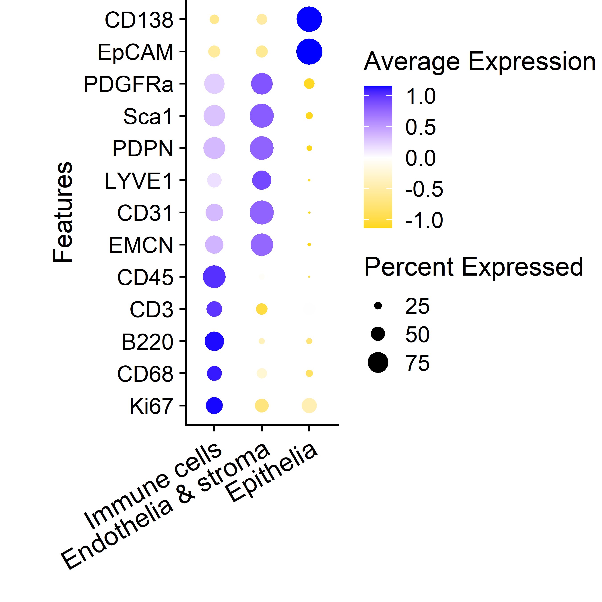
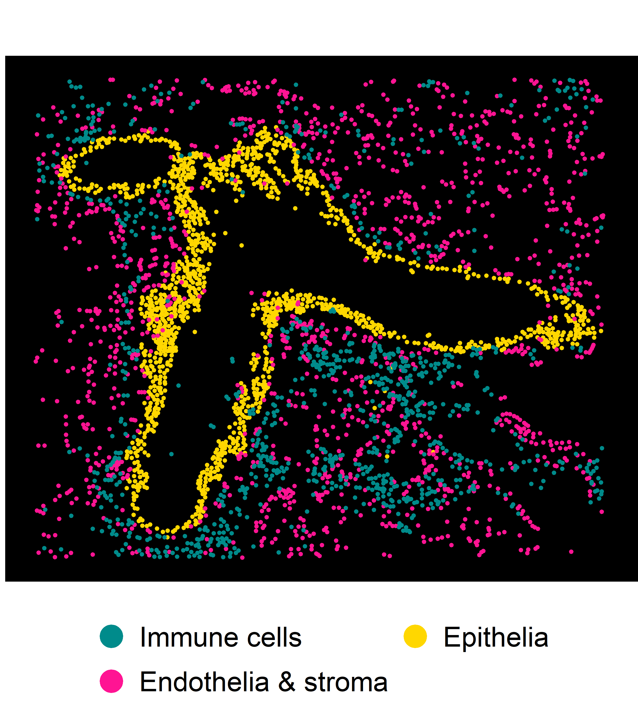
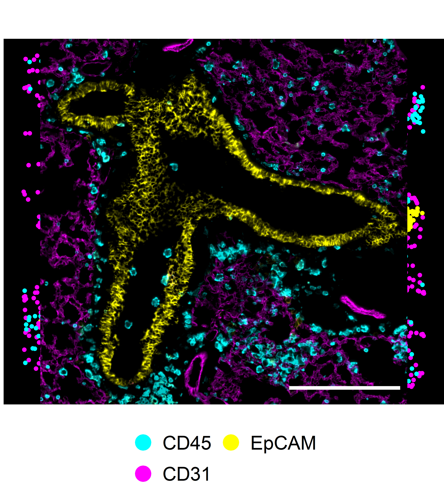
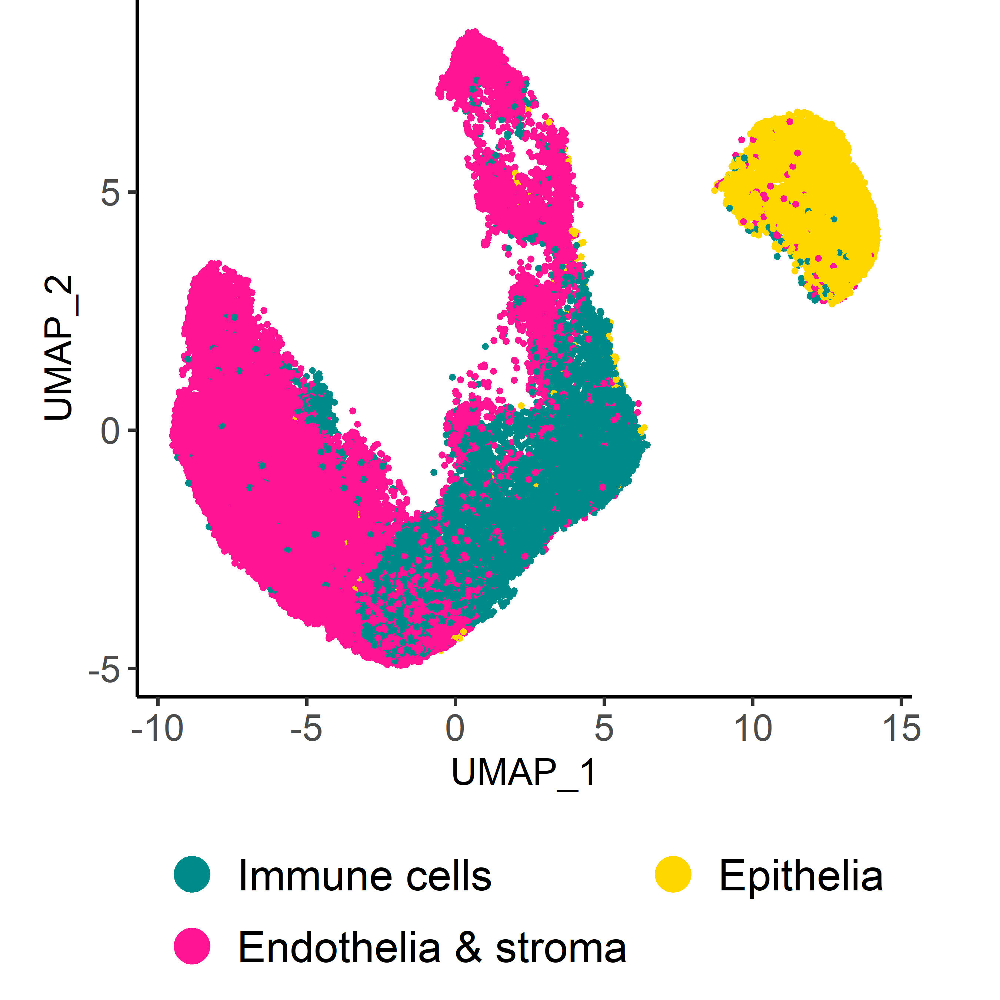

## Libraries


``` r
library(Seurat)
library(SeuratObject)
library(dplyr)
library(ggplot2)
# library(stringr)
# library(glue)
# library(here)
library(readr)
# library(lubridate)
# library(data.table)
# library(clustree)
# library(magrittr)
library(ggpubr)
# library(ggrepel)
# library(readxl)
# library(openxlsx)
```

## Parameters


``` r
set.seed(123)

input_dir <- here::here("1_data_tidying", "Lung_SI_all_cells_all_ALs_files")

output_dir <- here::here("2_visualizations_for_figures", "Fig_2_major_cell_types_lung_files")
dir.create(output_dir)


main_markers <- c(
  "EpCAM", "EMCN", "LYVE1", "PDPN", "PDGFRa", "CD8a", "CD4",
  "CD45", "CD3", "IRF4", "Kappa", "CD11c", "CD127", "GATA3eGFP", "RORgt"
)

immune_markers <- c(
 "CD3", "CD4", "CD8a", "Kappa", "IRF4", "CD11c",
  "CD127", "CD90", "EOMES", "GATA3eGFP", "RORgt", "Ki67",  "KLRG1", "NKp46", "CD117", "Areg", "CCR6", "CD44", "MHCII", "Sca1"
)

ilc_markers <- c(
  "CD3", "CD4", "CD8a",
  "CD127", "CD90", "EOMES", "GATA3eGFP", "RORgt", "KLRG1", "NKp46", "CD117", "CCR6", "MHCII", "Ki67", "Areg", "IRF4", "Sca1", "CD44"
)


cols_nat <- c("magenta", "cyan", "blue", "purple", "green", 
                       "red", "yellow", "olivedrab1", "slateblue1", 
                       "darkcyan", "gold","indianred1", "seagreen", "deeppink", 
                       "orange", "brown", "violet",
                       "deeppink4", "pink", 
                       "grey", "black", "lightgreen", 
                       "#FF0066",  
                       "lightblue", "#FFCC99", "#CC00FF", 
                       "blueviolet",  "goldenrod4", 
                       "navy", "olivedrab", "lightcyan", "seagreen2", "darkviolet", "lightpink", "slateblue4", "olivedrab2")

colfunc <- colorRampPalette(c("darkcyan", "green", "yellow", "magenta", "purple"))
```

# Load data


``` r
SO.lung <- readRDS(paste0(input_dir, "/lung_all_cells_all_ALs.rds"))
dim(SO.lung)
```

```
## [1]    32 67537
```

``` r
SO.lung$AL1 <- gsub("Vessels", "Stromal cells", SO.lung$AL1)
```

# Visualization

## UMAP AL1

## Dotplot AL1


``` r
SO.lung$AL1 <- factor(SO.lung$AL1, levels = c("Immune cells", "Stromal cells", "Epithelia"))

dot_plot <- Seurat::DotPlot(SO.lung, 
                group.by = "AL1",
                  features = c(
                    "Ki67", 
                    "CD68", 
                    "B220", 
                    "CD3", 
                    "CD45", 
                    "EMCN", 
                    "CD31", 
                    "LYVE1", 
                    "PDPN",
                    "Sca1",
                    "PDGFRa",
                    "EpCAM", 
                    "CD138"
                  ), 
                cols ="RdBu", assay = "MELC")+   
    RotatedAxis()+
    coord_flip()+
    theme(axis.text.x=element_text(size=14, angle = 30),
          axis.text.y=element_text(size=12), 
          plot.margin = margin(0, 0.5, 0.5, 0.5, "cm"), 
          axis.title.x = element_blank(), 
          plot.title = element_blank())+ 
  scale_color_gradient2(midpoint = 0, low = "gold", 
                            high = "blue", space = "Lab" )

dot_plot
```



## Comparison annotation & IF overlay

Annotated cells of AL1:


``` r
df_all_cells <- FetchData(SO.lung, 
                        vars = c("Dataset",
                                 "Treatment",
                                 "AL1", 
                                 "CellID", 
                                 "Experiment", 
                                 "Location_Center_X", 
                                 "Location_Center_Y", 
                                 "UMAP_1", "UMAP_2"))


my_colors <- c("darkcyan", "deeppink", "gold")


df_fov <- df_all_cells %>%
          filter(Dataset == "D1_FOV1_20220316")

df_fov$AL1 <- factor(df_fov$AL1, 
                                       levels = c("Immune cells", "Stromal cells", "Epithelia"))
plot_ann_1 <- ggplot()+ 
  geom_point(data = df_fov, 
                       aes(x= Location_Center_X, y= Location_Center_Y, 
                           color = AL1), 
                      size = 0.5)+
    ggplot2::guides(color=guide_legend(override.aes = list(size=5), ncol=3), 
                    fill=guide_legend(ncol = 1,byrow=TRUE))+
    theme(legend.position = "bottom", 
          plot.margin=margin(1,0,0,0,"cm"),
          text = element_blank(),
           axis.ticks = element_blank(),
         panel.grid =  element_blank(),
          legend.ticks = element_blank(),
         legend.title=element_blank(),
         legend.key = element_blank(),
        legend.text = element_text(size=14), 
         panel.background = element_rect(fill = 'black', 
                                         color = 'black', size = 1))+    
    scale_colour_discrete(name  ="Annotated cell types",
                          breaks=c("Immune cells",
                                                  "Vessels & stroma",
                                                  "Epithelia"),
                          labels=c("Immune cells",
                                                  "Vessels & stroma",
                                                  "Epithelia")) +
    scale_color_manual(values = my_colors)+ 
    ggplot2::guides(color=guide_legend(override.aes = list(size=5), ncol=3),
                  fill=guide_legend(ncol = 1,byrow=TRUE))+
  xlim(0, 2048)+
  ylim(0, 2048) +
  scale_y_reverse()

plot_ann_1 <- ggarrange(plot_ann_1,
          nrow = 1, ncol = 1, 
          #widths = c(4.5, 4.5), 
          align = "v",
          font.label=list(size=12),hjust=-0.5
          )+    
  ggplot2::theme(legend.position = "left")+
  theme(plot.margin=margin(0,0,0,0,"cm"))
plot_ann_1
```



IF overlay:


``` r
img <- png::readPNG(
    "C:/Users/NieHau/Desktop/Sandy/R/R_analysis_output/LUNG_MELC_data_analysis_by_treatment/CTRL_D1_D2_D3/Overlays_for_R/20220316_1_D1_mu_lung_CD45-c_CD31-m_EpCAM-y.png"
  )


my_colors <- c("cyan", "magenta", "yellow")

g <- grid::rasterGrob(img, interpolate=TRUE)


df_fov <- df_fov %>%
  mutate(AL1 = recode(
    AL1, 
    "Immune cells" = "CD45",
    "Stromal cells" = "CD31",
    "Epithelia" = "EpCAM"
  ))

plot_if_1 <- ggplot()+ 
  geom_point(data = df_fov, 
                       aes(x= Location_Center_X, y= Location_Center_Y, color = AL1), 
                       size = 1)+
  annotation_custom(g, xmin=-Inf, xmax=Inf, ymin=-Inf, ymax=Inf)+
  theme(legend.title=element_blank())+ # exclude legend title
  scale_colour_discrete(name  ="MELC IF stainings",
                          breaks=c("CD45", "CD31", 
                                   "EpCAM"),
                          labels=c("CD45", "CD31", 
                                   "EpCAM")) +
  scale_color_manual(values = my_colors)+ 
    theme(legend.position = "bottom", 
          plot.margin=margin(1,0,0,0,"cm"),
          text = element_blank(),
           axis.ticks = element_blank(),
         panel.grid =  element_blank(),
          legend.ticks = element_blank(),
         legend.title=element_blank(),
         legend.key = element_blank(),
        legend.text = element_text(size=14), 
         panel.background = element_rect(fill = 'black', 
                                         color = 'black', size = 1))+    
  ggplot2::theme(legend.position = "bottom")+
  ggplot2::guides(color=guide_legend(override.aes = list(size=5), ncol=3),
                  fill=guide_legend(ncol = 1,byrow=TRUE))


plot_if_1 <- ggarrange(plot_if_1, 
            nrow = 1, ncol = 1, 
          #widths = c(4.5, 4.5), 
          align = "v",
          font.label=list(size=12),hjust=-0.5
          )+    
  ggplot2::theme(legend.position = "left")
  
plot_if_1
```



## UMAP AL1


``` r
df_umap <- read_csv("D:/Repositories/2025_Kroh_et_al/Murine_ILC_niches_lung_SI_IL-33/data/lung_umap_AL1.csv", 
    col_types = cols(...1 = col_skip()))

# delete mixed and useless UMAP information from the df_all_cells
df_all_cells <- df_all_cells %>%
  select(-c(UMAP_1, UMAP_2))

# combine correct UMAP information from AL1
df_all_cells <- base::merge(df_all_cells, df_umap, by = "CellID")

umap_plot <- ggplot(df_all_cells, aes(x=UMAP_1, y=UMAP_2, color=AL1)) +
  geom_point(size = 0.5)+ 
  theme_classic2()+
  xlab("UMAP_1")+
  ylab("UMAP_2")+
  ggplot2::guides(color=guide_legend(override.aes = list(size=5), ncol=3),
                  fill=guide_legend(ncol = 1,byrow=TRUE))+
  scale_color_manual(values = c("darkcyan", "deeppink", "gold"))+
  theme(axis.text.x=element_text(size=12),
          axis.text.y=element_text(size=12), 
          axis.title.x = element_text(size=12),
          plot.title = element_blank(), 
          plot.margin = margin(0, 1, 0.1, 0.5, "cm"), 
        legend.position = "bottom", 
        legend.text = element_text(size=14), 
        legend.title = element_blank())


umap_plot
```



Combine plots for figure


``` r
ggarrange(umap_plot, dot_plot, plot_ann_1, plot_if_1, ncol = 2, nrow = 2, heights = c(4.5, 6.5), labels = c("A", "", "B", "C"))+
  theme(plot.margin = margin(0, 0.1, 0, 0, "cm"))
```


## Session Information


``` r
save.image(paste0(output_dir, "/environment.RData"))
sessionInfo()
```

```
## R version 4.4.2 (2024-10-31 ucrt)
## Platform: x86_64-w64-mingw32/x64
## Running under: Windows 10 x64 (build 19045)
## 
## Matrix products: default
## 
## 
## locale:
## [1] LC_COLLATE=English_Germany.utf8  LC_CTYPE=English_Germany.utf8    LC_MONETARY=English_Germany.utf8 LC_NUMERIC=C                     LC_TIME=English_Germany.utf8    
## 
## time zone: Europe/Berlin
## tzcode source: internal
## 
## attached base packages:
## [1] stats     graphics  grDevices utils     datasets  methods   base     
## 
## other attached packages:
## [1] ggpubr_0.6.0       readr_2.1.5        ggplot2_3.5.1      dplyr_1.1.4        Seurat_5.2.1       SeuratObject_5.0.2 sp_2.2-0          
## 
## loaded via a namespace (and not attached):
##   [1] RColorBrewer_1.1-3     rstudioapi_0.17.1      jsonlite_1.9.1         magrittr_2.0.3         spatstat.utils_3.1-3   farver_2.1.2           rmarkdown_2.29         vctrs_0.6.5            ROCR_1.0-11            spatstat.explore_3.4-2 rstatix_0.7.2          htmltools_0.5.8.1      broom_1.0.8            Formula_1.2-5          sass_0.4.10            sctransform_0.4.1      parallelly_1.43.0      KernSmooth_2.23-24     bslib_0.9.0            htmlwidgets_1.6.4      ica_1.0-3              plyr_1.8.9             plotly_4.10.4          zoo_1.8-13             cachem_1.1.0           igraph_2.1.4           mime_0.13              lifecycle_1.0.4        pkgconfig_2.0.3        Matrix_1.7-1           R6_2.6.1               fastmap_1.2.0          fitdistrplus_1.2-2     future_1.40.0          shiny_1.10.0           digest_0.6.37          colorspace_2.1-1       patchwork_1.3.0        rprojroot_2.0.4        tensor_1.5             RSpectra_0.16-2        irlba_2.3.5.1          labeling_0.4.3         progressr_0.15.1       spatstat.sparse_3.1-0  httr_1.4.7             polyclip_1.10-7        abind_1.4-8            compiler_4.4.2         here_1.0.1             bit64_4.6.0-1         
##  [52] withr_3.0.2            backports_1.5.0        carData_3.0-5          fastDummies_1.7.5      ggsignif_0.6.4         MASS_7.3-61            tools_4.4.2            lmtest_0.9-40          httpuv_1.6.15          future.apply_1.11.3    goftest_1.2-3          glue_1.8.0             nlme_3.1-166           promises_1.3.2         grid_4.4.2             Rtsne_0.17             cluster_2.1.6          reshape2_1.4.4         generics_0.1.3         gtable_0.3.6           spatstat.data_3.1-6    tzdb_0.4.0             tidyr_1.3.1            data.table_1.17.0      hms_1.1.3              car_3.1-3              spatstat.geom_3.3-6    RcppAnnoy_0.0.22       ggrepel_0.9.6          RANN_2.6.2             pillar_1.10.2          stringr_1.5.1          vroom_1.6.5            spam_2.11-1            RcppHNSW_0.6.0         later_1.4.1            splines_4.4.2          lattice_0.22-6         bit_4.6.0              survival_3.7-0         deldir_2.0-4           tidyselect_1.2.1       miniUI_0.1.2           pbapply_1.7-2          knitr_1.50             gridExtra_2.3          scattermore_1.2        xfun_0.51              matrixStats_1.5.0      stringi_1.8.4          lazyeval_0.2.2        
## [103] yaml_2.3.10            evaluate_1.0.3         codetools_0.2-20       tibble_3.2.1           cli_3.6.3              uwot_0.2.3             xtable_1.8-4           reticulate_1.42.0      munsell_0.5.1          jquerylib_0.1.4        Rcpp_1.0.14            globals_0.17.0         spatstat.random_3.3-3  png_0.1-8              spatstat.univar_3.1-2  parallel_4.4.2         dotCall64_1.2          listenv_0.9.1          viridisLite_0.4.2      scales_1.3.0           ggridges_0.5.6         crayon_1.5.3           purrr_1.0.4            rlang_1.1.5            cowplot_1.1.3
```
