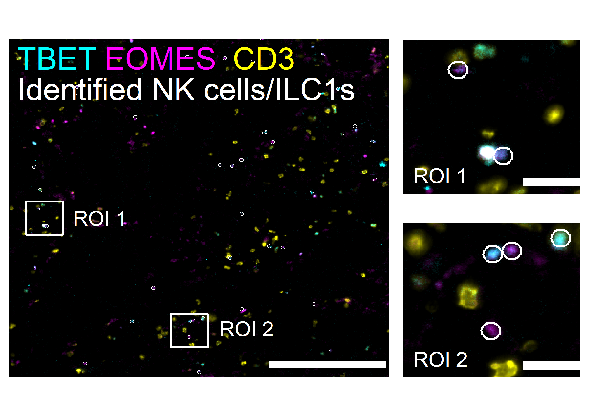
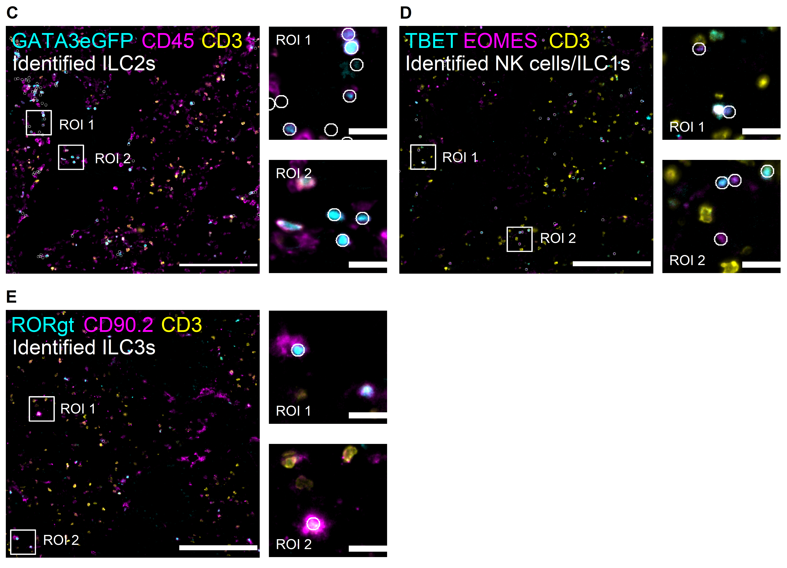

## Libraries


``` r
library(Seurat)
library(SeuratObject)
library(dplyr)
library(ggplot2)
# library(stringr)
# library(glue)
# library(here)
library(readr)
# library(lubridate)
# library(data.table)
# library(clustree)
# library(magrittr)
library(ggpubr)
# library(ggrepel)
# library(readxl)
# library(openxlsx)
```

## Parameters


``` r
set.seed(123)

input_dir <- here::here("1_data_tidying", "Lung_SI_all_cells_all_ALs_files")

output_dir <- here::here("2_visualizations_for_figures", "Fig_3_ILCs_in_lung_files")
dir.create(output_dir)


main_markers <- c(
  "EpCAM", "EMCN", "LYVE1", "PDPN", "PDGFRa", "CD8a", "CD4",
  "CD45", "CD3", "IRF4", "Kappa", "CD11c", "CD127", "GATA3eGFP", "RORgt"
)


immune_markers <- c(
 "CD3", "CD4", "CD8a", "Kappa", "IRF4", "CD11c",
  "CD127", "CD90", "EOMES", "GATA3eGFP", "RORgt", "Ki67",  "KLRG1", "NKp46", "CD117", "Areg", "CCR6", "CD44", "MHCII", "Sca1"
)

ilc_markers <- c(
  "CD3", "CD4", "CD8a",
  "CD127", "CD90", "EOMES", "GATA3eGFP", "RORgt", "KLRG1", "NKp46", "CD117", "CCR6", "MHCII", "Ki67", "Areg", "IRF4", "Sca1", "CD44"
)


cols_nat <- c("magenta", "cyan", "blue", "purple", "green", 
                       "red", "yellow", "olivedrab1", "slateblue1", 
                       "darkcyan", "gold","indianred1", "seagreen", "deeppink", 
                       "orange", "brown", "violet",
                       "deeppink4", "pink", 
                       "grey", "black", "lightgreen", 
                       "#FF0066",  
                       "lightblue", "#FFCC99", "#CC00FF", 
                       "blueviolet",  "goldenrod4", 
                       "navy", "olivedrab", "lightcyan", "seagreen2", "darkviolet", "lightpink", "slateblue4", "olivedrab2")

colfunc <- colorRampPalette(c("darkcyan", "green", "yellow", "magenta", "purple"))
```

# Load data


``` r
SO.lung <- readRDS(paste0(input_dir, "/lung_all_cells_all_ALs.rds"))
dim(SO.lung)
```

```
## [1]    32 67537
```

``` r
SO.lung$AL1 <- gsub("Vessels", "Stromal cells", SO.lung$AL1)
```

# Visualization

## Dotplot AL2


``` r
SO.lung$AL2 <- factor(SO.lung$AL2, levels = c(
  "B cells & Plasma cells",
  "Myeloid cells", 
  "T cytotox. cells", 
  "T helper cells", 
  "ILCs"
))


dot_plot <- Seurat::DotPlot(subset(SO.lung, subset = AL1 == "Immune cells"), 
                group.by = "AL2",
                  features = c(
                    "CD90", 
                    "CD127", 
                    "GATA3eGFP", 
                    "KLRG1", 
                    "RORgt", 
                    "CD4", 
                    "CD3", 
                    "CD8a", 
                    "CD68",
                    "CD11c",
                    "MHCII",
                    "B220", 
                    "Kappa", 
                    "CD117"
                  ), 
                cols ="RdBu", assay = "MELC")+   
    RotatedAxis()+
    # coord_flip()+
    theme(axis.text.x=element_text(size=12, angle = 45),
          axis.text.y=element_text(size=14), 
          plot.margin = margin(2, 0, 0.4, 0.5, "cm"), 
          axis.title.y = element_blank(), 
          plot.title = element_blank())+ 
  scale_color_gradient2(midpoint = 0, low = "gold", 
                            high = "blue", space = "Lab" )

dot_plot
```


## Ridge plots of ILC subytpes


``` r
ridge_plot <- RidgePlot(subset(SO.lung, subset = AL3 == c("NK cells/ILC1s", "ILC2s", "ILC3s")), 
          features = c("CD127", "CD90","GATA3eGFP", "KLRG1", "EOMES", "TBET",  "RORgt"),
          group.by = "AL3", ncol = 2, same.y.lims = TRUE, assay = "MELC", layer = "counts",
          cols = alpha(c(
            "navy",
            "seagreen2",
            "darkmagenta"
          ), 0.5))+
  theme(plot.margin = margin(0, 0, 0, 0, "cm"))

ridge_plot
```


``` r
RidgePlot(subset(SO.lung, subset = AL3 == c("NK cells/ILC1s", "ILC2s", "ILC3s")), 
          features = c("CD127", "CD90","GATA3eGFP",  "KLRG1", "EOMES", "TBET", "NKp46", "RORgt"),
          group.by = "AL3", ncol = 3, same.y.lims = TRUE, assay = "MELC", layer = "counts", y.max = 10, log = TRUE, 
          cols = alpha(c(
            "navy",
            "seagreen2",
            "darkmagenta"
          ), 0.5))+
  theme(plot.margin = margin(0, 0, 0, 0, "cm"))
```


``` r
fetched_data <- FetchData(SO.lung, vars = c("CD127", "CD90", "KLRG1", "ICOS",
                                       "TBET", "EOMES", "CCR6", "NKp46", "RORgt",
                                       "GATA3eGFP", "AL3", "Treatment", "Dataset"))

fetched_data <- fetched_data %>%
  filter(AL3 %in% c("NK cells/ILC1s", "ILC2s", "ILC3s")) %>%
  mutate(Treatment = factor(Treatment, levels = c(
    "CTRL", "1", "2", "3"
  ))) %>%
  group_by(AL3) %>%
  summarise(CD127_median = median(CD127), 
            GATA3eGFP_median = median(GATA3eGFP), 
            CD90_median = median(CD90), 
            ICOS_median = median(ICOS), 
            KLRG1_median = median(KLRG1), 
            RORgt_median = median(RORgt), 
            TBET_median = median(TBET), 
            EOMES_median = median(EOMES), 
            CCR6_median = median(CCR6), 
            NKp46_median = median(NKp46), 
            CD127_div = sd(CD127),
            CD127_skew = moments::skewness(CD127),
            CD127_kurt = moments::kurtosis(CD127),
            GATA3eGFP_div = sd(GATA3eGFP),
            GATA3eGFP_skew = moments::skewness(GATA3eGFP), 
            GATA3eGFP_kurt = moments::kurtosis(GATA3eGFP),
            CD90_div = sd(CD90), 
            CD90_skew = moments::skewness(CD90), 
            CD90_kurt = moments::kurtosis(CD90)
)

fetched_data
```

```
## # A tibble: 3 × 20
##   AL3            CD127_median GATA3eGFP_median CD90_median ICOS_median KLRG1_median RORgt_median TBET_median EOMES_median CCR6_median NKp46_median CD127_div CD127_skew CD127_kurt GATA3eGFP_div GATA3eGFP_skew GATA3eGFP_kurt CD90_div CD90_skew CD90_kurt
##   <fct>                 <dbl>            <dbl>       <dbl>       <dbl>        <dbl>        <dbl>       <dbl>        <dbl>       <dbl>        <dbl>     <dbl>      <dbl>      <dbl>         <dbl>          <dbl>          <dbl>    <dbl>     <dbl>     <dbl>
## 1 NK cells/ILC1s         0                5.59        0           4.31         4.22         0           6.54         6.78        5.45         5.50      2.21      0.562       1.67          2.49         -1.05            2.68     2.06     1.11       2.63
## 2 ILC2s                  5.61             5.96        5.43        5.43         4.81         0           0            0           5.09         0         2.48     -1.06        2.77          3.05         -0.706           1.82     2.81    -0.596      1.74
## 3 ILC3s                  5.65             5.43        5.79        6.15         0            5.27        4.00         0           6.26         4.00      1.52     -1.73        7.04          2.48         -1.07            2.55     2.30    -1.30       3.59
```

## IF overlays

### ILC1s/NK cells


``` r
# load overview overlay image
img <- png::readPNG(
    "D:/Sandy/Promotion/Dissertation/Figures/20210902_1_li_d3/NKILC1/TBET-c_EOMES-m_CD3-y_ov_ROIs.png"
  )

plot_ov <- ggplot() + background_image(img)+
  theme( panel.border = element_rect(colour = "white", fill=NA, size=2)) +
    theme(legend.position = "bottom", 
          plot.margin=margin(0.18,0,0.13,0,"cm"),
          text = element_blank(),
           axis.ticks = element_blank(),
         panel.grid =  element_blank(),
          legend.ticks = element_blank(),
         legend.title=element_blank(),
         legend.key = element_blank(),
        legend.text = element_text(size=14), 
         panel.background = element_rect(fill = 'black', 
                                         color = 'black', size = 1))+    
annotate("text", x=c(200, 800, 1400, 950), y=c(2000, 2000, 2000, 1800), label= c("TBET", "EOMES", "CD3", "Identified NK cells/ILC1s"), ymin = 0, ymax = 2048,
           xmin = 0, xmax = 2048, 
           col=c("cyan", "magenta", "yellow", "white"), size=6, parse=FALSE)  +    
annotate("text", x=c(450, 1300), y=c(960, 240), label= c("ROI 1", "ROI 2"), ymin = 0, ymax = 2048,
           xmin = 0, xmax = 2048, 
           col=c("white", "white"), size=4, parse=FALSE) 


# load overview overlay image
img <- png::readPNG(
    "D:/Sandy/Promotion/Dissertation/Figures/20210902_1_li_d3/NKILC1/TBET-c_EOMES-m_CD3-y_ov_ROIs-2.png"
  )

plot_1 <- ggplot() + background_image(img)  +
    theme(legend.position = "bottom", 
          plot.margin=margin(0.18,0.1,0.13,0,"cm"),
          text = element_blank(),
           axis.ticks = element_blank(),
         panel.grid =  element_blank(),
          legend.ticks = element_blank(),
         legend.title=element_blank(),
         legend.key = element_blank(),
        legend.text = element_text(size=14), 
         panel.background = element_rect(fill = 'white', 
                                         color = 'white', size = 1)) + 
  annotate("text", x=2, y=1, 
           label= c("ROI 1"), ymin = 0, ymax = 10,
           xmin = 0, xmax = 10, 
           col=c("white"), size=4, parse=FALSE) 


# load overview overlay image
img <- png::readPNG(
    "D:/Sandy/Promotion/Dissertation/Figures/20210902_1_li_d3/NKILC1/TBET-c_EOMES-m_CD3-y_ov_ROIs-1.png"
  )

plot_2 <- ggplot() + background_image(img)  +
    theme(legend.position = "bottom", 
          plot.margin=margin(0.18,0.1,0.13,0,"cm"),
          text = element_blank(),
           axis.ticks = element_blank(),
         panel.grid =  element_blank(),
          legend.ticks = element_blank(),
         legend.title=element_blank(),
         legend.key = element_blank(),
        legend.text = element_text(size=14), 
         panel.background = element_rect(fill = 'white', 
                                         color = 'white', size = 1)) + 
  annotate("text", x=2, y=1, 
           label= c("ROI 2"), ymin = 0, ymax = 10,
           xmin = 0, xmax = 10, 
           col=c("white"), size=4, parse=FALSE) 


zoomed <- ggarrange(plot_1, plot_2, nrow = 2, ncol = 1)

ilc1 <- ggarrange(plot_ov, zoomed, nrow = 1, ncol = 2, 
          heights = 5, 
          widths = c(4, 2))+
    theme(plot.margin=margin(0.5,0,0,0,"cm"))

ilc1
```



### ILC2s


``` r
# load overview overlay image
img <- png::readPNG(
    "D:/Sandy/Promotion/Dissertation/Figures/20210902_1_li_d3/ILC2s/GATA3eGFP-c_CD45-m_CD3-y_ov_ROI.png"
  )

plot_ov <- ggplot() + background_image(img)+
  theme( panel.border = element_rect(colour = "white", fill=NA, size=2)) +
    theme(legend.position = "bottom", 
          plot.margin=margin(0.18,0,0.13,0,"cm"),
          text = element_blank(),
           axis.ticks = element_blank(),
         panel.grid =  element_blank(),
          legend.ticks = element_blank(),
         legend.title=element_blank(),
         legend.key = element_blank(),
        legend.text = element_text(size=14), 
         panel.background = element_rect(fill = 'black', 
                                         color = 'black', size = 1))+    
annotate("text", x=c(500, 1330, 1800, 600), y=c(2000, 2000, 2000, 1800), label= c("GATA3eGFP", "CD45", "CD3", "Identified ILC2s"), ymin = 0, ymax = 2048,
           xmin = 0, xmax = 2048, 
           col=c("cyan", "magenta", "yellow", "white"), size=6, parse=FALSE) +    
annotate("text", x=c(540, 850), y=c(1250, 950), label= c("ROI 1", "ROI 2"), ymin = 0, ymax = 2048,
           xmin = 0, xmax = 2048, 
           col=c("white", "white"), size=4, parse=FALSE)  


# load overview overlay image
img <- png::readPNG(
    "D:/Sandy/Promotion/Dissertation/Figures/20210902_1_li_d3/ILC2s/GATA3eGFP-c_CD45-m_CD3-y_ov_ROI-2.png"
  )

plot_1 <- ggplot() + background_image(img) +
    theme(legend.position = "bottom", 
          plot.margin=margin(0.18,0.1,0.13,0,"cm"),
          text = element_blank(),
           axis.ticks = element_blank(),
         panel.grid =  element_blank(),
          legend.ticks = element_blank(),
         legend.title=element_blank(),
         legend.key = element_blank(),
        legend.text = element_text(size=14), 
         panel.background = element_rect(fill = 'white', 
                                         color = 'white', size = 1)) + 
  annotate("text", x=2, y=9, 
           label= c("ROI 1"), ymin = 0, ymax = 10,
           xmin = 0, xmax = 10, 
           col=c("white"), size=4, parse=FALSE) 


# load overview overlay image
img <- png::readPNG(
    "D:/Sandy/Promotion/Dissertation/Figures/20210902_1_li_d3/ILC2s/GATA3eGFP-c_CD45-m_CD3-y_ov_ROI-1.png"
  )

plot_2 <- ggplot() + background_image(img)  +
    theme(legend.position = "bottom", 
          plot.margin=margin(0.18,0.1,0.13,0,"cm"),
          text = element_blank(),
           axis.ticks = element_blank(),
         panel.grid =  element_blank(),
          legend.ticks = element_blank(),
         legend.title=element_blank(),
         legend.key = element_blank(),
        legend.text = element_text(size=14), 
         panel.background = element_rect(fill = 'white', 
                                         color = 'white', size = 1)) + 
  annotate("text", x=2, y=9, 
           label= c("ROI 2"), ymin = 0, ymax = 10,
           xmin = 0, xmax = 10, 
           col=c("white"), size=4, parse=FALSE) 


zoomed <- ggarrange(plot_1, plot_2, nrow = 2, ncol = 1)

ilc2 <- ggarrange(plot_ov, zoomed, nrow = 1, ncol = 2, 
          heights = 5, 
          widths = c(4, 2))+
    theme(plot.margin=margin(0.5,0,0,0,"cm"))

ilc2
```


### ILC3s


``` r
# load overview overlay image
img <- png::readPNG(
    "D:/Sandy/Promotion/Dissertation/Figures/20210902_2_lu_d3/ILC3s/RORgt-c_CD90-m_CD3-y_ov_ROIs.png"
  )

plot_ov <- ggplot() + background_image(img)+
  theme( panel.border = element_rect(colour = "white", fill=NA, size=2)) +
    theme(legend.position = "bottom", 
          plot.margin=margin(0.18,0,0.13,0,"cm"),
          text = element_blank(),
           axis.ticks = element_blank(),
         panel.grid =  element_blank(),
          legend.ticks = element_blank(),
         legend.title=element_blank(),
         legend.key = element_blank(),
        legend.text = element_text(size=14), 
         panel.background = element_rect(fill = 'black', 
                                         color = 'black', size = 1))+    
annotate("text", x=c(240, 900, 1450, 600), y=c(2000, 2000, 2000, 1800), label= c("RORgt", "CD90.2", "CD3", "Identified ILC3s"), ymin = 0, ymax = 2048,
           xmin = 0, xmax = 2048, 
           col=c("cyan", "magenta", "yellow", "white"), size=6, parse=FALSE) +    
annotate("text", x=c(550, 400), y=c(1250, 80), label= c("ROI 1", "ROI 2"), ymin = 0, ymax = 2048,
           xmin = 0, xmax = 2048, 
           col=c("white", "white"), size=4, parse=FALSE) 


# load overview overlay image
img <- png::readPNG(
    "D:/Sandy/Promotion/Dissertation/Figures/20210902_2_lu_d3/ILC3s/RORgt-c_CD90-m_CD3-y_ov_ROIs-1.png"
  )

plot_1 <- ggplot() + background_image(img)  +
    theme(legend.position = "bottom", 
          plot.margin=margin(0.18,0.1,0.13,0,"cm"),
          text = element_blank(),
           axis.ticks = element_blank(),
         panel.grid =  element_blank(),
          legend.ticks = element_blank(),
         legend.title=element_blank(),
         legend.key = element_blank(),
        legend.text = element_text(size=14), 
         panel.background = element_rect(fill = 'white', 
                                         color = 'white', size = 1)) + 
  annotate("text", x=2, y=1, 
           label= c("ROI 1"), ymin = 0, ymax = 10,
           xmin = 0, xmax = 10, 
           col=c("white"), size=4, parse=FALSE) 


# load overview overlay image
img <- png::readPNG(
    "D:/Sandy/Promotion/Dissertation/Figures/20210902_2_lu_d3/ILC3s/RORgt-c_CD90-m_CD3-y_ov_ROIs-2.png"
  )

plot_2 <- ggplot() + background_image(img)  +
    theme(legend.position = "bottom", 
          plot.margin=margin(0.18,0.1,0.13,0,"cm"),
          text = element_blank(),
           axis.ticks = element_blank(),
         panel.grid =  element_blank(),
          legend.ticks = element_blank(),
         legend.title=element_blank(),
         legend.key = element_blank(),
        legend.text = element_text(size=14), 
         panel.background = element_rect(fill = 'white', 
                                         color = 'white', size = 1)) + 
  annotate("text", x=2, y=1, 
           label= c("ROI 2"), ymin = 0, ymax = 10,
           xmin = 0, xmax = 10, 
           col=c("white"), size=4, parse=FALSE) 


zoomed <- ggarrange(plot_1, plot_2, nrow = 2, ncol = 1)

ilc3 <- ggarrange(plot_ov, zoomed, nrow = 1, ncol = 2, 
          heights = 5, 
          widths = c(4, 2))+
    theme(plot.margin=margin(0.5,0,0,0,"cm"))

ilc3
```


``` r
if_plots <- ggarrange(ilc2, ilc1, ilc3, ncol = 2, nrow = 2, labels = c( "C", "D", "E"))

if_plots
```



## Combine plots for figure


``` r
ggarrange(dot_plot, ridge_plot, if_plots, 
          ncol = 1, nrow = 3, heights = c(3, 7, 6.5), labels = c("A", "B", ""))+
  theme(plot.margin = margin(0, 0.1, 0, 0, "cm"))
```


## Session Information


``` r
save.image(paste0(output_dir, "/environment.RData"))
sessionInfo()
```

```
## R version 4.4.2 (2024-10-31 ucrt)
## Platform: x86_64-w64-mingw32/x64
## Running under: Windows 10 x64 (build 19045)
## 
## Matrix products: default
## 
## 
## locale:
## [1] LC_COLLATE=English_Germany.utf8  LC_CTYPE=English_Germany.utf8    LC_MONETARY=English_Germany.utf8 LC_NUMERIC=C                     LC_TIME=English_Germany.utf8    
## 
## time zone: Europe/Berlin
## tzcode source: internal
## 
## attached base packages:
## [1] stats     graphics  grDevices utils     datasets  methods   base     
## 
## other attached packages:
## [1] ggpubr_0.6.0       readr_2.1.5        ggplot2_3.5.2      dplyr_1.1.4        Seurat_5.2.1       SeuratObject_5.1.0 sp_2.2-0          
## 
## loaded via a namespace (and not attached):
##   [1] RColorBrewer_1.1-3     rstudioapi_0.17.1      jsonlite_1.9.1         magrittr_2.0.3         ggbeeswarm_0.7.2       spatstat.utils_3.1-3   farver_2.1.2           rmarkdown_2.29         vctrs_0.6.5            ROCR_1.0-11            spatstat.explore_3.4-2 rstatix_0.7.2          htmltools_0.5.8.1      broom_1.0.8            Formula_1.2-5          sass_0.4.10            sctransform_0.4.1      parallelly_1.45.0      KernSmooth_2.23-24     bslib_0.9.0            htmlwidgets_1.6.4      ica_1.0-3              plyr_1.8.9             plotly_4.11.0          zoo_1.8-13             cachem_1.1.0           igraph_2.1.4           mime_0.13              lifecycle_1.0.4        pkgconfig_2.0.3        Matrix_1.7-1           R6_2.6.1               fastmap_1.2.0          fitdistrplus_1.2-2     future_1.58.0          shiny_1.10.0           digest_0.6.37          colorspace_2.1-1       patchwork_1.3.1        rprojroot_2.0.4        tensor_1.5.1           RSpectra_0.16-2        irlba_2.3.5.1          labeling_0.4.3         progressr_0.15.1       spatstat.sparse_3.1-0  httr_1.4.7             polyclip_1.10-7        abind_1.4-8            compiler_4.4.2         here_1.0.1            
##  [52] withr_3.0.2            backports_1.5.0        carData_3.0-5          fastDummies_1.7.5      ggsignif_0.6.4         MASS_7.3-61            tools_4.4.2            vipor_0.4.7            lmtest_0.9-40          beeswarm_0.4.0         httpuv_1.6.15          future.apply_1.20.0    goftest_1.2-3          glue_1.8.0             nlme_3.1-166           promises_1.3.2         grid_4.4.2             Rtsne_0.17             cluster_2.1.6          reshape2_1.4.4         generics_0.1.4         gtable_0.3.6           spatstat.data_3.1-6    tzdb_0.4.0             tidyr_1.3.1            data.table_1.17.0      hms_1.1.3              utf8_1.2.6             car_3.1-3              spatstat.geom_3.3-6    RcppAnnoy_0.0.22       ggrepel_0.9.6          RANN_2.6.2             pillar_1.10.2          stringr_1.5.1          spam_2.11-1            RcppHNSW_0.6.0         later_1.4.1            splines_4.4.2          moments_0.14.1         lattice_0.22-6         survival_3.7-0         deldir_2.0-4           tidyselect_1.2.1       miniUI_0.1.2           pbapply_1.7-2          knitr_1.50             gridExtra_2.3          scattermore_1.2        xfun_0.51              matrixStats_1.5.0     
## [103] stringi_1.8.4          lazyeval_0.2.2         yaml_2.3.10            evaluate_1.0.4         codetools_0.2-20       tibble_3.2.1           cli_3.6.3              uwot_0.2.3             xtable_1.8-4           reticulate_1.42.0      jquerylib_0.1.4        Rcpp_1.0.14            globals_0.18.0         spatstat.random_3.3-3  png_0.1-8              ggrastr_1.0.2          spatstat.univar_3.1-2  parallel_4.4.2         dotCall64_1.2          listenv_0.9.1          viridisLite_0.4.2      scales_1.4.0           ggridges_0.5.6         purrr_1.0.4            rlang_1.1.5            cowplot_1.1.3
```
