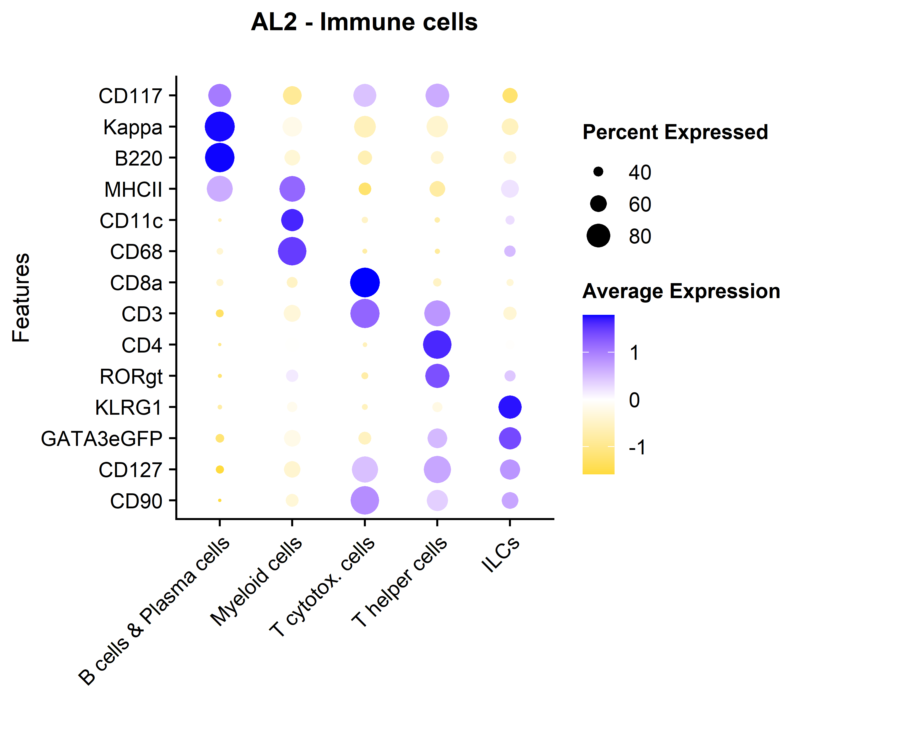
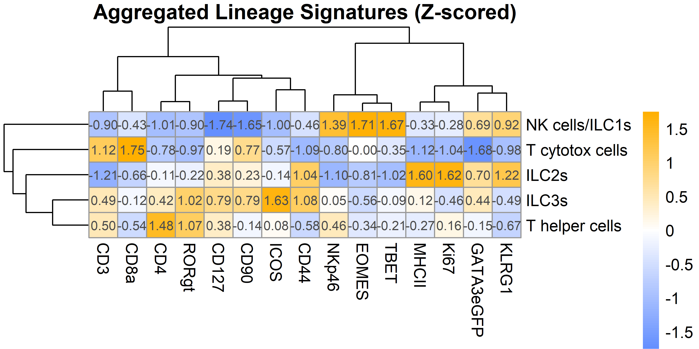
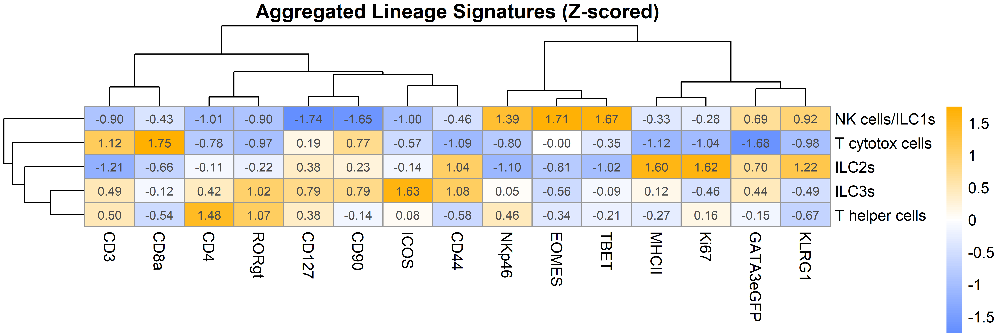
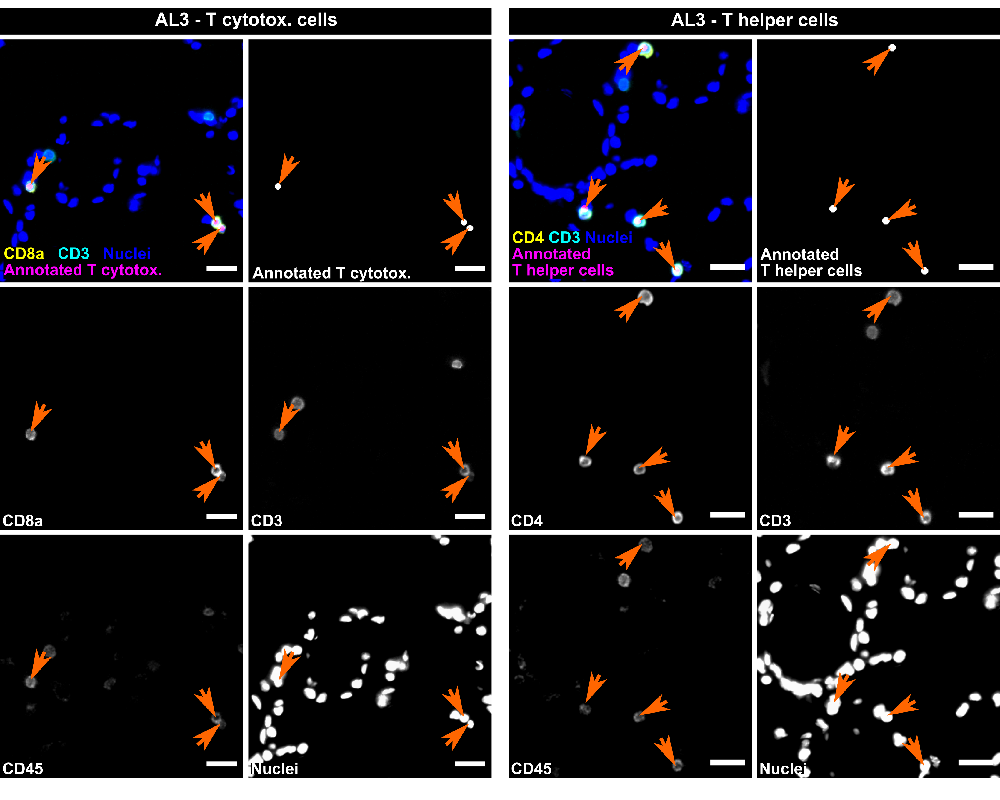
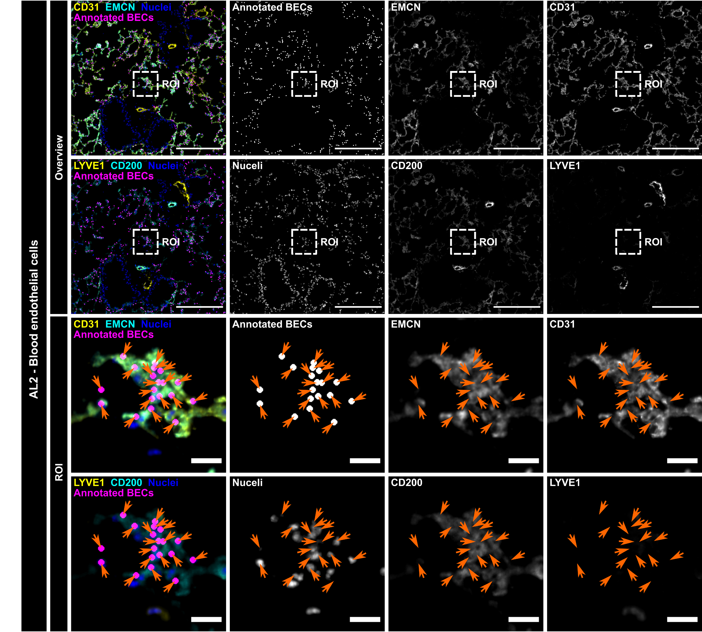
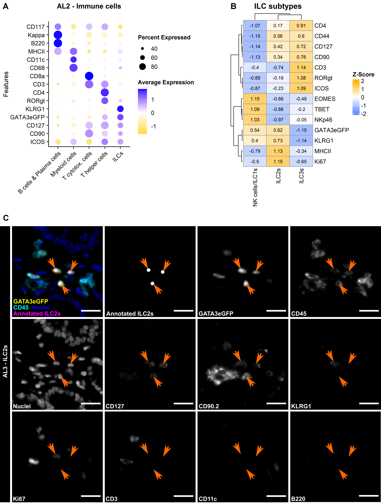
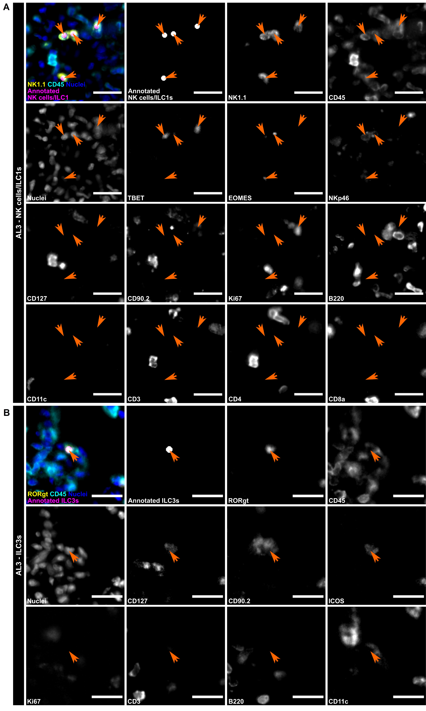
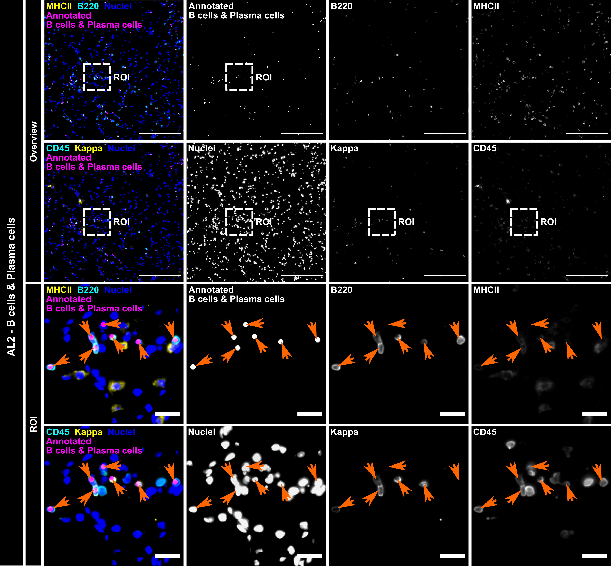
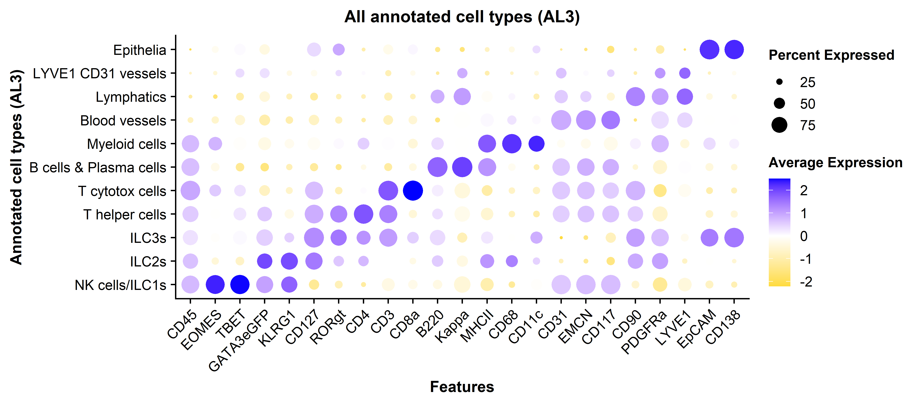

## Libraries


``` r
library(Seurat)
library(SeuratObject)
library(dplyr)
library(png)
library(grid)
library(ggplot2)
library(ggpubr)
```

## Parameters


``` r
set.seed(123)

input_dir <- here::here("1_data_tidying", "Lung_SI_all_cells_all_ALs_files")

output_dir <- here::here("2_visualizations_for_figures", "Fig_4_ILCs_in_lung_files")
dir.create(output_dir)


main_markers <- c(
  "EpCAM", "EMCN", "LYVE1", "PDPN", "PDGFRa", "CD8a", "CD4",
  "CD45", "CD3", "IRF4", "Kappa", "CD11c", "CD127", "GATA3eGFP", "RORgt"
)


immune_markers <- c(
 "CD3", "CD4", "CD8a", "Kappa", "IRF4", "CD11c",
  "CD127", "CD90", "EOMES", "GATA3eGFP", "RORgt", "Ki67",  "KLRG1", "NKp46", "CD117", "Areg", "CCR6", "CD44", "MHCII", "Sca1"
)

ilc_markers <- c(
  "CD3", "CD4", "CD8a",
  "CD127", "CD90", "EOMES", "GATA3eGFP", "RORgt", "KLRG1", "NKp46", "CD117", "CCR6", "MHCII", "Ki67", "Areg", "IRF4", "Sca1", "CD44"
)


cols_nat <- c("magenta", "cyan", "blue", "purple", "green", 
                       "red", "yellow", "olivedrab1", "slateblue1", 
                       "darkcyan", "gold","indianred1", "seagreen", "deeppink", 
                       "orange", "brown", "violet",
                       "deeppink4", "pink", 
                       "grey", "black", "lightgreen", 
                       "#FF0066",  
                       "lightblue", "#FFCC99", "#CC00FF", 
                       "blueviolet",  "goldenrod4", 
                       "navy", "olivedrab", "lightcyan", "seagreen2", "darkviolet", "lightpink", "slateblue4", "olivedrab2")

colfunc <- colorRampPalette(c("darkcyan", "green", "yellow", "magenta", "purple"))
```

# Load data


``` r
SO.lung <- readRDS(paste0(input_dir, "/lung_all_cells_all_ALs.rds"))
dim(SO.lung)
```

```
## [1]    32 67537
```

``` r
SO.lung$AL1 <- gsub("Vessels", "Stromal cells", SO.lung$AL1)
```

Somehow TBET ended up in the metadata. We will put it back as a feature:


``` r
# 1. Extract the current expression matrix from the active assay
# Note: Using slot = "counts". If your MELC data is only stored in "data", change this.
current_matrix <- GetAssayData(SO.lung, assay = "MELC", slot = "counts")

# 2. Extract TBET from metadata and format it as a 1-row matrix
tbet_values <- matrix(SO.lung$TBET, nrow = 1)
rownames(tbet_values) <- "TBET"
colnames(tbet_values) <- colnames(SO.lung) # Ensure cell names match perfectly

# 3. Bind the TBET row to the bottom of the expression matrix
new_matrix <- rbind(current_matrix, tbet_values)

# 4. Overwrite the existing MELC assay with the updated matrix
SO.lung[["MELC"]] <- CreateAssayObject(counts = new_matrix)

# 5. Clean up: Remove TBET from the metadata so it doesn't cause confusion later
SO.lung$TBET <- NULL

# Verify the fix! TBET should now appear at the bottom of this list:
rownames(SO.lung)
```

```
##  [1] "Areg"      "B220"      "CCR6"      "CD117"     "CD11c"     "CD127"     "CD138"     "CD3"       "CD31"      "CD4"       "CD44"      "CD45"      "CD68"      "CD8a"      "CD90"      "EMCN"      "EpCAM"     "ICOS"      "KLRG1"     "Kappa"     "LYVE1"     "MHCII"     "NKp46"     "PDGFRa"    "PDPN"      "Sca1"      "EOMES"     "GATA3"     "GATA3eGFP" "IRF4"      "Ki67"      "RORgt"     "TBET"
```

# Immune cells AL2 dot lot


``` r
SO.lung$AL2 <- factor(SO.lung$AL2, levels = c(
  "B cells & Plasma cells",
  "Myeloid cells", 
  "T cytotox. cells", 
  "T helper cells", 
  "ILCs"
))


dot_plot <- Seurat::DotPlot(subset(SO.lung, subset = AL1 == "Immune cells"), 
                group.by = "AL2",
                  features = c(
                    "CD90", 
                    "CD127", 
                    "GATA3eGFP", 
                    "KLRG1", 
                    "RORgt", 
                    "CD4", 
                    "CD3", 
                    "CD8a", 
                    "CD68",
                    "CD11c",
                    "MHCII",
                    "B220", 
                    "Kappa", 
                    "CD117"
                  ), 
                cols ="RdBu", assay = "MELC")+   
    RotatedAxis()+
    coord_flip()+
  ggtitle("AL2 - Immune cells\n")+
    theme(axis.text.x=element_text(size=10, angle = 45),
          axis.text.y=element_text(size=10), 
          axis.title.x = element_blank(), 
          axis.title.y = element_text(size=11), 
          plot.margin = margin(0.2, 2, 1, 0.2, "cm"), 
          plot.title = element_text(size=12, face = "bold", hjust = 0.5), 
          legend.text = element_text(size = 10),
          legend.title = element_text(size = 10, face = "bold"))+ 
  scale_color_gradient2(midpoint = 0, low = "gold", 
                            high = "blue", space = "Lab" )

dot_plot
```



# Differential expression ILC subtypes


``` r
library(scater)
library(SpatialExperiment)
set.seed(8)

SO.sub <- subset(SO.lung, subset = AL3 %in% c("NK cells/ILC1s", "ILC2s", "ILC3s", 
                                              "T helper cells", "T cytotox cells"))

counts = GetAssayData(SO.sub, layer = "counts")

metadata = SO.sub@meta.data

spatial_coords <- as.matrix(metadata[, c("Location_Center_X", "Location_Center_Y")])

spe <- SpatialExperiment(
  assays = list(counts = counts),
  colData = metadata,
  spatialCoords = spatial_coords
)

# Validate the SpatialExperiment object
print(spe)
```

```
## class: SpatialExperiment 
## dim: 33 5577 
## metadata(0):
## assays(1): counts
## rownames(33): Areg B220 ... RORgt TBET
## rowData names(0):
## colnames(5577): 61961 61962 ... 67536 67537
## colData names(18): orig.ident nCount_MELC ... AL4 sample_id
## reducedDimNames(0):
## mainExpName: NULL
## altExpNames(0):
## spatialCoords names(2) : Location_Center_X Location_Center_Y
## imgData names(0):
```

``` r
# --- 3. Generate Aggregated Heatmap ---
# Step A: Pseudo-bulk aggregation by cell type
library(scuttle) # required for aggregateAcrossCells

ilc_markers <- c("CD127", "CD90","GATA3eGFP", "KLRG1", "EOMES", "TBET",  
                 "CD3", "CD8a", "CD4", "RORgt", "ICOS", 
                 "MHCII", "CD44", "Ki67", "NKp46")

pbs_annotated <- aggregateAcrossCells(spe, 
                                      ids = spe$AL3, 
                                      subset.row = ilc_markers, 
                                      use.assay.type = "counts", 
                                      statistics = "mean")

# Step B: Extract matrix and Z-score (scale) the data
library(pheatmap)
# Transpose so rows = Cell Types, columns = Markers
mat_annotated <- t(assay(pbs_annotated, "counts"))


# Step C: Plot Heatmap
pheatmap(mat = mat_annotated, 
         scale = "column", 
         clustering_method = "ward.D2",
         color = colorRampPalette(c("#648FFF", "white", "#FFB000"))(101), 
         display_numbers = TRUE, # Optional: shows Z-score values in the cells
         main = "Aggregated Lineage Signatures (Z-scored)")
```




``` r
library(Seurat)
library(ComplexHeatmap)
library(ggplotify) # Required for as.ggplot()

set.seed(8)

# --- 1. Subsetting ---
SO.sub <- subset(SO.lung, subset = AL3 %in% c("NK cells/ILC1s", "ILC2s", "ILC3s"))
SO.sub$AL3 <- droplevels(as.factor(SO.sub$AL3))

# --- 2. Direct Pseudo-bulk Aggregation ---
ilc_markers <- c("CD127", "CD90","GATA3eGFP", "KLRG1", "EOMES", "TBET",  
                 "CD3", "CD4", "RORgt", "ICOS", 
                 "MHCII", "CD44", "Ki67", "NKp46")

# Calculate the mean directly from Seurat
avg_exp <- AverageExpression(SO.sub, features = ilc_markers, slot = "counts", group.by = "AL3")
mat_annotated <- avg_exp[[DefaultAssay(SO.sub)]]

# --- 3. Manually Scale (Z-score) the Matrix ---
mat_scaled <- t(scale(t(mat_annotated)))

# Clean up math errors and cap outliers
mat_scaled[is.na(mat_scaled)] <- 0
mat_scaled[mat_scaled > 2] <- 2
mat_scaled[mat_scaled < -2] <- -2

# --- 4. Plot Heatmap using ComplexHeatmap ---
plot_heat <- ComplexHeatmap::pheatmap(
  mat = mat_scaled, 
  scale = "none", 
  clustering_method = "ward.D2",
  color = colorRampPalette(c("#648FFF", "white", "#FFB000"))(101), 
  breaks = seq(-2, 2, length.out = 102), 
  display_numbers = round(mat_scaled, 2), 
  number_color = "black",
  main = "ILC subtypes",
  treeheight_col = 10,
  treeheight_row = 20,
  name = "Z-Score" 
)

# --- 5. Convert to ggplot object for arrangement ---
# Using grid.grabExpr(draw()) ensures that all the internal sizing, 
# legends, and dendrograms from ComplexHeatmap are captured perfectly.
gg_heat <- as.ggplot(grid::grid.grabExpr(ComplexHeatmap::draw(plot_heat)))

# 'gg_heat' is now a standard ggplot object! 
# You can now combine it using patchwork, e.g.:
# combined_plot <- spatial_scatter_plot + gg_heat
print(gg_heat)
```



# IF overlays

## Export TIFF images


## ILC2s


``` r
# 1. Define the path
img_path <- paste0(here::here("data", "images"), "/Visual_validation_AL3_ILC2s_ROI.png")

# 2. Read the image and get dimensions
img <- readPNG(img_path)
h <- nrow(img)
w <- ncol(img)

# 3. Create the ggplot object
# We use coord_fixed to ensure the image doesn't stretch
img_plot_ilc2s <- ggplot() +
  annotation_raster(img, xmin = 0, xmax = w, ymin = 0, ymax = h) +
  coord_fixed() +
  theme_void() +
  # Optional: adds a tiny margin to ensure the edges aren't clipped
  scale_x_continuous(expand = c(0, 0), limits = c(0, w)) +
  scale_y_continuous(expand = c(0, 0), limits = c(0, h)) +
  theme(plot.margin = margin(0, 0, 0, 0, "cm"))
```

## NK cells/ILC1s


``` r
# 1. Define the path
img_path <- paste0(here::here("data", "images"), "/Visual_validation_AL3_ILC1sNKs_ROI.png")

# 2. Read the image and get dimensions
img <- readPNG(img_path)
h <- nrow(img)
w <- ncol(img)

# 3. Create the ggplot object
# We use coord_fixed to ensure the image doesn't stretch
img_plot_nkilc1 <- ggplot() +
  annotation_raster(img, xmin = 0, xmax = w, ymin = 0, ymax = h) +
  coord_fixed() +
  theme_void() +
  # Optional: adds a tiny margin to ensure the edges aren't clipped
  scale_x_continuous(expand = c(0, 0), limits = c(0, w)) +
  scale_y_continuous(expand = c(0, 0), limits = c(0, h)) +
  theme(plot.margin = margin(0, 0, 0, 0.7, "cm"))
```

## ILC3s


``` r
# 1. Define the path
img_path <- paste0(here::here("data", "images"), "/Visual_validation_AL3_ILC3s_ROI.png")

# 2. Read the image and get dimensions
img <- readPNG(img_path)
h <- nrow(img)
w <- ncol(img)

# 3. Create the ggplot object
# We use coord_fixed to ensure the image doesn't stretch
img_plot_ilc3s <- ggplot() +
  annotation_raster(img, xmin = 0, xmax = w, ymin = 0, ymax = h) +
  coord_fixed() +
  theme_void() +
  # Optional: adds a tiny margin to ensure the edges aren't clipped
  scale_x_continuous(expand = c(0, 0), limits = c(0, w)) +
  scale_y_continuous(expand = c(0, 0), limits = c(0, h)) +
  theme(plot.margin = margin(0, 0, 0, 0.7, "cm"))
```

## T cells


``` r
# 1. Define the path
img_path <- paste0(here::here("data", "images"), "/Visual_validation_AL3_Tcells_ROI.png")

# 2. Read the image and get dimensions
img <- readPNG(img_path)
h <- nrow(img)
w <- ncol(img)

# 3. Create the ggplot object
# We use coord_fixed to ensure the image doesn't stretch
img_plot_tcells <- ggplot() +
  annotation_raster(img, xmin = 0, xmax = w, ymin = 0, ymax = h) +
  coord_fixed() +
  theme_void() +
  # Optional: adds a tiny margin to ensure the edges aren't clipped
  scale_x_continuous(expand = c(0, 0), limits = c(0, w)) +
  scale_y_continuous(expand = c(0, 0), limits = c(0, h)) +
  theme(plot.margin = margin(0, 0, 0, 0, "cm"))
```

## B cells & Plasma cells


``` r
# 1. Define the path
img_path <- paste0(here::here("data", "images"), "/AL2_BPCs.png")

# 2. Read the image and get dimensions
img <- readPNG(img_path)
h <- nrow(img)
w <- ncol(img)

# 3. Create the ggplot object
# We use coord_fixed to ensure the image doesn't stretch
img_plot_bpc <- ggplot() +
  annotation_raster(img, xmin = 0, xmax = w, ymin = 0, ymax = h) +
  coord_fixed() +
  theme_void() +
  # Optional: adds a tiny margin to ensure the edges aren't clipped
  scale_x_continuous(expand = c(0, 0), limits = c(0, w)) +
  scale_y_continuous(expand = c(0, 0), limits = c(0, h)) +
  theme(plot.margin = margin(0, 0, 0, 0, "cm"))
```

## Myeloid cells


``` r
# 1. Define the path
img_path <- paste0(here::here("data", "images"), "/AL2_Myeloid_cells.png")

# 2. Read the image and get dimensions
img <- readPNG(img_path)
h <- nrow(img)
w <- ncol(img)

# 3. Create the ggplot object
# We use coord_fixed to ensure the image doesn't stretch
img_plot_mye <- ggplot() +
  annotation_raster(img, xmin = 0, xmax = w, ymin = 0, ymax = h) +
  coord_fixed() +
  theme_void() +
  # Optional: adds a tiny margin to ensure the edges aren't clipped
  scale_x_continuous(expand = c(0, 0), limits = c(0, w)) +
  scale_y_continuous(expand = c(0, 0), limits = c(0, h)) +
  theme(plot.margin = margin(0, 0, 0, 0, "cm"))
```

## BECs


``` r
# 1. Define the path
img_path <- paste0(here::here("data", "images"), "/AL2_BECs.png")

# 2. Read the image and get dimensions
img <- readPNG(img_path)
h <- nrow(img)
w <- ncol(img)

# 3. Create the ggplot object
# We use coord_fixed to ensure the image doesn't stretch
img_plot_bec <- ggplot() +
  annotation_raster(img, xmin = 0, xmax = w, ymin = 0, ymax = h) +
  coord_fixed() +
  theme_void() +
  # Optional: adds a tiny margin to ensure the edges aren't clipped
  scale_x_continuous(expand = c(0, 0), limits = c(0, w)) +
  scale_y_continuous(expand = c(0, 0), limits = c(0, h)) +
  theme(plot.margin = margin(0, 0, 0, 0.7, "cm"))


img_plot_bec
```



## Lymphatics


``` r
# 1. Define the path
img_path <- paste0(here::here("data", "images"), "/Visual_validation_AL2_Lymphatics.png")

# 2. Read the image and get dimensions
img <- readPNG(img_path)
h <- nrow(img)
w <- ncol(img)

# 3. Create the ggplot object
# We use coord_fixed to ensure the image doesn't stretch
img_plot_ly <- ggplot() +
  annotation_raster(img, xmin = 0, xmax = w, ymin = 0, ymax = h) +
  coord_fixed() +
  theme_void() +
  # Optional: adds a tiny margin to ensure the edges aren't clipped
  scale_x_continuous(expand = c(0, 0), limits = c(0, w)) +
  scale_y_continuous(expand = c(0, 0), limits = c(0, h)) +
  theme(plot.margin = margin(0, 0, 0, 0.7, "cm"))

img_plot_ly
```



# Visualizations for figures

## Figure 4


``` r
figure <- ggarrange(dot_plot, gg_heat, 
          ncol = 2, nrow = 1, labels = c("A", "B"), widths = c(3, 2))+
  theme(plot.margin = margin(0, 0.1, 0, 0, "cm"))

ggarrange(figure, "NONE", img_plot_ilc2s, ncol = 1, nrow = 3, heights = c(5, 0.3, 6.6), labels = c("", "C"))
```


## Suppl. Figure


``` r
ggarrange(img_plot_nkilc1, img_plot_ilc3s, ncol = 1, nrow = 2, heights = c(8.6, 6.47), labels = c("A", "B"))
```


``` r
# Display the plot
print(img_plot_tcells)
```




``` r
img_plot_bpc
```




``` r
# Display the plot
print(img_plot_mye)
```




``` r
ggarrange(img_plot_bec, "NONE", img_plot_ly, ncol = 1, nrow = 3, heights = c(8.1, 0.2, 4.9), labels = c("A", "",  "B"))
```


``` r
Seurat::DotPlot(SO.lung, 
                group.by = "AL3",
                  features = c(
                    "CD45", 
                    "EOMES", 
                    "TBET", 
                    "GATA3eGFP", 
                    "KLRG1", 
                    "CD127",
                    "RORgt",
                    "CD4", 
                    "CD3", 
                    "CD8a", 
                    "B220", 
                    "Kappa",
                    "MHCII", 
                    "CD68", 
                    "CD11c",
                    "CD31", 
                    "EMCN", 
                    "CD117",
                    "CD90", 
                    "PDGFRa", 
                    "LYVE1",
                    "EpCAM", 
                    "CD138" 
                  ), 
                cols ="RdBu", assay = "MELC")+   
    RotatedAxis()+
  ylab("Annotated cell types (AL3)")+
  ggtitle("All annotated cell types (AL3)")+
    # coord_flip()+
    theme(axis.text.x=element_text(size=10, angle = 45),
          axis.text.y=element_text(size=10), 
          axis.title.y = element_text(size=11, face = "bold"), 
          axis.title.x = element_text(size=11, face = "bold"), 
          # plot.margin = margin(0.2, 2, 1, 0.2, "cm"), 
          plot.title = element_text(size=12, face = "bold", hjust = 0.5), 
          legend.text = element_text(size = 10),
          legend.title = element_text(size = 10, face = "bold"))+ 
  scale_color_gradient2(midpoint = 0, low = "gold", 
                            high = "blue", space = "Lab" )
```



## Session Information


``` r
save.image(paste0(output_dir, "/environment.RData"))
sessionInfo()
```

```
## R version 4.5.2 (2025-10-31 ucrt)
## Platform: x86_64-w64-mingw32/x64
## Running under: Windows 11 x64 (build 26200)
## 
## Matrix products: default
##   LAPACK version 3.12.1
## 
## locale:
## [1] LC_COLLATE=German_Germany.utf8  LC_CTYPE=German_Germany.utf8    LC_MONETARY=German_Germany.utf8 LC_NUMERIC=C                    LC_TIME=German_Germany.utf8    
## 
## time zone: Europe/Berlin
## tzcode source: internal
## 
## attached base packages:
## [1] stats4    grid      stats     graphics  grDevices utils     datasets  methods   base     
## 
## other attached packages:
##  [1] ggplotify_0.1.3             ComplexHeatmap_2.26.1       pheatmap_1.0.13             SpatialExperiment_1.20.0    scater_1.38.0               scuttle_1.20.0              SingleCellExperiment_1.32.0 SummarizedExperiment_1.40.0 Biobase_2.70.0              GenomicRanges_1.62.0        Seqinfo_1.0.0               IRanges_2.44.0              S4Vectors_0.48.0            BiocGenerics_0.56.0         generics_0.1.4              MatrixGenerics_1.22.0       matrixStats_1.5.0           ggpubr_0.6.2                ggplot2_4.0.1               png_0.1-8                   dplyr_1.1.4                 Seurat_5.3.1                SeuratObject_5.2.0          sp_2.2-0                   
## 
## loaded via a namespace (and not attached):
##   [1] RcppAnnoy_0.0.22       splines_4.5.2          later_1.4.4            tibble_3.3.0           polyclip_1.10-7        fastDummies_1.7.5      lifecycle_1.0.5        rstatix_0.7.3          doParallel_1.0.17      rprojroot_2.1.1        globals_0.19.0         lattice_0.22-7         MASS_7.3-65            backports_1.5.0        magrittr_2.0.4         plotly_4.12.0          sass_0.4.10            rmarkdown_2.30         jquerylib_0.1.4        yaml_2.3.10            httpuv_1.6.16          otel_0.2.0             sctransform_0.4.2      spam_2.11-1            spatstat.sparse_3.1-0  reticulate_1.44.0      cowplot_1.2.0          pbapply_1.7-4          RColorBrewer_1.1-3     abind_1.4-8            Rtsne_0.17             purrr_1.2.0            yulab.utils_0.2.4      rappdirs_0.3.4         circlize_0.4.17        ggrepel_0.9.6          irlba_2.3.5.1          listenv_0.10.0         spatstat.utils_3.2-0   goftest_1.2-3          RSpectra_0.16-2        spatstat.random_3.4-2  fitdistrplus_1.2-6     parallelly_1.45.1      codetools_0.2-20       DelayedArray_0.36.0    shape_1.4.6.1          tidyselect_1.2.1       farver_2.1.2           viridis_0.6.5          ScaledMatrix_1.18.0   
##  [52] spatstat.explore_3.5-3 jsonlite_2.0.0         GetoptLong_1.1.0       BiocNeighbors_2.4.0    progressr_0.18.0       Formula_1.2-5          iterators_1.0.14       ggridges_0.5.7         survival_3.8-3         foreach_1.5.2          tools_4.5.2            ica_1.0-3              Rcpp_1.1.0             glue_1.8.0             gridExtra_2.3          SparseArray_1.10.1     xfun_0.56              here_1.0.2             withr_3.0.2            fastmap_1.2.0          digest_0.6.38          rsvd_1.0.5             gridGraphics_0.5-1     R6_2.6.1               mime_0.13              colorspace_2.1-2       Cairo_1.7-0            scattermore_1.2        tensor_1.5.1           dichromat_2.0-0.1      spatstat.data_3.1-9    tidyr_1.3.1            data.table_1.17.8      httr_1.4.8             htmlwidgets_1.6.4      S4Arrays_1.10.0        uwot_0.2.4             pkgconfig_2.0.3        gtable_0.3.6           lmtest_0.9-40          S7_0.2.0               XVector_0.50.0         htmltools_0.5.8.1      carData_3.0-6          dotCall64_1.2          clue_0.3-67            scales_1.4.0           spatstat.univar_3.1-4  knitr_1.51             rstudioapi_0.18.0      rjson_0.2.23          
## [103] reshape2_1.4.5         nlme_3.1-168           GlobalOptions_0.1.3    cachem_1.1.0           zoo_1.8-14             stringr_1.6.0          KernSmooth_2.23-26     vipor_0.4.7            parallel_4.5.2         miniUI_0.1.2           pillar_1.11.1          vctrs_0.6.5            RANN_2.6.2             promises_1.5.0         car_3.1-5              BiocSingular_1.26.0    beachmat_2.26.0        xtable_1.8-8           cluster_2.1.8.1        beeswarm_0.4.0         evaluate_1.0.5         magick_2.9.0           cli_3.6.5              compiler_4.5.2         crayon_1.5.3           rlang_1.1.6            future.apply_1.20.2    ggsignif_0.6.4         labeling_0.4.3         fs_1.6.6               plyr_1.8.9             ggbeeswarm_0.7.3       stringi_1.8.7          viridisLite_0.4.2      deldir_2.0-4           BiocParallel_1.44.0    lazyeval_0.2.2         spatstat.geom_3.6-0    Matrix_1.7-4           RcppHNSW_0.6.0         patchwork_1.3.2        future_1.69.0          shiny_1.13.0           ROCR_1.0-12            igraph_2.2.1           broom_1.0.12           bslib_0.10.0
```
