## Libraries


``` r
library(Seurat)
library(SeuratObject)
library(dplyr)
library(ggplot2)
library(rstatix)
library(ggbeeswarm)
# library(stringr)
# library(glue)
# library(here)
library(readr)
# library(lubridate)
# library(data.table)
# library(clustree)
# library(magrittr)
library(ggpubr)
# library(ggrepel)
# library(readxl)
# library(openxlsx)
```

## Parameters


``` r
set.seed(123)

input_dir <- here::here("1_data_tidying", "Lung_SI_all_cells_all_ALs_files")

output_dir <- here::here("2_visualizations_for_figures", "Fig_4_quantification_lung_files")
dir.create(output_dir)


main_markers <- c(
  "EpCAM", "EMCN", "LYVE1", "PDPN", "PDGFRa", "CD8a", "CD4",
  "CD45", "CD3", "IRF4", "Kappa", "CD11c", "CD127", "GATA3eGFP", "RORgt"
)


immune_markers <- c(
 "CD3", "CD4", "CD8a", "Kappa", "IRF4", "CD11c",
  "CD127", "CD90", "EOMES", "GATA3eGFP", "RORgt", "Ki67",  "KLRG1", "NKp46", "CD117", "Areg", "CCR6", "CD44", "MHCII", "Sca1"
)

ilc_markers <- c(
  "CD3", "CD4", "CD8a",
  "CD127", "CD90", "EOMES", "GATA3eGFP", "RORgt", "KLRG1", "NKp46", "CD117", "CCR6", "MHCII", "Ki67", "Areg", "IRF4", "Sca1", "CD44"
)


cols_nat <- c("magenta", "cyan", "blue", "purple", "green", 
                       "red", "yellow", "olivedrab1", "slateblue1", 
                       "darkcyan", "gold","indianred1", "seagreen", "deeppink", 
                       "orange", "brown", "violet",
                       "deeppink4", "pink", 
                       "grey", "black", "lightgreen", 
                       "#FF0066",  
                       "lightblue", "#FFCC99", "#CC00FF", 
                       "blueviolet",  "goldenrod4", 
                       "navy", "olivedrab", "lightcyan", "seagreen2", "darkviolet", "lightpink", "slateblue4", "olivedrab2")

colfunc <- colorRampPalette(c("darkcyan", "green", "yellow", "magenta", "purple"))

cols_ilcs_lung <- c("darkcyan", "seagreen2", "deeppink4")

cols_treat <- c("darkcyan", "gold", "deeppink", "slateblue")
```

# Load data


``` r
df_lung <- read_csv(paste0(input_dir, "/lung_proportions.csv"), 
    col_types = cols(...1 = col_skip()))
```

# Visualization

## 4A - Count of ILCs \@CTRL conditions


``` r
# filter for CTRL and convert to longer format
df <- df_lung %>%
  filter(Treatment == "CTRL") %>%
  select(Treatment, Dataset, `NK cells/ILC1s`, ILC2s, ILC3s) %>%
  tidyr::pivot_longer(cols = c(`NK cells/ILC1s`, ILC2s, ILC3s), names_to = "ILCtype") %>%
  mutate(ILCtype = factor(ILCtype, level = c(
    "NK cells/ILC1s", "ILC2s", "ILC3s"
  )))

# Testing for normal distribution
shapiro.test(df$value)
```

```
## 
## 	Shapiro-Wilk normality test
## 
## data:  df$value
## W = 0.88672, p-value = 0.006732
```

``` r
moments::kurtosis(df$value)
```

```
## [1] 1.622249
```

``` r
moments::jarque.test(df$value)
```

```
## 
## 	Jarque-Bera Normality Test
## 
## data:  df$value
## JB = 2.4178, p-value = 0.2985
## alternative hypothesis: greater
```

``` r
# Kruskal-Wallis-test to check for significance between tested groups and effect size
res.kruskal <- df %>% kruskal_test(`value` ~ ILCtype)
res.kruskal
```

```
## # A tibble: 1 × 6
##   .y.       n statistic    df        p method        
## * <chr> <int>     <dbl> <int>    <dbl> <chr>         
## 1 value    27      18.1     2 0.000116 Kruskal-Wallis
```

``` r
df %>% kruskal_effsize(`value` ~ ILCtype)
```

```
## # A tibble: 1 × 5
##   .y.       n effsize method  magnitude
## * <chr> <int>   <dbl> <chr>   <ord>    
## 1 value    27   0.672 eta2[H] large
```

``` r
# Pairwise comparisons using Dunn's test
pwc <- df %>% 
  dunn_test(`value` ~ ILCtype, p.adjust.method = "bonferroni") 
pwc
```

```
## # A tibble: 3 × 9
##   .y.   group1         group2    n1    n2 statistic         p    p.adj p.adj.signif
## * <chr> <chr>          <chr>  <int> <int>     <dbl>     <dbl>    <dbl> <chr>       
## 1 value NK cells/ILC1s ILC2s      9     9     0.678 0.498     1        ns          
## 2 value NK cells/ILC1s ILC3s      9     9    -3.30  0.000962  0.00289  **          
## 3 value ILC2s          ILC3s      9     9    -3.98  0.0000690 0.000207 ***
```

``` r
# add N to plot
tab <- data.frame(xtabs(~ ILCtype, data = df))
head(tab)
```

```
##          ILCtype Freq
## 1 NK cells/ILC1s    9
## 2          ILC2s    9
## 3          ILC3s    9
```

``` r
# Add cell number per cluster to cluster labels
Labels = paste0("n = ", tab$Freq, "")


# Visualization: box plots with p-values
pwc <- pwc %>% add_xy_position(x = "ILCtype")

plot_prop <- ggplot(df, aes(x = ILCtype, y = value, fill = "ILCtype"))+
  geom_boxplot(fill="white")+
  geom_beeswarm(aes(color = ILCtype), size = 2, cex = 3)+
  scale_color_manual(values = cols_ilcs_lung)+
  theme_classic2()+
  theme(plot.margin=margin(1,0.5,1,1,"cm"),
        axis.text.x = element_text(angle = 30, 
                                   vjust = 1, size = 12, hjust = 1, face = "bold"),
         axis.text.y = element_text(hjust = 0.5, size = 12),
        axis.title.x = element_text(size = 12),
        axis.title.y = element_text(size = 12),
        plot.title = element_text(size =14, hjust = 0.5),
        legend.title = element_text(size =14),
        legend.text = element_text(size =12))+
  stat_pvalue_manual(pwc,
                       hide.ns = TRUE, size = 6,
                       step.increase = 0.1, y.position = 20) +
  xlab(NULL)+
  ylab("Count per FOV [#]")+
  scale_y_continuous(expand = c(0, 0), limits = c(0,24))+
    # annotate(geom = 'text',
    #        x="ILC2s",
    #        y=28,
    #        label=Labels[1], 
    #        #angle = 90, 
    #        size = 10/.pt)+
  NoLegend()

plot_prop
```

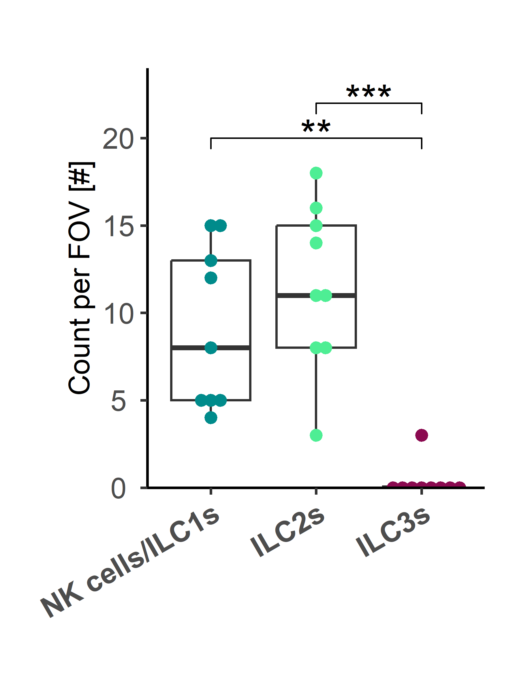

## 4C - Frequencies of ILCs within ILC compartment \@ CTRL conditions


``` r
# filter for CTRL and convert to longer format
df <- df_lung %>%
  filter(Treatment == "CTRL") %>%
  select(Treatment, Dataset, `Prop_NK cells/ILC1s_perTotalILCsFOV`, Prop_ILC2s_perTotalILCsFOV, Prop_ILC3s_perTotalILCsFOV) %>%
  tidyr::pivot_longer(cols = c(`Prop_NK cells/ILC1s_perTotalILCsFOV`, Prop_ILC2s_perTotalILCsFOV, Prop_ILC3s_perTotalILCsFOV), names_to = "ILCtype") %>%
  mutate(ILCtype = gsub("Prop_|_perTotalILCsFOV", "", ILCtype), 
         ILCtype = factor(ILCtype, level = c(
    "NK cells/ILC1s", "ILC2s", "ILC3s"
  )))

# Testing for normal distribution
shapiro.test(df$value)
```

```
## 
## 	Shapiro-Wilk normality test
## 
## data:  df$value
## W = 0.89454, p-value = 0.01006
```

``` r
moments::kurtosis(df$value)
```

```
## [1] 1.622854
```

``` r
moments::jarque.test(df$value)
```

```
## 
## 	Jarque-Bera Normality Test
## 
## data:  df$value
## JB = 2.2919, p-value = 0.3179
## alternative hypothesis: greater
```

``` r
# Kruskal-Wallis-test to check for significance between tested groups and effect size
res.kruskal <- df %>% kruskal_test(`value` ~ ILCtype)
res.kruskal
```

```
## # A tibble: 1 × 6
##   .y.       n statistic    df         p method        
## * <chr> <int>     <dbl> <int>     <dbl> <chr>         
## 1 value    27      18.5     2 0.0000974 Kruskal-Wallis
```

``` r
df %>% kruskal_effsize(`value` ~ ILCtype)
```

```
## # A tibble: 1 × 5
##   .y.       n effsize method  magnitude
## * <chr> <int>   <dbl> <chr>   <ord>    
## 1 value    27   0.686 eta2[H] large
```

``` r
# Pairwise comparisons using Dunn's test
pwc <- df %>% 
  dunn_test(`value` ~ ILCtype, p.adjust.method = "bonferroni") 
pwc
```

```
## # A tibble: 3 × 9
##   .y.   group1         group2    n1    n2 statistic         p    p.adj p.adj.signif
## * <chr> <chr>          <chr>  <int> <int>     <dbl>     <dbl>    <dbl> <chr>       
## 1 value NK cells/ILC1s ILC2s      9     9     0.812 0.417     1        ns          
## 2 value NK cells/ILC1s ILC3s      9     9    -3.25  0.00116   0.00347  **          
## 3 value ILC2s          ILC3s      9     9    -4.06  0.0000488 0.000146 ***
```

``` r
# add N to plot
tab <- data.frame(xtabs(~ ILCtype, data = df))
head(tab)
```

```
##          ILCtype Freq
## 1 NK cells/ILC1s    9
## 2          ILC2s    9
## 3          ILC3s    9
```

``` r
# Add cell number per cluster to cluster labels
Labels = paste0("n = ", tab$Freq, "")


# Visualization: box plots with p-values
pwc <- pwc %>% add_xy_position(x = "ILCtype")

plot_freq <- ggplot(df, aes(x = ILCtype, y = value, fill = "ILCtype"))+
  geom_boxplot(fill="white")+
  geom_beeswarm(aes(color = ILCtype), size = 2, cex = 3)+
  scale_color_manual(values = cols_ilcs_lung)+
  theme_classic2()+
  theme(plot.margin=margin(1,0.5,1,1,"cm"),
        axis.text.x = element_text(angle = 30, 
                                   vjust = 1, size = 12, hjust = 1, face = "bold"),
        axis.text.y = element_text(hjust = 0.5, size = 12),
        axis.title.x = element_text(size = 12),
        axis.title.y = element_text(size = 12),
        plot.title = element_text(size =14, hjust = 0.5),
        legend.title = element_text(size =14),
        legend.text = element_text(size =12))+
  stat_pvalue_manual(pwc,
                       hide.ns = TRUE, size = 6,
                       step.increase = 0.1, y.position = 90) +
  xlab(NULL)+
  ylab("Frequency per FOV/ILCs [%]")+
  scale_y_continuous(expand = c(0, 0), limits = c(0,105))+
  NoLegend()


plot_freq
```

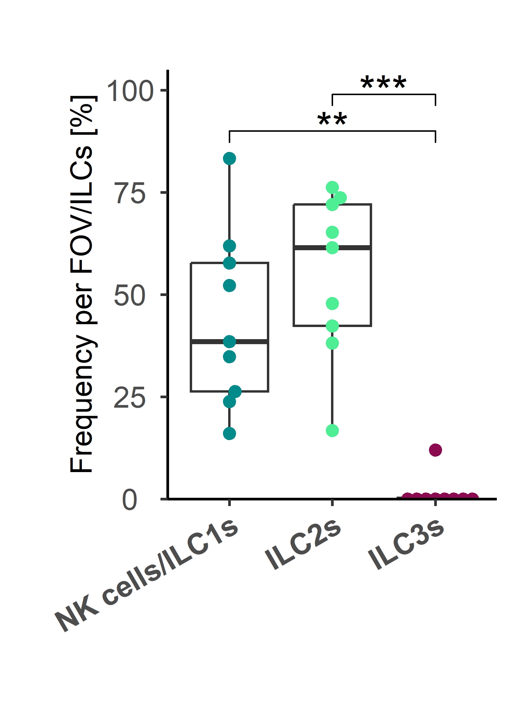

## 4B - Frequency of ILCs within immune compartment \@ CTRL


``` r
# filter for CTRL and convert to longer format
df <- df_lung %>%
  filter(Treatment == "CTRL") %>%
  select(Treatment, Dataset, `Prop_NK cells/ILC1s_perTotalImmuneFOV`, Prop_ILC2s_perTotalImmuneFOV, Prop_ILC3s_perTotalImmuneFOV) %>%
  tidyr::pivot_longer(cols = c(`Prop_NK cells/ILC1s_perTotalImmuneFOV`, Prop_ILC2s_perTotalImmuneFOV, Prop_ILC3s_perTotalImmuneFOV), names_to = "ILCtype") %>%
  mutate(ILCtype = gsub("Prop_|_perTotalImmuneFOV", "", ILCtype), 
         ILCtype = factor(ILCtype, level = c(
    "NK cells/ILC1s", "ILC2s", "ILC3s"
  )))

# Testing for normal distribution
shapiro.test(df$value)
```

```
## 
## 	Shapiro-Wilk normality test
## 
## data:  df$value
## W = 0.90165, p-value = 0.0146
```

``` r
moments::kurtosis(df$value)
```

```
## [1] 2.567516
```

``` r
moments::jarque.test(df$value)
```

```
## 
## 	Jarque-Bera Normality Test
## 
## data:  df$value
## JB = 2.3173, p-value = 0.3139
## alternative hypothesis: greater
```

``` r
# Kruskal-Wallis-test to check for significance between tested groups and effect size
res.kruskal <- df %>% kruskal_test(`value` ~ ILCtype)
res.kruskal
```

```
## # A tibble: 1 × 6
##   .y.       n statistic    df        p method        
## * <chr> <int>     <dbl> <int>    <dbl> <chr>         
## 1 value    27      17.9     2 0.000132 Kruskal-Wallis
```

``` r
df %>% kruskal_effsize(`value` ~ ILCtype)
```

```
## # A tibble: 1 × 5
##   .y.       n effsize method  magnitude
## * <chr> <int>   <dbl> <chr>   <ord>    
## 1 value    27   0.661 eta2[H] large
```

``` r
# Pairwise comparisons using Dunn's test
pwc <- df %>% 
  dunn_test(`value` ~ ILCtype, p.adjust.method = "bonferroni") 
pwc
```

```
## # A tibble: 3 × 9
##   .y.   group1         group2    n1    n2 statistic         p    p.adj p.adj.signif
## * <chr> <chr>          <chr>  <int> <int>     <dbl>     <dbl>    <dbl> <chr>       
## 1 value NK cells/ILC1s ILC2s      9     9     0.692 0.489     1        ns          
## 2 value NK cells/ILC1s ILC3s      9     9    -3.26  0.00110   0.00329  **          
## 3 value ILC2s          ILC3s      9     9    -3.96  0.0000760 0.000228 ***
```

``` r
# add N to plot
tab <- data.frame(xtabs(~ ILCtype, data = df))
head(tab)
```

```
##          ILCtype Freq
## 1 NK cells/ILC1s    9
## 2          ILC2s    9
## 3          ILC3s    9
```

``` r
# Add cell number per cluster to cluster labels
Labels = paste0("n = ", tab$Freq, "")


# Visualization: box plots with p-values
pwc <- pwc %>% add_xy_position(x = "ILCtype")

plot_freq_immune <- ggplot(df, aes(x = ILCtype, y = value, fill = "ILCtype"))+
  geom_boxplot(fill="white")+
  geom_beeswarm(aes(color = ILCtype), size = 2, cex = 3)+
  scale_color_manual(values = cols_ilcs_lung)+
  theme_classic2()+
  theme(plot.margin=margin(1,0.5,1,1,"cm"),
        axis.text.x = element_text(angle = 30, 
                                   vjust = 1, size = 12, hjust = 1, face = "bold"),
        axis.text.y = element_text(hjust = 0.5, size = 12),
        axis.title.x = element_text(size = 12),
        axis.title.y = element_text(size = 12),
        plot.title = element_text(size =14, hjust = 0.5),
        legend.title = element_text(size =14),
        legend.text = element_text(size =12))+
  stat_pvalue_manual(pwc,
                       hide.ns = TRUE, size = 6,
                       step.increase = 0.1, y.position = 11) +
  xlab(NULL)+
  ylab("Frequency per FOV/Immune [%]")+
  scale_y_continuous(expand = c(0, 0), limits = c(0,14))+
  NoLegend()

plot_freq_immune
```

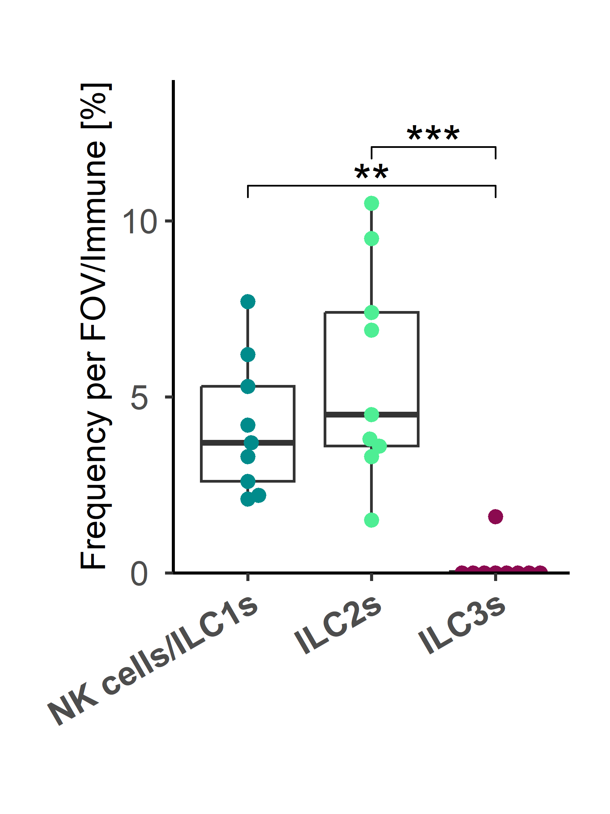

## Total cell count IL-33


``` r
# filter for CTRL and convert to longer format
df <- df_lung %>%
  select(Treatment, Dataset, TotalCellCountFOV) %>%
  mutate(Treatment = factor(Treatment, level =c(
    "CTRL", "1", "2", "3"
  )))

# Testing for normal distribution
shapiro.test(df$TotalCellCountFOV)
```

```
## 
## 	Shapiro-Wilk normality test
## 
## data:  df$TotalCellCountFOV
## W = 0.82636, p-value = 5.688e-05
```

``` r
# Kruskal-Wallis-test to check for significance between tested groups and effect size
res.kruskal <- df %>% kruskal_test(`TotalCellCountFOV` ~ Treatment)
res.kruskal
```

```
## # A tibble: 1 × 6
##   .y.                   n statistic    df          p method        
## * <chr>             <int>     <dbl> <int>      <dbl> <chr>         
## 1 TotalCellCountFOV    36      27.0     3 0.00000597 Kruskal-Wallis
```

``` r
df %>% kruskal_effsize(`TotalCellCountFOV` ~ Treatment)
```

```
## # A tibble: 1 × 5
##   .y.                   n effsize method  magnitude
## * <chr>             <int>   <dbl> <chr>   <ord>    
## 1 TotalCellCountFOV    36   0.749 eta2[H] large
```

``` r
# Pairwise comparisons using Dunn's test
pwc <- df %>% 
  dunn_test(`TotalCellCountFOV` ~ Treatment, p.adjust.method = "bonferroni") 
pwc
```

```
## # A tibble: 6 × 9
##   .y.               group1 group2    n1    n2 statistic          p     p.adj p.adj.signif
## * <chr>             <chr>  <chr>  <int> <int>     <dbl>      <dbl>     <dbl> <chr>       
## 1 TotalCellCountFOV CTRL   1          9     9     2.84  0.00449    0.0270    *           
## 2 TotalCellCountFOV CTRL   2          9     9     0.515 0.607      1         ns          
## 3 TotalCellCountFOV CTRL   3          9     9     4.56  0.00000502 0.0000301 ****        
## 4 TotalCellCountFOV 1      2          9     9    -2.33  0.0200     0.120     ns          
## 5 TotalCellCountFOV 1      3          9     9     1.72  0.0850     0.510     ns          
## 6 TotalCellCountFOV 2      3          9     9     4.05  0.0000514  0.000308  ***
```

``` r
# add N to plot
tab <- data.frame(xtabs(~ Treatment, data = df))
head(tab)
```

```
##   Treatment Freq
## 1      CTRL    9
## 2         1    9
## 3         2    9
## 4         3    9
```

``` r
# Add cell number per cluster to cluster labels
Labels = paste0("n = ", tab$Freq, "")


# Visualization: box plots with p-values
pwc <- pwc %>% add_xy_position(x = "Treatment")

plot_count_all <- ggplot(df, aes(x = Treatment, y = TotalCellCountFOV, fill = "Treatment"))+
  geom_boxplot(fill="white")+
  geom_beeswarm(aes(color = Treatment), size = 2, cex = 3)+
  scale_color_manual(values = cols_treat)+
  theme_classic2()+
  theme(plot.margin=margin(1,0.5,1,1,"cm"),
        axis.text.x = element_text(#angle = 45, 
                                   vjust = 1, size = 12, hjust = 0.5, face = "bold"),
         axis.text.y = element_text(hjust = 0.5, size = 12),
        axis.title.x = element_text(size = 12),
        axis.title.y = element_text(size = 12),
        plot.title = element_text(size =14, hjust = 0.5),
        legend.title = element_text(size =14),
        legend.text = element_text(size =12))+
  stat_pvalue_manual(pwc,
                       hide.ns = TRUE, size = 6,
                       step.increase = 0.1, y.position = 5200) +
  xlab(NULL)+
  ylab("Total count per FOV [#]")+
  ggtitle("Total cells")+
  scale_y_continuous(expand = c(0, 0), limits = c(0,6800))+
  NoLegend()
# +
#     annotate(geom = 'text',
#            x="ILC2s",
#            y=28,
#            label=Labels[1], 
#            #angle = 90, 
#            size = 10/.pt)

plot_count_all
```

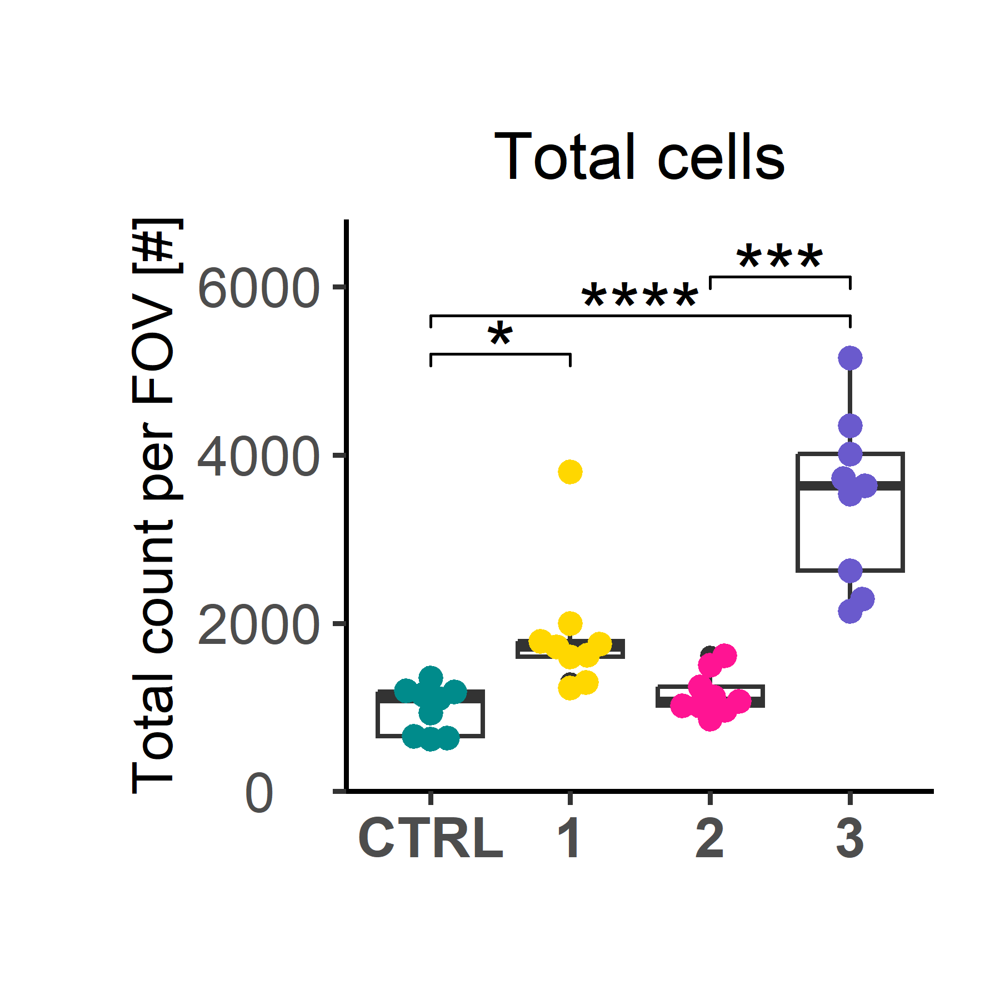

## Total immune count IL-33


``` r
# filter for CTRL and convert to longer format
df <- df_lung %>%
  select(Treatment, Dataset, `Immune cells`) %>%
  mutate(Treatment = factor(Treatment, level =c(
    "CTRL", "1", "2", "3"
  )))

# Testing for normal distribution
shapiro.test(df$`Immune cells`)
```

```
## 
## 	Shapiro-Wilk normality test
## 
## data:  df$`Immune cells`
## W = 0.76496, p-value = 3.524e-06
```

``` r
# Kruskal-Wallis-test to check for significance between tested groups and effect size
res.kruskal <- df %>% kruskal_test(`Immune cells` ~ Treatment)
res.kruskal
```

```
## # A tibble: 1 × 6
##   .y.              n statistic    df         p method        
## * <chr>        <int>     <dbl> <int>     <dbl> <chr>         
## 1 Immune cells    36      28.9     3 0.0000023 Kruskal-Wallis
```

``` r
df %>% kruskal_effsize(`Immune cells` ~ Treatment)
```

```
## # A tibble: 1 × 5
##   .y.              n effsize method  magnitude
## * <chr>        <int>   <dbl> <chr>   <ord>    
## 1 Immune cells    36   0.811 eta2[H] large
```

``` r
# Pairwise comparisons using Dunn's test
pwc <- df %>% 
  dunn_test(`Immune cells` ~ Treatment, p.adjust.method = "bonferroni") 
pwc
```

```
## # A tibble: 6 × 9
##   .y.          group1 group2    n1    n2 statistic           p      p.adj p.adj.signif
## * <chr>        <chr>  <chr>  <int> <int>     <dbl>       <dbl>      <dbl> <chr>       
## 1 Immune cells CTRL   1          9     9      3.19 0.00143     0.00858    **          
## 2 Immune cells CTRL   2          9     9      1.44 0.149       0.894      ns          
## 3 Immune cells CTRL   3          9     9      5.08 0.000000379 0.00000228 ****        
## 4 Immune cells 1      2          9     9     -1.75 0.0809      0.486      ns          
## 5 Immune cells 1      3          9     9      1.89 0.0587      0.352      ns          
## 6 Immune cells 2      3          9     9      3.64 0.000277    0.00166    **
```

``` r
# add N to plot
tab <- data.frame(xtabs(~ Treatment, data = df))
head(tab)
```

```
##   Treatment Freq
## 1      CTRL    9
## 2         1    9
## 3         2    9
## 4         3    9
```

``` r
# Add cell number per cluster to cluster labels
Labels = paste0("n = ", tab$Freq, "")


# Visualization: box plots with p-values
pwc <- pwc %>% add_xy_position(x = "Treatment")

plot_count_immune <- ggplot(df, aes(x = Treatment, y = `Immune cells`, fill = "Treatment"))+
  geom_boxplot(fill="white")+
  geom_beeswarm(aes(color = Treatment), size = 2, cex = 3)+
  scale_color_manual(values = cols_treat)+
  theme_classic2()+
  theme(plot.margin=margin(1,0.5,1,1,"cm"),
        axis.text.x = element_text(#angle = 45, 
                                   vjust = 1, size = 12, hjust = 0.5, face = "bold"),
         axis.text.y = element_text(hjust = 0.5, size = 12),
        axis.title.x = element_text(size = 12),
        axis.title.y = element_text(size = 12),
        plot.title = element_text(size =14, hjust = 0.5),
        legend.title = element_text(size =14),
        legend.text = element_text(size =12))+
  stat_pvalue_manual(pwc,
                       hide.ns = TRUE, size = 6,
                       step.increase = 0.1, y.position = 1750) +
  xlab(NULL)+
  ylab("Total count per FOV [#]")+
  ggtitle("Immune cells")+
  scale_y_continuous(expand = c(0, 0), limits = c(0,2300))+
  NoLegend()
# +
#     annotate(geom = 'text',
#            x="ILC2s",
#            y=28,
#            label=Labels[1], 
#            #angle = 90, 
#            size = 10/.pt)

plot_count_immune
```

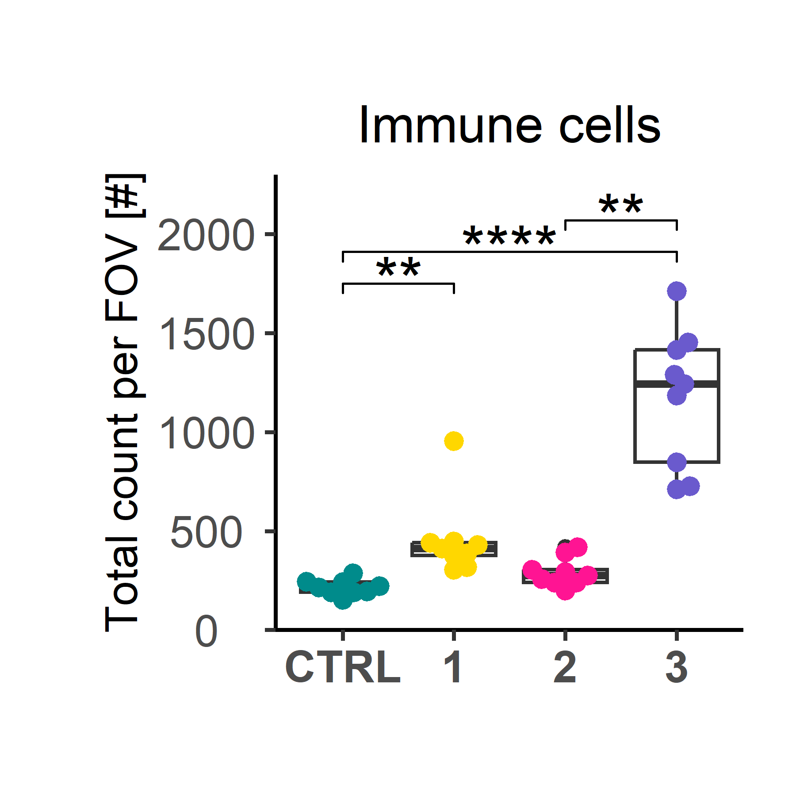

## Total ILC count IL-33


``` r
# filter for CTRL and convert to longer format
df <- df_lung %>%
  select(Treatment, Dataset, ILCs) %>%
  mutate(Treatment = factor(Treatment, level =c(
    "CTRL", "1", "2", "3"
  )))

# Testing for normal distribution
shapiro.test(df$ILCs)
```

```
## 
## 	Shapiro-Wilk normality test
## 
## data:  df$ILCs
## W = 0.74981, p-value = 1.892e-06
```

``` r
# Kruskal-Wallis-test to check for significance between tested groups and effect size
res.kruskal <- df %>% kruskal_test(`ILCs` ~ Treatment)
res.kruskal
```

```
## # A tibble: 1 × 6
##   .y.       n statistic    df         p method        
## * <chr> <int>     <dbl> <int>     <dbl> <chr>         
## 1 ILCs     36      25.9     3 0.0000102 Kruskal-Wallis
```

``` r
df %>% kruskal_effsize(`ILCs` ~ Treatment)
```

```
## # A tibble: 1 × 5
##   .y.       n effsize method  magnitude
## * <chr> <int>   <dbl> <chr>   <ord>    
## 1 ILCs     36   0.714 eta2[H] large
```

``` r
# Pairwise comparisons using Dunn's test
pwc <- df %>% 
  dunn_test(`ILCs` ~ Treatment, p.adjust.method = "bonferroni") 
pwc
```

```
## # A tibble: 6 × 9
##   .y.   group1 group2    n1    n2 statistic           p      p.adj p.adj.signif
## * <chr> <chr>  <chr>  <int> <int>     <dbl>       <dbl>      <dbl> <chr>       
## 1 ILCs  CTRL   1          9     9     3.14  0.00166     0.00998    **          
## 2 ILCs  CTRL   2          9     9     2.20  0.0275      0.165      ns          
## 3 ILCs  CTRL   3          9     9     4.99  0.000000600 0.00000360 ****        
## 4 ILCs  1      2          9     9    -0.940 0.347       1          ns          
## 5 ILCs  1      3          9     9     1.85  0.0648      0.389      ns          
## 6 ILCs  2      3          9     9     2.79  0.00533     0.0320     *
```

``` r
# add N to plot
tab <- data.frame(xtabs(~ Treatment, data = df))
head(tab)
```

```
##   Treatment Freq
## 1      CTRL    9
## 2         1    9
## 3         2    9
## 4         3    9
```

``` r
# Add cell number per cluster to cluster labels
Labels = paste0("n = ", tab$Freq, "")


# Visualization: box plots with p-values
pwc <- pwc %>% add_xy_position(x = "Treatment")

plot_count_ilc <- ggplot(df, aes(x = Treatment, y = ILCs, fill = "Treatment"))+
  geom_boxplot(fill="white")+
  geom_beeswarm(aes(color = Treatment), size = 2, cex = 3)+
  scale_color_manual(values = cols_treat)+
  theme_classic2()+
  theme(plot.margin=margin(1,0.5,1,1,"cm"),
        axis.text.x = element_text(#angle = 45, 
                                   vjust = 1, size = 12, hjust = 0.5, face = "bold"),
         axis.text.y = element_text(hjust = 0.5, size = 12),
        axis.title.x = element_text(size = 12),
        axis.title.y = element_text(size = 12),
        plot.title = element_text(size =14, hjust = 0.5),
        legend.title = element_text(size =14),
        legend.text = element_text(size =12))+
  stat_pvalue_manual(pwc,
                       hide.ns = TRUE, size = 6,
                       step.increase = 0.08, y.position = 80) +
  xlab(NULL)+
  ylab("Total count per FOV [#]")+
  ggtitle("ILCs")+
  scale_y_continuous(expand = c(0, 0), limits = c(0,100))+
  NoLegend()
# +
#     annotate(geom = 'text',
#            x="ILC2s",
#            y=28,
#            label=Labels[1], 
#            #angle = 90, 
#            size = 10/.pt)

plot_count_ilc
```

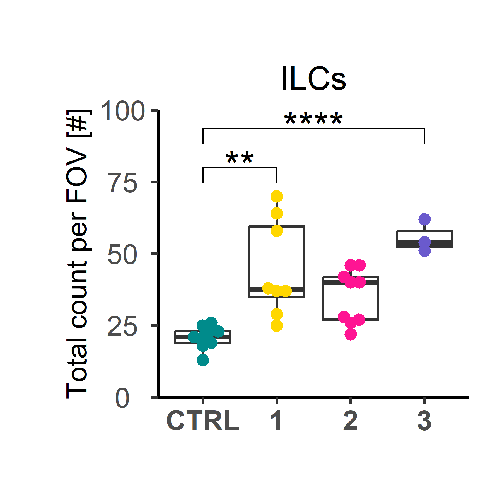

## Total count ILC1s/NK cells


``` r
# filter for CTRL and convert to longer format
df <- df_lung %>%
  select(Treatment, Dataset, `NK cells/ILC1s`) %>%
  mutate(Treatment = factor(Treatment, level =c(
    "CTRL", "1", "2", "3"
  )))

# Testing for normal distribution
shapiro.test(df$`NK cells/ILC1s`)
```

```
## 
## 	Shapiro-Wilk normality test
## 
## data:  df$`NK cells/ILC1s`
## W = 0.83781, p-value = 0.000101
```

``` r
# Kruskal-Wallis-test to check for significance between tested groups and effect size
res.kruskal <- df %>% kruskal_test(`NK cells/ILC1s` ~ Treatment)
res.kruskal
```

```
## # A tibble: 1 × 6
##   .y.                n statistic    df        p method        
## * <chr>          <int>     <dbl> <int>    <dbl> <chr>         
## 1 NK cells/ILC1s    36      20.8     3 0.000118 Kruskal-Wallis
```

``` r
df %>% kruskal_effsize(`NK cells/ILC1s` ~ Treatment)
```

```
## # A tibble: 1 × 5
##   .y.                n effsize method  magnitude
## * <chr>          <int>   <dbl> <chr>   <ord>    
## 1 NK cells/ILC1s    36   0.555 eta2[H] large
```

``` r
# Pairwise comparisons using Dunn's test
pwc <- df %>% 
  dunn_test(`NK cells/ILC1s` ~ Treatment, p.adjust.method = "bonferroni") 
pwc
```

```
## # A tibble: 6 × 9
##   .y.            group1 group2    n1    n2 statistic         p    p.adj p.adj.signif
## * <chr>          <chr>  <chr>  <int> <int>     <dbl>     <dbl>    <dbl> <chr>       
## 1 NK cells/ILC1s CTRL   1          9     9     3.69  0.000227  0.00136  **          
## 2 NK cells/ILC1s CTRL   2          9     9     1.82  0.0687    0.412    ns          
## 3 NK cells/ILC1s CTRL   3          9     9     4.02  0.0000573 0.000344 ***         
## 4 NK cells/ILC1s 1      2          9     9    -1.87  0.0621    0.373    ns          
## 5 NK cells/ILC1s 1      3          9     9     0.337 0.736     1        ns          
## 6 NK cells/ILC1s 2      3          9     9     2.20  0.0276    0.166    ns
```

``` r
# add N to plot
tab <- data.frame(xtabs(~ Treatment, data = df))
head(tab)
```

```
##   Treatment Freq
## 1      CTRL    9
## 2         1    9
## 3         2    9
## 4         3    9
```

``` r
# Add cell number per cluster to cluster labels
Labels = paste0("n = ", tab$Freq, "")


# Visualization: box plots with p-values
pwc <- pwc %>% add_xy_position(x = "Treatment")

plot_count_ilc1 <- ggplot(df, aes(x = Treatment, y = `NK cells/ILC1s`, fill = "Treatment"))+
  geom_boxplot(fill="white")+
  geom_beeswarm(aes(color = Treatment), size = 2, cex = 3)+
  scale_color_manual(values = cols_treat)+
  theme_classic2()+
  theme(plot.margin=margin(1,0.5,1,1,"cm"),
        axis.text.x = element_text(#angle = 45, 
                                   vjust = 1, size = 12, hjust = 0.5, face = "bold"),
         axis.text.y = element_text(hjust = 0.5, size = 12),
        axis.title.x = element_text(size = 12),
        axis.title.y = element_text(size = 12),
        plot.title = element_text(size =14, hjust = 0.5),
        legend.title = element_text(size =14),
        legend.text = element_text(size =12))+
  stat_pvalue_manual(pwc,
                       hide.ns = TRUE, size = 6,
                       step.increase = 0.1, y.position = 65) +
  xlab(NULL)+
  ylab("Total count per FOV [#]")+
  ggtitle("NK cells/ILC1s")+
  scale_y_continuous(expand = c(0, 0), limits = c(0,78))+
  NoLegend()
# +
#     annotate(geom = 'text',
#            x="ILC2s",
#            y=28,
#            label=Labels[1], 
#            #angle = 90, 
#            size = 10/.pt)

plot_count_ilc1
```

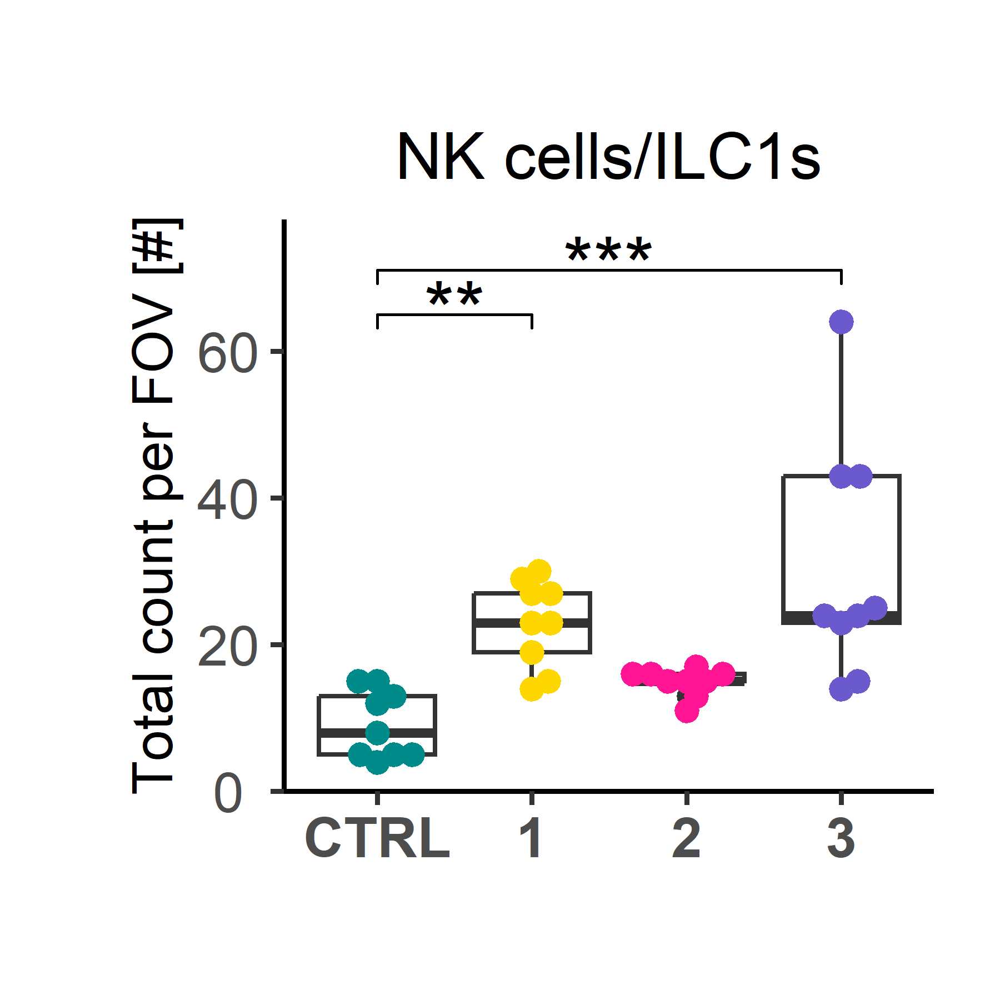

## Total count ILC2s


``` r
# filter for CTRL and convert to longer format
df <- df_lung %>%
  select(Treatment, Dataset, `ILC2s`) %>%
  mutate(Treatment = factor(Treatment, level =c(
    "CTRL", "1", "2", "3"
  )))

# Testing for normal distribution
shapiro.test(df$`ILC2s`)
```

```
## 
## 	Shapiro-Wilk normality test
## 
## data:  df$ILC2s
## W = 0.72409, p-value = 6.914e-07
```

``` r
# Kruskal-Wallis-test to check for significance between tested groups and effect size
res.kruskal <- df %>% kruskal_test(`ILC2s` ~ Treatment)
res.kruskal
```

```
## # A tibble: 1 × 6
##   .y.       n statistic    df        p method        
## * <chr> <int>     <dbl> <int>    <dbl> <chr>         
## 1 ILC2s    36      17.5     3 0.000546 Kruskal-Wallis
```

``` r
df %>% kruskal_effsize(`ILC2s` ~ Treatment)
```

```
## # A tibble: 1 × 5
##   .y.       n effsize method  magnitude
## * <chr> <int>   <dbl> <chr>   <ord>    
## 1 ILC2s    36   0.455 eta2[H] large
```

``` r
# Pairwise comparisons using Dunn's test
pwc <- df %>% 
  dunn_test(`ILC2s` ~ Treatment, p.adjust.method = "bonferroni") 
pwc
```

```
## # A tibble: 6 × 9
##   .y.   group1 group2    n1    n2 statistic         p    p.adj p.adj.signif
## * <chr> <chr>  <chr>  <int> <int>     <dbl>     <dbl>    <dbl> <chr>       
## 1 ILC2s CTRL   1          9     9     1.33  0.183     1        ns          
## 2 ILC2s CTRL   2          9     9     0.839 0.401     1        ns          
## 3 ILC2s CTRL   3          9     9     3.96  0.0000743 0.000446 ***         
## 4 ILC2s 1      2          9     9    -0.492 0.622     1        ns          
## 5 ILC2s 1      3          9     9     2.63  0.00853   0.0512   ns          
## 6 ILC2s 2      3          9     9     3.12  0.00179   0.0108   *
```

``` r
# add N to plot
tab <- data.frame(xtabs(~ Treatment, data = df))
head(tab)
```

```
##   Treatment Freq
## 1      CTRL    9
## 2         1    9
## 3         2    9
## 4         3    9
```

``` r
# Add cell number per cluster to cluster labels
Labels = paste0("n = ", tab$Freq, "")


# Visualization: box plots with p-values
pwc <- pwc %>% add_xy_position(x = "Treatment")

plot_count_ilc2 <- ggplot(df, aes(x = Treatment, y = `ILC2s`, fill = "Treatment"))+
  geom_boxplot(fill="white")+
  geom_beeswarm(aes(color = Treatment), size = 2, cex = 3)+
  scale_color_manual(values = cols_treat)+
  theme_classic2()+
  theme(plot.margin=margin(1,0.5,1,1,"cm"),
        axis.text.x = element_text(#angle = 45, 
                                   vjust = 1, size = 12, hjust = 0.5, face = "bold"),
         axis.text.y = element_text(hjust = 0.5, size = 12),
        axis.title.x = element_text(size = 12),
        axis.title.y = element_text(size = 12),
        plot.title = element_text(size =14, hjust = 0.5),
        legend.title = element_text(size =14),
        legend.text = element_text(size =12))+
  stat_pvalue_manual(pwc,
                       hide.ns = TRUE, size = 6,
                       step.increase = 0.1, y.position = 158) +
  xlab(NULL)+
  ylab("Total count per FOV [#]")+
  ggtitle("ILC2s")+
  scale_y_continuous(expand = c(0, 0), limits = c(0,190))+
  NoLegend()
# +
#     annotate(geom = 'text',
#            x="ILC2s",
#            y=28,
#            label=Labels[1], 
#            #angle = 90, 
#            size = 10/.pt)

plot_count_ilc2
```

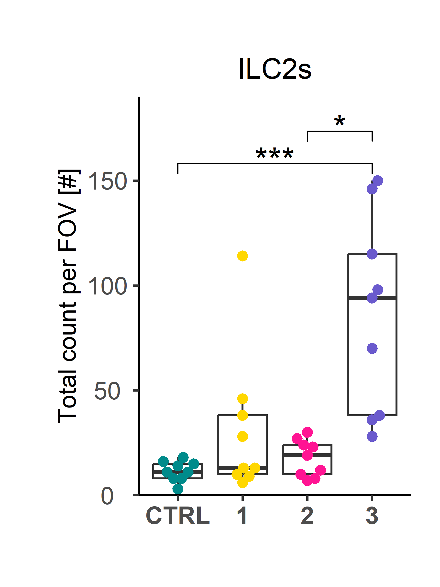

## Total count ILC3s


``` r
# filter for CTRL and convert to longer format
df <- df_lung %>%
  select(Treatment, Dataset, `ILC3s`) %>%
  mutate(Treatment = factor(Treatment, level =c(
    "CTRL", "1", "2", "3"
  )))

# Testing for normal distribution
shapiro.test(df$`ILC3s`)
```

```
## 
## 	Shapiro-Wilk normality test
## 
## data:  df$ILC3s
## W = 0.83426, p-value = 8.433e-05
```

``` r
# Kruskal-Wallis-test to check for significance between tested groups and effect size
res.kruskal <- df %>% kruskal_test(`ILC3s` ~ Treatment)
res.kruskal
```

```
## # A tibble: 1 × 6
##   .y.       n statistic    df     p method        
## * <chr> <int>     <dbl> <int> <dbl> <chr>         
## 1 ILC3s    36      12.4     3 0.006 Kruskal-Wallis
```

``` r
df %>% kruskal_effsize(`ILC3s` ~ Treatment)
```

```
## # A tibble: 1 × 5
##   .y.       n effsize method  magnitude
## * <chr> <int>   <dbl> <chr>   <ord>    
## 1 ILC3s    36   0.295 eta2[H] large
```

``` r
# Pairwise comparisons using Dunn's test
pwc <- df %>% 
  dunn_test(`ILC3s` ~ Treatment, p.adjust.method = "bonferroni") 
pwc
```

```
## # A tibble: 6 × 9
##   .y.   group1 group2    n1    n2 statistic        p   p.adj p.adj.signif
## * <chr> <chr>  <chr>  <int> <int>     <dbl>    <dbl>   <dbl> <chr>       
## 1 ILC3s CTRL   1          9     9     2.01  0.0444   0.266   ns          
## 2 ILC3s CTRL   2          9     9     2.73  0.00625  0.0375  *           
## 3 ILC3s CTRL   3          9     9     3.30  0.000976 0.00585 **          
## 4 ILC3s 1      2          9     9     0.724 0.469    1       ns          
## 5 ILC3s 1      3          9     9     1.29  0.198    1       ns          
## 6 ILC3s 2      3          9     9     0.563 0.573    1       ns
```

``` r
# add N to plot
tab <- data.frame(xtabs(~ Treatment, data = df))
head(tab)
```

```
##   Treatment Freq
## 1      CTRL    9
## 2         1    9
## 3         2    9
## 4         3    9
```

``` r
# Add cell number per cluster to cluster labels
Labels = paste0("n = ", tab$Freq, "")


# Visualization: box plots with p-values
pwc <- pwc %>% add_xy_position(x = "Treatment")

plot_count_ilc3 <- ggplot(df, aes(x = Treatment, y = `ILC3s`, fill = "Treatment"))+
  geom_boxplot(fill="white")+
  geom_beeswarm(aes(color = Treatment), size = 2, cex = 3)+
  scale_color_manual(values = cols_treat)+
  theme_classic2()+
  theme(plot.margin=margin(1,0.5,1,1,"cm"),
        axis.text.x = element_text(#angle = 45, 
                                   vjust = 1, size = 12, hjust = 0.5, face = "bold"),
         axis.text.y = element_text(hjust = 0.5, size = 12),
        axis.title.x = element_text(size = 12),
        axis.title.y = element_text(size = 12),
        plot.title = element_text(size =14, hjust = 0.5),
        legend.title = element_text(size =14),
        legend.text = element_text(size =12))+
  stat_pvalue_manual(pwc,
                       hide.ns = TRUE, size = 6,
                       step.increase = 0.1, y.position = 11) +
  xlab(NULL)+
  ylab("Total count per FOV [#]")+
  ggtitle("ILC3s")+
  scale_y_continuous(expand = c(0, 0), limits = c(0,14))+
  NoLegend()
# +
#     annotate(geom = 'text',
#            x="ILC2s",
#            y=28,
#            label=Labels[1], 
#            #angle = 90, 
#            size = 10/.pt)

plot_count_ilc3
```

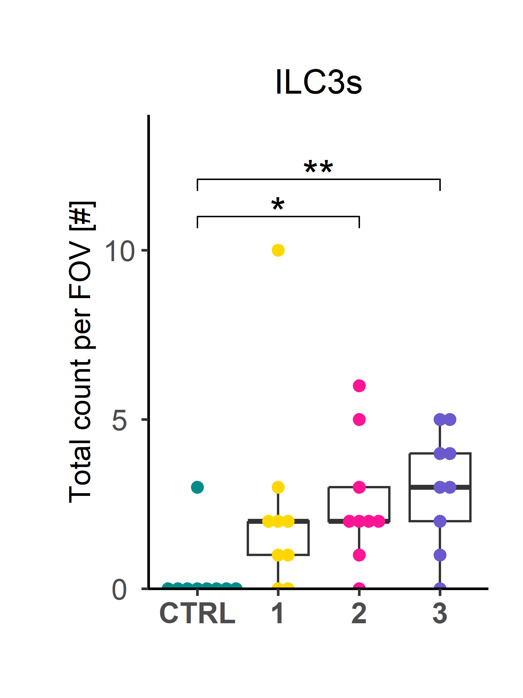

## Freq ILC1s of ILC compartment


``` r
# filter for CTRL and convert to longer format
df <- df_lung %>%
  select(Treatment, Dataset, `Prop_NK cells/ILC1s_perTotalILCsFOV`) %>%
  mutate(Treatment = factor(Treatment, level =c(
    "CTRL", "1", "2", "3"
  )), 
  `NK cells/ILC1s` = `Prop_NK cells/ILC1s_perTotalILCsFOV`)

# Testing for normal distribution
shapiro.test(df$`NK cells/ILC1s`)
```

```
## 
## 	Shapiro-Wilk normality test
## 
## data:  df$`NK cells/ILC1s`
## W = 0.96616, p-value = 0.33
```

``` r
# Kruskal-Wallis-test to check for significance between tested groups and effect size
res.kruskal <- df %>% kruskal_test(`NK cells/ILC1s` ~ Treatment)
res.kruskal
```

```
## # A tibble: 1 × 6
##   .y.                n statistic    df      p method        
## * <chr>          <int>     <dbl> <int>  <dbl> <chr>         
## 1 NK cells/ILC1s    36      7.56     3 0.0559 Kruskal-Wallis
```

``` r
df %>% kruskal_effsize(`NK cells/ILC1s` ~ Treatment)
```

```
## # A tibble: 1 × 5
##   .y.                n effsize method  magnitude
## * <chr>          <int>   <dbl> <chr>   <ord>    
## 1 NK cells/ILC1s    36   0.143 eta2[H] large
```

``` r
# Pairwise comparisons using Dunn's test
pwc <- df %>% 
  dunn_test(`NK cells/ILC1s` ~ Treatment, p.adjust.method = "bonferroni") 
pwc
```

```
## # A tibble: 6 × 9
##   .y.            group1 group2    n1    n2 statistic       p  p.adj p.adj.signif
## * <chr>          <chr>  <chr>  <int> <int>     <dbl>   <dbl>  <dbl> <chr>       
## 1 NK cells/ILC1s CTRL   1          9     9     0.850 0.395   1      ns          
## 2 NK cells/ILC1s CTRL   2          9     9     0.313 0.754   1      ns          
## 3 NK cells/ILC1s CTRL   3          9     9    -1.75  0.0810  0.486  ns          
## 4 NK cells/ILC1s 1      2          9     9    -0.537 0.591   1      ns          
## 5 NK cells/ILC1s 1      3          9     9    -2.60  0.00945 0.0567 ns          
## 6 NK cells/ILC1s 2      3          9     9    -2.06  0.0396  0.237  ns
```

``` r
# add N to plot
tab <- data.frame(xtabs(~ Treatment, data = df))
head(tab)
```

```
##   Treatment Freq
## 1      CTRL    9
## 2         1    9
## 3         2    9
## 4         3    9
```

``` r
# Add cell number per cluster to cluster labels
Labels = paste0("n = ", tab$Freq, "")


# Visualization: box plots with p-values
pwc <- pwc %>% add_xy_position(x = "Treatment")

plot_freq_ilc1 <- ggplot(df, aes(x = Treatment, y = `NK cells/ILC1s`, fill = "Treatment"))+
  geom_boxplot(fill="white")+
  geom_beeswarm(aes(color = Treatment), size = 2, cex = 3)+
  scale_color_manual(values = cols_treat)+
  theme_classic2()+
  theme(plot.margin=margin(1,0.5,1,1,"cm"),
        axis.text.x = element_text(#angle = 45, 
                                   vjust = 1, size = 12, hjust = 0.5, face = "bold"),
         axis.text.y = element_text(hjust = 0.5, size = 12),
        axis.title.x = element_text(size = 12),
        axis.title.y = element_text(size = 12),
        plot.title = element_text(size =14, hjust = 0.5),
        legend.title = element_text(size =14),
        legend.text = element_text(size =12))+
  stat_pvalue_manual(pwc,
                       hide.ns = TRUE, size = 6,
                       step.increase = 0.1, y.position = 14) +
  xlab(NULL)+
  ylab("Frequency per FOV [%]")+
  ggtitle("NK cells/ILC1s")+
  scale_y_continuous(expand = c(0, 0), limits = c(0,85))+
  NoLegend()
# +
#     annotate(geom = 'text',
#            x="ILC2s",
#            y=28,
#            label=Labels[1], 
#            #angle = 90, 
#            size = 10/.pt)

plot_freq_ilc1
```

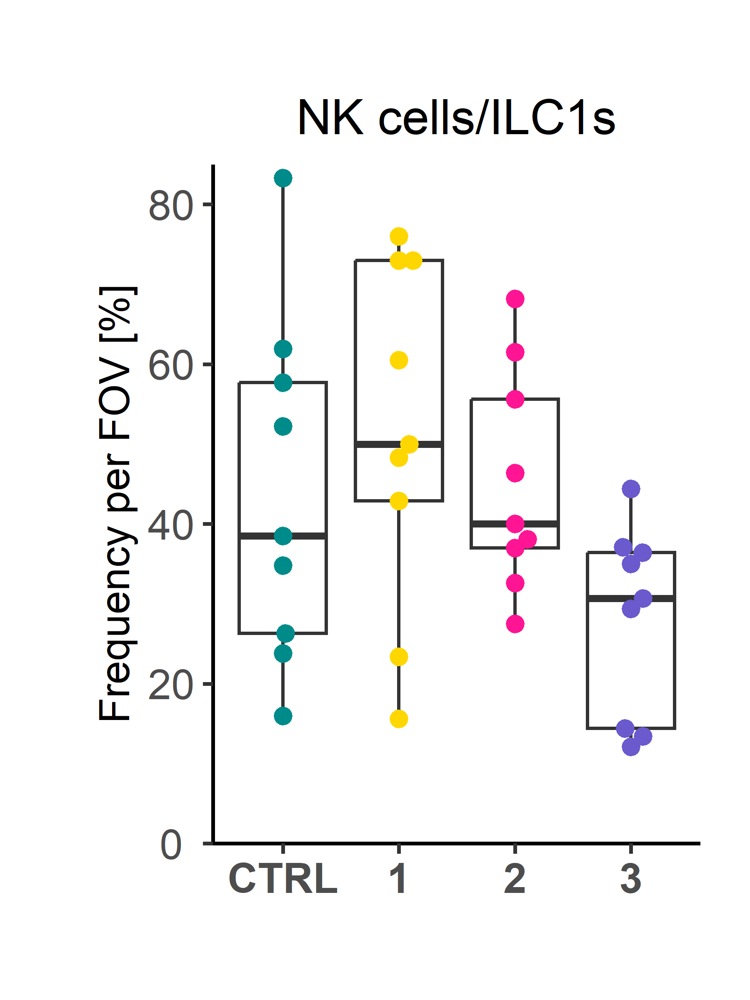

## Freq ILC2s of ILC compartment


``` r
# filter for CTRL and convert to longer format
df <- df_lung %>%
  select(Treatment, Dataset, Prop_ILC2s_perTotalILCsFOV) %>%
  mutate(Treatment = factor(Treatment, level =c(
    "CTRL", "1", "2", "3"
  )), 
  ILC2s = Prop_ILC2s_perTotalILCsFOV)

# Testing for normal distribution
shapiro.test(df$`ILC2s`)
```

```
## 
## 	Shapiro-Wilk normality test
## 
## data:  df$ILC2s
## W = 0.96896, p-value = 0.3978
```

``` r
# Kruskal-Wallis-test to check for significance between tested groups and effect size
res.kruskal <- df %>% kruskal_test(`ILC2s` ~ Treatment)
res.kruskal
```

```
## # A tibble: 1 × 6
##   .y.       n statistic    df      p method        
## * <chr> <int>     <dbl> <int>  <dbl> <chr>         
## 1 ILC2s    36      8.72     3 0.0332 Kruskal-Wallis
```

``` r
df %>% kruskal_effsize(`ILC2s` ~ Treatment)
```

```
## # A tibble: 1 × 5
##   .y.       n effsize method  magnitude
## * <chr> <int>   <dbl> <chr>   <ord>    
## 1 ILC2s    36   0.179 eta2[H] large
```

``` r
# Pairwise comparisons using Dunn's test
pwc <- df %>% 
  dunn_test(`ILC2s` ~ Treatment, p.adjust.method = "bonferroni") 
pwc
```

```
## # A tibble: 6 × 9
##   .y.   group1 group2    n1    n2 statistic       p  p.adj p.adj.signif
## * <chr> <chr>  <chr>  <int> <int>     <dbl>   <dbl>  <dbl> <chr>       
## 1 ILC2s CTRL   1          9     9    -1.13  0.259   1      ns          
## 2 ILC2s CTRL   2          9     9    -0.984 0.325   1      ns          
## 3 ILC2s CTRL   3          9     9     1.49  0.137   0.821  ns          
## 4 ILC2s 1      2          9     9     0.145 0.884   1      ns          
## 5 ILC2s 1      3          9     9     2.62  0.00885 0.0531 ns          
## 6 ILC2s 2      3          9     9     2.47  0.0134  0.0806 ns
```

``` r
# add N to plot
tab <- data.frame(xtabs(~ Treatment, data = df))
head(tab)
```

```
##   Treatment Freq
## 1      CTRL    9
## 2         1    9
## 3         2    9
## 4         3    9
```

``` r
# Add cell number per cluster to cluster labels
Labels = paste0("n = ", tab$Freq, "")


# Visualization: box plots with p-values
pwc <- pwc %>% add_xy_position(x = "Treatment")

plot_freq_ilc2 <- ggplot(df, aes(x = Treatment, y = `ILC2s`, fill = "Treatment"))+
  geom_boxplot(fill="white")+
  geom_beeswarm(aes(color = Treatment), size = 2, cex = 3)+
  scale_color_manual(values = cols_treat)+
  theme_classic2()+
  theme(plot.margin=margin(1,0.5,1,1,"cm"),
        axis.text.x = element_text(#angle = 45, 
                                   vjust = 1, size = 12, hjust = 0.5, face = "bold"),
         axis.text.y = element_text(hjust = 0.5, size = 12),
        axis.title.x = element_text(size = 12),
        axis.title.y = element_text(size = 12),
        plot.title = element_text(size =14, hjust = 0.5),
        legend.title = element_text(size =14),
        legend.text = element_text(size =12))+
  stat_pvalue_manual(pwc,
                       hide.ns = TRUE, size = 6,
                       step.increase = 0.1, y.position = 14) +
  xlab(NULL)+
  ylab("Frequency per FOV [%]")+
  ggtitle("ILC2s")+
  scale_y_continuous(expand = c(0, 0), limits = c(0,90))+
  NoLegend()
# +
#     annotate(geom = 'text',
#            x="ILC2s",
#            y=28,
#            label=Labels[1], 
#            #angle = 90, 
#            size = 10/.pt)

plot_freq_ilc2
```

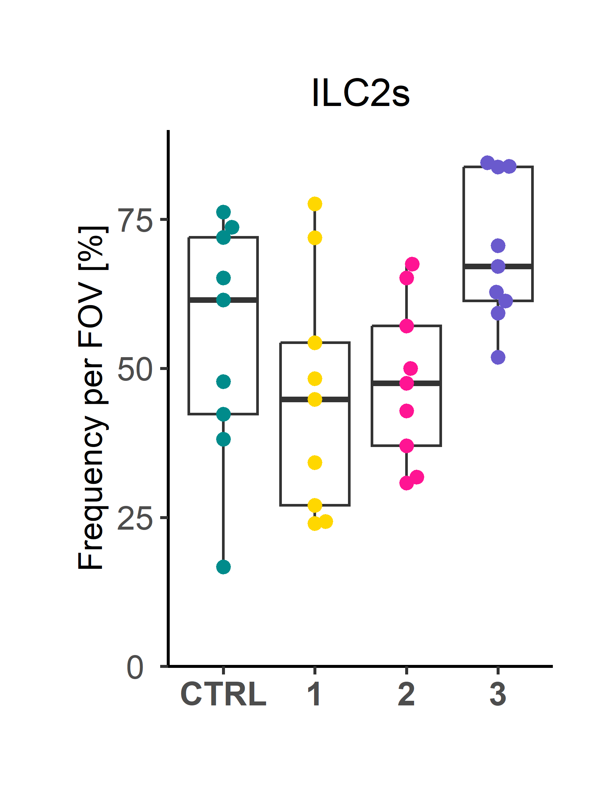

## Freq ILC3s of ILC compartment


``` r
# filter for CTRL and convert to longer format
df <- df_lung %>%
  select(Treatment, Dataset, Prop_ILC3s_perTotalILCsFOV) %>%
  mutate(Treatment = factor(Treatment, level =c(
    "CTRL", "1", "2", "3"
  )), 
  ILC3s = Prop_ILC3s_perTotalILCsFOV)

# Testing for normal distribution
shapiro.test(df$`ILC3s`)
```

```
## 
## 	Shapiro-Wilk normality test
## 
## data:  df$ILC3s
## W = 0.84165, p-value = 0.000123
```

``` r
# Kruskal-Wallis-test to check for significance between tested groups and effect size
res.kruskal <- df %>% kruskal_test(`ILC3s` ~ Treatment)
res.kruskal
```

```
## # A tibble: 1 × 6
##   .y.       n statistic    df       p method        
## * <chr> <int>     <dbl> <int>   <dbl> <chr>         
## 1 ILC3s    36      13.3     3 0.00411 Kruskal-Wallis
```

``` r
df %>% kruskal_effsize(`ILC3s` ~ Treatment)
```

```
## # A tibble: 1 × 5
##   .y.       n effsize method  magnitude
## * <chr> <int>   <dbl> <chr>   <ord>    
## 1 ILC3s    36   0.321 eta2[H] large
```

``` r
# Pairwise comparisons using Dunn's test
pwc <- df %>% 
  dunn_test(`ILC3s` ~ Treatment, p.adjust.method = "bonferroni") 
pwc
```

```
## # A tibble: 6 × 9
##   .y.   group1 group2    n1    n2 statistic        p   p.adj p.adj.signif
## * <chr> <chr>  <chr>  <int> <int>     <dbl>    <dbl>   <dbl> <chr>       
## 1 ILC3s CTRL   1          9     9     2.13  0.0330   0.198   ns          
## 2 ILC3s CTRL   2          9     9     3.60  0.000316 0.00189 **          
## 3 ILC3s CTRL   3          9     9     1.61  0.108    0.648   ns          
## 4 ILC3s 1      2          9     9     1.47  0.141    0.849   ns          
## 5 ILC3s 1      3          9     9    -0.524 0.600    1       ns          
## 6 ILC3s 2      3          9     9    -1.99  0.0461   0.276   ns
```

``` r
# add N to plot
tab <- data.frame(xtabs(~ Treatment, data = df))
head(tab)
```

```
##   Treatment Freq
## 1      CTRL    9
## 2         1    9
## 3         2    9
## 4         3    9
```

``` r
# Add cell number per cluster to cluster labels
Labels = paste0("n = ", tab$Freq, "")


# Visualization: box plots with p-values
pwc <- pwc %>% add_xy_position(x = "Treatment")

plot_freq_ilc3 <- ggplot(df, aes(x = Treatment, y = `ILC3s`, fill = "Treatment"))+
  geom_boxplot(fill="white")+
  geom_beeswarm(aes(color = Treatment), size = 2, cex = 3)+
  scale_color_manual(values = cols_treat)+
  theme_classic2()+
  theme(plot.margin=margin(1,0.5,1,1,"cm"),
        axis.text.x = element_text(#angle = 45, 
                                   vjust = 1, size = 12, hjust = 0.5, face = "bold"),
         axis.text.y = element_text(hjust = 0.5, size = 12),
        axis.title.x = element_text(size = 12),
        axis.title.y = element_text(size = 12),
        plot.title = element_text(size =14, hjust = 0.5),
        legend.title = element_text(size =14),
        legend.text = element_text(size =12))+
  stat_pvalue_manual(pwc,
                       hide.ns = TRUE, size = 6,
                       step.increase = 0.1, y.position = 14) +
  xlab(NULL)+
  ylab("Frequency per FOV [%]")+
  ggtitle("ILC3s")+
  scale_y_continuous(expand = c(0, 0), limits = c(0,16))+
  NoLegend()
# +
#     annotate(geom = 'text',
#            x="ILC2s",
#            y=28,
#            label=Labels[1], 
#            #angle = 90, 
#            size = 10/.pt)

plot_freq_ilc3
```

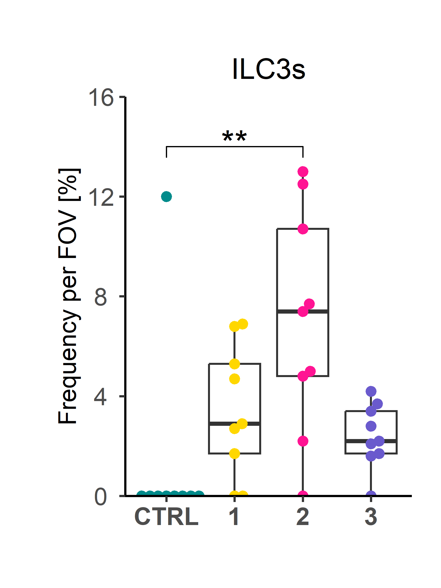

## Freq of immune cells, Endothelia & stroma and epithelia within total cells


``` r
# IMMUNE CELLS ---------------------------------------------------------------
df <- df_lung %>%
  select(Treatment, Dataset, `Prop_Immune cells_perTotalCountFOV`) %>%
  mutate(Treatment = factor(Treatment, level =c(
    "CTRL", "1", "2", "3"
  )), 
  `Immune cells` = `Prop_Immune cells_perTotalCountFOV`)

# Testing for normal distribution
shapiro.test(df$`Immune cells`)
```

```
## 
## 	Shapiro-Wilk normality test
## 
## data:  df$`Immune cells`
## W = 0.92858, p-value = 0.02267
```

``` r
# Kruskal-Wallis-test to check for significance between tested groups and effect size
res.kruskal <- df %>% kruskal_test(`Immune cells` ~ Treatment)
res.kruskal
```

```
## # A tibble: 1 × 6
##   .y.              n statistic    df        p method        
## * <chr>        <int>     <dbl> <int>    <dbl> <chr>         
## 1 Immune cells    36      21.8     3 0.000071 Kruskal-Wallis
```

``` r
df %>% kruskal_effsize(`Immune cells` ~ Treatment)
```

```
## # A tibble: 1 × 5
##   .y.              n effsize method  magnitude
## * <chr>        <int>   <dbl> <chr>   <ord>    
## 1 Immune cells    36   0.588 eta2[H] large
```

``` r
# Pairwise comparisons using Dunn's test
pwc <- df %>% 
  dunn_test(`Immune cells` ~ Treatment, p.adjust.method = "bonferroni") 
pwc
```

```
## # A tibble: 6 × 9
##   .y.          group1 group2    n1    n2 statistic         p     p.adj p.adj.signif
## * <chr>        <chr>  <chr>  <int> <int>     <dbl>     <dbl>     <dbl> <chr>       
## 1 Immune cells CTRL   1          9     9     0.839 0.401     1         ns          
## 2 Immune cells CTRL   2          9     9     1.44  0.149     0.893     ns          
## 3 Immune cells CTRL   3          9     9     4.39  0.0000115 0.0000690 ****        
## 4 Immune cells 1      2          9     9     0.604 0.546     1         ns          
## 5 Immune cells 1      3          9     9     3.55  0.000389  0.00233   **          
## 6 Immune cells 2      3          9     9     2.94  0.00325   0.0195    *
```

``` r
# add N to plot
tab <- data.frame(xtabs(~ Treatment, data = df))
head(tab)
```

```
##   Treatment Freq
## 1      CTRL    9
## 2         1    9
## 3         2    9
## 4         3    9
```

``` r
# Add cell number per cluster to cluster labels
Labels = paste0("n = ", tab$Freq, "")


# Visualization: box plots with p-values
pwc <- pwc %>% add_xy_position(x = "Treatment")

plot_immune <- ggplot(df, aes(x = Treatment, y = `Immune cells`, fill = "Treatment"))+
  geom_boxplot(fill="white")+
  geom_beeswarm(aes(color = Treatment), size = 2, cex = 3)+
  scale_color_manual(values = cols_treat)+
  theme_classic2()+
  theme(plot.margin=margin(1,0.5,1,1,"cm"),
        axis.text.x = element_text(#angle = 45, 
                                   vjust = 1, size = 12, hjust = 0.5, face = "bold"),
         axis.text.y = element_text(hjust = 0.5, size = 12),
        axis.title.x = element_text(size = 12),
        axis.title.y = element_text(size = 12),
        plot.title = element_text(size =14, hjust = 0.5),
        legend.title = element_text(size =14),
        legend.text = element_text(size =12))+
  stat_pvalue_manual(pwc,
                       hide.ns = TRUE, size = 6,
                       step.increase = 0.5, y.position = 40) +
  xlab(NULL)+
  ylab("Frequency/total cells per FOV [#]")+
  ggtitle("Immune cells")+
  scale_y_continuous(expand = c(0, 0), limits = c(0,100))+
  NoLegend()


# Endothelia & stroma ---------------------------------------------------------------
df <- df_lung %>%
  select(Treatment, Dataset, `Prop_Endothelia & stroma_perTotalCountFOV`) %>%
  mutate(Treatment = factor(Treatment, level =c(
    "CTRL", "1", "2", "3"
  )), 
  `cells_of_interest` = `Prop_Endothelia & stroma_perTotalCountFOV`)

# Testing for normal distribution
shapiro.test(df$`cells_of_interest`)
```

```
## 
## 	Shapiro-Wilk normality test
## 
## data:  df$cells_of_interest
## W = 0.97166, p-value = 0.4725
```

``` r
# Kruskal-Wallis-test to check for significance between tested groups and effect size
res.kruskal <- df %>% kruskal_test(`cells_of_interest` ~ Treatment)
res.kruskal
```

```
## # A tibble: 1 × 6
##   .y.                   n statistic    df        p method        
## * <chr>             <int>     <dbl> <int>    <dbl> <chr>         
## 1 cells_of_interest    36      18.3     3 0.000374 Kruskal-Wallis
```

``` r
df %>% kruskal_effsize(`cells_of_interest` ~ Treatment)
```

```
## # A tibble: 1 × 5
##   .y.                   n effsize method  magnitude
## * <chr>             <int>   <dbl> <chr>   <ord>    
## 1 cells_of_interest    36   0.479 eta2[H] large
```

``` r
# Pairwise comparisons using Dunn's test
pwc <- df %>% 
  dunn_test(`cells_of_interest` ~ Treatment, p.adjust.method = "bonferroni") 
pwc
```

```
## # A tibble: 6 × 9
##   .y.               group1 group2    n1    n2 statistic         p    p.adj p.adj.signif
## * <chr>             <chr>  <chr>  <int> <int>     <dbl>     <dbl>    <dbl> <chr>       
## 1 cells_of_interest CTRL   1          9     9    -2.37  0.0177    0.106    ns          
## 2 cells_of_interest CTRL   2          9     9    -2.26  0.0238    0.143    ns          
## 3 cells_of_interest CTRL   3          9     9    -4.27  0.0000192 0.000115 ***         
## 4 cells_of_interest 1      2          9     9     0.112 0.911     1        ns          
## 5 cells_of_interest 1      3          9     9    -1.90  0.0572    0.343    ns          
## 6 cells_of_interest 2      3          9     9    -2.01  0.0440    0.264    ns
```

``` r
# add N to plot
tab <- data.frame(xtabs(~ Treatment, data = df))
head(tab)
```

```
##   Treatment Freq
## 1      CTRL    9
## 2         1    9
## 3         2    9
## 4         3    9
```

``` r
# Add cell number per cluster to cluster labels
Labels = paste0("n = ", tab$Freq, "")


# Visualization: box plots with p-values
pwc <- pwc %>% add_xy_position(x = "Treatment")

plot_stroma <- ggplot(df, aes(x = Treatment, y = `cells_of_interest`, fill = "Treatment"))+
  geom_boxplot(fill="white")+
  geom_beeswarm(aes(color = Treatment), size = 2, cex = 3)+
  scale_color_manual(values = cols_treat)+
  theme_classic2()+
  theme(plot.margin=margin(1,0.5,1,1,"cm"),
        axis.text.x = element_text(#angle = 45, 
                                   vjust = 1, size = 12, hjust = 0.5, face = "bold"),
         axis.text.y = element_text(hjust = 0.5, size = 12),
        axis.title.x = element_text(size = 12),
        axis.title.y = element_text(size = 12),
        plot.title = element_text(size =14, hjust = 0.5),
        legend.title = element_text(size =14),
        legend.text = element_text(size =12))+
  stat_pvalue_manual(pwc,
                       hide.ns = TRUE, size = 6,
                       step.increase = 0.2, y.position = 80) +
  xlab(NULL)+
  ylab("Frequency/total cells per FOV [#]")+
  ggtitle("Endothelia & stroma")+
  scale_y_continuous(expand = c(0, 0), limits = c(0,100))+
  NoLegend()


# Epithelia ---------------------------------------------------------------
df <- df_lung %>%
  select(Treatment, Dataset, `Prop_Epithelia_perTotalCountFOV`) %>%
  mutate(Treatment = factor(Treatment, level =c(
    "CTRL", "1", "2", "3"
  )), 
  `cells_of_interest` = `Prop_Epithelia_perTotalCountFOV`)

# Testing for normal distribution
shapiro.test(df$`cells_of_interest`)
```

```
## 
## 	Shapiro-Wilk normality test
## 
## data:  df$cells_of_interest
## W = 0.91559, p-value = 0.009365
```

``` r
# Kruskal-Wallis-test to check for significance between tested groups and effect size
res.kruskal <- df %>% kruskal_test(`cells_of_interest` ~ Treatment)
res.kruskal
```

```
## # A tibble: 1 × 6
##   .y.                   n statistic    df      p method        
## * <chr>             <int>     <dbl> <int>  <dbl> <chr>         
## 1 cells_of_interest    36      9.28     3 0.0257 Kruskal-Wallis
```

``` r
df %>% kruskal_effsize(`cells_of_interest` ~ Treatment)
```

```
## # A tibble: 1 × 5
##   .y.                   n effsize method  magnitude
## * <chr>             <int>   <dbl> <chr>   <ord>    
## 1 cells_of_interest    36   0.196 eta2[H] large
```

``` r
# Pairwise comparisons using Dunn's test
pwc <- df %>% 
  dunn_test(`cells_of_interest` ~ Treatment, p.adjust.method = "bonferroni") 
pwc
```

```
## # A tibble: 6 × 9
##   .y.               group1 group2    n1    n2 statistic       p  p.adj p.adj.signif
## * <chr>             <chr>  <chr>  <int> <int>     <dbl>   <dbl>  <dbl> <chr>       
## 1 cells_of_interest CTRL   1          9     9     2.66  0.00774 0.0465 *           
## 2 cells_of_interest CTRL   2          9     9     2.50  0.0126  0.0755 ns          
## 3 cells_of_interest CTRL   3          9     9     2.23  0.0260  0.156  ns          
## 4 cells_of_interest 1      2          9     9    -0.168 0.867   1      ns          
## 5 cells_of_interest 1      3          9     9    -0.436 0.663   1      ns          
## 6 cells_of_interest 2      3          9     9    -0.269 0.788   1      ns
```

``` r
# add N to plot
tab <- data.frame(xtabs(~ Treatment, data = df))
head(tab)
```

```
##   Treatment Freq
## 1      CTRL    9
## 2         1    9
## 3         2    9
## 4         3    9
```

``` r
# Add cell number per cluster to cluster labels
Labels = paste0("n = ", tab$Freq, "")


# Visualization: box plots with p-values
pwc <- pwc %>% add_xy_position(x = "Treatment")

plot_epithelia <- ggplot(df, aes(x = Treatment, y = `cells_of_interest`, fill = "Treatment"))+
  geom_boxplot(fill="white")+
  geom_beeswarm(aes(color = Treatment), size = 2, cex = 3)+
  scale_color_manual(values = cols_treat)+
  theme_classic2()+
  theme(plot.margin=margin(1,0.5,1,1,"cm"),
        axis.text.x = element_text(#angle = 45, 
                                   vjust = 1, size = 12, hjust = 0.5, face = "bold"),
         axis.text.y = element_text(hjust = 0.5, size = 12),
        axis.title.x = element_text(size = 12),
        axis.title.y = element_text(size = 12),
        plot.title = element_text(size =14, hjust = 0.5),
        legend.title = element_text(size =14),
        legend.text = element_text(size =12))+
  stat_pvalue_manual(pwc,
                       hide.ns = TRUE, size = 6,
                       step.increase = 0.15, y.position = 40) +
  xlab(NULL)+
  ylab("Frequency/total cells per FOV [#]")+
  ggtitle("Epithelia")+
  scale_y_continuous(expand = c(0, 0), limits = c(0,100))+
  NoLegend()


ggarrange(plot_immune, plot_stroma, plot_epithelia, 
          ncol = 3, nrow = 1, 
          labels = c("A", "B", "C", "D", "E", "F", "G", "H", "I"))+
  theme(plot.margin = margin(0, 0.1, 0, 0, "cm"))
```

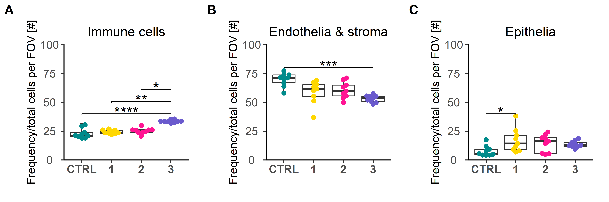

## Combine plots for figure


``` r
ggarrange(plot_prop, plot_freq_immune, plot_freq, 
          plot_count_all, plot_count_immune, plot_count_ilc, 
          plot_count_ilc1, plot_count_ilc2, plot_count_ilc3, 
          ncol = 3, nrow = 3, heights = c(3.5, 3, 3), 
          labels = c("A", "B", "C", "D", "E", "F", "G", "H", "I"))+
  theme(plot.margin = margin(0, 0.1, 0, 0, "cm"))
```

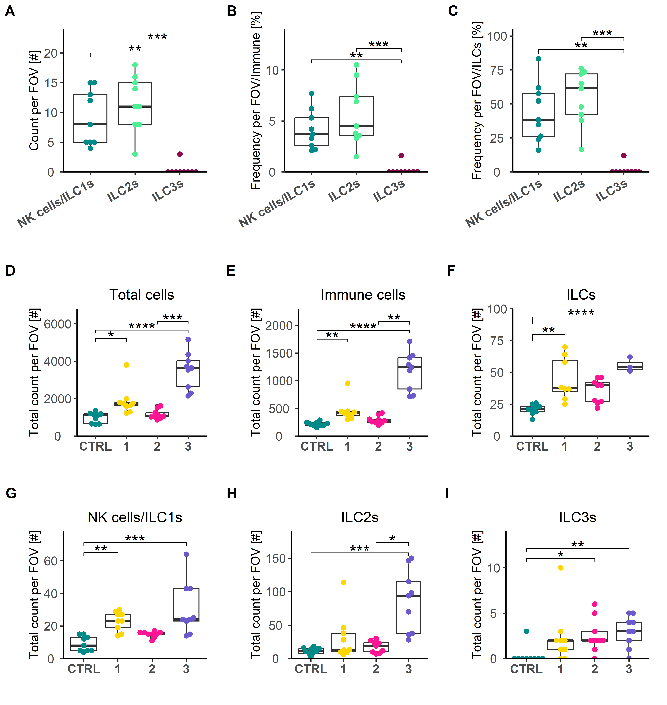


``` r
ggarrange(plot_freq_ilc1, plot_freq_ilc2, plot_freq_ilc3, 
          ncol = 3, nrow = 1, 
          labels = c("A", "B", "C", "D", "E", "F", "G", "H", "I"))+
  theme(plot.margin = margin(0, 0.1, 0, 0, "cm"))
```

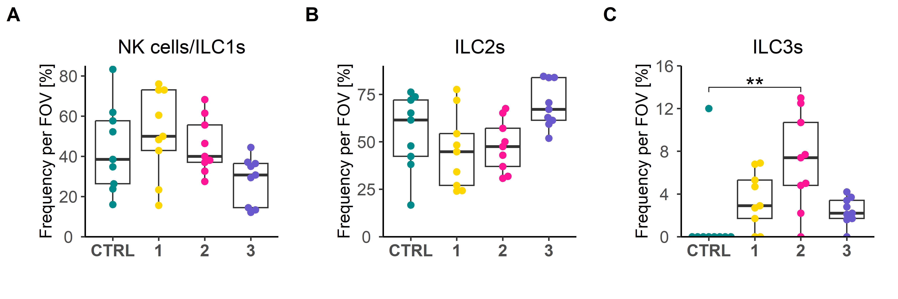

## Session Information


``` r
save.image(paste0(output_dir, "/environment.RData"))
sessionInfo()
```

```
## R version 4.4.2 (2024-10-31 ucrt)
## Platform: x86_64-w64-mingw32/x64
## Running under: Windows 10 x64 (build 19045)
## 
## Matrix products: default
## 
## 
## locale:
## [1] LC_COLLATE=English_Germany.utf8  LC_CTYPE=English_Germany.utf8    LC_MONETARY=English_Germany.utf8 LC_NUMERIC=C                     LC_TIME=English_Germany.utf8    
## 
## time zone: Europe/Berlin
## tzcode source: internal
## 
## attached base packages:
## [1] stats     graphics  grDevices utils     datasets  methods   base     
## 
## other attached packages:
## [1] ggpubr_0.6.0       readr_2.1.5        ggbeeswarm_0.7.2   rstatix_0.7.2      ggplot2_3.5.2      dplyr_1.1.4        Seurat_5.2.1       SeuratObject_5.1.0 sp_2.2-0          
## 
## loaded via a namespace (and not attached):
##   [1] RColorBrewer_1.1-3     rstudioapi_0.17.1      jsonlite_1.9.1         magrittr_2.0.3         spatstat.utils_3.1-3   farver_2.1.2           rmarkdown_2.29         vctrs_0.6.5            ROCR_1.0-11            spatstat.explore_3.4-2 htmltools_0.5.8.1      broom_1.0.8            Formula_1.2-5          sass_0.4.10            sctransform_0.4.1      parallelly_1.45.0      KernSmooth_2.23-24     bslib_0.9.0            htmlwidgets_1.6.4      ica_1.0-3              plyr_1.8.9             plotly_4.11.0          zoo_1.8-13             cachem_1.1.0           igraph_2.1.4           mime_0.13              lifecycle_1.0.4        pkgconfig_2.0.3        Matrix_1.7-1           R6_2.6.1               fastmap_1.2.0          fitdistrplus_1.2-2     future_1.58.0          shiny_1.10.0           digest_0.6.37          colorspace_2.1-1       patchwork_1.3.1        rprojroot_2.0.4        tensor_1.5.1           RSpectra_0.16-2        irlba_2.3.5.1          labeling_0.4.3         progressr_0.15.1       spatstat.sparse_3.1-0  httr_1.4.7             polyclip_1.10-7        abind_1.4-8            compiler_4.4.2         here_1.0.1             bit64_4.6.0-1          withr_3.0.2           
##  [52] backports_1.5.0        carData_3.0-5          fastDummies_1.7.5      ggsignif_0.6.4         MASS_7.3-61            tools_4.4.2            vipor_0.4.7            lmtest_0.9-40          beeswarm_0.4.0         httpuv_1.6.15          future.apply_1.20.0    goftest_1.2-3          glue_1.8.0             nlme_3.1-166           promises_1.3.2         grid_4.4.2             Rtsne_0.17             cluster_2.1.6          reshape2_1.4.4         generics_0.1.4         gtable_0.3.6           spatstat.data_3.1-6    tzdb_0.4.0             tidyr_1.3.1            data.table_1.17.0      hms_1.1.3              utf8_1.2.6             car_3.1-3              spatstat.geom_3.3-6    RcppAnnoy_0.0.22       ggrepel_0.9.6          RANN_2.6.2             pillar_1.10.2          stringr_1.5.1          vroom_1.6.5            spam_2.11-1            RcppHNSW_0.6.0         later_1.4.1            splines_4.4.2          moments_0.14.1         lattice_0.22-6         bit_4.6.0              survival_3.7-0         deldir_2.0-4           tidyselect_1.2.1       miniUI_0.1.2           pbapply_1.7-2          knitr_1.50             gridExtra_2.3          scattermore_1.2        xfun_0.51             
## [103] matrixStats_1.5.0      stringi_1.8.4          lazyeval_0.2.2         yaml_2.3.10            evaluate_1.0.4         codetools_0.2-20       tibble_3.2.1           cli_3.6.3              uwot_0.2.3             xtable_1.8-4           reticulate_1.42.0      jquerylib_0.1.4        Rcpp_1.0.14            globals_0.18.0         spatstat.random_3.3-3  png_0.1-8              spatstat.univar_3.1-2  parallel_4.4.2         dotCall64_1.2          listenv_0.9.1          viridisLite_0.4.2      scales_1.4.0           ggridges_0.5.6         crayon_1.5.3           purrr_1.0.4            rlang_1.1.5            cowplot_1.1.3
```
