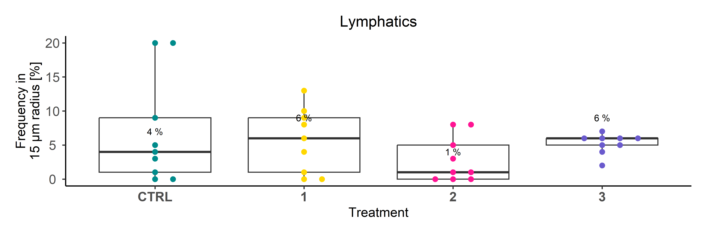
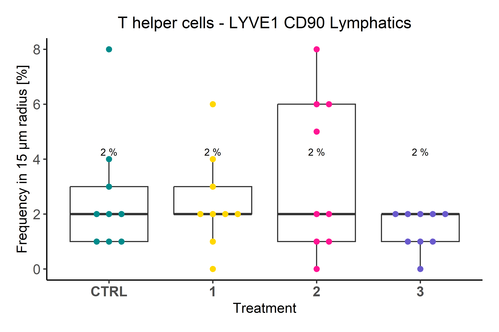
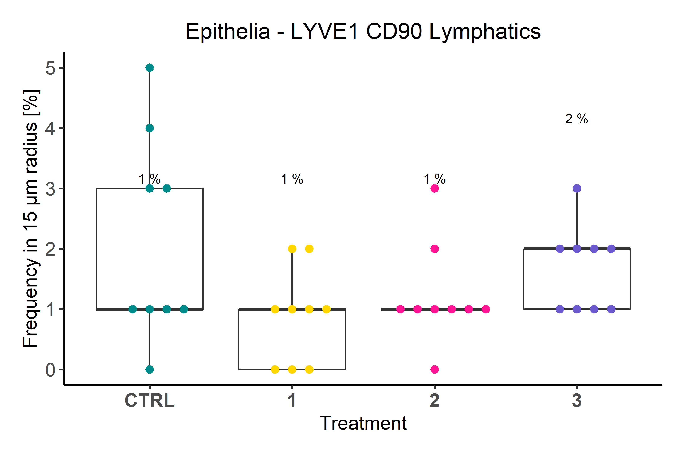

## Libraries


``` r
library(SeuratObject)
library(dplyr)
library(rstatix)

# remove.packages("rlang")
# remove.packages("dplyr")
# install.packages("rlang")
# install.packages("dplyr")
library(rlang)
library(dplyr)

if (!requireNamespace("Giotto", quietly = TRUE))
  devtools::install_github("drieslab/Giotto@suite")
if (!requireNamespace("VoltRon", quietly = TRUE))
  devtools::install_github("Artur-man/VoltRon")
if (!requireNamespace("Seurat", quietly = TRUE))
  install.packages("Seurat")
library(Giotto)
library(Seurat)
library(VoltRon)
library(ggplot2)
library(ggpubr)
library(readr)
library(ggbeeswarm)
library(stringr)
```

## Parameters


``` r
set.seed(123)

input_dir <- here::here("1_data_tidying", "Lung_SI_all_cells_all_ALs_files")

output_dir <- here::here("2_visualizations_for_figures", "Fig_5_spatial_analysis_ILC2s_lung_files")
dir.create(output_dir)


main_markers <- c(
  "EpCAM", "EMCN", "LYVE1", "PDPN", "PDGFRa", "CD8a", "CD4",
  "CD45", "CD3", "IRF4", "Kappa", "CD11c", "CD127", "GATA3eGFP", "RORgt"
)


immune_markers <- c(
 "CD3", "CD4", "CD8a", "Kappa", "IRF4", "CD11c",
  "CD127", "CD90", "EOMES", "GATA3eGFP", "RORgt", "Ki67",  "KLRG1", "NKp46", "CD117", "Areg", "CCR6", "CD44", "MHCII", "Sca1"
)

ilc_markers <- c(
  "CD3", "CD4", "CD8a",
  "CD127", "CD90", "EOMES", "GATA3eGFP", "RORgt", "KLRG1", "NKp46", "CD117", "CCR6", "MHCII", "Ki67", "Areg", "IRF4", "Sca1", "CD44"
)


cols_nat <- c("magenta", "cyan", "blue", "purple", "green", 
                       "red", "yellow", "olivedrab1", "slateblue1", 
                       "darkcyan", "gold","indianred1", "seagreen", "deeppink", 
                       "orange", "brown", "violet",
                       "deeppink4", "pink", 
                       "grey", "black", "lightgreen", 
                       "#FF0066",  
                       "lightblue", "#FFCC99", "#CC00FF", 
                       "blueviolet",  "goldenrod4", 
                       "navy", "olivedrab", "lightcyan", "seagreen2", "darkviolet", "lightpink", "slateblue4", "olivedrab2")

colfunc <- colorRampPalette(c("darkcyan", "green", "yellow", "magenta", "purple"))

cols_ilcs_lung <- c("darkcyan", "seagreen2", "deeppink4")

cols_treat <- c("darkcyan", "gold", "deeppink", "slateblue")
```

# Load data


``` r
# from import_Giotto.Rmd
gio_list <- readRDS(here::here("data", "Giotto_data_lung.rds"))

# from import_VoltRon.Rmd
vr_list <- readRDS(here::here("data", "VoltRon_data_lung.rds"))

# original data
metadatax <- read_csv(here::here("data", "MELC_data_murine_lung_CTRL_D1_D2_D3_withfolders.csv"))
metadatax <- metadatax %>%
  mutate(CellType = AL3)  %>%
  filter(Sample != "20210906_3_lu_d3")

unique(metadatax$CellType)
```

```
##  [1] "Epithelia"               "EMCN CD31 Blood vessels" "LYVE1 CD31 vessels"      "LYVE1 CD90 Lymphatics"   "Myeloid cells"           "B cells & Plasma cells"  "NK cells/ILC1s"          "ILC3s"                   "T cytotox cells"         "T helper cells"          "ILC2s"
```

``` r
vr_list_names <- unique(metadatax$Sample)


cell_proximities_list <- list()
for(samp in vr_list_names){
  print(samp)
  cell_proximities_list[[samp]] <-cellProximityEnrichment(
    gobject = gio_list[[samp]],
    cluster_column = 'CellType',
    spatial_network_name = 'Delaunay_network',
    adjust_method = 'fdr',
    number_of_simulations = 1000)
  cell_proximities_list[[samp]] <- cell_proximities_list[[samp]]$enrichm_res
}
```

```
## [1] "20210910_1_lu_ctrl"
## [1] "20210914_1_lu_ctrl"
## [1] "20210922_1_lu_ctrl"
## [1] "20210910_2_lu_ctrl"
## [1] "20210914_2_lu_ctrl"
## [1] "20210922_2_lu_ctrl"
## [1] "20210910_3_lu_ctrl"
## [1] "20210914_3_lu_ctrl"
## [1] "20210922_3_lu_ctrl"
## [1] "20220311_1"
## [1] "20220316_1"
## [1] "20220321_1"
## [1] "20220311_2"
## [1] "20220316_2"
## [1] "20220321_2"
## [1] "20220311_3"
## [1] "20220316_3"
## [1] "20220321_3"
## [1] "20220325_1"
## [1] "20220421_1"
## [1] "20220502_1"
## [1] "20220325_2"
## [1] "20220421_2"
## [1] "20220502_2"
## [1] "20220325_3"
## [1] "20220421_3"
## [1] "20220502_3"
## [1] "20210902_1_lu_d3"
## [1] "20210906_1_lu_d3"
## [1] "20210928_1_lu_d3"
## [1] "20210902_2_lu_d3"
## [1] "20210906_2_lu_d3"
## [1] "20210928_2_lu_d3"
## [1] "20210902_3_lu_d3"
## [1] "20210928_3_lu_d3"
```

``` r
vr_merged <- merge(vr_list[[1]], vr_list[-1])
vrImageNames(vr_merged)
```

```
## [1] "image_1"
```

``` r
unique(vr_merged$CellType)
```

```
##  [1] "Epithelia"               "EMCN CD31 Blood vessels" "LYVE1 CD31 vessels"      "LYVE1 CD90 Lymphatics"   "Myeloid cells"           "B cells & Plasma cells"  "NK cells/ILC1s"          "T cytotox cells"         "T helper cells"          "ILC2s"                   "ILC3s"
```

Calculate co-enrichment scores and plot them:


``` r
# FOVs for representative overview images
fovs <- vr_list_names

set_alpha <- 0.35
set_ptsize <- 2
set_nrows <- 1
set_ncols <- 3
cell_shape <- 20


cols_con <- c("darkcyan", "gold", "deeppink", 
                "slateblue")

cols_fov <- c("darkcyan", "gold", "deeppink", 
                "slateblue")

ColorsCellType <-  list(
  #`NK cells/ILC1s/ILC3s` = "cyan", 
  `ILC2s` = "magenta",
  #`ILC3s` = "magenta", 
  `EMCN CD31 Blood vessels` = "green")

uni_celltypes <- unique(vr_merged$CellType)
backgroundlist <- list("EpCAM","CD31","LYVE1","LYVE1","CD11c","B220","EOMES", "CD8a", "CD4", "GATA3eGFP", "RORgt")
names(backgroundlist) <- uni_celltypes
uni_celltypes <- uni_celltypes[!uni_celltypes %in% "ILC2s"]

g_master_list <- list()
for(unic in uni_celltypes){
  
    ### selected cell groups ####
  selected_celltypes <- c("ILC2s", unic)
  # interactions <- c("EMCN CD31 Blood vessels--ILC2s")
  interactions <- unique(cell_proximities_list[[vr_list_names[30]]]$unified_int)
  interactions <- interactions[grepl("ILC2s", interactions) & grepl(unic, interactions)]
  background_image <- backgroundlist[[unic]]
  if(length(interactions) > 0){
     ### get interaction results ####
    interaction_celltypes <- NULL
    for(samp in vr_list_names){
      cur_cell_proximities <- cell_proximities_list[[samp]]
      cur_cell_proximities <- cur_cell_proximities[cur_cell_proximities$unified_int %in% interactions,]
      sample <- unique(metadatax$FullInfo[metadatax$Sample==samp])
      if(nrow(cur_cell_proximities) > 0 & sample != "20210906_FOV3_D3"){
        interaction_celltypes <- rbind(interaction_celltypes,
                                       data.frame(cur_cell_proximities[cur_cell_proximities$unified_int %in% interactions,], 
                                                  experiment = strsplit(sample, split = "_")[[1]][1], fov = strsplit(sample, split = "_")[[1]][2], condition = strsplit(sample, split = "_")[[1]][3]))
      }
    }
    interaction_celltypes$p.adj <- ifelse(interaction_celltypes$enrichm > 0, interaction_celltypes$p.adj_higher, interaction_celltypes$p.adj_lower)

    
    sig_label <- as.character(ifelse(interaction_celltypes$p.adj < 0.1, paste0("*"), ""))

    g_test <- ggplot(interaction_celltypes, aes(x = condition, y = enrichm, fill = condition)) +
      geom_bar(stat = "identity", position = position_dodge2(width=0.9, preserve = "single")) +
      facet_grid(.~condition, scales = "free_x") +
      geom_text(aes(label=sig_label), position=position_dodge2(width=0.9, preserve = "single"), angle = 90, hjust = -0.02, size = 4) +
      ylim(-2,3.5)+
      NoLegend()+
      theme_classic2()+
      scale_fill_manual(values = cols_fov, name = "") +
      theme(axis.text.x = element_text(#angle = 50,
                                       vjust = 1, size = 12, hjust = 0.5, face = "bold"
                                       ),
            axis.text.y = element_text(hjust = 0.5, size = 12),
            axis.title.x = element_blank(),
            axis.title.y = element_text(size = 12),
            plot.title = element_text(size =14, hjust = 0.5),
            plot.margin = margin(0, 0.5, 0.5, 0.5, "cm"),
            legend.position = "none",
            strip.background=element_blank(),
            strip.background.x= element_blank(),
            strip.text.x = element_text(size = 1, color = "white"),
            panel.grid.major.y = element_line())+
      NoLegend()+  
      ggtitle(gsub("LYVE1 CD90 ", "", interactions)) +
      ylab("Enrichment")
    
    
    g_master_list[[unic]] <- g_test+
        theme(plot.margin = margin(0, 0.5, 0, 0.5, "cm"))
  }
}

# ILC2s around ILC2s -----------------------------------------
interactions <- c("ILC2s--ILC2s")
unic <- "ILC2s"
background_image <- backgroundlist[["ILC2s"]]
interaction_celltypes <- NULL
for(samp in vr_list_names){
    cur_cell_proximities <- cell_proximities_list[[samp]]
    cur_cell_proximities <- cur_cell_proximities[cur_cell_proximities$unified_int %in% interactions,]
    sample <- unique(metadatax$FullInfo[metadatax$Sample==samp])
    if(nrow(cur_cell_proximities) > 0 & sample != "20210906_FOV3_D3"){
      interaction_celltypes <- rbind(interaction_celltypes,
                                     data.frame(cur_cell_proximities[cur_cell_proximities$unified_int %in% interactions,], 
                                                experiment = strsplit(sample, split = "_")[[1]][1], fov = strsplit(sample, split = "_")[[1]][2], condition = strsplit(sample, split = "_")[[1]][3]))
    }
  }
interaction_celltypes$p.adj <- ifelse(interaction_celltypes$enrichm > 0, interaction_celltypes$p.adj_higher, interaction_celltypes$p.adj_lower)
  # plot test results
  # sig_label <- as.character(ifelse(interaction_celltypes$p.adj < 0.1, paste0("p=",round(interaction_celltypes$p.adj,3)), ""))
  sig_label <- as.character(ifelse(interaction_celltypes$p.adj < 0.1, paste0("*"), ""))
    # print(sig_label)
g_test <- ggplot(interaction_celltypes, aes(x = condition, y = enrichm, fill = condition)) +
  geom_bar(stat = "identity", position = position_dodge2(width=0.9, preserve = "single")) +
  facet_grid(.~condition, scales = "free_x") +
  geom_text(aes(label=sig_label), position=position_dodge2(width=0.9, preserve = "single"), angle = 90, hjust = -0.02, size = 4) +
  ylim(-2,3.5)+
  NoLegend()+
  theme_classic2()+
  scale_fill_manual(values = cols_fov, name = "") +
  theme(axis.text.x = element_text(#angle = 50,
                                   vjust = 1, size = 12, hjust = 0.5, face = "bold"
                                   ),
        axis.text.y = element_text(hjust = 0.5, size = 12),
        axis.title.x = element_blank(),
        axis.title.y = element_text(size = 12),
        plot.title = element_text(size =14, hjust = 0.5),
        plot.margin = margin(0, 0.5, 0.5, 0.5, "cm"),
        legend.position = "none",
        strip.background=element_blank(),
        strip.background.x= element_blank(),
        strip.text.x = element_text(size = 1, color = "white"),
        panel.grid.major.y = element_line())+
  NoLegend()+  
  ggtitle(interactions) +
  ylab("Enrichment")


g_master_list[[unic]] <- g_test+
    theme(plot.margin = margin(0, 0.5, 0, 0.5, "cm"))
```

# Visualization

## ILC2s localize close to vessels

### B - IF overlays


``` r
img <- png::readPNG(
    "D:/Repositories/2025_Kroh_et_al/Murine_ILC_niches_lung_SI_IL-33/data/images/Fig_5_ILC2_niche/20210906_1_ILC2s-w_CD90-c_CD31-m_LYVE1-y.png"
  )


my_colors <- c("cyan", "magenta", "yellow")

g <- grid::rasterGrob(img, interpolate=TRUE)


df_fov <- metadatax %>%
  mutate(AL1 = recode(
    AL1,
    "Immune cells" = "CD90.2",
    "Endothelia & stroma" = "CD31",
    "Epithelia" = "LYVE1"
  ))

plot_if_1 <- ggplot()+ 
  geom_point(data = df_fov, 
                       aes(x= Loc_X, y= Loc_Y, color = AL1), 
                       size = 1)+
  annotation_custom(g, xmin=-Inf, xmax=Inf, ymin=-Inf, ymax=Inf)+
  theme(legend.title=element_blank())+ # exclude legend title
  scale_colour_discrete(name  ="MELC IF stainings",
                          breaks=c("CD45", "CD31",
                                   "EpCAM"),
                          labels=c("CD45", "CD31",
                                   "EpCAM")) +
  scale_color_manual(values = my_colors)+ 
    theme(legend.position = "bottom", 
          plot.margin=margin(1,0,0,0,"cm"),
          text = element_blank(),
           axis.ticks = element_blank(),
         panel.grid =  element_blank(),
          legend.ticks = element_blank(),
         legend.title=element_blank(),
         legend.key = element_blank(),
        legend.text = element_text(size=14), 
         panel.background = element_rect(fill = 'black', 
                                         color = 'black', size = 1))+    
  ggplot2::theme(legend.position = "bottom")+
  ggplot2::guides(color=guide_legend(override.aes = list(size=5), ncol=3),
                  fill=guide_legend(ncol = 1,byrow=TRUE))


plot_if_1 <- ggarrange(plot_if_1, 
            nrow = 1, ncol = 1, 
          #widths = c(4.5, 4.5), 
          align = "v",
          font.label=list(size=12),hjust=-0.5
          )+    
  ggplot2::theme(legend.position = "left")
  
plot_if_1
```


Plot ILC2s on overlay of endothelial markers


``` r
set_ptsize <- 2
cell_shape <- 18
set_alpha <- 1
```


``` r
# define markers for the Overlay

# CYAN
marker1 <- "CD90"
# MAGENTA
marker2 <- "FN"
# YELLOW
marker3 <- "LYVE1"
# GREEN
marker4 <- "EpCAM"
# RED
marker5 <- "CD31"

# define cell type of interested that should be plotted on the overlay
celltype_of_interest <- "ILC2s"

ColorsCellTypeSingle <-  list(
  #`NK cells/ILC1s/ILC3s` = "cyan", 
  `ILC2s` = "white",
  #`ILC3s` = "magenta", 
  `EMCN CD31 Blood vessels` = "green")


name_channel_key <- paste0(marker1, "-c_", marker2, "-m_", marker3, "-y_" 
                           # marker4, "-g_", 
                           # marker5, "-r" 
                           )
vr_merged <- combineChannels(vr_merged,
                             channels = c(marker1, marker2, marker3 
                                          # marker4, 
                                          # marker5
                                          ),
                             colors = c("cyan", "magenta", "yellow" 
                                        # "green",
                                        # "red"
                                        ),
                             channel_key = name_channel_key)


cell_type_of_interest <- "ILC2s"

# CTRL ------------------------------------------------------------
plot <- vrSpatialPlot(vr_merged, assay = paste0("Assay", 2), 
                        group.by = "CellType", 
                        group.ids = celltype_of_interest,
                        alpha = set_alpha, 
                        background = c("image_1", name_channel_key), 
                        pt.size = set_ptsize, cell.shape = cell_shape)+
  guides(color = guide_legend(override.aes = list(size = 5)))+
  scale_color_manual(values = ColorsCellTypeSingle)+
  scale_fill_manual(values = ColorsCellTypeSingle)+
  theme_void()+ NoLegend()+ ggtitle(NULL)+
  ggtitle("CTRL")+
  theme(plot.title = element_text(hjust = 0.5, size = 14))


plot_if_ctrl <- plot +
  annotate("text", x=70, y=970, label= marker1,
           col="cyan", size=3.5, parse=TRUE) +
  annotate("text", x=180, y=970, label= marker2,
           col="magenta", size=3.5, parse=TRUE) +
  annotate("text", x=305, y=970, label= marker3,
           col="yellow", size=3.5, parse=TRUE)+
  # annotate("text", x=305, y=920, label= marker4,
  #          col="green", size=3.5, parse=TRUE)+
  # annotate("text", x=70, y=920, label= marker5,
  #          col="red", size=3.5, parse=TRUE)+
  annotate("segment", x = 680, xend = 985, y = 45, yend = 45, size = 1.6, 
  colour = "white")

plot_if_ctrl
```


``` r
# IL-33 D3 ------------------------------------------------------------
plot <- vrSpatialPlot(vr_merged, assay = paste0("Assay", 35), #2
                        group.by = "CellType", 
                        group.ids = celltype_of_interest,
                        alpha = set_alpha, 
                        background = c("image_1", name_channel_key), 
                        pt.size = set_ptsize, cell.shape = cell_shape)+
  guides(color = guide_legend(override.aes = list(size = 5)))+
  scale_color_manual(values = ColorsCellTypeSingle)+
  scale_fill_manual(values = ColorsCellTypeSingle)+
  theme_void()+ NoLegend()+ ggtitle(NULL)+
  ggtitle("IL-33 day 3")+
  theme(plot.title = element_text(hjust = 0.5, size = 14), 
        text = element_text(size = 12))


plot_if_d3 <- plot +
  annotate("text", x=70, y=970, label= marker1,
           col="cyan", size=5, parse=TRUE) +
  annotate("text", x=180, y=970, label= marker2,
           col="magenta", size=5, parse=TRUE) +
  annotate("text", x=305, y=970, label= marker3,
           col="yellow", size=5, parse=TRUE)+
  # annotate("text", x=305, y=920, label= marker4,
  #          col="green", size=3.5, parse=TRUE)+
  # annotate("text", x=70, y=920, label= marker5,
  #          col="red", size=3.5, parse=TRUE)+
  annotate("segment", x = 680, xend = 985, y = 45, yend = 45, size = 1.6, 
  colour = "white")

plot_if_d3
```


### A - Coenrichment plot


``` r
# fine tune the co-enrichment plot
# ILC2s around ILC2s -----------------------------------------
interactions <- c("ILC2s--LYVE1 CD90 Lymphatics")
unic <- "LYVE1 CD90 Lymphatics"
background_image <- backgroundlist[["LYVE1 CD90 Lymphatics"]]
interaction_celltypes <- NULL
for(samp in vr_list_names){
    cur_cell_proximities <- cell_proximities_list[[samp]]
    cur_cell_proximities <- cur_cell_proximities[cur_cell_proximities$unified_int %in% interactions,]
    sample <- unique(metadatax$FullInfo[metadatax$Sample==samp])
    if(nrow(cur_cell_proximities) > 0 & sample != "20210906_FOV3_D3"){
      interaction_celltypes <- rbind(interaction_celltypes,
                                     data.frame(cur_cell_proximities[cur_cell_proximities$unified_int %in% interactions,], 
                                                experiment = strsplit(sample, split = "_")[[1]][1], fov = strsplit(sample, split = "_")[[1]][2], condition = strsplit(sample, split = "_")[[1]][3]))
    }
  }
interaction_celltypes$p.adj <- ifelse(interaction_celltypes$enrichm > 0, interaction_celltypes$p.adj_higher, interaction_celltypes$p.adj_lower)
  # plot test results
  # sig_label <- as.character(ifelse(interaction_celltypes$p.adj < 0.1, paste0("p=",round(interaction_celltypes$p.adj,3)), ""))
  sig_label <- as.character(ifelse(interaction_celltypes$p.adj < 0.1, paste0("*"), ""))
    # print(sig_label)
plot_coenrichment <- ggplot(interaction_celltypes, aes(x = condition, y = enrichm, fill = condition)) +
  geom_bar(stat = "identity", position = position_dodge2(width=0.9, preserve = "single")) +
  facet_grid(.~condition, scales = "free_x") +
  geom_text(aes(label=sig_label), position=position_dodge2(width=0.9, preserve = "single"), angle = 90, hjust = -0.02, size = 4) +
  ylim(-2,2.1)+
  NoLegend()+
  theme_classic2()+
  scale_fill_manual(values = cols_fov, name = "") +
  ggtitle(gsub("LYVE1 CD90 ", "", interactions)) +
  theme(axis.text.x = element_text(#angle = 50,
                                   vjust = 1, size = 12, hjust = 0.5, face = "bold"
                                   ),
        axis.text.y = element_text(hjust = 0.5, size = 12),
        axis.title.x = element_blank(),
        axis.title.y = element_text(size = 12),
        plot.title = element_text(size =14, hjust = 0.5),
        plot.margin = margin(0.5, 1, 0.5, 1, "cm"),
        legend.position = "none",
        strip.background=element_blank(),
        strip.background.x= element_blank(),
        strip.text.x = element_text(size = 1, color = "white"),
        panel.grid.major.y = element_line())+
  NoLegend()+  
  ylab("Enrichment")

plot_coenrichment
```


### C-D - Minimum distance plot


``` r
set.seed(8)
radius <- 10
unit <- "\u03BC"
thresh <- 0.04
nmarkers <- 33
save_name <- "SPIAT_cin_"

cols_nat <- c("magenta", "cyan", "blue", "purple", "green", 
                       "red", "yellow", "olivedrab1", "slateblue1", 
                       "darkcyan", "seagreen", "deeppink", 
                       "orange", "brown", "violet",
                       "deeppink4", "pink", 
                       "grey", "black", "lightgreen", 
                       "#FF0066", "gold", 
                       "lightblue", "#FFCC99", "#CC00FF", 
                       "blueviolet",  "goldenrod4", 
                       "indianred1", "navy", "olivedrab", "lightcyan", "seagreen2", "darkviolet", "lightpink", "slateblue4", "olivedrab2")
                


ColorsCellType <-  list(`NK cells/ILC1s` = "darkcyan", 
                        `ILC2s` = "seagreen2", 
                        `ILC3s` = "darkmagenta", 
                        `T helper cells` = "deeppink",
                        `T cytotox cells` = "slateblue", 
                        `Myeloid cells` = "gold", 
                        `B cells & Plasma cells` = "indianred1",
                        `LYVE1 CD31 vessels` = "darkgreen", 
                        `LYVE1 CD90 Lymphatics` = "yellow", 
                        `EMCN CD31 Blood vessels` = "red", 
                        `Epithelia` = "green")
ColorsCellType 
```

```
## $`NK cells/ILC1s`
## [1] "darkcyan"
## 
## $ILC2s
## [1] "seagreen2"
## 
## $ILC3s
## [1] "darkmagenta"
## 
## $`T helper cells`
## [1] "deeppink"
## 
## $`T cytotox cells`
## [1] "slateblue"
## 
## $`Myeloid cells`
## [1] "gold"
## 
## $`B cells & Plasma cells`
## [1] "indianred1"
## 
## $`LYVE1 CD31 vessels`
## [1] "darkgreen"
## 
## $`LYVE1 CD90 Lymphatics`
## [1] "yellow"
## 
## $`EMCN CD31 Blood vessels`
## [1] "red"
## 
## $Epithelia
## [1] "green"
```

``` r
cols_treat <- c("darkcyan", "gold", "deeppink", "slateblue")

celltypes <- c(
  "NK cells/ILC1s", 
  "ILC2s", 
  "ILC3s", 
  "T helper cells", 
  "T cytotox cells", 
  "Myeloid cells", 
  "B cells & Plasma cells", 
  "LYVE1 CD31 vessels", 
  "LYVE1 CD90 Lymphatics", 
  "EMCN CD31 Blood vessels", 
  "Epithelia"
)

input_dir <- "C:/Users/NieHau/Desktop/Sandy/R/R_analysis_output/Niche_analysis_SPIAT_lung/Output_SPIAT/cells_in_neighborhood/"

list_files <- list.files(path=input_dir, 
                         pattern=NULL, all.files=FALSE,
                         full.names=FALSE)

df_cin = data.frame()
for (element in list_files) {
  dir <- paste0(input_dir, element)
  df_sub <- read_csv(dir, 
    col_types = cols(...1 = col_skip()))
  df_cin <- rbind(df_cin, df_sub)
}

df_cin$Experiment <- str_sub(df_cin$Dataset,-8,-1)
df_cin$FOV <- str_sub(df_cin$Dataset,-10,-10)  
df_cin$Treatment <- gsub("D", "", str_extract(df_cin$Dataset, "[^_]+"))
df_cin$ExpID <- paste0(df_cin$Experiment, "_", df_cin$FOV)
colnames(df_cin) <- gsub("Reference cell", "Reference", colnames(df_cin))
# colnames(df_cin) <- gsub("NK cells & ILC1s", "NK cells/ILC1s", colnames(df_cin))
# df_cin$Reference <- gsub("NK cells & ILC1s", "NK cells/ILC1s", df_cin$Reference)
head(df_cin)
```

```
## # A tibble: 6 × 17
##   Dataset          Epithelia `EMCN CD31 Blood vessels` `LYVE1 CD31 vessels` `LYVE1 CD90 Lymphatics` `Myeloid cells` `B cells & Plasma cells` `NK cells & ILC1s` ILC3s `T cytotox cells` `T helper cells` ILC2s Reference               Experiment FOV   Treatment ExpID     
##   <chr>                <dbl>                     <dbl>                <dbl>                   <dbl>           <dbl>                    <dbl>              <dbl> <dbl>             <dbl>            <dbl> <dbl> <chr>                   <chr>      <chr> <chr>     <chr>     
## 1 D3_FOV1_20210902        80                         5                    4                       1               6                        2                  0     0                 0                1     1 Epithelia               20210902   1     3         20210902_1
## 2 D3_FOV1_20210902         3                        62                    6                       1               6                       14                  1     0                 1                4     1 EMCN CD31 Blood vessels 20210902   1     3         20210902_1
## 3 D3_FOV1_20210902         7                        22                   47                       2               9                        7                  1     0                 1                2     1 LYVE1 CD31 vessels      20210902   1     3         20210902_1
## 4 D3_FOV1_20210902        10                        18                    9                      31              18                        8                  0     0                 1                1     3 LYVE1 CD90 Lymphatics   20210902   1     3         20210902_1
## 5 D3_FOV1_20210902         9                        18                    9                       4              45                        6                  1     0                 1                3     5 Myeloid cells           20210902   1     3         20210902_1
## 6 D3_FOV1_20210902         2                        36                    6                       2               4                       40                  2     0                 3                5     1 B cells & Plasma cells  20210902   1     3         20210902_1
```

``` r
# get the meta data of the treatment from the df_cin
df_treat <- cbind(df_cin["ExpID"], df_cin["Treatment"])
df_treat <- df_treat[!duplicated(df_treat), ]
head(df_treat)
```

```
##         ExpID Treatment
## 1  20210902_1         3
## 12 20210902_2         3
## 23 20210902_3         3
## 34 20210906_1         3
## 45 20210906_2         3
## 56 20210906_3         3
```

``` r
input_dir <- "C:/Users/NieHau/Desktop/Sandy/R/R_analysis_output/Niche_analysis_SPIAT_lung/Output_SPIAT/cell_distances_minimal_all/"

list_files <- list.files(path=input_dir, 
                         pattern=NULL, all.files=FALSE,
                         full.names=FALSE)

df_dist = data.frame()
for (element in list_files) {
  dir <- paste0(input_dir, element)
  df_sub <- read_csv(dir, 
    col_types = cols(...1 = col_skip()))
  df_sub$Name <- element
  df_dist <- rbind(df_dist, df_sub)
}


head(df_dist)
```

```
## # A tibble: 6 × 7
##   RefCell     RefType   NearestCell NearestType             Distance Pair                              Name                                    
##   <chr>       <chr>     <chr>       <chr>                      <dbl> <chr>                             <chr>                                   
## 1 Cell_175084 Epithelia Cell_175108 EMCN CD31 Blood vessels     4.52 Epithelia/EMCN CD31 Blood vessels SPIAT_20210902_1_min_distances_pairs.csv
## 2 Cell_175115 Epithelia Cell_175126 EMCN CD31 Blood vessels     4.53 Epithelia/EMCN CD31 Blood vessels SPIAT_20210902_1_min_distances_pairs.csv
## 3 Cell_175154 Epithelia Cell_175123 EMCN CD31 Blood vessels     4.52 Epithelia/EMCN CD31 Blood vessels SPIAT_20210902_1_min_distances_pairs.csv
## 4 Cell_175252 Epithelia Cell_175201 EMCN CD31 Blood vessels     6.98 Epithelia/EMCN CD31 Blood vessels SPIAT_20210902_1_min_distances_pairs.csv
## 5 Cell_175423 Epithelia Cell_175453 EMCN CD31 Blood vessels     5.29 Epithelia/EMCN CD31 Blood vessels SPIAT_20210902_1_min_distances_pairs.csv
## 6 Cell_175570 Epithelia Cell_175592 EMCN CD31 Blood vessels     7.93 Epithelia/EMCN CD31 Blood vessels SPIAT_20210902_1_min_distances_pairs.csv
```

``` r
df_dist$ExpID <- str_sub(df_dist$Name,7,16)
df_dist$Experiment <- str_sub(df_dist$Name,7,14)
df_dist$FOV <- str_sub(df_dist$Name,16,16)  

df_dist <- merge(df_dist, df_treat, 
                 by = "ExpID", 
                 all.x = TRUE) 

df_dist <- df_dist %>%
  mutate(Pair = paste(RefType, "--", NearestType))


df_dist$RefType <- gsub("NK cells & ILC1s", "NK cells/ILC1s", df_dist$RefType)
df_dist$NearestType <- gsub("NK cells & ILC1s", "NK cells/ILC1s", df_dist$NearestType)

df_dist$RefType <- factor(df_dist$RefType, levels = celltypes)
df_dist$NearestType <- factor(df_dist$NearestType, levels = celltypes)


df_dist_all <- df_dist

head(df_dist)
```

```
##        ExpID     RefCell   RefType NearestCell             NearestType Distance                                 Pair                                     Name Experiment FOV Treatment
## 1 20210902_1 Cell_175084 Epithelia Cell_175108 EMCN CD31 Blood vessels 4.515044 Epithelia -- EMCN CD31 Blood vessels SPIAT_20210902_1_min_distances_pairs.csv   20210902   1         3
## 2 20210902_1 Cell_175115 Epithelia Cell_175126 EMCN CD31 Blood vessels 4.526726 Epithelia -- EMCN CD31 Blood vessels SPIAT_20210902_1_min_distances_pairs.csv   20210902   1         3
## 3 20210902_1 Cell_175154 Epithelia Cell_175123 EMCN CD31 Blood vessels 4.515044 Epithelia -- EMCN CD31 Blood vessels SPIAT_20210902_1_min_distances_pairs.csv   20210902   1         3
## 4 20210902_1 Cell_175252 Epithelia Cell_175201 EMCN CD31 Blood vessels 6.978046 Epithelia -- EMCN CD31 Blood vessels SPIAT_20210902_1_min_distances_pairs.csv   20210902   1         3
## 5 20210902_1 Cell_175423 Epithelia Cell_175453 EMCN CD31 Blood vessels 5.290617 Epithelia -- EMCN CD31 Blood vessels SPIAT_20210902_1_min_distances_pairs.csv   20210902   1         3
## 6 20210902_1 Cell_175570 Epithelia Cell_175592 EMCN CD31 Blood vessels 7.934261 Epithelia -- EMCN CD31 Blood vessels SPIAT_20210902_1_min_distances_pairs.csv   20210902   1         3
```

``` r
# filter condition and reference cell types to compare ILC subtypes and 
# T cells
df_dist_ref <- df_dist_all %>%
  # filter(Treatment == condition) %>%
  filter(RefType == "ILC2s"
         |
           RefType == "NK cells/ILC1s"| RefType == "ILC3s"|
           RefType == "T helper cells"| RefType == "T cytotox cells"| RefType == "Myeloid cells"| RefType == "B cells & Plasma cells"
         )

unique(df_dist_ref$Treatment)
```

```
## [1] "3"    "CTRL" "1"    "2"
```

``` r
df_dist_ref$Treatment <- factor(df_dist_ref$Treatment, levels = c(
  "CTRL", "1", "2", "3"
))
unique(df_dist_ref$RefType)
```

```
## [1] Myeloid cells          B cells & Plasma cells NK cells/ILC1s         ILC3s                  T cytotox cells        T helper cells         ILC2s                 
## Levels: NK cells/ILC1s ILC2s ILC3s T helper cells T cytotox cells Myeloid cells B cells & Plasma cells LYVE1 CD31 vessels LYVE1 CD90 Lymphatics EMCN CD31 Blood vessels Epithelia
```

``` r
# LYMPHATICS ------------------------------------------------------------
celltype_of_interest <- "LYVE1 CD90 Lymphatics"
ypos <- 100


my_plot_list <- list()

celltype_of_interest <- "LYVE1 CD90 Lymphatics"

for (condition in c("CTRL", "1", "2", "3")) {
  
  plot_data <- df_dist_ref %>%
    filter(Treatment == condition) %>%
    filter(NearestType == celltype_of_interest)
  
  # Test for statistical significance of ILC2s to the other cell types
  stat.test <- plot_data %>%
    dunn_test(Distance ~ RefType) %>%
    adjust_pvalue(method = "bonferroni") %>%
    add_significance()
  stat.test <- stat.test %>% add_xy_position(x = "RefType")
  
  stat.test <- stat.test %>%
    filter(group1 == "ILC2s"|group2 == "ILC2s"
           )
  
  # Create lav´bels that depict mean value 
  Labs = plot_data %>% 
    group_by(RefType) %>%
    summarise(lab_text = paste0(round(median(Distance), 0), " µm"), lab_pos = quantile(Distance)[3]
                )
  
  # create plot
  plot <- ggplot(plot_data, aes(x=RefType , 
            y = Distance, 
            fill = "RefType")) +
    geom_boxplot(fill="white", outliers = FALSE)+
    geom_beeswarm(aes(color = RefType), alpha = 0.5, size = 0.1, cex = 0.2)+
    stat_pvalue_manual(stat.test,
                       size = 6,
                       hide.ns = TRUE, y.position = 250, step.increase = 0.1
                       )+
    scale_y_continuous(expand = c(0, 0), limits = c(0,400))+
    rotate_x_text(angle = 45)+
  ggtitle(gsub("3", "IL-33 day 3", condition))+
  scale_color_manual(values = ColorsCellType)+
  theme_classic2()+
  theme(axis.text.x = element_text(angle = 45, vjust = 1, hjust = 1, 
                                   # vjust = 1, hjust = 0.5, 
                                   size = 12, face = "bold"),
        axis.text.y = element_text(hjust = 0.5, size = 12),
        # axis.title.x = element_text(size = 12),
        axis.title.x = element_blank(),
        axis.title.y = element_text(size = 12),
        plot.title = element_text(size =14, hjust = 0.5),
        plot.margin = margin(0.5, 1, 0.5, 1, "cm"),
        legend.title = element_text(size =14),
        legend.text = element_text(size =12))+
    NoLegend()+
    xlab("Cell types")+
    ylab("Minimal distance [µm]")+
    geom_text(aes(y = 150, #lab_pos, 
                  label = lab_text, vjust = -0.5), angle = 50,
              data = Labs,size=3)
  plot
  
  assigned_name <- gsub(" ", "", paste0(celltype_of_interest, "_", condition))
  assign(assigned_name, plot )
  my_plot_list[[assigned_name]] <- plot
  

}

ggarrange(plotlist = my_plot_list[c(1:4)], nrow = 1, ncol = 4)
```


``` r
dist_lymph <- ggarrange(plotlist = my_plot_list[c(1, 4)], nrow = 2, ncol = 1, labels = c("C", "D"))

dist_lymph
```


Check what is the frequency of ILC2s with a minimum distance to lymphatics less than 5 µm:


``` r
plot_data <- df_dist_ref %>%
  filter(Treatment == "CTRL") %>%
  filter(RefType == "ILC2s") %>%
  filter(NearestType == celltype_of_interest)

percentage_under_5 <- plot_data %>%
  summarise(pct = mean(Distance < 5) * 100) %>%
  pull(pct)

print(paste("Percentage of cells with Distance < 5 under healthy conditions:", round(percentage_under_5, 2), "%"))
```

```
## [1] "Percentage of cells with Distance < 5 under healthy conditions: 1.92 %"
```

``` r
plot_data <- df_dist_ref %>%
  filter(RefType == "ILC2s") %>%
  filter(NearestType == celltype_of_interest)

percentage_under_5 <- plot_data %>%
  summarise(pct = mean(Distance < 5) * 100) %>%
  pull(pct)

print(paste("Percentage of cells with Distance < 5:", round(percentage_under_5, 2), "%"))
```

```
## [1] "Percentage of cells with Distance < 5: 2.66 %"
```

### E - CIN plot


``` r
library(stringr)

input_dir <- "C:/Users/NieHau/Desktop/Sandy/R/R_analysis_output/Niche_analysis_SPIAT_all_organs_CIN/Output/"

# List all radii calculated 
list_files_rad <- list.files(path="C:/Users/NieHau/Desktop/Sandy/R/R_analysis_output/Niche_analysis_SPIAT_all_organs_CIN/Output/Lung", 
                         pattern=NULL, all.files=FALSE,
                         full.names=FALSE)

list_files_rad
```

```
## [1] "10_micm" "15_micm" "20_micm" "25_micm"
```

``` r
df_cin_lung = data.frame()

tissuearea <- "Lung"

# define a dataframe to collect all data from one tissue area
df_radius <- data.frame()
for (defined_radius in list_files_rad) {
  print(defined_radius)
  list_files <- list.files(path=paste0(input_dir,
                                   tissuearea, 
                                   "/", 
                                   defined_radius, 
                                   "/"), 
                       pattern=NULL, all.files=FALSE,
                       full.names=FALSE)
  # define a dataframe to collect the data for all datasets of one 
  df_cin = data.frame()
  for (element in list_files) {
    dir <- paste0(input_dir,
                  tissuearea, 
                  "/", defined_radius, 
                  "/", element)
    df_sub <- read_csv(dir, 
      col_types = cols(...1 = col_skip()))
    df_sub$Filename <- paste0(tissuearea, 
                  "/", defined_radius, 
                  "/", element)
    df_cin <- rbind(df_cin, df_sub)
  }

  df_cin$Radius <- defined_radius
  df_radius <- rbind(df_radius, df_cin)
}
```

```
## [1] "10_micm"
```

```
## [1] "15_micm"
```

```
## [1] "20_micm"
```

```
## [1] "25_micm"
```

``` r
# collect data from current tissue area to datafram df_all_cin
df_cin_lung <- df_radius
df_cin_lung$Radius <- gsub("_micm", " \u03BCm", df_cin_lung$Radius)
df_cin_lung$Experiment <- str_sub(df_cin_lung$Dataset,-8,-1)
df_cin_lung$FOV <- str_sub(df_cin_lung$Dataset,-10,-10)  
df_cin_lung$Treatment <- str_extract(df_cin_lung$Dataset, "[^_]+")
df_cin_lung$ExpID <- paste0(df_cin_lung$Experiment, "_", df_cin_lung$FOV)
colnames(df_cin_lung) <- gsub("Reference cell", "Reference", 
                                colnames(df_cin_lung))

colnames(df_cin_lung) <- gsub("NK cells & ILC1s", "NK cells/ILC1s", 
                              colnames(df_cin_lung))
df_cin_lung$Reference <- gsub("NK cells & ILC1s", "NK cells/ILC1s",
                              df_cin_lung$Reference)
head(df_cin_lung)
```

```
## # A tibble: 6 × 21
##   Dataset          Epithelia `EMCN CD31 Blood vessels` `LYVE1 CD31 vessels` `LYVE1 CD90 Lymphatics` `Myeloid cells` `B cells & Plasma cells` `NK cells/ILC1s` ILC3s `T cytotox cells` `T helper cells` ILC2s Reference               Organ Tissue.area Filename                                               Radius Experiment FOV   Treatment ExpID     
##   <chr>                <dbl>                     <dbl>                <dbl>                   <dbl>           <dbl>                    <dbl>            <dbl> <dbl>             <dbl>            <dbl> <dbl> <chr>                   <chr> <chr>       <chr>                                                  <chr>  <chr>      <chr> <chr>     <chr>     
## 1 D3_FOV1_20210902        88                         4                    3                       1               3                        1                0     0                 0                0     0 Epithelia               Lung  Lung        Lung/10_micm/SPIAT_20210902_1_rad10_micm_Lung_freq.csv 10 μm  20210902   1     D3        20210902_1
## 2 D3_FOV1_20210902         2                        70                    6                       1               5                       11                1     0                 1                3     1 EMCN CD31 Blood vessels Lung  Lung        Lung/10_micm/SPIAT_20210902_1_rad10_micm_Lung_freq.csv 10 μm  20210902   1     D3        20210902_1
## 3 D3_FOV1_20210902         5                        18                   59                       2               7                        6                1     0                 1                2     1 LYVE1 CD31 vessels      Lung  Lung        Lung/10_micm/SPIAT_20210902_1_rad10_micm_Lung_freq.csv 10 μm  20210902   1     D3        20210902_1
## 4 D3_FOV1_20210902         5                        14                    8                      47              15                        8                0     0                 0                0     2 LYVE1 CD90 Lymphatics   Lung  Lung        Lung/10_micm/SPIAT_20210902_1_rad10_micm_Lung_freq.csv 10 μm  20210902   1     D3        20210902_1
## 5 D3_FOV1_20210902         5                        14                    6                       3              59                        4                1     0                 0                2     5 Myeloid cells           Lung  Lung        Lung/10_micm/SPIAT_20210902_1_rad10_micm_Lung_freq.csv 10 μm  20210902   1     D3        20210902_1
## 6 D3_FOV1_20210902         1                        27                    5                       1               3                       54                1     0                 2                4     1 B cells & Plasma cells  Lung  Lung        Lung/10_micm/SPIAT_20210902_1_rad10_micm_Lung_freq.csv 10 μm  20210902   1     D3        20210902_1
```

``` r
colnames(df_cin_lung)
```

```
##  [1] "Dataset"                 "Epithelia"               "EMCN CD31 Blood vessels" "LYVE1 CD31 vessels"      "LYVE1 CD90 Lymphatics"   "Myeloid cells"           "B cells & Plasma cells"  "NK cells/ILC1s"          "ILC3s"                   "T cytotox cells"         "T helper cells"          "ILC2s"                   "Reference"               "Organ"                   "Tissue.area"             "Filename"                "Radius"                  "Experiment"              "FOV"                     "Treatment"               "ExpID"
```

``` r
df_cin_lung$Treatment <- gsub("D", "", df_cin_lung$Treatment)

radius <- unique(df_cin_lung$Radius)[2]
celltype_of_interest <- "ILC2s"

df_sub_lung <- df_cin_lung %>%
  filter(Reference == celltype_of_interest) %>%
  filter(Radius == radius) %>%
  select(Reference, Radius, Treatment, Dataset, `LYVE1 CD90 Lymphatics`, Tissue.area)

head(df_sub_lung)
```

```
## # A tibble: 6 × 6
##   Reference Radius Treatment Dataset          `LYVE1 CD90 Lymphatics` Tissue.area
##   <chr>     <chr>  <chr>     <chr>                              <dbl> <chr>      
## 1 ILC2s     15 μm  3         D3_FOV1_20210902                       4 Lung       
## 2 ILC2s     15 μm  3         D3_FOV2_20210902                       6 Lung       
## 3 ILC2s     15 μm  3         D3_FOV3_20210902                       5 Lung       
## 4 ILC2s     15 μm  3         D3_FOV1_20210906                       2 Lung       
## 5 ILC2s     15 μm  3         D3_FOV2_20210906                       7 Lung       
## 6 ILC2s     15 μm  3         D3_FOV3_20210906                       6 Lung
```

``` r
plot_data <- df_sub_lung

# Create lav´bels that depict mean value 
Labs = plot_data %>% 
  group_by(Treatment) %>%
  summarise(lab_text = paste0(round(median(`LYVE1 CD90 Lymphatics`), 0), " %"), lab_pos = quantile(`LYVE1 CD90 Lymphatics`)[3]+2
              )

plot_data$Treatment <- factor(plot_data$Treatment, levels = c("CTRL", "1", "2", "3"))
# create plot
plot_cin <- ggplot(plot_data, aes(x = Treatment, y = `LYVE1 CD90 Lymphatics`, fill = "Treatment"))+
  geom_boxplot(fill="white")+
  geom_beeswarm(aes(color = Treatment), size = 2, cex = 3)+
  scale_color_manual(values = cols_treat)+
  theme_classic2()+
  theme(axis.text.x = element_text(#angle = 50,
                                   vjust = 1, size = 12, hjust = 0.5, face = "bold"),
        axis.text.y = element_text(hjust = 0.5, size = 12),
        axis.title.x = element_text(size = 12),
        axis.title.y = element_text(size = 12),
        plot.title = element_text(size =14, hjust = 0.5),
        plot.margin = margin(0.5, 0.5, 0.5, 0.5, "cm"),
        legend.title = element_text(size =14),
        legend.text = element_text(size =12))+
  NoLegend()+
  ggtitle("Lymphatics")+
  xlab("Treatment")+
  ylab("Frequency in\n15 µm radius [%]")+
  # scale_y_continuous(expand = c(0, 0), limits = c(10,40))+
  geom_text(aes(y = lab_pos, label = lab_text, vjust = -0.5), data = Labs,size=3)
plot_cin
```



For comparison, check the CIN of :


``` r
# B cells ------------------------------------------------------------
celltype_of_interest <- "B cells & Plasma cells"

df_sub_lung <- df_cin_lung %>%
  filter(Reference == celltype_of_interest) %>%
  filter(Radius == radius) %>%
  select(Reference, Radius, Treatment, Dataset, `LYVE1 CD90 Lymphatics`, Tissue.area)

head(df_sub_lung)
```

```
## # A tibble: 6 × 6
##   Reference              Radius Treatment Dataset          `LYVE1 CD90 Lymphatics` Tissue.area
##   <chr>                  <chr>  <chr>     <chr>                              <dbl> <chr>      
## 1 B cells & Plasma cells 15 μm  3         D3_FOV1_20210902                       2 Lung       
## 2 B cells & Plasma cells 15 μm  3         D3_FOV2_20210902                       2 Lung       
## 3 B cells & Plasma cells 15 μm  3         D3_FOV3_20210902                       2 Lung       
## 4 B cells & Plasma cells 15 μm  3         D3_FOV1_20210906                       2 Lung       
## 5 B cells & Plasma cells 15 μm  3         D3_FOV2_20210906                       1 Lung       
## 6 B cells & Plasma cells 15 μm  3         D3_FOV3_20210906                       2 Lung
```

``` r
plot_data <- df_sub_lung

# Create lav´bels that depict mean value 
Labs = plot_data %>% 
  group_by(Treatment) %>%
  summarise(lab_text = paste0(round(median(`LYVE1 CD90 Lymphatics`), 0), " %"), lab_pos = quantile(`LYVE1 CD90 Lymphatics`)[3]+2
              )

plot_data$Treatment <- factor(plot_data$Treatment, levels = c("CTRL", "1", "2", "3"))
# create plot
ggplot(plot_data, aes(x = Treatment, y = `LYVE1 CD90 Lymphatics`, fill = "Treatment"))+
  geom_boxplot(fill="white")+
  geom_beeswarm(aes(color = Treatment), size = 2, cex = 3)+
  scale_color_manual(values = cols_treat)+
  theme_classic2()+
  theme(axis.text.x = element_text(#angle = 50,
                                   vjust = 1, size = 12, hjust = 0.5, face = "bold"),
        axis.text.y = element_text(hjust = 0.5, size = 12),
        axis.title.x = element_text(size = 12),
        axis.title.y = element_text(size = 12),
        plot.title = element_text(size =14, hjust = 0.5),
        plot.margin = margin(0.5, 0.5, 0.5, 0.5, "cm"),
        legend.title = element_text(size =14),
        legend.text = element_text(size =12))+
  NoLegend()+
  ggtitle("B cells & Plasma cells - LYVE1 CD90 Lymphatics")+
  xlab("Treatment")+
  ylab("Frequency in 15 µm radius [%]")+
  # scale_y_continuous(expand = c(0, 0), limits = c(10,40))+
  geom_text(aes(y = lab_pos, label = lab_text, vjust = -0.5), data = Labs,size=3)
```


``` r
# T cells ---------------------------------------------------------------
celltype_of_interest <- "T helper cells"

df_sub_lung <- df_cin_lung %>%
  filter(Reference == celltype_of_interest) %>%
  filter(Radius == radius) %>%
  select(Reference, Radius, Treatment, Dataset, `LYVE1 CD90 Lymphatics`, Tissue.area)

head(df_sub_lung)
```

```
## # A tibble: 6 × 6
##   Reference      Radius Treatment Dataset          `LYVE1 CD90 Lymphatics` Tissue.area
##   <chr>          <chr>  <chr>     <chr>                              <dbl> <chr>      
## 1 T helper cells 15 μm  3         D3_FOV1_20210902                       1 Lung       
## 2 T helper cells 15 μm  3         D3_FOV2_20210902                       2 Lung       
## 3 T helper cells 15 μm  3         D3_FOV3_20210902                       2 Lung       
## 4 T helper cells 15 μm  3         D3_FOV1_20210906                       1 Lung       
## 5 T helper cells 15 μm  3         D3_FOV2_20210906                       1 Lung       
## 6 T helper cells 15 μm  3         D3_FOV3_20210906                       2 Lung
```

``` r
plot_data <- df_sub_lung

# Create lav´bels that depict mean value 
Labs = plot_data %>% 
  group_by(Treatment) %>%
  summarise(lab_text = paste0(round(median(`LYVE1 CD90 Lymphatics`), 0), " %"), lab_pos = quantile(`LYVE1 CD90 Lymphatics`)[3]+2
              )

plot_data$Treatment <- factor(plot_data$Treatment, levels = c("CTRL", "1", "2", "3"))
# create plot
ggplot(plot_data, aes(x = Treatment, y = `LYVE1 CD90 Lymphatics`, fill = "Treatment"))+
  geom_boxplot(fill="white")+
  geom_beeswarm(aes(color = Treatment), size = 2, cex = 3)+
  scale_color_manual(values = cols_treat)+
  theme_classic2()+
  theme(axis.text.x = element_text(#angle = 50,
                                   vjust = 1, size = 12, hjust = 0.5, face = "bold"),
        axis.text.y = element_text(hjust = 0.5, size = 12),
        axis.title.x = element_text(size = 12),
        axis.title.y = element_text(size = 12),
        plot.title = element_text(size =14, hjust = 0.5),
        plot.margin = margin(0.5, 0.5, 0.5, 0.5, "cm"),
        legend.title = element_text(size =14),
        legend.text = element_text(size =12))+
  NoLegend()+
  ggtitle("T helper cells - LYVE1 CD90 Lymphatics")+
  xlab("Treatment")+
  ylab("Frequency in 15 µm radius [%]")+
  # scale_y_continuous(expand = c(0, 0), limits = c(10,40))+
  geom_text(aes(y = lab_pos, label = lab_text, vjust = -0.5), data = Labs,size=3)
```



``` r
# T cells ---------------------------------------------------------------
celltype_of_interest <- "Myeloid cells"

df_sub_lung <- df_cin_lung %>%
  filter(Reference == celltype_of_interest) %>%
  filter(Radius == radius) %>%
  select(Reference, Radius, Treatment, Dataset, `LYVE1 CD90 Lymphatics`, Tissue.area)

head(df_sub_lung)
```

```
## # A tibble: 6 × 6
##   Reference     Radius Treatment Dataset          `LYVE1 CD90 Lymphatics` Tissue.area
##   <chr>         <chr>  <chr>     <chr>                              <dbl> <chr>      
## 1 Myeloid cells 15 μm  3         D3_FOV1_20210902                       4 Lung       
## 2 Myeloid cells 15 μm  3         D3_FOV2_20210902                       4 Lung       
## 3 Myeloid cells 15 μm  3         D3_FOV3_20210902                       3 Lung       
## 4 Myeloid cells 15 μm  3         D3_FOV1_20210906                       4 Lung       
## 5 Myeloid cells 15 μm  3         D3_FOV2_20210906                       5 Lung       
## 6 Myeloid cells 15 μm  3         D3_FOV3_20210906                       4 Lung
```

``` r
plot_data <- df_sub_lung

# Create lav´bels that depict mean value 
Labs = plot_data %>% 
  group_by(Treatment) %>%
  summarise(lab_text = paste0(round(median(`LYVE1 CD90 Lymphatics`), 0), " %"), lab_pos = quantile(`LYVE1 CD90 Lymphatics`)[3]+2
              )

plot_data$Treatment <- factor(plot_data$Treatment, levels = c("CTRL", "1", "2", "3"))
# create plot
ggplot(plot_data, aes(x = Treatment, y = `LYVE1 CD90 Lymphatics`, fill = "Treatment"))+
  geom_boxplot(fill="white")+
  geom_beeswarm(aes(color = Treatment), size = 2, cex = 3)+
  scale_color_manual(values = cols_treat)+
  theme_classic2()+
  theme(axis.text.x = element_text(#angle = 50,
                                   vjust = 1, size = 12, hjust = 0.5, face = "bold"),
        axis.text.y = element_text(hjust = 0.5, size = 12),
        axis.title.x = element_text(size = 12),
        axis.title.y = element_text(size = 12),
        plot.title = element_text(size =14, hjust = 0.5),
        plot.margin = margin(0.5, 0.5, 0.5, 0.5, "cm"),
        legend.title = element_text(size =14),
        legend.text = element_text(size =12))+
  NoLegend()+
  ggtitle("Myeloid cells - LYVE1 CD90 Lymphatics")+
  xlab("Treatment")+
  ylab("Frequency in 15 µm radius [%]")+
  # scale_y_continuous(expand = c(0, 0), limits = c(10,40))+
  geom_text(aes(y = lab_pos, label = lab_text, vjust = -0.5), data = Labs,size=3)
```


``` r
# T cells ---------------------------------------------------------------
celltype_of_interest <- "T cytotox cells"

df_sub_lung <- df_cin_lung %>%
  filter(Reference == celltype_of_interest) %>%
  filter(Radius == radius) %>%
  select(Reference, Radius, Treatment, Dataset, `LYVE1 CD90 Lymphatics`, Tissue.area)

head(df_sub_lung)
```

```
## # A tibble: 6 × 6
##   Reference       Radius Treatment Dataset          `LYVE1 CD90 Lymphatics` Tissue.area
##   <chr>           <chr>  <chr>     <chr>                              <dbl> <chr>      
## 1 T cytotox cells 15 μm  3         D3_FOV1_20210902                       1 Lung       
## 2 T cytotox cells 15 μm  3         D3_FOV2_20210902                       3 Lung       
## 3 T cytotox cells 15 μm  3         D3_FOV3_20210902                       2 Lung       
## 4 T cytotox cells 15 μm  3         D3_FOV1_20210906                       1 Lung       
## 5 T cytotox cells 15 μm  3         D3_FOV2_20210906                       2 Lung       
## 6 T cytotox cells 15 μm  3         D3_FOV3_20210906                       3 Lung
```

``` r
plot_data <- df_sub_lung

# Create lav´bels that depict mean value 
Labs = plot_data %>% 
  group_by(Treatment) %>%
  summarise(lab_text = paste0(round(median(`LYVE1 CD90 Lymphatics`), 0), " %"), lab_pos = quantile(`LYVE1 CD90 Lymphatics`)[3]+2
              )

plot_data$Treatment <- factor(plot_data$Treatment, levels = c("CTRL", "1", "2", "3"))
# create plot
ggplot(plot_data, aes(x = Treatment, y = `LYVE1 CD90 Lymphatics`, fill = "Treatment"))+
  geom_boxplot(fill="white")+
  geom_beeswarm(aes(color = Treatment), size = 2, cex = 3)+
  scale_color_manual(values = cols_treat)+
  theme_classic2()+
  theme(axis.text.x = element_text(#angle = 50,
                                   vjust = 1, size = 12, hjust = 0.5, face = "bold"),
        axis.text.y = element_text(hjust = 0.5, size = 12),
        axis.title.x = element_text(size = 12),
        axis.title.y = element_text(size = 12),
        plot.title = element_text(size =14, hjust = 0.5),
        plot.margin = margin(0.5, 0.5, 0.5, 0.5, "cm"),
        legend.title = element_text(size =14),
        legend.text = element_text(size =12))+
  NoLegend()+
  ggtitle("T cytotox cells - LYVE1 CD90 Lymphatics")+
  xlab("Treatment")+
  ylab("Frequency in 15 µm radius [%]")+
  # scale_y_continuous(expand = c(0, 0), limits = c(10,40))+
  geom_text(aes(y = lab_pos, label = lab_text, vjust = -0.5), data = Labs,size=3)
```


``` r
# Epithelia ---------------------------------------------------------------
celltype_of_interest <- "Epithelia"

df_sub_lung <- df_cin_lung %>%
  filter(Reference == celltype_of_interest) %>%
  filter(Radius == radius) %>%
  select(Reference, Radius, Treatment, Dataset, `LYVE1 CD90 Lymphatics`, Tissue.area)

head(df_sub_lung)
```

```
## # A tibble: 6 × 6
##   Reference Radius Treatment Dataset          `LYVE1 CD90 Lymphatics` Tissue.area
##   <chr>     <chr>  <chr>     <chr>                              <dbl> <chr>      
## 1 Epithelia 15 μm  3         D3_FOV1_20210902                       1 Lung       
## 2 Epithelia 15 μm  3         D3_FOV2_20210902                       1 Lung       
## 3 Epithelia 15 μm  3         D3_FOV3_20210902                       2 Lung       
## 4 Epithelia 15 μm  3         D3_FOV1_20210906                       2 Lung       
## 5 Epithelia 15 μm  3         D3_FOV2_20210906                       3 Lung       
## 6 Epithelia 15 μm  3         D3_FOV3_20210906                       2 Lung
```

``` r
plot_data <- df_sub_lung

# Create lav´bels that depict mean value 
Labs = plot_data %>% 
  group_by(Treatment) %>%
  summarise(lab_text = paste0(round(median(`LYVE1 CD90 Lymphatics`), 0), " %"), lab_pos = quantile(`LYVE1 CD90 Lymphatics`)[3]+2
              )

plot_data$Treatment <- factor(plot_data$Treatment, levels = c("CTRL", "1", "2", "3"))
# create plot
ggplot(plot_data, aes(x = Treatment, y = `LYVE1 CD90 Lymphatics`, fill = "Treatment"))+
  geom_boxplot(fill="white")+
  geom_beeswarm(aes(color = Treatment), size = 2, cex = 3)+
  scale_color_manual(values = cols_treat)+
  theme_classic2()+
  theme(axis.text.x = element_text(#angle = 50,
                                   vjust = 1, size = 12, hjust = 0.5, face = "bold"),
        axis.text.y = element_text(hjust = 0.5, size = 12),
        axis.title.x = element_text(size = 12),
        axis.title.y = element_text(size = 12),
        plot.title = element_text(size =14, hjust = 0.5),
        plot.margin = margin(0.5, 0.5, 0.5, 0.5, "cm"),
        legend.title = element_text(size =14),
        legend.text = element_text(size =12))+
  NoLegend()+
  ggtitle("Epithelia - LYVE1 CD90 Lymphatics")+
  xlab("Treatment")+
  ylab("Frequency in 15 µm radius [%]")+
  # scale_y_continuous(expand = c(0, 0), limits = c(10,40))+
  geom_text(aes(y = lab_pos, label = lab_text, vjust = -0.5), data = Labs,size=3)
```



``` r
# EMCN CD31 Blood vessels ---------------------------------------------------------------
celltype_of_interest <- "EMCN CD31 Blood vessels"

df_sub_lung <- df_cin_lung %>%
  filter(Reference == celltype_of_interest) %>%
  filter(Radius == radius) %>%
  select(Reference, Radius, Treatment, Dataset, `LYVE1 CD90 Lymphatics`, Tissue.area)

head(df_sub_lung)
```

```
## # A tibble: 6 × 6
##   Reference               Radius Treatment Dataset          `LYVE1 CD90 Lymphatics` Tissue.area
##   <chr>                   <chr>  <chr>     <chr>                              <dbl> <chr>      
## 1 EMCN CD31 Blood vessels 15 μm  3         D3_FOV1_20210902                       1 Lung       
## 2 EMCN CD31 Blood vessels 15 μm  3         D3_FOV2_20210902                       2 Lung       
## 3 EMCN CD31 Blood vessels 15 μm  3         D3_FOV3_20210902                       1 Lung       
## 4 EMCN CD31 Blood vessels 15 μm  3         D3_FOV1_20210906                       1 Lung       
## 5 EMCN CD31 Blood vessels 15 μm  3         D3_FOV2_20210906                       2 Lung       
## 6 EMCN CD31 Blood vessels 15 μm  3         D3_FOV3_20210906                       2 Lung
```

``` r
plot_data <- df_sub_lung

# Create lav´bels that depict mean value 
Labs = plot_data %>% 
  group_by(Treatment) %>%
  summarise(lab_text = paste0(round(median(`LYVE1 CD90 Lymphatics`), 0), " %"), lab_pos = quantile(`LYVE1 CD90 Lymphatics`)[3]+2
              )

plot_data$Treatment <- factor(plot_data$Treatment, levels = c("CTRL", "1", "2", "3"))
# create plot
ggplot(plot_data, aes(x = Treatment, y = `LYVE1 CD90 Lymphatics`, fill = "Treatment"))+
  geom_boxplot(fill="white")+
  geom_beeswarm(aes(color = Treatment), size = 2, cex = 3)+
  scale_color_manual(values = cols_treat)+
  theme_classic2()+
  theme(axis.text.x = element_text(#angle = 50,
                                   vjust = 1, size = 12, hjust = 0.5, face = "bold"),
        axis.text.y = element_text(hjust = 0.5, size = 12),
        axis.title.x = element_text(size = 12),
        axis.title.y = element_text(size = 12),
        plot.title = element_text(size =14, hjust = 0.5),
        plot.margin = margin(0.5, 0.5, 0.5, 0.5, "cm"),
        legend.title = element_text(size =14),
        legend.text = element_text(size =12))+
  NoLegend()+
  ggtitle("EMCN CD31 Blood vessels - LYVE1 CD90 Lymphatics")+
  xlab("Treatment")+
  ylab("Frequency in 15 µm radius [%]")+
  # scale_y_continuous(expand = c(0, 0), limits = c(10,40))+
  geom_text(aes(y = lab_pos, label = lab_text, vjust = -0.5), data = Labs,size=3)
```


``` r
# NK cells/ILC1s ---------------------------------------------------------------
celltype_of_interest <- "NK cells/ILC1s"

df_sub_lung <- df_cin_lung %>%
  filter(Reference == celltype_of_interest) %>%
  filter(Radius == radius) %>%
  select(Reference, Radius, Treatment, Dataset, `LYVE1 CD90 Lymphatics`, Tissue.area)

head(df_sub_lung)
```

```
## # A tibble: 6 × 6
##   Reference      Radius Treatment Dataset          `LYVE1 CD90 Lymphatics` Tissue.area
##   <chr>          <chr>  <chr>     <chr>                              <dbl> <chr>      
## 1 NK cells/ILC1s 15 μm  3         D3_FOV1_20210902                       1 Lung       
## 2 NK cells/ILC1s 15 μm  3         D3_FOV2_20210902                       2 Lung       
## 3 NK cells/ILC1s 15 μm  3         D3_FOV3_20210902                       1 Lung       
## 4 NK cells/ILC1s 15 μm  3         D3_FOV1_20210906                       0 Lung       
## 5 NK cells/ILC1s 15 μm  3         D3_FOV2_20210906                       2 Lung       
## 6 NK cells/ILC1s 15 μm  3         D3_FOV3_20210906                       2 Lung
```

``` r
plot_data <- df_sub_lung

# Create lav´bels that depict mean value 
Labs = plot_data %>% 
  group_by(Treatment) %>%
  summarise(lab_text = paste0(round(median(`LYVE1 CD90 Lymphatics`), 0), " %"), lab_pos = quantile(`LYVE1 CD90 Lymphatics`)[3]+2
              )

plot_data$Treatment <- factor(plot_data$Treatment, levels = c("CTRL", "1", "2", "3"))
# create plot
ggplot(plot_data, aes(x = Treatment, y = `LYVE1 CD90 Lymphatics`, fill = "Treatment"))+
  geom_boxplot(fill="white")+
  geom_beeswarm(aes(color = Treatment), size = 2, cex = 3)+
  scale_color_manual(values = cols_treat)+
  theme_classic2()+
  theme(axis.text.x = element_text(#angle = 50,
                                   vjust = 1, size = 12, hjust = 0.5, face = "bold"),
        axis.text.y = element_text(hjust = 0.5, size = 12),
        axis.title.x = element_text(size = 12),
        axis.title.y = element_text(size = 12),
        plot.title = element_text(size =14, hjust = 0.5),
        plot.margin = margin(0.5, 0.5, 0.5, 0.5, "cm"),
        legend.title = element_text(size =14),
        legend.text = element_text(size =12))+
  NoLegend()+
  ggtitle("NK cells/ILC1s - LYVE1 CD90 Lymphatics")+
  xlab("Treatment")+
  ylab("Frequency in 15 µm radius [%]")+
  # scale_y_continuous(expand = c(0, 0), limits = c(10,40))+
  geom_text(aes(y = lab_pos, label = lab_text, vjust = -0.5), data = Labs,size=3)
```


``` r
# # ILC3s ---------------------------------------------------------------
# celltype_of_interest <- "ILC3s"
# 
# df_sub_lung <- df_cin_lung %>%
#   filter(Reference == celltype_of_interest) %>%
#   filter(Radius == radius) %>%
#   select(Reference, Radius, Treatment, Dataset, `LYVE1 CD90 Lymphatics`, Tissue.area)
# 
# head(df_sub_lung)
# 
# 
# 
# plot_data <- df_sub_lung
# 
# # Create lav´bels that depict mean value 
# Labs = plot_data %>% 
#   group_by(Treatment) %>%
#   summarise(lab_text = paste0(round(median(`LYVE1 CD90 Lymphatics`), 0), " %"), lab_pos = quantile(`LYVE1 CD90 Lymphatics`)[3]+2
#               )
# 
# plot_data$Treatment <- factor(plot_data$Treatment, levels = c("CTRL", "1", "2", "3"))
# # create plot
# ggplot(plot_data, aes(x = Treatment, y = `LYVE1 CD90 Lymphatics`, fill = "Treatment"))+
#   geom_boxplot(fill="white")+
#   geom_beeswarm(aes(color = Treatment), size = 2, cex = 3)+
#   scale_color_manual(values = cols_treat)+
#   theme_classic2()+
#   theme(axis.text.x = element_text(#angle = 50,
#                                    vjust = 1, size = 12, hjust = 0.5, face = "bold"),
#         axis.text.y = element_text(hjust = 0.5, size = 12),
#         axis.title.x = element_text(size = 12),
#         axis.title.y = element_text(size = 12),
#         plot.title = element_text(size =14, hjust = 0.5),
#         plot.margin = margin(0.5, 0.5, 0.5, 0.5, "cm"),
#         legend.title = element_text(size =14),
#         legend.text = element_text(size =12))+
#   NoLegend()+
#   ggtitle("ILC3s - LYVE1 CD90 Lymphatics")+
#   xlab("Treatment")+
#   ylab("Frequency in 15 µm radius [%]")+
#   # scale_y_continuous(expand = c(0, 0), limits = c(10,40))+
#   geom_text(aes(y = lab_pos, label = lab_text, vjust = -0.5), data = Labs,size=3)
```

## Combine plots for figure


``` r
coenrichment <- ggarrange(plot_coenrichment, "NONE", plot_if_d3,  
          ncol = 1, nrow = 3, heights = c(1.5, 0.2, 2),
          labels = c("A", "", "B", "C", "D", "E", "F", "G", "H", "I"))+
  theme(plot.margin = margin(0, 1, 0, 0, "cm"))

spiat <- ggarrange(dist_lymph, plot_cin,
          ncol = 1, nrow = 2, heights = c(3, 1),
          labels = c("", "E", "F", "G", "H", "I"))+
  theme(plot.margin = margin(0, 0.1, 0, 0, "cm"))

ggarrange(coenrichment, spiat, 
          ncol = 2, nrow = 1, widths = c(5.5, 3.5)
          # labels = c("A", "B", "C", "D", "E", "F", "G", "H", "I")
          )+
  theme(plot.margin = margin(0, 0.1, 0, 0, "cm"))
```


Additional plots


``` r
# fine tune the co-enrichment plot
#  -----------------------------------------
interactions <- c("LYVE1 CD90 Lymphatics--T cytotox cells")
unic <- "LYVE1 CD90 Lymphatics"
background_image <- backgroundlist[["LYVE1 CD90 Lymphatics"]]
interaction_celltypes <- NULL
for(samp in vr_list_names){
    cur_cell_proximities <- cell_proximities_list[[samp]]
    cur_cell_proximities <- cur_cell_proximities[cur_cell_proximities$unified_int %in% interactions,]
    sample <- unique(metadatax$FullInfo[metadatax$Sample==samp])
    if(nrow(cur_cell_proximities) > 0 & sample != "20210906_FOV3_D3"){
      interaction_celltypes <- rbind(interaction_celltypes,
                                     data.frame(cur_cell_proximities[cur_cell_proximities$unified_int %in% interactions,], 
                                                experiment = strsplit(sample, split = "_")[[1]][1], fov = strsplit(sample, split = "_")[[1]][2], condition = strsplit(sample, split = "_")[[1]][3]))
    }
  }
interaction_celltypes$p.adj <- ifelse(interaction_celltypes$enrichm > 0, interaction_celltypes$p.adj_higher, interaction_celltypes$p.adj_lower)
  # plot test results
  # sig_label <- as.character(ifelse(interaction_celltypes$p.adj < 0.1, paste0("p=",round(interaction_celltypes$p.adj,3)), ""))
  sig_label <- as.character(ifelse(interaction_celltypes$p.adj < 0.1, paste0("*"), ""))
    # print(sig_label)
plot_coenrichment <- ggplot(interaction_celltypes, aes(x = condition, y = enrichm, fill = condition)) +
  geom_bar(stat = "identity", position = position_dodge2(width=0.9, preserve = "single")) +
  facet_grid(.~condition, scales = "free_x") +
  geom_text(aes(label=sig_label), position=position_dodge2(width=0.9, preserve = "single"), angle = 90, hjust = -0.02, size = 4) +
  ylim(-2,2.1)+
  NoLegend()+
  theme_classic2()+
  scale_fill_manual(values = cols_fov, name = "") +
  ggtitle(gsub("LYVE1 CD90 ", "", interactions)) +
  theme(axis.text.x = element_text(#angle = 50,
                                   vjust = 1, size = 12, hjust = 0.5, face = "bold"
                                   ),
        axis.text.y = element_text(hjust = 0.5, size = 12),
        axis.title.x = element_blank(),
        axis.title.y = element_text(size = 12),
        plot.title = element_text(size =14, hjust = 0.5),
        plot.margin = margin(0.5, 1, 0.5, 1, "cm"),
        legend.position = "none",
        strip.background=element_blank(),
        strip.background.x= element_blank(),
        strip.text.x = element_text(size = 1, color = "white"),
        panel.grid.major.y = element_line())+
  NoLegend()+  
  ylab("Enrichment")

plot_coenrichment
```


``` r
# fine tune the co-enrichment plot
#  -----------------------------------------
interactions <- c("LYVE1 CD90 Lymphatics--Myeloid cells")
unic <- "LYVE1 CD90 Lymphatics"
background_image <- backgroundlist[["LYVE1 CD90 Lymphatics"]]
interaction_celltypes <- NULL
for(samp in vr_list_names){
    cur_cell_proximities <- cell_proximities_list[[samp]]
    cur_cell_proximities <- cur_cell_proximities[cur_cell_proximities$unified_int %in% interactions,]
    sample <- unique(metadatax$FullInfo[metadatax$Sample==samp])
    if(nrow(cur_cell_proximities) > 0 & sample != "20210906_FOV3_D3"){
      interaction_celltypes <- rbind(interaction_celltypes,
                                     data.frame(cur_cell_proximities[cur_cell_proximities$unified_int %in% interactions,], 
                                                experiment = strsplit(sample, split = "_")[[1]][1], fov = strsplit(sample, split = "_")[[1]][2], condition = strsplit(sample, split = "_")[[1]][3]))
    }
  }
interaction_celltypes$p.adj <- ifelse(interaction_celltypes$enrichm > 0, interaction_celltypes$p.adj_higher, interaction_celltypes$p.adj_lower)
  # plot test results
  # sig_label <- as.character(ifelse(interaction_celltypes$p.adj < 0.1, paste0("p=",round(interaction_celltypes$p.adj,3)), ""))
  sig_label <- as.character(ifelse(interaction_celltypes$p.adj < 0.1, paste0("*"), ""))
    # print(sig_label)
plot_coenrichment <- ggplot(interaction_celltypes, aes(x = condition, y = enrichm, fill = condition)) +
  geom_bar(stat = "identity", position = position_dodge2(width=0.9, preserve = "single")) +
  facet_grid(.~condition, scales = "free_x") +
  geom_text(aes(label=sig_label), position=position_dodge2(width=0.9, preserve = "single"), angle = 90, hjust = -0.02, size = 4) +
  ylim(-2,2.1)+
  NoLegend()+
  theme_classic2()+
  scale_fill_manual(values = cols_fov, name = "") +
  ggtitle(gsub("LYVE1 CD90 ", "", interactions)) +
  theme(axis.text.x = element_text(#angle = 50,
                                   vjust = 1, size = 12, hjust = 0.5, face = "bold"
                                   ),
        axis.text.y = element_text(hjust = 0.5, size = 12),
        axis.title.x = element_blank(),
        axis.title.y = element_text(size = 12),
        plot.title = element_text(size =14, hjust = 0.5),
        plot.margin = margin(0.5, 1, 0.5, 1, "cm"),
        legend.position = "none",
        strip.background=element_blank(),
        strip.background.x= element_blank(),
        strip.text.x = element_text(size = 1, color = "white"),
        panel.grid.major.y = element_line())+
  NoLegend()+  
  ylab("Enrichment")

plot_coenrichment
```


Frequency of cell types per FOV/condition:


``` r
df_freq_cells <- metadatax %>%
  select(Condition, CellType, FullInfo) %>%
  janitor::tabyl(Condition, CellType) %>%
  janitor::adorn_percentages() %>%
  janitor::adorn_totals(c('row', 'col')) %>%
  janitor::adorn_pct_formatting(2)
```

## Session Information


``` r
save.image(paste0(output_dir, "/environment.RData"))
sessionInfo()
```

```
## R version 4.4.2 (2024-10-31 ucrt)
## Platform: x86_64-w64-mingw32/x64
## Running under: Windows 10 x64 (build 19045)
## 
## Matrix products: default
## 
## 
## locale:
## [1] LC_COLLATE=English_Germany.utf8  LC_CTYPE=English_Germany.utf8    LC_MONETARY=English_Germany.utf8 LC_NUMERIC=C                     LC_TIME=English_Germany.utf8    
## 
## time zone: Europe/Berlin
## tzcode source: internal
## 
## attached base packages:
## [1] stats     graphics  grDevices utils     datasets  methods   base     
## 
## other attached packages:
##  [1] stringr_1.5.1      ggbeeswarm_0.7.2   readr_2.1.5        ggpubr_0.6.0       ggplot2_3.5.2      VoltRon_0.2.0      Seurat_5.2.1       Giotto_4.2.2       GiottoClass_0.4.8  rlang_1.1.5        rstatix_0.7.2      dplyr_1.1.4        SeuratObject_5.1.0 sp_2.2-0          
## 
## loaded via a namespace (and not attached):
##   [1] matrixStats_1.5.0           spatstat.sparse_3.1-0       bitops_1.0-9                lubridate_1.9.4             EBImage_4.48.0              httr_1.4.7                  RColorBrewer_1.1-3          tools_4.4.2                 sctransform_0.4.1           backports_1.5.0             utf8_1.2.6                  R6_2.6.1                    lazyeval_0.2.2              uwot_0.2.3                  withr_3.0.2                 gridExtra_2.3               GiottoUtils_0.2.5           progressr_0.15.1            cli_3.6.3                   Biobase_2.66.0              spatstat.explore_3.4-2      fastDummies_1.7.5           shinyjs_2.1.0               labeling_0.4.3              sass_0.4.10                 spatstat.data_3.1-6         ggridges_0.5.6              pbapply_1.7-2               parallelly_1.45.0           rstudioapi_0.17.1           generics_0.1.4              vroom_1.6.5                 gtools_3.9.5                ica_1.0-3                   spatstat.random_3.3-3       car_3.1-3                   Matrix_1.7-1                S4Vectors_0.44.0            abind_1.4-8                 terra_1.8-54                lifecycle_1.0.4             scatterplot3d_0.3-44       
##  [43] yaml_2.3.10                 snakecase_0.11.1            carData_3.0-5               SummarizedExperiment_1.36.0 gplots_3.2.0                SparseArray_1.6.2           Rtsne_0.17                  grid_4.4.2                  promises_1.3.2              crayon_1.5.3                miniUI_0.1.2                lattice_0.22-6              cowplot_1.1.3               magick_2.8.7                pillar_1.10.2               knitr_1.50                  GenomicRanges_1.58.0        rjson_0.2.23                future.apply_1.20.0         codetools_0.2-20            glue_1.8.0                  spatstat.univar_3.1-2       data.table_1.17.0           vctrs_0.6.5                 png_0.1-8                   ids_1.0.1                   spam_2.11-1                 gtable_0.3.6                cachem_1.1.0                xfun_0.51                   S4Arrays_1.6.0              mime_0.13                   tidygraph_1.3.1             survival_3.7-0              SingleCellExperiment_1.28.1 bluster_1.16.0              rgl_1.3.18                  fitdistrplus_1.2-2          ROCR_1.0-11                 colorsGen_1.0.0             nlme_3.1-166                bit64_4.6.0-1              
##  [85] RcppAnnoy_0.0.22            rprojroot_2.0.4             GenomeInfoDb_1.42.3         bslib_0.9.0                 irlba_2.3.5.1               vipor_0.4.7                 KernSmooth_2.23-24          colorspace_2.1-1            BiocGenerics_0.52.0         tidyselect_1.2.1            bit_4.6.0                   compiler_4.4.2              BiocNeighbors_2.0.1         DelayedArray_0.32.0         plotly_4.11.0               checkmate_2.3.2             scales_1.4.0                caTools_1.18.3              lmtest_0.9-40               tiff_0.1-12                 SpatialExperiment_1.16.0    digest_0.6.37               goftest_1.2-3               fftwtools_0.9-11            spatstat.utils_3.1-3        rmarkdown_2.29              XVector_0.46.0              htmltools_0.5.8.1           GiottoVisuals_0.2.12        pkgconfig_2.0.3             jpeg_0.1-11                 base64enc_0.1-3             MatrixGenerics_1.18.1       fastmap_1.2.0               htmlwidgets_1.6.4           UCSC.utils_1.2.0            shiny_1.10.0                Rvcg_0.25                   farver_2.1.2                jquerylib_0.1.4             zoo_1.8-13                  jsonlite_1.9.1             
## [127] BiocParallel_1.40.2         RCurl_1.98-1.17             magrittr_2.0.3              Formula_1.2-5               GenomeInfoDbData_1.2.13     dotCall64_1.2               patchwork_1.3.1             RCDT_1.3.0                  Rcpp_1.0.14                 viridis_0.6.5               reticulate_1.42.0           stringi_1.8.4               ggraph_2.2.1                zlibbioc_1.52.0             MASS_7.3-61                 plyr_1.8.9                  parallel_4.4.2              listenv_0.9.1               ggrepel_0.9.6               deldir_2.0-4                graphlayouts_1.2.2          splines_4.4.2               tensor_1.5.1                hms_1.1.3                   locfit_1.5-9.12             colorRamp2_0.1.0            igraph_2.1.4                uuid_1.2-1                  spatstat.geom_3.3-6         ggsignif_0.6.4              RcppHNSW_0.6.0              reshape2_1.4.4              stats4_4.4.2                evaluate_1.0.4              tzdb_0.4.0                  tweenr_2.0.3                httpuv_1.6.15               RANN_2.6.2                  tidyr_1.3.1                 purrr_1.0.4                 polyclip_1.10-7             future_1.58.0              
## [169] scattermore_1.2             ggforce_0.5.0               janitor_2.2.1               broom_1.0.8                 xtable_1.8-4                RSpectra_0.16-2             later_1.4.1                 viridisLite_0.4.2           Polychrome_1.5.4            tibble_3.2.1                memoise_2.0.1               beeswarm_0.4.0              IRanges_2.40.1              cluster_2.1.6               timechange_0.3.0            globals_0.18.0              here_1.0.1
```
