## Libraries


``` r
library(SeuratObject)
library(dplyr)
library(rstatix)
library(rlang)
library(Seurat)
library(ggplot2)
library(ggpubr)
library(readr)
library(ggbeeswarm)
library(stringr)
library(tidyr)
library(patchwork)
library(rstatix) 
library(dbscan)
```

## Parameters


``` r
set.seed(123)

input_dir <- here::here("1_data_tidying", "Lung_SI_all_cells_all_ALs_files")

output_dir <- here::here("2_visualizations_for_figures", "Fig_6_Niche_analysis_lung_files")
dir.create(output_dir)


main_markers <- c(
  "EpCAM", "EMCN", "LYVE1", "PDPN", "PDGFRa", "CD8a", "CD4",
  "CD45", "CD3", "IRF4", "Kappa", "CD11c", "CD127", "GATA3eGFP", "RORgt"
)


immune_markers <- c(
 "CD3", "CD4", "CD8a", "Kappa", "IRF4", "CD11c",
  "CD127", "CD90", "EOMES", "GATA3eGFP", "RORgt", "Ki67",  "KLRG1", "NKp46", "CD117", "Areg", "CCR6", "CD44", "MHCII", "Sca1"
)

ilc_markers <- c(
  "CD3", "CD4", "CD8a",
  "CD127", "CD90", "EOMES", "GATA3eGFP", "RORgt", "KLRG1", "NKp46", "CD117", "CCR6", "MHCII", "Ki67", "Areg", "IRF4", "Sca1", "CD44"
)


cols_nat <- c("magenta", "cyan", "blue", "purple", "green", 
                       "red", "yellow", "olivedrab1", "slateblue1", 
                       "darkcyan", "gold","indianred1", "seagreen", "deeppink", 
                       "orange", "brown", "violet",
                       "deeppink4", "pink", 
                       "grey", "black", "lightgreen", 
                       "#FF0066",  
                       "lightblue", "#FFCC99", "#CC00FF", 
                       "blueviolet",  "goldenrod4", 
                       "navy", "olivedrab", "lightcyan", "seagreen2", "darkviolet", "lightpink", "slateblue4", "olivedrab2")

colfunc <- colorRampPalette(c("darkcyan", "green", "yellow", "magenta", "purple"))

cols_ilcs_lung <- c("darkcyan", "seagreen2", "deeppink4")

cols_treat <- c("CTRL"  = "darkcyan", 
              "1"  = "gold",
              "2"  = "deeppink", 
              "3"  = "slateblue", 
              "D1"  = "gold",
              "D2"  = "deeppink", 
              "D3"  = "slateblue")


# colorblind-friendly palette for conditions
cols_con <- cols_treat
ColorsCellType_conditions <- cols_con

cols_heat <- c(
               "#648FFF", "white", "#FFB000")


order_al3 <- c(
      "NK cells/ILC1s",
    "ILC2s",
    "ILC3s",
    "T cytotox cells",
    "T helper cells",
    "B cells & Plasma cells",
    "Myeloid cells",
    "LYVE1 CD31 vessels",
    "LYVE1 CD90 Lymphatics",
    "EMCN CD31 Blood vessels",
    "Epithelia"

)

ColorsCellType <-  list(`NK cells/ILC1s` = "darkcyan", 
                        `ILC2s` = "seagreen2", 
                        `ILC3s` = "darkmagenta", 
                        `T helper cells` = "deeppink",
                        `T cytotox cells` = "slateblue", 
                        `Myeloid cells` = "burlywood", 
                        `B cells & Plasma cells` = "indianred1",
                        `LYVE1 CD31 vessels` = "darkgreen", 
                        `LYVE1 CD90 Lymphatics` = "yellow", 
                        `EMCN CD31 Blood vessels` = "red", 
                        `Epithelia` = "green")

celltypes <- c(
  "NK cells/ILC1s", 
  "ILC2s", 
  "ILC3s", 
  "T helper cells", 
  "T cytotox cells", 
  "Myeloid cells", 
  "B cells & Plasma cells", 
  "LYVE1 CD31 vessels", 
  "LYVE1 CD90 Lymphatics", 
  "EMCN CD31 Blood vessels", 
  "Epithelia"
)
```

# Load data


``` r
metadatax <- read_csv(here::here("data", "MELC_data_murine_lung_CTRL_D1_D2_D3_withfolders.csv"))
metadatax <- metadatax %>%
  mutate(CellType = AL3)  %>%
  filter(Sample != "20210906_3_lu_d3")

unique(metadatax$CellType)
```

```
##  [1] "Epithelia"               "EMCN CD31 Blood vessels" "LYVE1 CD31 vessels"      "LYVE1 CD90 Lymphatics"   "Myeloid cells"           "B cells & Plasma cells"  "NK cells/ILC1s"          "ILC3s"                   "T cytotox cells"         "T helper cells"          "ILC2s"
```

# Cellular Microenvironments (Tissue Hubs/Domains)

## Data preparation


``` r
df_all <- metadatax

df_all <- df_all %>%
  select(-c(X, ...1)) %>%
  mutate(Dataset = FullInfo, 
         Filename = Dataset, 
         Condition = str_split_i(Dataset, "_", -1))

# max values x and y before conversion
max(df_all$Loc_X)
```

```
## [1] 2033.556
```

``` r
max(df_all$Loc_Y)
```

```
## [1] 2034.286
```

``` r
df_all <- df_all %>%
  mutate(Loc_X = Loc_X * 0.325,
         Loc_Y = Loc_Y * 0.325)

# max values x and y after conversion
max(df_all$Loc_X)
```

```
## [1] 660.9056
```

``` r
max(df_all$Loc_Y)
```

```
## [1] 661.1429
```

``` r
head(df_all)
```

```
## # A tibble: 6 × 47
##    Areg  B220  CCR6 CD117 CD11c CD127 CD138   CD3  CD31   CD4  CD44  CD45  CD68  CD8a  CD90  EMCN EpCAM  ICOS KLRG1 Kappa LYVE1 MHCII NKp46 PDGFRa  PDPN  Sca1 EOMES GATA3 GATA3eGFP  IRF4  Ki67 RORgt  TBET Loc_X Loc_Y CellID FullInfo           Experiment FOV   Condition CellType  AL1       AL2       AL3       Sample             Dataset            Filename          
##   <dbl> <dbl> <dbl> <dbl> <dbl> <dbl> <dbl> <dbl> <dbl> <dbl> <dbl> <dbl> <dbl> <dbl> <dbl> <dbl> <dbl> <dbl> <dbl> <dbl> <dbl> <dbl> <dbl>  <dbl> <dbl> <dbl> <dbl> <dbl>     <dbl> <dbl> <dbl> <dbl> <dbl> <dbl> <dbl>  <dbl> <chr>                   <dbl> <chr> <chr>     <chr>     <chr>     <chr>     <chr>     <chr>              <chr>              <chr>             
## 1  5.49  0     0     0        0  0     7.81  0     0        0  0        0     0  0        0     0  0     0     0     0     0     7.31     0   0     8.34  7.24     0     0         0  5.31  0     0     0    239.   27.5  12029 20210910_FOV1_CTRL   20210910 FOV1  CTRL      Epithelia Epithelia Epithelia Epithelia 20210910_1_lu_ctrl 20210910_FOV1_CTRL 20210910_FOV1_CTRL
## 2  4.73  0     5.16  0        0  3.02  6.36  0     0        0  0        0     0  7.92     0     0  6.56  6.86  4.97  4.86  4.25  4.75     0   5.22  7.91  6.65     0     0         0  6.38  0     0     0     51.2  42.7  12050 20210910_FOV1_CTRL   20210910 FOV1  CTRL      Epithelia Epithelia Epithelia Epithelia 20210910_1_lu_ctrl 20210910_FOV1_CTRL 20210910_FOV1_CTRL
## 3  5.82  2.54  6.58  3.34     0  0     6.29  3.26  6.16     0  5.52     0     0  3.41     0     0  5.92  7.27  0     4.69  5.68  5.07     0   5.87  7.75  7.31     0     0         0  3.91  3.49  0     6.89 363.   46.6  12057 20210910_FOV1_CTRL   20210910 FOV1  CTRL      Epithelia Epithelia Epithelia Epithelia 20210910_1_lu_ctrl 20210910_FOV1_CTRL 20210910_FOV1_CTRL
## 4  6.40  0     6.77  0        0  5.39  0     0     0        0  0        0     0  0        0     0  0     7.80  0     0     0     0        0   0     8.65  0        0     0         0  0     5.21  0     0     36.8  74.4  12127 20210910_FOV1_CTRL   20210910 FOV1  CTRL      Epithelia Epithelia Epithelia Epithelia 20210910_1_lu_ctrl 20210910_FOV1_CTRL 20210910_FOV1_CTRL
## 5  6.52  0     7.35  5.86     0  3.60  5.30  4.29  6.75     0  5.06     0     0  0        0     0  6.29  7.26  0     1.82  4.86  5.61     0   4.84  7.38  6.96     0     0         0  6.26  4.70  5.78  0    447.  120.   12203 20210910_FOV1_CTRL   20210910 FOV1  CTRL      Epithelia Epithelia Epithelia Epithelia 20210910_1_lu_ctrl 20210910_FOV1_CTRL 20210910_FOV1_CTRL
## 6  4.99  0     6.13  6.10     0  0     4.89  0     7.59     0  0        0     0  0        0     0  6.06  6.44  3.61  4.47  0     0        0   0     8.13  7.52     0     0         0  5.91  4.13  0     0    477.  130.   12216 20210910_FOV1_CTRL   20210910 FOV1  CTRL      Epithelia Epithelia Epithelia Epithelia 20210910_1_lu_ctrl 20210910_FOV1_CTRL 20210910_FOV1_CTRL
```

## Niche analysis 20 µm

This analysis clusters the tissue based on local composition to find **functional zones**. For example, it might identify an "Inflamed Immune Hub" (dense T cells + B cells + ILCs) or a "Vascular Niche" (Vessels + Fibroblasts).


``` r
set.seed(8)


# ========================================================================
# PART 1: COMPUTE GLOBAL CELLULAR NEIGHBORHOODS
# ========================================================================
# Parameters
search_radius <- 20  # Look at cells within 20 µm
num_niches <- 4        # Number of distinct spatial environments to identify (K)
all_cell_types <- unique(df_all$CellType)

# Create a globally unique ID for every cell so we can map them back flawlessly
df_all$Global_ID <- paste0(df_all$Filename, "_", df_all$CellID)
cn_matrix_list <- list()

print("Extracting local neighborhoods for all cells...")
```

```
## [1] "Extracting local neighborhoods for all cells..."
```

``` r
for (fov_name in unique(df_all$Filename)) {
  
  df_fov <- df_all %>% filter(Filename == fov_name)
  coords <- as.matrix(df_fov[, c("Loc_X", "Loc_Y")])
  
  # Find all neighbors within the radius (Extremely fast using kd-trees)
  neighbors <- dbscan::frNN(coords, eps = search_radius)$id
  
  # Empty matrix to store the counts (Rows = cells, Columns = cell types)
  fov_counts <- matrix(0, nrow = nrow(df_fov), ncol = length(all_cell_types))
  colnames(fov_counts) <- all_cell_types
  rownames(fov_counts) <- df_fov$Global_ID
  
  # Tabulate neighbors for each cell
  for (i in seq_along(neighbors)) {
    # Include the central cell itself in its own neighborhood
    neighbor_idx <- c(i, neighbors[[i]])
    neighbor_types <- df_fov$CellType[neighbor_idx]
    
    # Factor guarantees missing cell types get recorded as 0
    counts <- table(factor(neighbor_types, levels = all_cell_types))
    fov_counts[i, ] <- as.numeric(counts)
  }
  
  # Convert counts to fractions (proportions from 0 to 1)
  fov_freqs <- fov_counts / rowSums(fov_counts)
  cn_matrix_list[[fov_name]] <- fov_freqs
}

# Combine all images into one master matrix
master_cn_matrix <- do.call(rbind, cn_matrix_list)

print("Clustering microenvironments using K-means...")
```

```
## [1] "Clustering microenvironments using K-means..."
```

``` r
set.seed(8) # Lock seed for reproducibility
kmeans_res <- kmeans(master_cn_matrix, centers = num_niches, nstart = 25)

# Add the raw cluster assignments temporarily
df_all$Raw_Niche <- paste0("Niche ", kmeans_res$cluster[df_all$Global_ID])

# Map raw clusters to your specific biological names
# NOTE: The order of K-means clusters (1-5) can shift if the data changes slightly.
# Assuming Niche 1 = Epithelial, Niche 2 = B cell, etc. based on your prompt.
niche_names <- c(
  "Niche 1" = "Mixed Myeloid/LEC niche",
  "Niche 2" = "Mixed BPC/BEC niche",
  "Niche 3" = "Epithelial niche",
  "Niche 4" = "Blood endothelial niche"
)

df_all$Tissue_Niche <- unname(niche_names[df_all$Raw_Niche])
df_all$Tissue_Niche <- factor(df_all$Tissue_Niche, levels = c(
  "Mixed BPC/BEC niche",        
  "Mixed Myeloid/LEC niche",
  "Epithelial niche", 
  "Blood endothelial niche"       
))

niche_colors <- c(
  "Epithelial niche" = "#117733", 
  "Mixed Myeloid/LEC niche" = "#DDCC77", 
  "Blood endothelial niche" = "#882255", 
  "Mixed BPC/BEC niche" = "#332288"
)


# ========================================================================
# PART 2: WHAT IS IN EACH NICHE? (Composition Profiling)
# ========================================================================
niche_composition <- df_all %>%
  mutate(CellType = factor(CellType, levels = c(
    "NK cells/ILC1s",
    "ILC2s",
    "ILC3s",
    "T cytotox cells",
    "T helper cells",
    "B cells & Plasma cells",
    "Myeloid cells",
    "LYVE1 CD31 vessels",
    "LYVE1 CD90 Lymphatics",
    "EMCN CD31 Blood vessels",
    "Epithelia"
  ))) %>%
  group_by(Tissue_Niche, CellType) %>%
  summarise(Count = n(), .groups = "drop") %>%
  group_by(Tissue_Niche) %>%
  mutate(Fraction = Count / sum(Count))

table_plot_al3 <- ggtexttable(niche_composition, 
                          rows = NULL
                          )

plot_comp_al3 <- ggplot(niche_composition, aes(x = Tissue_Niche, y = Fraction, fill = CellType)) +
  geom_bar(stat = "identity", position = "stack", color = "black", 
           linewidth = 0.05) +
  scale_fill_manual(values = ColorsCellType) +
  theme_classic() +
  labs(title = "Cellular Niches",
       x = "Identified Tissue Niches", y = "Average Proportion of Cell Types", fill = "AL3 cell types") +
  theme(
    axis.text.x = element_text(angle = 30, face = "bold", size = 9 , 
                                   hjust = 1),
    axis.title.x = element_blank(),
    axis.text.y = element_text(size = 9),
    axis.title.y = element_text(size = 9),
    legend.title = element_text(size = 9, face = "bold"),
    legend.text = element_text(size = 9),
    plot.title = element_text(face = "bold", hjust = 0.75, size = 12), 
    plot.margin = margin(0.2, 0, 0.5, 1, "cm"))

print(plot_comp_al3)
```

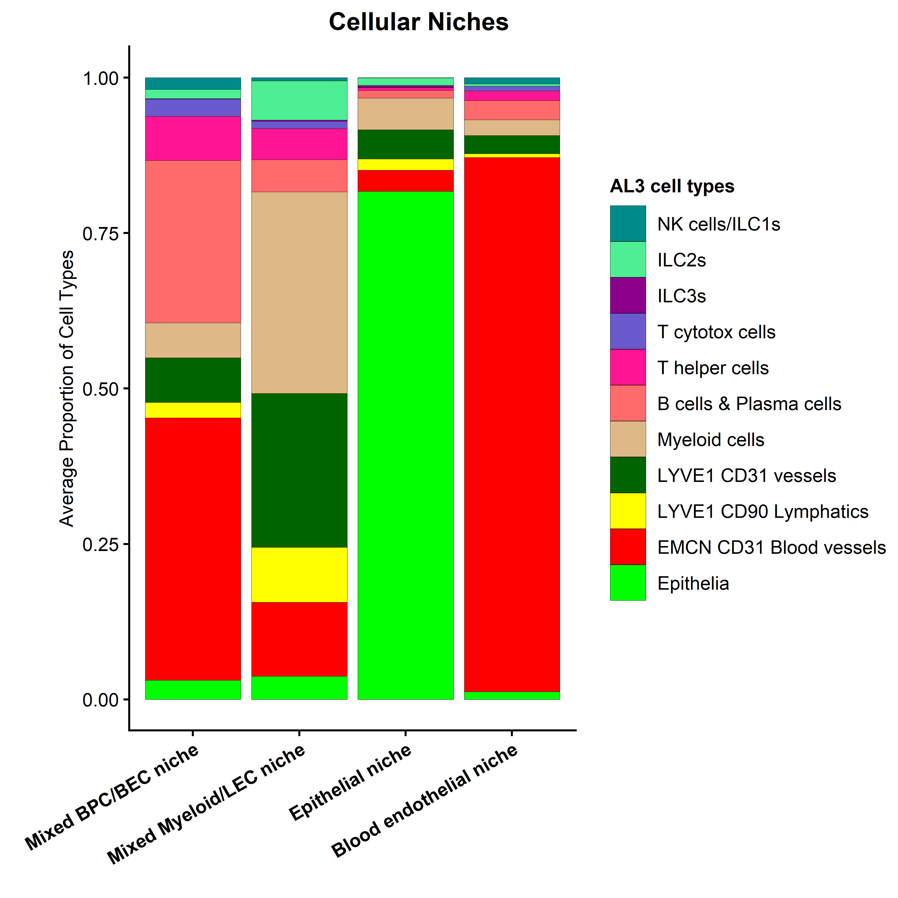


``` r
set.seed(8)

niche_composition <- df_all %>%
  group_by(Tissue_Niche, AL1) %>%
  summarise(Count = n(), .groups = "drop") %>%
  group_by(Tissue_Niche) %>%
  mutate(Fraction = Count / sum(Count))

table_plot_al1 <- ggtexttable(niche_composition, 
                          rows = NULL
                          )

plot_comp_al1 <- ggplot(niche_composition, aes(x = Tissue_Niche, y = Fraction, fill = AL1)) +
  geom_bar(stat = "identity", position = "stack", color = "black", 
           linewidth = 0.05) +
  scale_fill_manual(values = c("yellow", "aquamarine3", "deeppink")) +
  theme_classic() +
  labs(title = "AL1 - Cellular Microenvironments",
       x = "Identified Tissue Niches", 
       y = "Average Proportion of Cell Types", 
       fill = "AL1 cell types") +
  theme(
    axis.text.x = element_text(angle = 45, size = 9, face = "bold" , 
                                   hjust = 1),
    axis.title.x = element_blank(),
    axis.text.y = element_text(size = 9),
    axis.title.y = element_text(size = 9),
    legend.title = element_text(size = 9, face = "bold"),
    legend.text = element_text(size = 9),
    legend.position = "right", 
    plot.title = element_blank(), 
    plot.margin = margin(0, 0, 0, 0.6, "cm"))+
  guides(fill = guide_legend(ncol = 1))

print(plot_comp_al1)
```

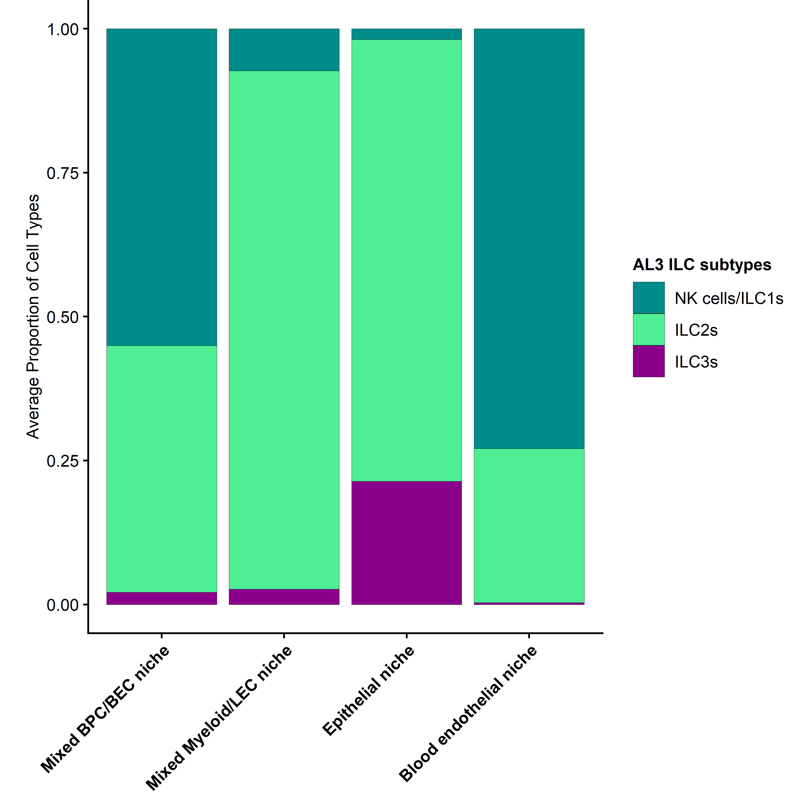


``` r
# ========================================================================
# PART 2: WHAT IS IN EACH NICHE? (Composition Profiling)
# ========================================================================
niche_composition <- df_all %>%
  filter(AL2 == "ILCs") %>%
  mutate(CellType = factor(CellType, levels = c(
    "NK cells/ILC1s",
    "ILC2s",
    "ILC3s",
    "T cytotox cells",
    "T helper cells",
    "B cells & Plasma cells",
    "Myeloid cells",
    "LYVE1 CD31 vessels",
    "LYVE1 CD90 Lymphatics",
    "EMCN CD31 Blood vessels",
    "Epithelia"
  ))) %>%
  group_by(Tissue_Niche, CellType) %>%
  summarise(Count = n(), .groups = "drop") %>%
  group_by(Tissue_Niche) %>%
  mutate(Fraction = Count / sum(Count))

table_plot_ilc <- ggtexttable(niche_composition, 
                          rows = NULL
                          )

plot_comp_ilc <- ggplot(niche_composition, 
                        aes(x = Tissue_Niche, y = Fraction, fill = CellType)) +
  geom_bar(stat = "identity", position = "stack", color = "black", 
           linewidth = 0.05) +
  scale_fill_manual(values = ColorsCellType) +
  theme_classic() +
  labs(title = "ILC subtypes across niches",
       x = "Identified Tissue Niches", 
       y = "Average Proportion of Cell Types", 
       # CHANGED legend title here
       fill = "AL3 ILC subtypes") + 
  theme(
    axis.text.x = element_text(angle = 30, face = "bold", size = 9 , 
                                   hjust = 1),
    axis.title.x = element_blank(),
    axis.text.y = element_text(size = 9),
    axis.title.y = element_text(size = 9),
    legend.title = element_text(size = 9, face = "bold"),
    legend.text = element_text(size = 9),
    plot.title = element_text(face = "bold", hjust = -0.25, size = 12), 
    plot.margin = margin(0.2, 0, 0.5, 1, "cm"))


print(plot_comp_ilc)
```

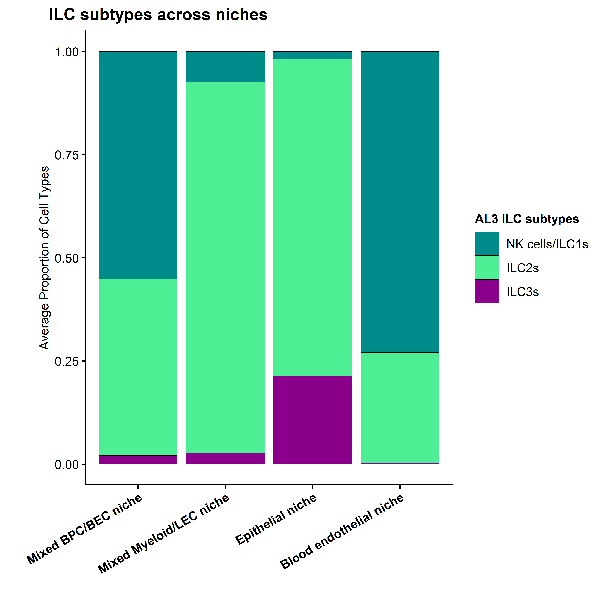


``` r
# ========================================================================
# PART 2: WHAT IS IN EACH NICHE? (Composition Profiling)
# ========================================================================

# AL3 ---------------------------------------------------------------------------
niche_composition_al3 <- df_all %>%
  mutate(CellType = factor(CellType, levels = c(
    "NK cells/ILC1s",
    "ILC2s",
    "ILC3s",
    "T cytotox cells",
    "T helper cells",
    "B cells & Plasma cells",
    "Myeloid cells",
    "LYVE1 CD31 vessels",
    "LYVE1 CD90 Lymphatics",
    "EMCN CD31 Blood vessels",
    "Epithelia"
  ))) %>%
  group_by(Tissue_Niche, CellType) %>%
  summarise(Count = n(), .groups = "drop") %>%
  group_by(Tissue_Niche) %>%
  # Calculate percentage and round to 1 decimal place
  mutate(`Percentage [%]` = round((Count / sum(Count)) * 100, 3)) %>%
  ungroup() %>%
  # Selecting columns to keep the table clean for the plot
  select(Tissue_Niche, CellType, `Percentage [%]`)

# Create the table plot
table_plot_al3 <- ggtexttable(niche_composition_al3, 
                              rows = NULL) # Optional: added a blue theme for readability
print(table_plot_al3)
```

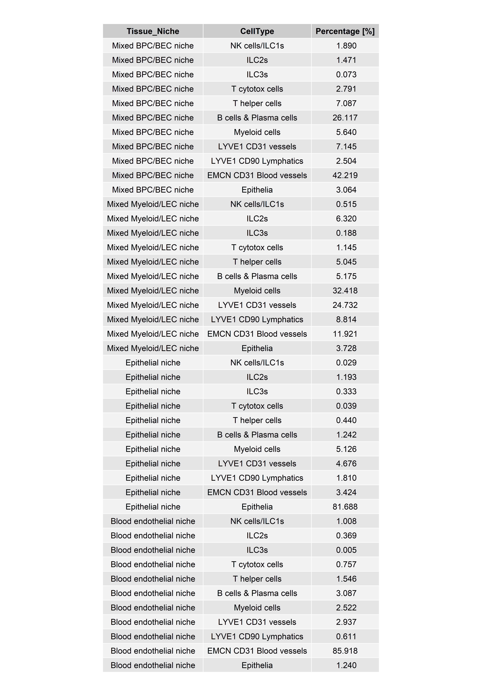

``` r
# AL1 ---------------------------------------------------------------------------
niche_composition_al1 <- df_all %>%
  group_by(Tissue_Niche, AL1) %>%
  summarise(Count = n(), .groups = "drop") %>%
  group_by(Tissue_Niche) %>%
  # Calculate percentage and round to 1 decimal place
  mutate(`Percentage [%]` = round((Count / sum(Count)) * 100, 1)) %>%
  ungroup() %>%
  # Selecting columns to keep the table clean for the plot
  select(Tissue_Niche, AL1, `Percentage [%]`)

# Create the table plot
table_plot_al1 <- ggtexttable(niche_composition_al1, 
                              rows = NULL) # Optional: added a blue theme for readability

print(table_plot_al1)
```


``` r
# AL3 ILCs ---------------------------------------------------------------------------
niche_composition_ilc <- df_all %>%
  filter(AL2 == "ILCs") %>%
  mutate(CellType = factor(CellType, levels = c(
    "NK cells/ILC1s",
    "ILC2s",
    "ILC3s",
    "T cytotox cells",
    "T helper cells",
    "B cells & Plasma cells",
    "Myeloid cells",
    "LYVE1 CD31 vessels",
    "LYVE1 CD90 Lymphatics",
    "EMCN CD31 Blood vessels",
    "Epithelia"
  ))) %>%
  group_by(Tissue_Niche, CellType) %>%
  summarise(Count = n(), .groups = "drop") %>%
  group_by(Tissue_Niche) %>%
  # Calculate percentage and round to 1 decimal place
  mutate(`Percentage [%]` = round((Count / sum(Count)) * 100, 1)) %>%
  ungroup() %>%
  # Selecting columns to keep the table clean for the plot
  select(Tissue_Niche, CellType, `Percentage [%]`)

# Create the table plot
table_plot_ilc <- ggtexttable(niche_composition_ilc, 
                              rows = NULL) # Optional: added a blue theme for readability

print(table_plot_ilc)
```


``` r
# --- 1. Calculate Niche Composition per FOV ---
fov_composition <- df_all %>%
  group_by(FullInfo, Condition, Tissue_Niche) %>%
  summarise(Count = n(), .groups = "drop") %>%
  group_by(FullInfo) %>%
  mutate(Fraction = Count / sum(Count)) %>%
  ungroup()

# Ensure the Condition order is preserved for the X-axis sorting
# This keeps CTRL, D1, D2, D3 grouped together in the bar plot
fov_composition <- fov_composition %>%
  arrange(factor(Condition, levels = c("CTRL", "D1", "D2", "D3")), FullInfo) %>%
  mutate(FullInfo = factor(FullInfo, levels = unique(FullInfo)))

# --- Optional: Facet by Condition ---
# If you have 35+ FOVs, it is often better to facet them so they are readable
lower_supp_plot <- ggplot(fov_composition, aes(x = FullInfo, y = Fraction, fill = Tissue_Niche)) +
  geom_bar(stat = "identity", position = "stack", color = "black", 
           linewidth = 0.01) +
  facet_grid(~Condition, scales = "free_x", space = "free_x") +
  ggtitle("Cellular niches across acquired tissue regions") +
  scale_fill_manual(values = niche_colors) +
  theme_classic() +
  scale_y_continuous(labels = scales::percent, expand = c(0, 0)) +
  theme_classic() +
  labs(title = "Niche Composition across Conditions",
       y = "Proportion of Niche Area", 
       fill = "Tissue Niche") +
  theme(
    # --- REMOVE THE BOX ON TOP ---
    strip.background = element_blank(),
    strip.text = element_text(size = 11),
    
    # Cleaning up the X-axis
    axis.text.x = element_blank(), 
    axis.ticks.x = element_blank(),
    axis.title.x = element_blank(),
    
    # General Aesthetics
    legend.title = element_text(size = 9, face = "bold"),
    legend.text = element_text(size = 9),
    axis.text.y = element_text(size = 9),
    axis.title.y = element_text(size = 10, face = "bold"),
    legend.position = "bottom",
    plot.title = element_text(face = "bold", size = 11, hjust = 0.5)
  )+
  guides(fill = guide_legend(ncol = 4))

lower_supp_plot
```

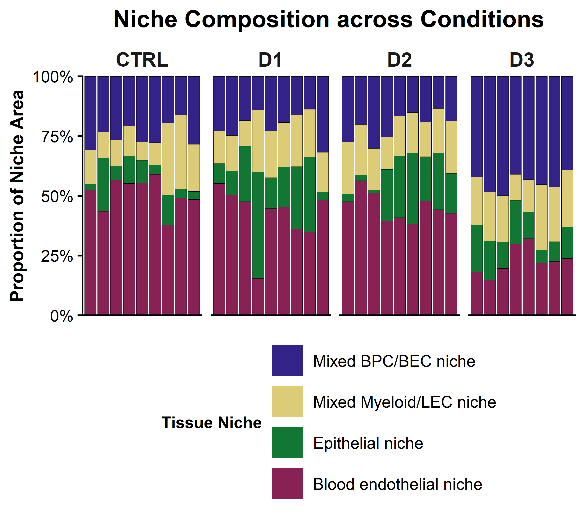

## Niche abundance


``` r
# ========================================================================
# PART 3: COMPARING CONDITIONS
# ========================================================================

# 1. Calculate the frequency of each niche per FOV
niche_abundance <- df_all %>%
  group_by(Filename, Condition, Tissue_Niche) %>%
  summarise(Cells_in_Niche = n(), .groups = "drop") %>%
  group_by(Filename) %>%
  mutate(Total_Cells = sum(Cells_in_Niche),
         Frequency = (Cells_in_Niche / Total_Cells) * 100) %>%
  ungroup()

# --- 1. SETTINGS & PREPARATION ---
# Ensure your Conditions are in the correct order for the x-axis
# Adjust levels to match your actual data (e.g., "CTRL", "D1", "D3")
target_conditions <- c("CTRL", "D1", "D2", "D3") 
niche_abundance$Condition <- factor(niche_abundance$Condition, levels = target_conditions)

all_niches <- unique(niche_abundance$Tissue_Niche)
niche_plot_list <- list()

# --- 2. LOOP THROUGH EACH NICHE ---
for (target_niche in all_niches) {
  
  # Step A: Filter data for this specific niche
  stats_df <- niche_abundance %>%
    filter(Tissue_Niche == target_niche)
  
  if (nrow(stats_df) == 0) next
  
  # Step B: Statistical Testing (Pairwise Wilcoxon)
  # This compares all conditions against each other
  stat.test <- tryCatch({
    stats_df %>%
      wilcox_test(Frequency ~ Condition) %>%
      add_significance() %>%
      add_xy_position(x = "Condition", step.increase = 0.1)
  }, error = function(e) NULL)
  
  # Step C: Calculate n labels (Number of FOVs per Condition)
  global_max <- max(stats_df$Frequency, na.rm = TRUE)
  
  n_df <- stats_df %>%
    group_by(Condition) %>%
    summarise(n = n(), .groups = "drop") %>%
    mutate(
      Label = paste0("n=", n),
      # Position labels at the very top of the plot
      Y_pos = global_max * 1.1 
    )
  
  # Step D: Build the Plot
  p <- ggplot(stats_df, aes(x = Condition, y = Frequency)) +
    geom_boxplot(outlier.colour = NA, alpha = 0.5, fill = "white") +
    geom_beeswarm(aes(color = Condition), size = 1.5, cex = 2) + 
    # Add n= labels
    # geom_text(data = n_df, aes(x = Condition, y = 95, label = Label), 
    #           size = 3, fontface = "italic", inherit.aes = FALSE) +
    ggtitle(target_niche) +
    # Expand Y-axis for significance brackets
    scale_y_continuous(expand = c(0, 0.5), limits = c(0,90))+
    theme_classic() + 
    theme(
      axis.text.x = element_text(angle = 30, size = 9, face = "bold" , 
                                     hjust = 1),
      axis.title.x = element_blank(),
      axis.text.y = element_text(size = 9),
      axis.title.y = element_text(size = 9),
      legend.title = element_text(size = 9, face = "bold"),
      legend.text = element_text(size = 9),
      plot.title = element_text(hjust = 0.5, size = 11, face = "bold"), 
      plot.margin = margin(0, 0.2, 0.3, 0.2, "cm"),
      legend.position = "none") +
    ylab("% of Total Cells per FOV") +
    scale_color_manual(values = cols_treat)

  # Step E: Add Stat Brackets
  if (!is.null(stat.test) && nrow(stat.test) > 0) {
    # Dynamically pick significance column
    sig_label <- ifelse("p.adj.signif" %in% colnames(stat.test), "p.adj.signif", "p.signif")
    
    p <- p + stat_pvalue_manual(stat.test, 
                                label = sig_label, 
                                hide.ns = TRUE, 
                                tip.length = 0.01,
                                step.increase = 0.05)
  }
  
  # Save to list
  niche_plot_list[[as.character(target_niche)]] <- p
}

# --- 3. COMBINE INTO GRID ---
if (length(niche_plot_list) > 0) {
  final_niche_grid <- wrap_plots(niche_plot_list, ncol = 4) +
    plot_annotation(
      title = "Cellular Niche Abundance across Conditions",
      theme = theme(
        plot.title = element_text(size = 12, face = "bold", hjust = 0.5)
        )
    )
  
  print(final_niche_grid)
}
```

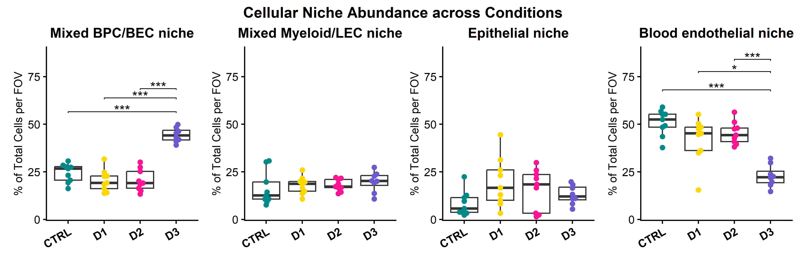


``` r
upper_fig <- ggarrange(plot_comp_al3, plot_comp_ilc, 
                       ncol = 2, nrow = 1, 
                       widths = c(4, 3) ,
                       labels = c("A", "B"))

upper_fig <- ggarrange(upper_fig, final_niche_grid, ncol = 1, nrow = 2,
          heights = c(6, 3) , labels = c("", "C"))

upper_fig
```

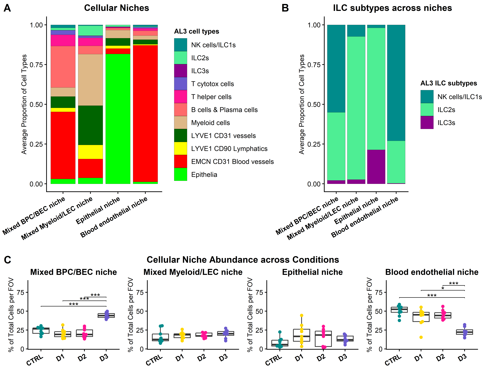

## Cellular composition across conditions


``` r
# Calculate the frequency of each CellType within each Tissue_Niche per FOV
niche_composition <- df_all %>%
  group_by(Filename, Condition, Tissue_Niche, CellType) %>%
  summarise(Cell_Count = n(), .groups = "drop") %>%
  # Ensure all cell types are represented in every niche/FOV, even if count is 0
  complete(nesting(Filename, Condition, Tissue_Niche), CellType, fill = list(Cell_Count = 0)) %>%
  group_by(Filename, Tissue_Niche) %>%
  mutate(
    Total_Niche_Cells = sum(Cell_Count),
    Frequency = (Cell_Count / Total_Niche_Cells) * 100
  ) %>%
  ungroup() %>%
  # Remove NaNs if a niche had 0 cells total in an FOV
  filter(!is.na(Frequency))

niche_composition$Condition <- factor(niche_composition$Condition, levels = c("CTRL", "D1", "D2", "D3"))


all_niches <- unique(niche_composition$Tissue_Niche)
all_cell_types <- unique(niche_composition$CellType)
niche_plots_all <- list()

for (current_niche in all_niches) {
  
  message("Processing Niche: ", current_niche)
  niche_plots <- list()
  
  # Filter data for the specific niche
  niche_data <- niche_composition %>% filter(Tissue_Niche == current_niche)
  
  for (current_cell in all_cell_types) {
    
    stats_df <- niche_data %>% filter(CellType == current_cell)
    
    # Skip if there's no data at all for this cell type in this niche
    if(nrow(stats_df) == 0 || sum(stats_df$Frequency) == 0) next
    
    # Statistical Testing (Pairwise)
    stat.test <- tryCatch({
      stats_df %>%
        wilcox_test(Frequency ~ Condition) %>%
        add_significance() %>%
        add_xy_position(x = "Condition")
    }, error = function(e) NULL)
    
    # Calculate Max for Labeling
    y_max <- max(stats_df$Frequency, na.rm = TRUE)
    
    # Build the individual plot
    p <- ggplot(stats_df, aes(x = Condition, y = Frequency)) +
      geom_boxplot(outlier.colour = NA, fill = "white", alpha = 0.5) +
      geom_beeswarm(aes(color = Condition), size = 1, cex = 1.5, alpha = 0.6) +
      ggtitle(gsub("LYVE1 CD90 |EMCN CD31 ", "", current_cell)) +
      scale_y_continuous(expand = expansion(mult = c(0.1, 0.4))) +
      scale_color_manual(values = cols_treat) +
      theme_classic() +
    theme(
      axis.text.x = element_text(angle = 30, size = 9, face = "bold" , 
                                     hjust = 1),
      axis.title.x = element_blank(),
      axis.text.y = element_text(size = 9),
      axis.title.y = element_text(size = 9),
      legend.title = element_text(size = 9, face = "bold"),
      legend.text = element_text(size = 9),
      plot.title = element_text(hjust = 0.5, size = 11), 
      plot.margin = margin(0.1, 0.4, 0.3, 0.4, "cm"),
      legend.position = "none") +
      NoLegend()
    
    # Add Stats
    if (!is.null(stat.test) && nrow(stat.test) > 0) {
      sig_col <- if("p.adj.signif" %in% colnames(stat.test)) "p.adj.signif" else "p.signif"
      p <- p + stat_pvalue_manual(stat.test, label = sig_col, hide.ns = TRUE, 
                                  tip.length = 0.01, step.increase = 0.1)
    }
    
    niche_plots[[current_cell]] <- p
    
    plot_name <- paste0(current_niche, "_", current_cell)
    niche_plots_all[[plot_name]] <- p
  }
  
  # Assemble the Grid for this Niche
  if (length(niche_plots) > 0) {
    combined_grid <- wrap_plots(niche_plots, ncol = 4) +
      plot_annotation(
        title = paste("Niche Composition:", gsub("LYVE1 CD90 ", "", current_niche)),
        subtitle = "Y-axis: % of total cells within this specific niche; Stats: Pairwise Wilcoxon",
        theme = theme(plot.title = element_text(size = 16, face = "bold", hjust = 0.5))
      )
    
    print(combined_grid)
  }
}
```

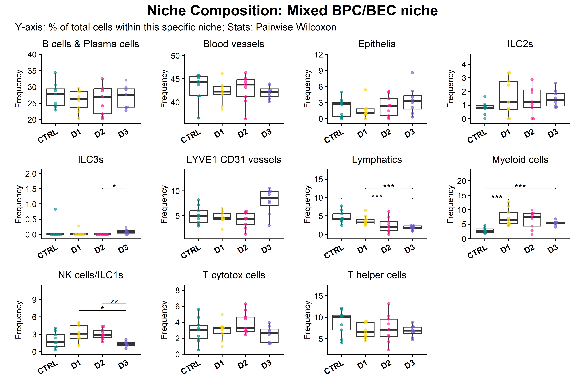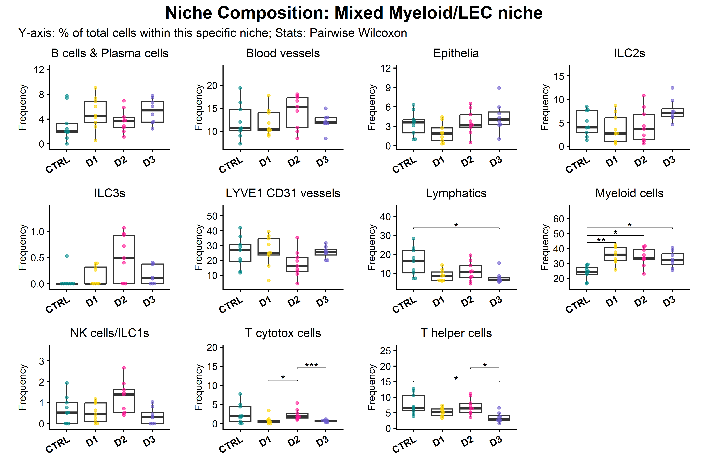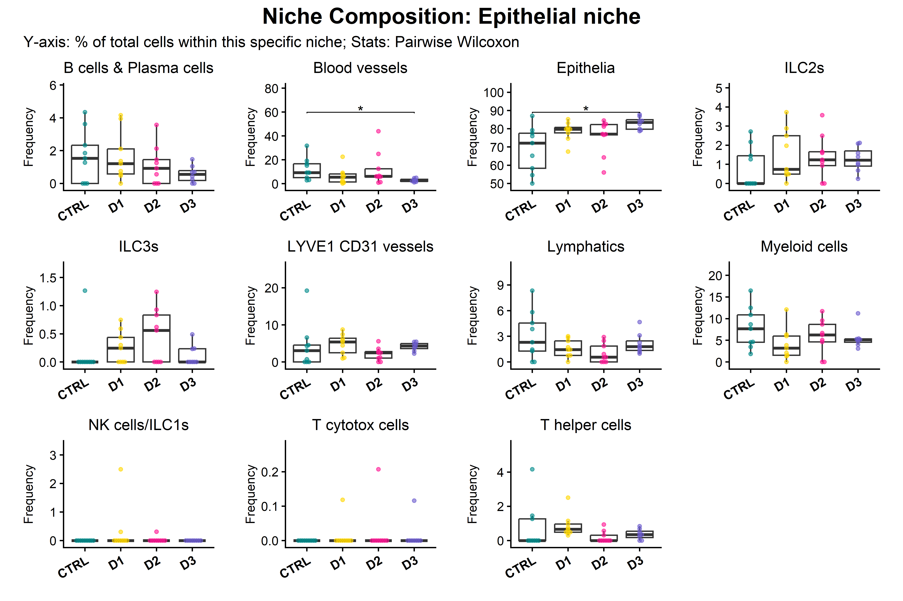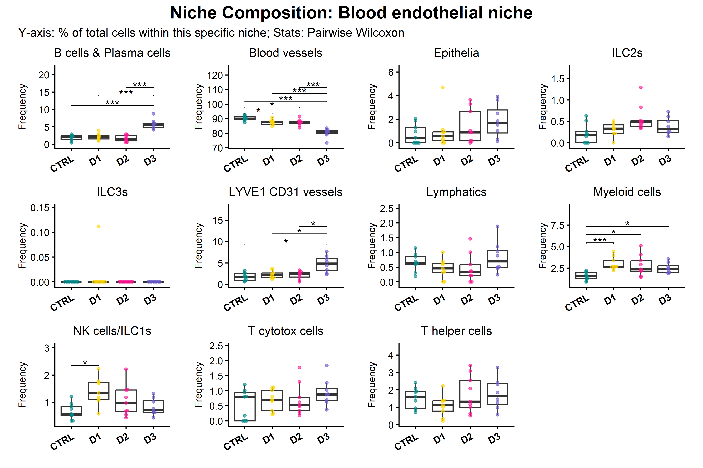


``` r
plot_bpcbec <- ggarrange(
  niche_plots_all[["Mixed BPC/BEC niche_NK cells/ILC1s"]],
  niche_plots_all[["Mixed BPC/BEC niche_ILC2s"]],
  niche_plots_all[["Mixed BPC/BEC niche_ILC3s"]],
  ncol = 1, nrow = 3)+
  theme(plot.margin = margin(0, 0.25, 0, 0.25, "cm"))

plot_bpcbec <- annotate_figure(
  plot_bpcbec, 
  top = text_grob("Mixed BPC/BEC niche\n", color = "black", 
                  face = "bold", size = 11, hjust = 0.5)
  )


plot_myly <- ggarrange(
  niche_plots_all[["Mixed Myeloid/LEC niche_NK cells/ILC1s"]],
  niche_plots_all[["Mixed Myeloid/LEC niche_ILC2s"]],
  niche_plots_all[["Mixed Myeloid/LEC niche_ILC3s"]],
  ncol = 1, nrow = 3)+
  theme(plot.margin = margin(0, 0.25, 0, 0.25, "cm"))

plot_myly <- annotate_figure(
  plot_myly, 
  top = text_grob("Mixed Myeloid/LEC niche\n", color = "black", 
                  face = "bold", size = 11, hjust = 0.5)
  )


plot_epi <- ggarrange(
  niche_plots_all[["Epithelial niche_NK cells/ILC1s"]],
  niche_plots_all[["Epithelial niche_ILC2s"]],
  niche_plots_all[["Epithelial niche_ILC3s"]],
  ncol = 1, nrow = 3)+
  theme(plot.margin = margin(0, 0.25, 0, 0.25, "cm"))

plot_epi <- annotate_figure(
  plot_epi, 
  top = text_grob("Epithelial niche\n", color = "black", 
                  face = "bold", size = 11, hjust = 0.5)
  )


plot_endo <- ggarrange(
  niche_plots_all[["Blood endothelial niche_NK cells/ILC1s"]],
  niche_plots_all[["Blood endothelial niche_ILC2s"]],
  niche_plots_all[["Blood endothelial niche_ILC3s"]],
  ncol = 1, nrow = 3)+
  theme(plot.margin = margin(0, 0.25, 0, 0.25, "cm"))

plot_endo <- annotate_figure(
  plot_endo, 
  top = text_grob("Blood endothelial niche\n", color = "black", 
                  face = "bold", size = 11, hjust = 0.5)
  )


plot_ilcs_niches <- ggarrange(
  plot_bpcbec, plot_myly, plot_epi, plot_endo, 
  ncol = 4, nrow = 1)

annotate_figure(
  plot_ilcs_niches, 
  top = text_grob("ILC composition across niches\n", color = "black", 
                  face = "bold", size = 12)
  )
```

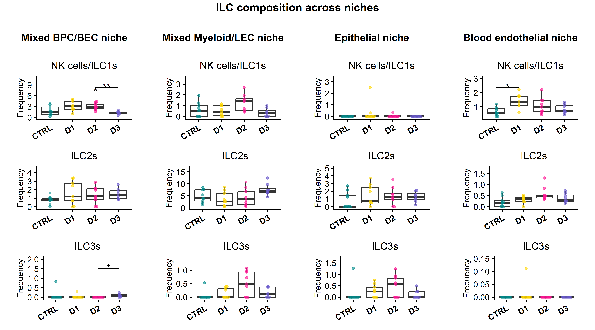


``` r
# 1. Define the lists based on your data
target_niches <- c("Mixed BPC/BEC niche", "Mixed Myeloid/LEC niche", 
                   "Epithelial niche", "Blood endothelial niche")

all_cell_types <- c("NK cells/ILC1s", "ILC2s", "ILC3s", "T helper cells", 
                    "T cytotox cells", "Myeloid cells", "B cells & Plasma cells", 
                    "LYVE1 CD31 vessels", "LYVE1 CD90 Lymphatics", 
                    "EMCN CD31 Blood vessels", "Epithelia")

# 2. Loop through each niche to create the columns
niche_columns <- list()

for (niche in target_niches) {
  
  # Collect all 11 plots for the current niche from your niche_plots_all list
  # We use mget or a loop to grab them safely
  current_niche_plots <- lapply(all_cell_types, function(cell) {
    plot_key <- paste0(niche, "_", cell)
    return(niche_plots_all[[plot_key]])
  })
  
  # Remove any NULLs in case a specific cell/niche combo didn't exist
  current_niche_plots <- current_niche_plots[!sapply(current_niche_plots, is.null)]
  
  # Arrange vertically (1 column, 11 rows)
  col_plot <- ggarrange(
    plotlist = current_niche_plots,
    ncol = 1, 
    nrow = length(current_niche_plots)
  ) +
  theme(plot.margin = margin(0, 0.5, 0, 0.5, "cm"))
  
  # Add the Niche title at the top of the column
  niche_columns[[niche]] <- annotate_figure(
    col_plot, 
    top = text_grob(paste0(niche, "\n"), color = "black", 
                    face = "bold", size = 11, hjust = 0.5)
  )
}

# 3. Final Assembly: Combine the 4 Niche Columns
plot_stru_niches_all <- ggarrange(
  plotlist = niche_columns, 
  ncol = 4, 
  nrow = 1
)

# 4. Add the Global Title
plot_cell_comp_niche <- annotate_figure(
  plot_stru_niches_all, 
  left = text_grob("______________________________________________________________________ Cellular composition across niches _______________________________________________________________________", 
                   color = "black", 
                   # face = "bold", 
                   size = 14, rot = 90)
)

plot_cell_comp_niche
```


### Total counts


``` r
# --- 1. Settings ---
# Ensure Condition is a factor in the correct order
niche_composition$Condition <- factor(niche_composition$Condition, 
                                      levels = c("CTRL", "D1", "D2", "D3"))

all_niches <- unique(niche_composition$Tissue_Niche)
all_cell_types <- unique(niche_composition$CellType)

# --- 2. Main Loop ---
for (current_niche in all_niches) {
  
  message("Processing Niche: ", current_niche)
  niche_plots_abundance <- list()
  
  # Filter data for the specific niche
  niche_data <- niche_composition %>% filter(Tissue_Niche == current_niche)
  
  for (current_cell in all_cell_types) {
    
    stats_df <- niche_data %>% filter(CellType == current_cell)
    
    # Skip if there's no data for this cell type in this niche
    if(nrow(stats_df) == 0 || sum(stats_df$Cell_Count) == 0) next
    
    # --- Statistical Testing (Wilcoxon vs CTRL) ---
    stat.test <- tryCatch({
      stats_df %>%
        wilcox_test(Cell_Count ~ Condition, ref.group = "CTRL") %>%
        add_significance() %>%
        add_xy_position(x = "Condition")
    }, error = function(e) NULL)
    
    # --- Build the Plot with Requested Aesthetics ---
    p <- ggplot(stats_df, aes(x = Condition, y = Cell_Count)) +
      geom_boxplot(outlier.colour = NA, fill = "white", alpha = 0.5) +
      geom_beeswarm(aes(color = Condition), size = 1, cex = 1.5, alpha = 0.6) +
      # Title logic with the requested gsub pattern
      ggtitle(gsub("LYVE1 CD90 |EMCN CD31 ", "", current_cell)) +
      scale_y_continuous(expand = expansion(mult = c(0.1, 0.4))) +
      scale_color_manual(values = cols_treat) +
      theme_classic() +
      theme(
        axis.text.x = element_text(angle = 30, size = 9, face = "bold", hjust = 1),
        axis.title.x = element_blank(),
        axis.text.y = element_text(size = 9),
        axis.title.y = element_text(size = 9),
        legend.title = element_text(size = 9, face = "bold"),
        legend.text = element_text(size = 9),
        plot.title = element_text(hjust = 0.5, size = 11), 
        plot.margin = margin(0.1, 0.4, 0.3, 0.4, "cm"),
        legend.position = "none"
      ) +
      ylab("Cell Count")

    # --- Add Significance Brackets ---
    if (!is.null(stat.test) && nrow(stat.test) > 0) {
      sig_col <- if("p.adj.signif" %in% colnames(stat.test)) "p.adj.signif" else "p.signif"
      p <- p + stat_pvalue_manual(
        stat.test, 
        label = sig_col, 
        hide.ns = TRUE, 
        tip.length = 0.01, 
        step.increase = 0.1,
        size = 3.5
      )
    }
    
    niche_plots_abundance[[current_cell]] <- p
  }
  
  # --- 3. Assemble and Print the Grid for this Niche ---
  if (length(niche_plots) > 0) {
    combined_grid_abundance <- wrap_plots(niche_plots_abundance, ncol = 4) +
      plot_annotation(
        title = paste("Niche Cell Counts:", current_niche),
        subtitle = "Stats: Wilcoxon test vs CTRL",
        theme = theme(
          plot.title = element_text(size = 14, face = "bold", hjust = 0.5),
          plot.subtitle = element_text(size = 10, hjust = 0.5)
        )
      )
    
    print(combined_grid_abundance)
  }
}
```

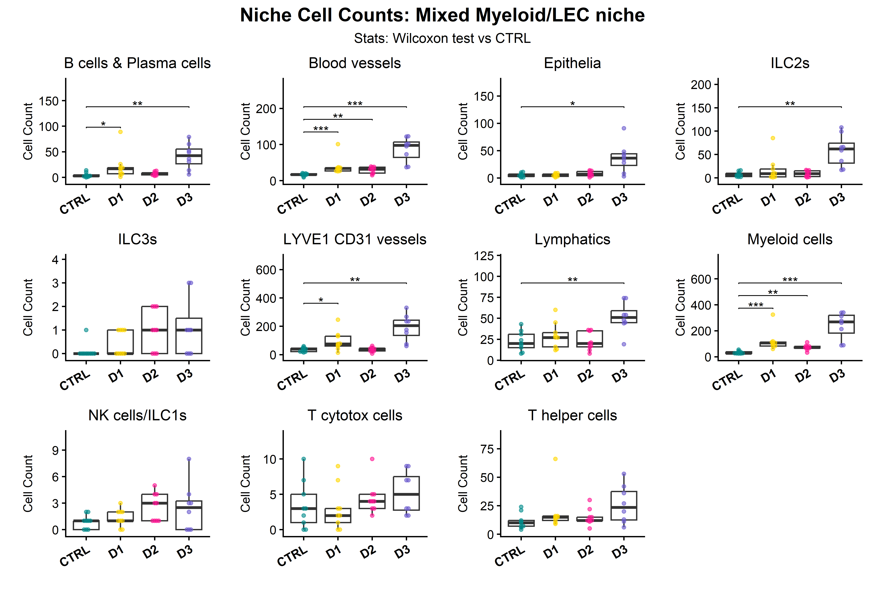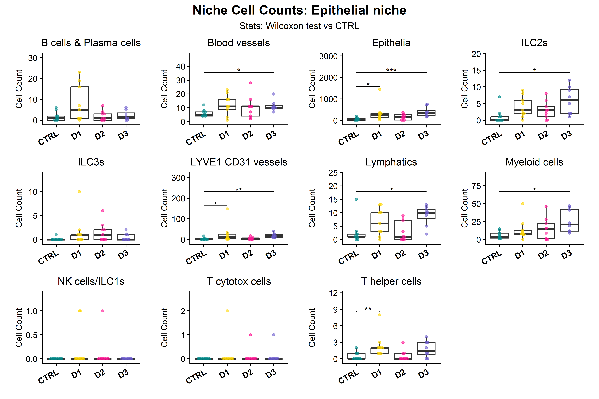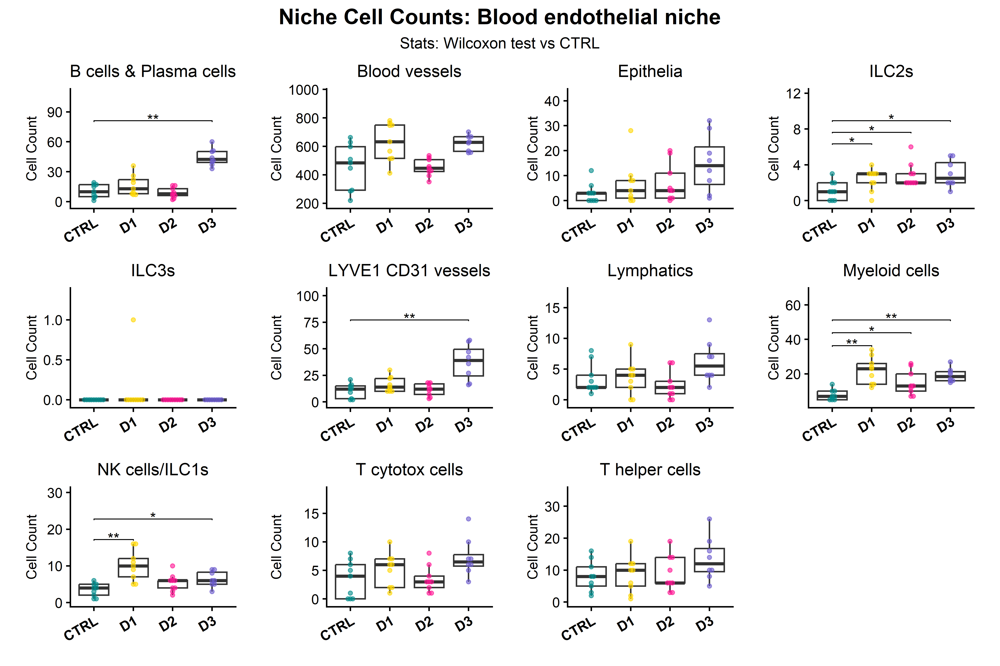

## Counts and frequencies per niche

### ILC2s


``` r
library(dplyr)
library(ggplot2)
library(ggbeeswarm)
library(rstatix)
library(patchwork)

# --- 1. Filter and Prepare Data ---
ilc2_niche_comp <- niche_composition %>%
  filter(CellType == "ILC2s") %>%
  mutate(Condition = factor(Condition, levels = c("CTRL", "D1", "D2", "D3")))

niche_colors_spec <- c(
  "Mixed BPC/BEC niche" = "#332288", 
  "Mixed Myeloid/LEC niche" = "#DDCC77", 
  "Epithelial niche" = "#117733", 
  "Blood endothelial niche" = "#882255"
)

# --- 2. Statistical Testing (Global calculation) ---
stat.test_all <- ilc2_niche_comp %>%
  group_by(Condition) %>%
  dunn_test(Cell_Count ~ Tissue_Niche) %>%
  adjust_pvalue(method = "bonferroni") %>%
  add_significance() %>%
  add_xy_position(x = "Tissue_Niche")

# --- 3. Loop to Create 4 Individual Plots ---
condition_list <- c("CTRL", "D1", "D2", "D3")
individual_plots <- list()

for (cond in condition_list) {
  
  # Filter data and stats for the specific condition
  plot_data <- ilc2_niche_comp %>% filter(Condition == cond)
  plot_stats <- stat.test_all %>% filter(Condition == cond)
  
  p <- ggplot(plot_data, aes(x = Tissue_Niche, y = Cell_Count)) +
    geom_boxplot(outlier.colour = NA, fill = "white", alpha = 0.5) +
    geom_beeswarm(aes(color = Tissue_Niche), size = 1.2, cex = 1.5, alpha = 0.6) +
    
    # Aesthetics and Limits
    ylim(0, 150) +
    scale_color_manual(values = niche_colors_spec) +
    ggtitle(cond) + # Set condition as individual plot title
    theme_classic() +
    theme(
      axis.text.x = element_text(angle = 30, size = 9, face = "bold", hjust = 1),
      axis.title.x = element_blank(),
      axis.text.y = element_text(size = 9),
      axis.title.y = element_text(size = 9),
      plot.title = element_text(hjust = 0.5, size = 11), 
      plot.margin = margin(0.1, 0.2, 0.3, 0.2, "cm"),
      legend.position = "none"
    ) +
    ylab(if(cond == "CTRL") "ILC2 Cell Count" else "") # Only label first Y-axis
    
  # Add Stats for this specific plot
  if (nrow(plot_stats) > 0) {
    p <- p + stat_pvalue_manual(
      plot_stats, 
      label = "p.adj.signif", 
      hide.ns = TRUE, 
      y.position = 110, # Adjusted slightly for clarity below ylim 150
      tip.length = 0.01, 
      step.increase = 0.15,
      size = 3.5
    )
  }
  
  individual_plots[[cond]] <- p
}

# --- 4. Assemble Individual Plots Side-by-Side ---
# This "glues" the 4 independent plots together
final_niche_comparison_ilc2s <- wrap_plots(individual_plots, ncol = 4) +
  plot_annotation(
    title = "Total count ILC2s across Tissue Niches",
    theme = theme(plot.title = element_text(size = 12, face = "bold", hjust = 0.5),
                  plot.margin = margin(0.5, 0, 0, 1.2, "cm")))

print(final_niche_comparison_ilc2s)
```


### NK cells/ILC1s


``` r
# --- 1. Filter and Prepare Data (NK cells/ILC1s) ---
target_cell <- "NK cells/ILC1s"

nk_ilc1_niche_comp <- niche_composition %>%
  filter(CellType == target_cell) %>%
  mutate(Condition = factor(Condition, levels = c("CTRL", "D1", "D2", "D3")))

niche_colors_spec <- c(
  "Mixed BPC/BEC niche" = "#332288", 
  "Mixed Myeloid/LEC niche" = "#DDCC77", 
  "Epithelial niche" = "#117733", 
  "Blood endothelial niche" = "#882255"
)

# --- 2. Statistical Testing (Comparing Niches within each Condition) ---
stat.test_nk <- nk_ilc1_niche_comp %>%
  group_by(Condition) %>%
  dunn_test(Cell_Count ~ Tissue_Niche) %>%
  adjust_pvalue(method = "bonferroni") %>%
  add_significance() %>%
  add_xy_position(x = "Tissue_Niche")

# --- 3. Loop to Create 4 Individual Plots ---
condition_list <- c("CTRL", "D1", "D2", "D3")
nk_plots <- list()

for (cond in condition_list) {
  
  plot_data <- nk_ilc1_niche_comp %>% filter(Condition == cond)
  plot_stats <- stat.test_nk %>% filter(Condition == cond)
  
  p <- ggplot(plot_data, aes(x = Tissue_Niche, y = Cell_Count)) +
    geom_boxplot(outlier.colour = NA, fill = "white", alpha = 0.5) +
    geom_beeswarm(aes(color = Tissue_Niche), size = 1.2, cex = 1.5, alpha = 0.6) +
    
    # Aesthetics and Limits (Keep 150 as baseline or adjust to your data)
    ylim(0, 70) +
    scale_color_manual(values = niche_colors_spec) +
    ggtitle(cond) +
    theme_classic() +
    theme(
      axis.text.x = element_text(angle = 30, size = 9, face = "bold", hjust = 1),
      axis.title.x = element_blank(),
      axis.text.y = element_text(size = 9),
      axis.title.y = element_text(size = 9),
      plot.title = element_text(hjust = 0.5, size = 11), 
      plot.margin = margin(0.1, 0.2, 0.3, 0.2, "cm"),
      legend.position = "none"
    ) +
    ylab(if(cond == "CTRL") paste(target_cell, "Cell Count") else "")
    
  if (nrow(plot_stats) > 0) {
    p <- p + stat_pvalue_manual(
      plot_stats, 
      label = "p.adj.signif", 
      hide.ns = TRUE, 
      y.position = 50, 
      tip.length = 0.01, 
      step.increase = 0.15,
      size = 3.5
    )
  }
  nk_plots[[cond]] <- p
}

# --- 4. Assemble ---
final_niche_comparison_nkilc1 <- wrap_plots(nk_plots, ncol = 4) +
  plot_annotation(
    title = paste("Total count", target_cell, "across Tissue Niches"),
    theme = theme(plot.title = element_text(size = 12, face = "bold", hjust = 0.5),
                  plot.margin = margin(0.5, 0, 0, 1.2, "cm")))

final_niche_comparison_nkilc1
```

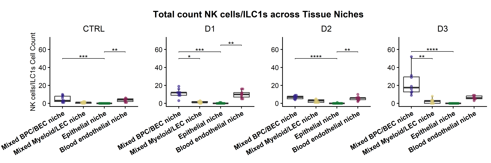

### ILC3s


``` r
# --- 1. Filter and Prepare Data (ILC3s) ---
target_cell <- "ILC3s"

ilc3_niche_comp <- niche_composition %>%
  filter(CellType == target_cell) %>%
  mutate(Condition = factor(Condition, levels = c("CTRL", "D1", "D2", "D3")))

# --- 2. Statistical Testing ---
stat.test_ilc3 <- ilc3_niche_comp %>%
  group_by(Condition) %>%
  dunn_test(Cell_Count ~ Tissue_Niche) %>%
  adjust_pvalue(method = "bonferroni") %>%
  add_significance() %>%
  add_xy_position(x = "Tissue_Niche")

# --- 3. Loop to Create 4 Individual Plots ---
ilc3_plots <- list()

for (cond in condition_list) {
  
  plot_data <- ilc3_niche_comp %>% filter(Condition == cond)
  plot_stats <- stat.test_ilc3 %>% filter(Condition == cond)
  
  p <- ggplot(plot_data, aes(x = Tissue_Niche, y = Cell_Count)) +
    geom_boxplot(outlier.colour = NA, fill = "white", alpha = 0.5) +
    geom_beeswarm(aes(color = Tissue_Niche), size = 1.2, cex = 1.5, alpha = 0.6) +
    
    # Aesthetics and Limits
    ylim(0, 10) + 
    scale_color_manual(values = niche_colors_spec) +
    ggtitle(cond) +
    theme_classic() +
    theme(
      axis.text.x = element_text(angle = 30, size = 9, face = "bold", hjust = 1),
      axis.title.x = element_blank(),
      axis.text.y = element_text(size = 9),
      axis.title.y = element_text(size = 9),
      plot.title = element_text(hjust = 0.5, size = 11), 
      plot.margin = margin(0.1, 0.2, 0.3, 0.2, "cm"),
      legend.position = "none"
    ) +
    ylab(if(cond == "CTRL") paste(target_cell, "Cell Count") else "")
    
  if (nrow(plot_stats) > 0) {
    p <- p + stat_pvalue_manual(
      plot_stats, 
      label = "p.adj.signif", 
      hide.ns = TRUE, 
      y.position = 5, 
      tip.length = 0.01, 
      step.increase = 0.08,
      size = 3.5
    )
  }
  ilc3_plots[[cond]] <- p
}

# --- 4. Assemble ---
final_niche_comparison_ilc3s <- wrap_plots(ilc3_plots, ncol = 4) +
  plot_annotation(
    title = paste("Total count", target_cell, "across Tissue Niches"),
    theme = theme(plot.title = element_text(size = 12, face = "bold", hjust = 0.5),
                  plot.margin = margin(0.5, 0, 0, 1.2, "cm")))

final_niche_comparison_ilc3s
```

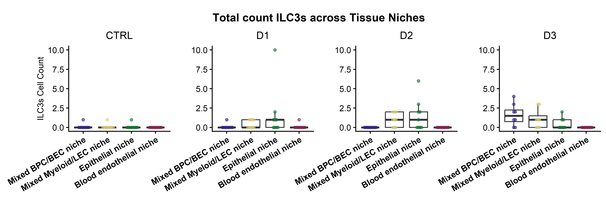

### ILC2 frequency


``` r
library(dplyr)
library(ggplot2)
library(ggbeeswarm)
library(rstatix)
library(patchwork)

# --- 1. Filter and Prepare Data ---
ilc2_freq_comp <- niche_composition %>%
  filter(CellType == "ILC2s") %>%
  mutate(Condition = factor(Condition, levels = c("CTRL", "D1", "D2", "D3")))

niche_colors_spec <- c(
  "Mixed BPC/BEC niche" = "#332288", 
  "Mixed Myeloid/LEC niche" = "#DDCC77", 
  "Epithelial niche" = "#117733", 
  "Blood endothelial niche" = "#882255"
)

# --- 2. Statistical Testing (Comparing Frequency between Niches) ---
stat.test_freq <- ilc2_freq_comp %>%
  group_by(Condition) %>%
  dunn_test(Frequency ~ Tissue_Niche) %>%
  adjust_pvalue(method = "bonferroni") %>%
  add_significance() %>%
  add_xy_position(x = "Tissue_Niche")

# --- 3. Loop to Create 4 Individual Plots ---
condition_list <- c("CTRL", "D1", "D2", "D3")
individual_plots <- list()

for (cond in condition_list) {
  
  # Filter data and stats for the specific condition
  plot_data <- ilc2_freq_comp %>% filter(Condition == cond)
  plot_stats <- stat.test_freq %>% filter(Condition == cond)
  
  p <- ggplot(plot_data, aes(x = Tissue_Niche, y = Frequency)) +
    geom_boxplot(outlier.colour = NA, fill = "white", alpha = 0.5) +
    geom_beeswarm(aes(color = Tissue_Niche), size = 1.2, cex = 1.5, alpha = 0.6) +
    
    # Aesthetics and Limits (Adjusted for Percentage)
    ylim(0, 15) + 
    scale_color_manual(values = niche_colors_spec) +
    ggtitle(cond) + 
    theme_classic() +
    theme(
      axis.text.x = element_text(angle = 30, size = 9, face = "bold", hjust = 1),
      axis.title.x = element_blank(),
      axis.text.y = element_text(size = 9),
      axis.title.y = element_text(size = 9),
      plot.title = element_text(hjust = 0.5, size = 11), 
      plot.margin = margin(0.1, 0.2, 0.3, 0.2, "cm"),
      legend.position = "none"
    ) +
    ylab(if(cond == "CTRL") "ILC2 Frequency [%]" else "") 
    
  # Add Stats for this specific plot
  if (nrow(plot_stats) > 0) {
    p <- p + stat_pvalue_manual(
      plot_stats, 
      label = "p.adj.signif", 
      hide.ns = TRUE, 
      y.position = 13, 
      tip.length = 0.01, 
      step.increase = 0.15,
      size = 3.5
    )
  }
  
  individual_plots[[cond]] <- p
}

# --- 4. Assemble Individual Plots Side-by-Side ---
final_niche_freq_comparison <- wrap_plots(individual_plots, ncol = 4) +
  plot_annotation(
    title = "Frequency of ILC2s across Tissue Niches",
    theme = theme(plot.title = element_text(size = 11, face = "bold", hjust = 0.5),
                  plot.margin = margin(0.5, 0, 0, 1.2, "cm")))

print(final_niche_freq_comparison)
```

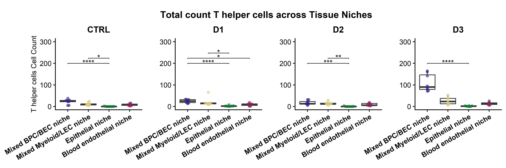

### NK cells/ILC1s frequency


``` r
library(dplyr)
library(ggplot2)
library(ggbeeswarm)
library(rstatix)
library(patchwork)

# --- 1. Filter and Prepare Data ---
target_cell <- "NK cells/ILC1s"

nk_freq_comp <- niche_composition %>%
  filter(CellType == target_cell) %>%
  mutate(Condition = factor(Condition, levels = c("CTRL", "D1", "D2", "D3")))

niche_colors_spec <- c(
  "Mixed BPC/BEC niche" = "#332288", 
  "Mixed Myeloid/LEC niche" = "#DDCC77", 
  "Epithelial niche" = "#117733", 
  "Blood endothelial niche" = "#882255"
)

# --- 2. Statistical Testing ---
stat.test_nk <- nk_freq_comp %>%
  group_by(Condition) %>%
  dunn_test(Frequency ~ Tissue_Niche) %>%
  adjust_pvalue(method = "bonferroni") %>%
  add_significance() %>%
  add_xy_position(x = "Tissue_Niche")

# --- 3. Loop to Create 4 Individual Plots ---
condition_list <- c("CTRL", "D1", "D2", "D3")
individual_plots <- list()

for (cond in condition_list) {
  
  plot_data <- nk_freq_comp %>% filter(Condition == cond)
  plot_stats <- stat.test_nk %>% filter(Condition == cond)
  
  p <- ggplot(plot_data, aes(x = Tissue_Niche, y = Frequency)) +
    geom_boxplot(outlier.colour = NA, fill = "white", alpha = 0.5) +
    geom_beeswarm(aes(color = Tissue_Niche), size = 1.2, cex = 1.5, alpha = 0.6) +
    
    ylim(0, 8) + 
    scale_color_manual(values = niche_colors_spec) +
    ggtitle(cond) + 
    theme_classic() +
    theme(
      axis.text.x = element_text(angle = 30, size = 9, face = "bold", hjust = 1),
      axis.title.x = element_blank(),
      axis.text.y = element_text(size = 9),
      axis.title.y = element_text(size = 9),
      plot.title = element_text(hjust = 0.5, size = 11, face = "bold"), 
      plot.margin = margin(0.1, 0.2, 0.3, 0.2, "cm"),
      legend.position = "none"
    ) +
    ylab(if(cond == "CTRL") paste(target_cell, "Frequency [%]") else "") 
    
  if (nrow(plot_stats) > 0) {
    p <- p + stat_pvalue_manual(
      plot_stats, 
      label = "p.adj.signif", 
      hide.ns = TRUE, 
      y.position = 6, 
      tip.length = 0.01, 
      step.increase = 0.2,
      size = 3.5
    )
  }
  
  individual_plots[[cond]] <- p
}

# --- 4. Assemble ---
final_niche_nk_comp <- wrap_plots(individual_plots, ncol = 4) +
  plot_annotation(
    title = paste("Frequency of", target_cell, "across Tissue Niches"),
    theme = theme(plot.title = element_text(size = 12, face = "bold", hjust = 0.5),
                  plot.margin = margin(0.5, 0, 0, 1.2, "cm")))

print(final_niche_nk_comp)
```

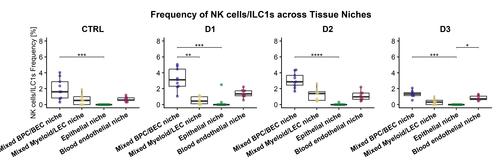

### ILC3s frequency


``` r
# --- 1. Filter and Prepare Data ---
target_cell <- "ILC3s"

ilc3_freq_comp <- niche_composition %>%
  filter(CellType == target_cell) %>%
  mutate(Condition = factor(Condition, levels = c("CTRL", "D1", "D2", "D3")))

# --- 2. Statistical Testing ---
stat.test_ilc3 <- ilc3_freq_comp %>%
  group_by(Condition) %>%
  dunn_test(Frequency ~ Tissue_Niche) %>%
  adjust_pvalue(method = "bonferroni") %>%
  add_significance() %>%
  add_xy_position(x = "Tissue_Niche")

# --- 3. Loop to Create 4 Individual Plots ---
individual_plots <- list()

for (cond in condition_list) {
  
  plot_data <- ilc3_freq_comp %>% filter(Condition == cond)
  plot_stats <- stat.test_ilc3 %>% filter(Condition == cond)
  
  p <- ggplot(plot_data, aes(x = Tissue_Niche, y = Frequency)) +
    geom_boxplot(outlier.colour = NA, fill = "white", alpha = 0.5) +
    geom_beeswarm(aes(color = Tissue_Niche), size = 1.2, cex = 1.5, alpha = 0.6) +
    
    ylim(0, 2) + 
    scale_color_manual(values = niche_colors_spec) +
    ggtitle(cond) + 
    theme_classic() +
    theme(
      axis.text.x = element_text(angle = 30, size = 9, face = "bold", hjust = 1),
      axis.title.x = element_blank(),
      axis.text.y = element_text(size = 9),
      axis.title.y = element_text(size = 9),
      plot.title = element_text(hjust = 0.5, size = 11, face = "bold"), 
      plot.margin = margin(0.1, 0.2, 0.3, 0.2, "cm"),
      legend.position = "none"
    ) +
    ylab(if(cond == "CTRL") paste(target_cell, "Frequency [%]") else "") 
    
  if (nrow(plot_stats) > 0) {
    p <- p + stat_pvalue_manual(
      plot_stats, 
      label = "p.adj.signif", 
      hide.ns = TRUE, 
      y.position = 1, 
      tip.length = 0.01, 
      step.increase = 0.08,
      size = 3.5
    )
  }
  
  individual_plots[[cond]] <- p
}

# --- 4. Assemble ---
final_niche_ilc3_comp <- wrap_plots(individual_plots, ncol = 4) +
  plot_annotation(
    title = paste("Frequency of", target_cell, "across Tissue Niches"),
    theme = theme(plot.title = element_text(size = 12, face = "bold", hjust = 0.5),
                  plot.margin = margin(0.5, 0, 0, 1.2, "cm")))

print(final_niche_ilc3_comp)
```

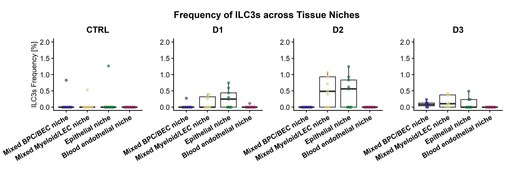

All ILC subtypes


``` r
# --- 1. Filter Data for ILC Subsets ---
# The niche_composition table already has Frequency per FOV (Filename)
target_ilcs <- c("NK cells/ILC1s", "ILC2s", "ILC3s")

ilc_plot_data <- niche_composition %>%
  filter(CellType %in% target_ilcs)

niche_colors_spec <- c(
  "Mixed BPC/BEC niche" = "#332288", 
  "Mixed Myeloid/LEC niche" = "#DDCC77", 
  "Epithelial niche" = "#117733", 
  "Blood endothelial niche" = "#882255"
)

# --- 2. Create the Plots in a Loop ---
ilc_summary_plots <- list()

for (cell in target_ilcs) {
  
  # Filter for the current cell type
  plot_df <- ilc_plot_data %>% filter(CellType == cell)
  
  # Statistical Testing: Compare Frequency between different Tissue_Niches
  # (Pooled across all Conditions/Filenames)
  stat.test <- plot_df %>%
    dunn_test(Frequency ~ Tissue_Niche) %>%
    adjust_pvalue(method = "bonferroni") %>%
    add_significance() %>%
    add_xy_position(x = "Tissue_Niche")
  
  # Build the Plot
  p <- ggplot(plot_df, aes(x = Tissue_Niche, y = Frequency)) +
    geom_boxplot(outlier.colour = NA, fill = "white", alpha = 0.5) +
    # Each point represents one acquired area (Filename)
    geom_beeswarm(aes(color = Tissue_Niche), size = 1.2, cex = 0.9, alpha = 0.5) +
    
    # Dynamics and Aesthetics
    scale_y_continuous(expand = expansion(mult = c(0.05, 0.4))) + 
    scale_color_manual(values = niche_colors_spec) +
    ggtitle(cell) + 
    theme_classic() +
    theme(
      axis.text.x = element_text(angle = 45, size = 9, face = "bold", hjust = 1),
      axis.title.x = element_blank(),
      axis.text.y = element_text(size = 9),
      axis.title.y = element_text(size = 9),
      plot.title = element_text(hjust = 0.5, size = 11), 
      plot.margin = margin(0.1, 0.4, 0.3, 0.4, "cm"),
      legend.position = "none"
    ) +
    ylab("Frequency [%]")
    
  # Add Stats
  if (nrow(stat.test) > 0) {
    p <- p + stat_pvalue_manual(
      stat.test, 
      label = "p.adj.signif", 
      hide.ns = TRUE, 
      tip.length = 0.01, 
      step.increase = 0.1, 
      size = 3.5
    )
  }
  
  ilc_summary_plots[[cell]] <- p
}

# --- 3. Assemble and Print ---
final_ilc_niche_comparison <- wrap_plots(ilc_summary_plots, ncol = 3) +
  plot_annotation(
    title = "ILC Frequency across Tissue Niches",
    theme = theme(
      plot.title = element_text(size = 12, face = "bold", hjust = 0.5),
      plot.margin = margin(0, 0, 0, 1, "cm"),
      plot.subtitle = element_text(size = 10, hjust = 0.5)
    )
  )

print(final_ilc_niche_comparison)
```


## Spatial distribution of identified niches


``` r
library(ggplot2)
library(dplyr)
library(patchwork)

# ========================================================================
# PART 4: SPATIAL MAPPING (36 Plot Grid Assembly)
# ========================================================================

# 1. Define the Niche colors (Matches your specific clusters)
niche_colors <- c(
  "Epithelial niche" = "#117733", 
  "Mixed Myeloid/LEC niche" = "#DDCC77", 
  "Blood endothelial niche" = "#882255", 
  "Mixed BPC/BEC niche" = "#332288"
)

# 2. Grab and Sort exactly 35 FOVs by Condition
example_fovs_raw <- unique(df_all$Filename)[1:35] 

fov_order_df <- df_all %>%
  dplyr::filter(Filename %in% example_fovs_raw) %>%
  dplyr::select(Filename, Condition) %>%
  dplyr::distinct() %>%
  dplyr::arrange(factor(Condition, levels = c("CTRL", "D1", "D2", "D3")), Filename)

example_fovs <- fov_order_df$Filename
spatial_niche_plots <- list()

# 3. LOOP: Generate individual FOV maps
for(fov in example_fovs) {
  plot_data <- df_all %>% filter(Filename == fov)
  cond_label <- unique(plot_data$Condition)
  plot_title <- fov
  
  p <- ggplot(plot_data, aes(x = Loc_X, y = Loc_Y, color = Tissue_Niche)) +
    geom_point(size = 1, alpha = 0.5, shape = 19) + # Smaller points for high-density grid
    scale_color_manual(values = niche_colors) +
    scale_y_reverse() + # Standard spatial orientation
    coord_fixed() +
    theme_void() +
    theme(
      panel.background = element_rect(fill = "black", color = NA),
      plot.background = element_rect(fill = "black", color = NA),
      plot.title = element_text(color = "white", hjust = 0.5, face = "bold", size = 7),
      legend.position = "none"
    ) +
    labs(title = plot_title)
  
  spatial_niche_plots[[fov]] <- p
}

# 4. THE LEGEND PLOT (The 36th Plot)
n_niches <- length(niche_colors)
text_legend_df <- data.frame(
  Niche = names(niche_colors),
  Y_pos = seq(n_niches, 1),
  X_pos = rep(0, n_niches)
)

legend_plot <- ggplot(text_legend_df, aes(x = X_pos, y = Y_pos)) +
  geom_point(aes(color = Niche), size = 5, shape = 15) + 
  geom_text(aes(label = Niche), color = "white", hjust = 0, nudge_x = 0.1, size = 4, fontface = "bold") +
  scale_color_manual(values = niche_colors) +
  xlim(-0.1, 1.5) + 
  ylim(0, n_niches + 1) +
  theme_void() +
  theme(
    panel.background = element_rect(fill = "black", color = NA),
    plot.background = element_rect(fill = "black", color = NA),
    legend.position = "none"
  )

# 5. ASSEMBLE THE 6x6 GRID
# Combine the 35 FOV plots + 1 legend plot
final_plot_list <- c(spatial_niche_plots, list(legend = legend_plot))

niche_map_grid <- wrap_plots(final_plot_list, ncol = 9) +
  plot_annotation(
    title = "Spatial Niche Atlas: Tissue Organization across Timepoints",
    theme = theme(
      plot.background = element_rect(fill = "black", color = NA),
      plot.title = element_text(color = "white", size = 20, face = "bold", hjust = 0.5),
      plot.subtitle = element_text(color = "gray70", size = 14, hjust = 0.5),
      plot.margin = margin(1, 1, 1, 1)
    )
  )

# Render the atlas
print(niche_map_grid)
```


``` r
library(ggplot2)
library(dplyr)
library(patchwork)

# ========================================================================
# PART 4: SPATIAL MAPPING (3x3 CTRL vs 3x3 D3)
# ========================================================================

# 2. Function to generate a list of 9 plots for a specific condition
get_niche_plots <- function(data, target_condition, n_fovs = 9) {
  fovs <- data %>%
    filter(Condition == target_condition) %>%
    pull(Filename) %>%
    unique() %>%
    head(n_fovs)
  
  plot_list <- list()
  
  for(fov in fovs) {
    plot_data <- data %>% filter(Filename == fov)
    
    p <- ggplot(plot_data, aes(x = Loc_X, y = Loc_Y, color = Tissue_Niche)) +
      geom_point(size = 0.5, alpha = 0.6, shape = 19) + 
      scale_color_manual(values = niche_colors) +
      scale_y_reverse() + 
      coord_fixed() +
      theme_void() +
      theme(
        panel.background = element_rect(fill = "black", color = NA),
        plot.background = element_rect(fill = "black", color = NA),
        plot.title = element_text(color = "white", hjust = 0.5, size = 7),
        legend.position = "none"
      ) +
      labs(title = fov)
    
    plot_list[[fov]] <- p
  }
  return(plot_list)
}

# 3. Generate the plot lists
ctrl_plots <- get_niche_plots(df_all, "CTRL")
d3_plots   <- get_niche_plots(df_all, "D3")

# 4. Create the Legend Plot (HORIZONTAL 1 ROW, 4 COLUMNS)
# We spread the X coordinates out (1, 4, 7, 10) to give the text labels room
legend_df <- data.frame(
  Niche = names(niche_colors),
  Y = 1,
  X = c(1, 4, 7, 10) 
)

legend_plot <- ggplot(legend_df, aes(X, Y)) +
  geom_point(aes(color = Niche), size = 6, shape = 15) + 
  geom_text(aes(label = Niche), 
            color = "white", 
            hjust = 0, 
            nudge_x = 0.3, 
            size = 9/.pt, # Matches theme size 12pt
            fontface = "bold") +
  scale_color_manual(values = niche_colors) +
  # Expand limits so the last text label isn't cut off
  xlim(0.5, 13) + 
  theme_void() +
  theme(
    plot.background = element_rect(fill = "black", color = NA), 
    legend.position = "none",
    plot.margin = margin(t = 1, b = 1)
  )


# ========================================================================
# PART 4: SPATIAL MAPPING (Fixed Nested Titles)
# ========================================================================

# [Niche colors and get_niche_plots function remain the same as your code]

# 5. Assemble the Grids using wrap_elements to protect nested titles
grid_ctrl <- wrap_elements(full = (
  wrap_plots(ctrl_plots, ncol = 3) + 
    plot_annotation(
      title = "________________________  CTRL  ________________________",
      theme = theme(
        plot.background = element_rect(fill = "black", color = NA),
        plot.title = element_text(color = "white", size = 10, hjust = 0.5, margin = margin(b = 1))
      )
    ) & theme(plot.background = element_rect(fill = "black", color = NA))
))

grid_d3 <- wrap_elements(full = (
  wrap_plots(d3_plots, ncol = 3) + 
    plot_annotation(
      title = "______________________  IL-33 day 3  ______________________",
      theme = theme(
        plot.background = element_rect(fill = "black", color = NA),
        plot.title = element_text(color = "white", size = 10, hjust = 0.5, margin = margin(b = 1))
      )
    ) & theme(plot.background = element_rect(fill = "black", color = NA))
))

# 6. Assemble the Final Atlas
# The heights c(10, 1) usually works better to keep the legend readable
final_atlas <- (grid_ctrl | grid_d3) / legend_plot + 
  plot_layout(heights = c(10, 0.2)) +
  plot_annotation(
    # title = "Spatial distribution of tissue niches",
    theme = theme(
      plot.background = element_rect(fill = "black", color = NA),
      # plot.title = element_text(color = "white", size = 12, face = "bold", hjust = 0.5, margin = margin(t = 1, b = 1))
      plot.title = element_blank()
    )
  ) & theme(plot.background = element_rect(fill = "black", color = NA))

print(final_atlas)
```


## Proliferation


``` r
library(dplyr)
library(ggplot2)
library(ggbeeswarm)
library(rstatix)
library(patchwork)
library(ggpubr)

# --- 1. DATA PREPARATION ---
# Filter for target cells and calculate Mean Ki67 per FOV
ki67_df <- df_all %>%
  filter(CellType %in% c("NK cells/ILC1s", "ILC2s", "ILC3s")) %>%
  group_by(Filename, Condition, CellType) %>%
  summarise(Mean_Ki67 = mean(Ki67, na.rm = TRUE), .groups = "drop")

# Ensure Condition order
ki67_df$Condition <- factor(ki67_df$Condition, levels = c("CTRL", "D1", "D2", "D3"))

# --- 2. STATISTICAL TESTING ---
# Pairwise comparisons between conditions for each cell type
stat.test <- ki67_df %>%
  group_by(CellType) %>%
  wilcox_test(Mean_Ki67 ~ Condition) %>%
  add_significance() %>%
  add_xy_position(x = "Condition", dodge = 0.8)

# --- 3. PLOTTING LOOP ---
ki67_plots <- list()
target_cells <- c("NK cells/ILC1s", "ILC2s", "ILC3s")

for (ct in target_cells) {
  
  # Filter data for specific cell type
  stats_df <- ki67_df %>% filter(CellType == ct)
  
  # Filter stats for specific cell type
  curr_stat <- stat.test %>% filter(CellType == ct)
  
  # Detect correct p-value label
  sig_label <- if("p.adj.signif" %in% colnames(curr_stat)) "p.adj.signif" else "p.signif"
  
  # Build Plot
  p <- ggplot(stats_df, aes(x = Condition, y = Mean_Ki67)) +
    geom_boxplot(outlier.colour = NA, fill = "white", alpha = 0.5) +
    geom_beeswarm(aes(color = Condition), size = 1.5, cex = 2, alpha = 0.7) +
    
    # Add stats
    stat_pvalue_manual(curr_stat, 
                       label = sig_label, 
                       hide.ns = TRUE, 
                       step.increase = 0.1, 
                       size = 4) +
    
    # Aesthetic settings
    scale_y_continuous(expand = expansion(mult = c(0.1, 0.4))) +
    scale_color_manual(values = cols_treat) +
    ggtitle(ct) +
    theme_classic() +
    theme(
      axis.text.x = element_text(angle = 45, size = 9, face = "bold", hjust = 1),
      axis.title.x = element_blank(),
      axis.text.y = element_text(size = 9),
      axis.title.y = element_text(size = 9),
      plot.title = element_text(hjust = 0.5, size = 11, face = "bold"), 
      plot.margin = margin(0.2, 0.2, 0.3, 0.2, "cm"),
      legend.position = "none"
    ) +
    ylab("Mean Ki67 Intensity per FOV")

  ki67_plots[[ct]] <- p
}

# --- 4. ASSEMBLE ---
final_ki67_plot <- wrap_plots(ki67_plots, ncol = 3) +
  plot_annotation(
    title = "Ki67 Expression Proliferation Analysis",
    subtitle = "Points represent mean intensity per FOV; Wilcoxon pairwise test",
    theme = theme(plot.title = element_text(size = 12, face = "bold", hjust = 0.5),
                  plot.subtitle = element_text(hjust = 0.5))
  )

print(final_ki67_plot)
```

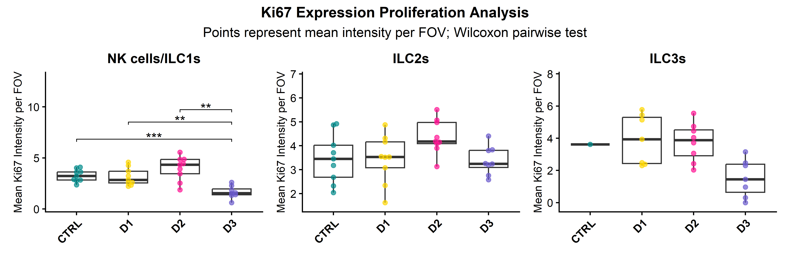


``` r
library(dplyr)
library(tidyr)
library(ggplot2)
library(ggbeeswarm)
library(rstatix)
library(patchwork)
library(ggpubr)

# --- 1. SETTINGS & PARAMETERS ---
target_markers <- c("Ki67", "GATA3eGFP", "EOMES", "TBET", "MHCII", "KLRG1", "ICOS")
target_cells   <- c("NK cells/ILC1s", "ILC2s", "ILC3s", "T helper cells", "T cytotox cells")

# --- 2. DATA AGGREGATION ---
# Calculate mean intensity for each marker per cell type per niche per FOV
niche_marker_data <- df_all %>%
  filter(CellType %in% target_cells) %>%
  group_by(Filename, Condition, Tissue_Niche, CellType) %>%
  summarise(across(all_of(target_markers), \(x) mean(x, na.rm = TRUE)), .groups = "drop") %>%
  # Pivot markers to long format for easier looping
  pivot_longer(cols = all_of(target_markers), names_to = "Marker", values_to = "Intensity")

niche_marker_data$Condition <- factor(niche_marker_data$Condition, levels = c("CTRL", "D1", "D2", "D3"))
all_niches <- unique(niche_marker_data$Tissue_Niche)

# --- 3. PLOTTING LOOP ---
for (current_niche in all_niches) {
  
  message("Processing Niche: ", current_niche)
  
  # Filter for the current niche
  niche_sub <- niche_marker_data %>% filter(Tissue_Niche == current_niche)
  
  # This list will hold plots in the order: Row 1 (all cells), Row 2 (all cells), etc.
  grid_plots <- list()
  
  for (marker in target_markers) {
    for (cell in target_cells) {
      
      # Subset data for this specific panel
      stats_df <- niche_sub %>% filter(Marker == marker, CellType == cell)
      
      # Check if we have enough data to plot
      if(nrow(stats_df) < 2 || all(is.na(stats_df$Intensity))) {
        # Create an empty placeholder plot to maintain grid alignment
        p <- ggplot() + theme_void() 
      } else {
        
        # Statistical Testing (Pairwise Wilcoxon)
        stat.test <- tryCatch({
          stats_df %>%
            wilcox_test(Intensity ~ Condition) %>%
            add_significance() %>%
            add_xy_position(x = "Condition")
        }, error = function(e) NULL)
        
        # Build Panel
        p <- ggplot(stats_df, aes(x = Condition, y = Intensity)) +
          geom_boxplot(outlier.colour = NA, fill = "white", alpha = 0.5) +
          geom_beeswarm(aes(color = Condition), size = 0.8, cex = 1.2, alpha = 0.6) +
          scale_y_continuous(expand = expansion(mult = c(0.1, 0.4))) +
          scale_color_manual(values = cols_treat) +
          # Title logic: Only show CellType on top row and Marker on left column (optional)
          # Here we keep both for clarity in large grids
          labs(title = marker, subtitle = cell, 
               y = "Mean Intensity") +
          theme_classic() +
          theme(
            axis.text.x = element_text(angle = 45, size = 7, face = "bold", hjust = 1),
            axis.title.x = element_blank(),
            axis.text.y = element_text(size = 7),
            axis.title.y = element_text(size = 7),
            plot.title = element_text(hjust = 0.5, size = 10, face = "bold"), 
            plot.subtitle = element_text(hjust = 0.5, size = 8),
            plot.margin = margin(2, 2, 2, 2, "pt"),
            legend.position = "none"
          )
        
        # Add Stats
        if (!is.null(stat.test) && nrow(stat.test) > 0) {
          sig_col <- if("p.adj.signif" %in% colnames(stat.test)) "p.adj.signif" else "p.signif"
          p <- p + stat_pvalue_manual(stat.test, label = sig_col, hide.ns = TRUE, 
                                      tip.length = 0.01, step.increase = 0.1, size = 2.5)
        }
      }
      grid_plots[[paste(marker, cell)]] <- p
    }
  }
  
  # --- 4. ASSEMBLE NICHE GRID ---
  # ncol = number of cell types (columns)
  if (length(grid_plots) > 0) {
    combined_grid <- wrap_plots(grid_plots, ncol = length(target_cells)) +
      plot_annotation(
        title = paste("Niche Protein Profile:", current_niche),
        subtitle = "Rows: Markers | Columns: Cell Types | Stats: Wilcoxon vs CTRL",
        theme = theme(
          plot.title = element_text(size = 12, face = "bold", hjust = 0.5),
          plot.subtitle = element_text(size = 11, hjust = 0.5)
        )
      )
    
    # Recommend saving as a large PDF or printing
    # {r fig.height=12, fig.width=15}
    print(combined_grid)
  }
}
```


# Visualization for figures

## Figure 6


``` r
ggarrange(upper_fig, "NONE", final_atlas, ncol = 1, nrow = 3, heights = c(5.4, 0.1, 3.6), 
          labels = c("", "", "D"), label.y = 1.06)
```

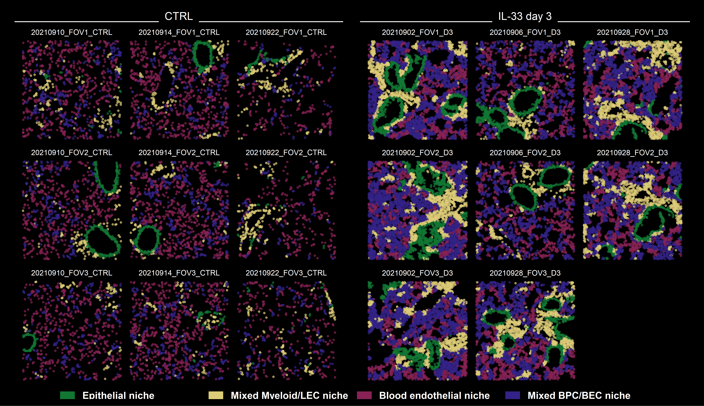

## Supplementary figures


``` r
final_ilc2_niche_comparison <- wrap_plots(ilc_summary_plots[["ILC2s"]], ncol = 1) +
  plot_annotation(
    theme = theme(
      plot.title = element_text(size = 12, face = "bold", hjust = 0.5),
      plot.margin = margin(0, 0, 0, 1, "cm"),
      plot.subtitle = element_text(size = 10, hjust = 0.5)
    )
  )


sup_upper <- ggarrange(plot_comp_al1, "NONE", final_ilc2_niche_comparison, ncol = 3, nrow = 1, labels = c("A", "", "B"), widths = c(6, 0.4, 4))

ggarrange(sup_upper, "NONE", lower_supp_plot, final_niche_freq_comparison,
          nrow = 4, ncol = 1, 
          heights = c(4, 0.5, 5, 3),
          labels = c("","", "C", "D"))
```

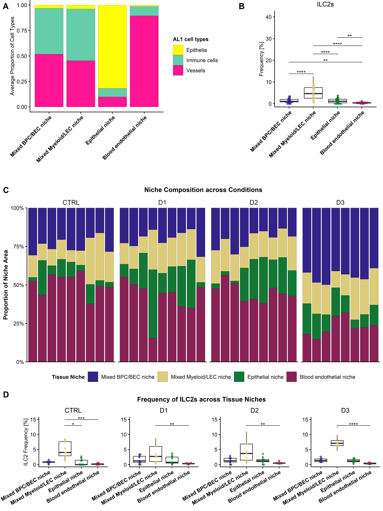


``` r
# --- 1. Calculate CellType Proportions per Niche per FOV ---
cell_comp_per_niche <- df_all %>%
  mutate(CellType = factor(CellType, levels = c(
        "NK cells/ILC1s",
    "ILC2s",
    "ILC3s",
    "T cytotox cells",
    "T helper cells",
    "B cells & Plasma cells",
    "Myeloid cells",
    "LYVE1 CD31 vessels",
    "LYVE1 CD90 Lymphatics",
    "EMCN CD31 Blood vessels",
    "Epithelia"
  ))) %>%
  # Group by FOV, its Condition, the Niche, and the CellType
  group_by(FullInfo, Condition, Tissue_Niche, CellType) %>%
  summarise(Count = n(), .groups = "drop") %>%
  # Now group by FOV and Niche to calculate the internal percentage
  group_by(FullInfo, Tissue_Niche) %>%
  mutate(Fraction = Count / sum(Count)) %>%
  ungroup()

# 2. Ensure ordering for the X-axis (Grouping by Condition)
cell_comp_per_niche <- cell_comp_per_niche %>%
  arrange(factor(Condition, levels = c("CTRL", "D1", "D2", "D3")), FullInfo) %>%
  mutate(FullInfo = factor(FullInfo, levels = unique(FullInfo)))

# --- 3. Create the Multi-Faceted Stacked Bar Plot ---
ggplot(cell_comp_per_niche, aes(x = FullInfo, y = Fraction, fill = CellType)) +
  geom_bar(stat = "identity", position = "stack", color = "black", 
           linewidth = 0.05) +
  # Rows = Niches, Columns = Conditions
  facet_grid(Tissue_Niche ~ Condition, scales = "free_x", space = "fixed", 
             switch = "y") +
  scale_fill_manual(values = ColorsCellType) +
  scale_y_continuous(labels = scales::percent, expand = c(0, 0)) +
  theme_classic() +
  labs(
    # title = "Cell Type Composition per Tissue Niche",
    # subtitle = "Each bar represents one FOV partitioned by cell type percentages",
       y = "Cell Type Proportion (%)", 
       x = "FOVs",
       fill = "AL3 cell types") +
  theme(
    # --- Clean up Facet Labels (No Boxes) ---
    strip.background = element_blank(),
    strip.text.x = element_text(face = "bold", size = 12),
    strip.text.y = element_text(face = "bold", size = 10, angle = 0), # Horizontal niche labels
    
    # Cleaning up the X-axis (FOVs)
    axis.text.x = element_blank(), 
    axis.ticks.x = element_blank(),

    # General Aesthetics
    axis.text.y = element_text(size = 9),
    axis.title.y = element_text(size = 11, face = "bold"),
    axis.title.x = element_text(size = 11, face = "bold"),
    legend.position = "bottom",
    legend.title = element_text(size = 10, face = "bold"),
    legend.text = element_text(size = 10),
    plot.title = element_text(face = "bold", hjust = 0.5, size = 14),
    plot.subtitle = element_text(hjust = 0.5, size = 10, color = "gray30"),
    panel.spacing.y = unit(1, "lines") # Add a bit of space between niche rows
  )
```


``` r
# 1. Define the lists based on your data
target_niches <- c("Mixed BPC/BEC niche", "Mixed Myeloid/LEC niche", 
                   "Epithelial niche", "Blood endothelial niche")

all_cell_types <- c("NK cells/ILC1s", "ILC2s", "ILC3s", "T helper cells", 
                    "T cytotox cells", "Myeloid cells", "B cells & Plasma cells", 
                    "LYVE1 CD31 vessels", "LYVE1 CD90 Lymphatics", 
                    "EMCN CD31 Blood vessels", "Epithelia")

# 2. Loop through each niche to create the columns
niche_columns <- list()

for (niche in target_niches) {
  
  # Collect all 11 plots for the current niche from your niche_plots_all list
  current_niche_plots <- lapply(all_cell_types, function(cell) {
    plot_key <- paste0(niche, "_", cell)
    p <- niche_plots_all[[plot_key]]
    
    # Skip if plot doesn't exist
    if(is.null(p)) return(NULL)
    
    # --- HIGHLIGHTING LOGIC ---
    
    # 1. Mixed Myeloid/LEC niche (darkorange1)
    if (niche == "Mixed Myeloid/LEC niche" && 
        cell %in% c("LYVE1 CD90 Lymphatics", "Myeloid cells")) {
      p <- p + theme(plot.background = element_rect(color = "darkorange1", linewidth = 1.5))
    }
    
    # 2. Blood endothelial niche (yellowgreen)
    if (niche == "Blood endothelial niche" && 
        cell %in% c("LYVE1 CD31 vessels", "Myeloid cells")) {
      p <- p + theme(plot.background = element_rect(color = "yellowgreen", linewidth = 1.5))
    }
    
    # 3. Blood endothelial niche (purple4) 
    # (Assuming "Endothelial niche" refers to "Blood endothelial niche")
    if (niche == "Blood endothelial niche" && 
        cell %in% c("B cells & Plasma cells", "EMCN CD31 Blood vessels")) {
      p <- p + theme(plot.background = element_rect(color = "purple4", linewidth = 1.5))
    }
    
    return(p)
  })
  
  # Remove any NULLs in case a specific cell/niche combo didn't exist
  current_niche_plots <- current_niche_plots[!sapply(current_niche_plots, is.null)]
  
  # Arrange vertically (1 column, 11 rows)
  col_plot <- ggarrange(
    plotlist = current_niche_plots,
    ncol = 1, 
    nrow = length(current_niche_plots)
  ) +
  theme(plot.margin = margin(0, 0.5, 0, 0.5, "cm"))
  
  # Add the Niche title at the top of the column
  niche_columns[[niche]] <- annotate_figure(
    col_plot, 
    top = text_grob(paste0(niche, "\n"), color = "black", 
                    face = "bold", size = 11, hjust = 0.5)
  )
}

# 3. Final Assembly: Combine the 4 Niche Columns
plot_stru_niches_all <- ggarrange(
  plotlist = niche_columns, 
  ncol = 4, 
  nrow = 1
)

# 4. Add the Global Title
annotate_figure(
  plot_stru_niches_all, 
  left = text_grob("______________________________________________________________________ Cellular composition across niches and conditions _______________________________________________________________________", 
                   color = "black", 
                   # face = "bold", 
                   size = 12, rot = 90)
)
```

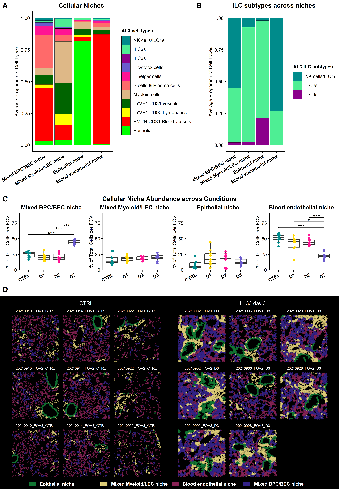


``` r
plot_myly <- ggarrange(
  niche_plots_all[["Mixed Myeloid/LEC niche_Myeloid cells"]],
  niche_plots_all[["Mixed Myeloid/LEC niche_LYVE1 CD90 Lymphatics"]],
  ncol = 1, nrow = 3)+
  theme(plot.margin = margin(0, 0.25, 0, 0, "cm"))

plot_myly <- annotate_figure(
  plot_myly, 
  left = text_grob("Mixed Myeloid/LEC niche", color = "black", 
                  face = "bold", size = 11, hjust = 0.5, rot = 90))+
  theme(plot.margin = margin(0, 0.25, 0, 0, "cm"))


plot_endo <- ggarrange(
  niche_plots_all[["Blood endothelial niche_B cells & Plasma cells"]],
  niche_plots_all[["Blood endothelial niche_Myeloid cells"]],
  niche_plots_all[["Blood endothelial niche_LYVE1 CD31 vessels"]],
  niche_plots_all[["Blood endothelial niche_EMCN CD31 Blood vessels"]],
  niche_plots_all[["Blood endothelial niche_NK cells/ILC1s"]],
  ncol = 2, nrow = 3)+
  theme(plot.margin = margin(0, 0.25, 0, 0, "cm"))

plot_endo <- annotate_figure(
  plot_endo, 
  left = text_grob("Blood endothelial niche", color = "black", 
                  face = "bold", size = 11, hjust = 0.5, rot = 90))+
  theme(plot.margin = margin(0, 0.25, 0, 0, "cm"))


plot_bpc <- ggarrange(
  niche_plots_all[["Mixed BPC/BEC niche_Myeloid cells"]],
  niche_plots_all[["Mixed BPC/BEC niche_EMCN CD31 Blood vessels"]],
  niche_plots_all[["Mixed BPC/BEC niche_NK cells/ILC1s"]],
  ncol = 1, nrow = 3)+
  theme(plot.margin = margin(0, 0.25, 0, 0, "cm"))

plot_bpc <- annotate_figure(
  plot_bpc, 
  left = text_grob("Mixed BPC/BEC niche", color = "black", 
                  face = "bold", size = 11, hjust = 0.5, rot = 90))+
  theme(plot.margin = margin(0, 0.25, 0, 0, "cm"))


ggarrange(
  plot_endo, plot_myly, plot_bpc, 
  ncol = 3, nrow = 1, 
  widths = c(2, 1, 1), 
  labels = "AUTO")
```

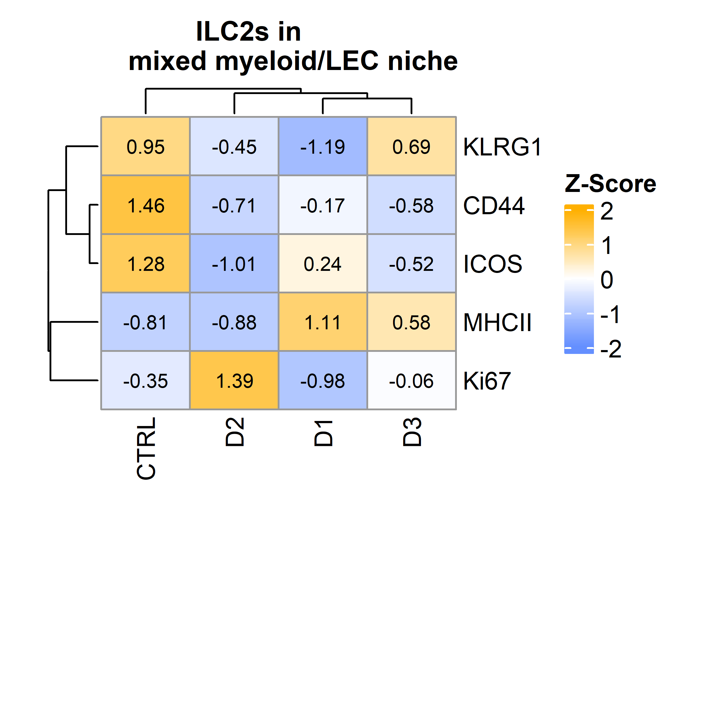


``` r
ggarrange(final_niche_comparison_ilc2s, 
          final_niche_comparison_nkilc1, 
          final_niche_comparison_ilc3s, nrow = 3, ncol = 1, labels = "AUTO")
```

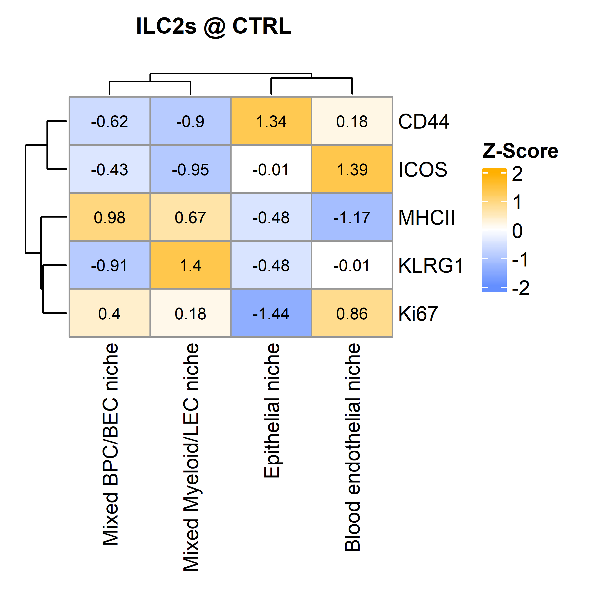

``` r
ggarrange(final_niche_freq_comparison, 
          final_niche_nk_comp, 
          final_niche_ilc3_comp, nrow = 3, ncol = 1, labels = "AUTO")
```

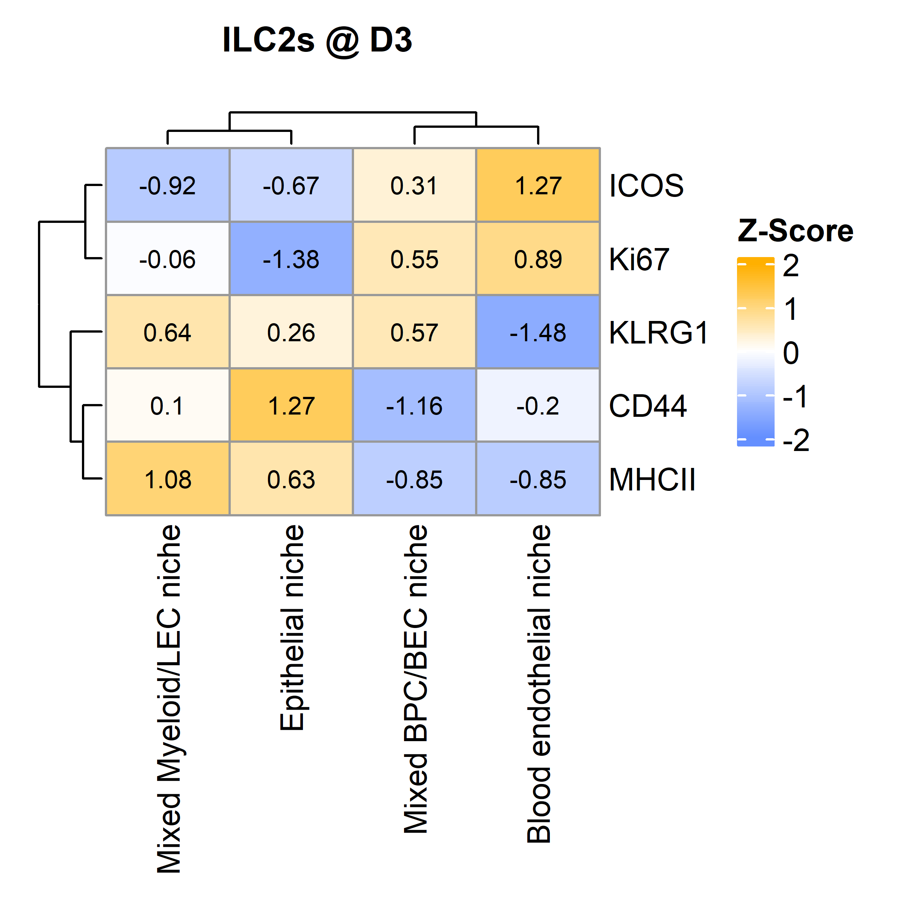


``` r
ggarrange(final_niche_comparison_ilc2s, 
          final_niche_freq_comparison,
          nrow = 2, ncol = 1, labels = "AUTO")
```

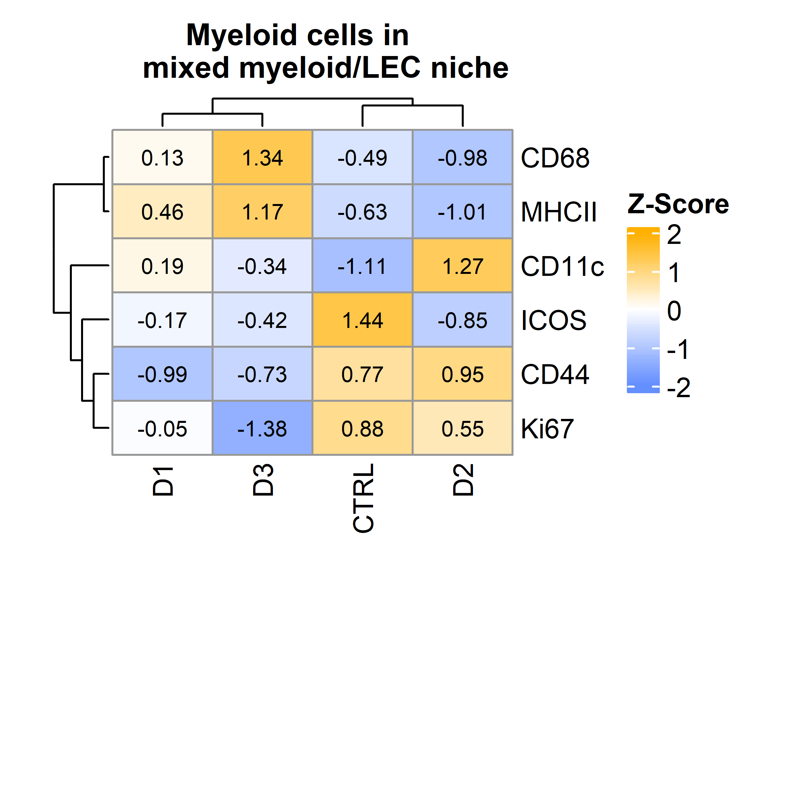

## Session Information


``` r
save.image(paste0(output_dir, "/environment.RData"))
sessionInfo()
```

```
## R version 4.5.2 (2025-10-31 ucrt)
## Platform: x86_64-w64-mingw32/x64
## Running under: Windows 11 x64 (build 26200)
## 
## Matrix products: default
##   LAPACK version 3.12.1
## 
## locale:
## [1] LC_COLLATE=German_Germany.utf8  LC_CTYPE=German_Germany.utf8    LC_MONETARY=German_Germany.utf8 LC_NUMERIC=C                    LC_TIME=German_Germany.utf8    
## 
## time zone: Europe/Berlin
## tzcode source: internal
## 
## attached base packages:
## [1] stats     graphics  grDevices utils     datasets  methods   base     
## 
## other attached packages:
##  [1] dbscan_1.2.3       patchwork_1.3.2    tidyr_1.3.1        stringr_1.6.0      ggbeeswarm_0.7.3   readr_2.1.6        ggpubr_0.6.2       ggplot2_4.0.1      Seurat_5.3.1       rlang_1.1.6        rstatix_0.7.3      dplyr_1.1.4        SeuratObject_5.2.0 sp_2.2-0          
## 
## loaded via a namespace (and not attached):
##   [1] RColorBrewer_1.1-3     rstudioapi_0.18.0      jsonlite_2.0.0         magrittr_2.0.4         spatstat.utils_3.2-0   farver_2.1.2           rmarkdown_2.30         vctrs_0.6.5            ROCR_1.0-12            spatstat.explore_3.5-3 htmltools_0.5.8.1      broom_1.0.12           Formula_1.2-5          sass_0.4.10            sctransform_0.4.2      parallelly_1.45.1      KernSmooth_2.23-26     bslib_0.10.0           htmlwidgets_1.6.4      ica_1.0-3              plyr_1.8.9             plotly_4.12.0          zoo_1.8-14             cachem_1.1.0           igraph_2.2.1           mime_0.13              lifecycle_1.0.5        pkgconfig_2.0.3        Matrix_1.7-4           R6_2.6.1               fastmap_1.2.0          fitdistrplus_1.2-6     future_1.69.0          shiny_1.13.0           digest_0.6.38          rprojroot_2.1.1        tensor_1.5.1           RSpectra_0.16-2        irlba_2.3.5.1          labeling_0.4.3         progressr_0.18.0       spatstat.sparse_3.1-0  httr_1.4.8             polyclip_1.10-7        abind_1.4-8            compiler_4.5.2         here_1.0.2             bit64_4.6.0-1          withr_3.0.2            S7_0.2.0               backports_1.5.0       
##  [52] carData_3.0-6          fastDummies_1.7.5      ggsignif_0.6.4         MASS_7.3-65            tools_4.5.2            vipor_0.4.7            lmtest_0.9-40          otel_0.2.0             beeswarm_0.4.0         httpuv_1.6.16          future.apply_1.20.2    goftest_1.2-3          glue_1.8.0             nlme_3.1-168           promises_1.5.0         grid_4.5.2             Rtsne_0.17             cluster_2.1.8.1        reshape2_1.4.5         generics_0.1.4         gtable_0.3.6           spatstat.data_3.1-9    tzdb_0.5.0             data.table_1.17.8      hms_1.1.4              utf8_1.2.6             car_3.1-5              spatstat.geom_3.6-0    RcppAnnoy_0.0.22       ggrepel_0.9.6          RANN_2.6.2             pillar_1.11.1          vroom_1.7.0            spam_2.11-1            RcppHNSW_0.6.0         later_1.4.4            splines_4.5.2          lattice_0.22-7         bit_4.6.0              survival_3.8-3         deldir_2.0-4           tidyselect_1.2.1       miniUI_0.1.2           pbapply_1.7-4          knitr_1.51             gridExtra_2.3          scattermore_1.2        xfun_0.56              matrixStats_1.5.0      stringi_1.8.7          lazyeval_0.2.2        
## [103] yaml_2.3.10            evaluate_1.0.5         codetools_0.2-20       tibble_3.3.0           cli_3.6.5              uwot_0.2.4             xtable_1.8-8           reticulate_1.44.0      jquerylib_0.1.4        dichromat_2.0-0.1      Rcpp_1.1.0             globals_0.19.0         spatstat.random_3.4-2  png_0.1-8              spatstat.univar_3.1-4  parallel_4.5.2         dotCall64_1.2          listenv_0.10.0         viridisLite_0.4.2      scales_1.4.0           ggridges_0.5.7         crayon_1.5.3           purrr_1.2.0            cowplot_1.2.0
```
