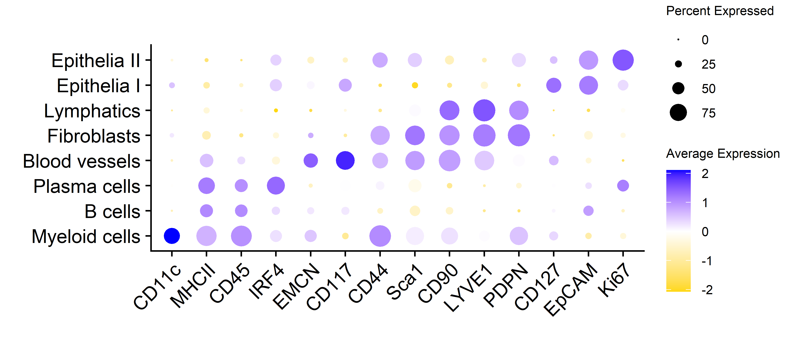

## Libraries


``` r
library(Seurat)
library(SeuratObject)
library(dplyr)
library(ggplot2)
# library(stringr)
# library(glue)
# library(here)
library(readr)
# library(lubridate)
# library(data.table)
# library(clustree)
# library(magrittr)
library(ggpubr)
# library(ggrepel)
# library(readxl)
# library(openxlsx)
```

## Parameters


``` r
set.seed(123)

input_dir <- here::here("1_data_tidying", "Lung_SI_all_cells_all_ALs_files")

output_dir <- here::here("2_visualizations_for_figures", "Fig_7_cell_type_annotation_SI_files")
dir.create(output_dir)


main_markers <- c(
  "EpCAM", "EMCN", "LYVE1", "PDPN", "PDGFRa", "CD8a", "CD4",
  "CD45", "CD3", "IRF4", "Kappa", "CD11c", "CD127", "GATA3eGFP", "RORgt"
)

immune_markers <- c(
 "CD3", "CD4", "CD8a", "Kappa", "IRF4", "CD11c",
  "CD127", "CD90", "EOMES", "GATA3eGFP", "RORgt", "Ki67",  "KLRG1", "NKp46", "CD117", "Areg", "CCR6", "CD44", "MHCII", "Sca1"
)

ilc_markers <- c(
  "CD3", "CD4", "CD8a",
  "CD127", "CD90", "EOMES", "GATA3eGFP", "RORgt", "KLRG1", "NKp46", "CD117", "CCR6", "MHCII", "Ki67", "Areg", "IRF4", "Sca1", "CD44"
)


cols_nat <- c("magenta", "cyan", "blue", "purple", "green", 
                       "red", "yellow", "olivedrab1", "slateblue1", 
                       "darkcyan", "gold","indianred1", "seagreen", "deeppink", 
                       "orange", "brown", "violet",
                       "deeppink4", "pink", 
                       "grey", "black", "lightgreen", 
                       "#FF0066",  
                       "lightblue", "#FFCC99", "#CC00FF", 
                       "blueviolet",  "goldenrod4", 
                       "navy", "olivedrab", "lightcyan", "seagreen2", "darkviolet", "lightpink", "slateblue4", "olivedrab2")

colfunc <- colorRampPalette(c("darkcyan", "green", "yellow", "magenta", "purple"))
```

# Load data


``` r
SO.si <- readRDS(paste0(input_dir, "/si_all_cells_all_ALs.rds"))
dim(SO.si)
```

```
## [1]    26 61207
```

``` r
SO.si$AL1 <- gsub("Epithelia & stroma", "Epithelia", SO.si$AL1)
colnames(SO.si@meta.data)
```

```
##  [1] "orig.ident"        "nCount_MELC"       "nFeature_MELC"     "Location_Center_X" "Location_Center_Y" "Treatment"         "FOV"               "Experiment"        "Organ"             "MELC.machine"      "Tissue.area"       "Dataset"           "CellID"            "MELC_snn_res.0.1"  "MELC_snn_res.0.15" "MELC_snn_res.0.2"  "MELC_snn_res.0.25" "MELC_snn_res.0.3"  "MELC_snn_res.0.35" "seurat_clusters"   "annotation_lvl1"   "MELC_snn_res.0.4"  "MELC_snn_res.0.45" "annotation_lvl2"   "MELC_snn_res.0.05" "annotation_lvl3"   "MELC_snn_res.0.5"  "annotation_lvl4"   "test_unresolved"   "AL1"               "AL2"               "AL3"               "MELC_snn_res.0.01"
```

# Visualization

## AL2 immune & non-immune cells

### Dot plot


``` r
SO.si$AL3 <- factor(SO.si$AL3, levels = c("ILC2s",
                                          "NK cells/ILC1s/ILC3s",
                                          "CD8+ CD3- IEL",
                                          "T helper cells",
                                          "T cytotox. cells",
                                          "Myeloid cells",
                                          "B cells",
                                          "Plasma cells",
                                          "Blood vessels",
                                          "Fibroblasts",
                                          "Lymphatics",
                                          "Epithelia I",
                                          "Epithelia II"))

SO.si.sub <- subset(SO.si, subset = AL3 ==c(
                                          "Myeloid cells",
                                          "B cells",
                                          "Plasma cells",
                                          "Blood vessels",
                                          "Fibroblasts",
                                          "Lymphatics",
                                          "Epithelia I",
                                          "Epithelia II"))

dot_plot_al2 <- Seurat::DotPlot(SO.si.sub, 
                group.by = "AL3",
                  features = c(
                    "CD11c", 
                    "MHCII", 
                    "CD45", 
                    "IRF4", 
                    "EMCN",
                    "CD117", 
                    "CD44", 
                    "Sca1",
                    "CD90", 
                    "CD31", 
                    "LYVE1", 
                    "PDPN",
                    "CD127", 
                    "EpCAM", 
                    "Ki67"
                  ), 
                cols ="RdBu", assay = "MELC")+   
    RotatedAxis()+
    # coord_flip()+
    theme(axis.text.x=element_text(size=12, angle = 45),
          axis.text.y=element_text(size=12), 
          plot.margin = margin(1, 0.5, 0.5, 0.5, "cm"), 
          axis.title.x = element_blank(), 
          axis.title.y = element_blank(), 
          plot.title = element_blank(), 
          legend.text = element_text(size=8), 
          legend.title = element_text(size=8))+ 
  scale_color_gradient2(midpoint = 0, low = "gold", 
                            high = "blue", space = "Lab" )

dot_plot_al2
```



## AL3 T cells and ILC subtypes

### Gating strategy


``` r
SO.si.sub <- subset(SO.si, subset = AL2 == c("ILCs",  
                                             "CD8+ CD3- IEL",  
                                             "T helper cells", 
                                             "T cytotox. cells"))
SO.si.sub$AL3 <- factor(SO.si.sub$AL3, levels = c("NK cells/ILC1s/ILC3s","ILC2s", "CD8+ CD3- IEL",    "T helper cells",   "T cytotox. cells"))


colfunc <- colorRampPalette(c("darkcyan", "green", "yellow", "magenta", "purple"))


fetched_data <- FetchData(SO.si.sub, 
                        vars = c("Dataset",
                                 "AL2",
                                 "AL3",
                                 "Location_Center_X", 
                                 "Location_Center_Y", 
                                 "UMAP_1", 
                                 "UMAP_2",
                                 "Treatment",
                                 "CellID", 
                                 "Experiment", 
                                 rownames(SO.si.sub)))

fetched_data <- as.data.frame(fetched_data)

marker2 <- "CD3"
marker1 <- "CD127"

plot1 <- ggplot(fetched_data, aes(x = get(marker1), y = get(marker2))) +
  geom_point(size = 0.5, color = "white") +
  stat_density_2d(aes(fill = ..level..), geom = "polygon", color = FALSE) +
  scale_fill_gradientn(colours = colfunc(400)) +
  labs(y = paste0("MFI ", marker2), x = paste0("MFI ", marker1)) +
  theme_bw() +
  theme(
    plot.margin = margin(0.5, 0.5, 0.5, 0.5, "cm"),
    plot.title = element_text(hjust = 0.5),
    legend.title = element_text(size = 8),
    panel.background = element_rect(fill = "white"),
    plot.background = element_rect(fill = "white"),
    strip.background = element_rect(fill = "white"),
    legend.position = "bottom",
    panel.grid = element_blank()  # Remove grey grid lines
  )  +
  ggtitle("ILCs & T cells")+
  annotate("rect", xmin = -1, xmax = 7.5, ymin = 3, ymax = 9,
  alpha = 0, color = "red"#, fill = "magenta"
  )+
  annotate("text", 
           x = 2, 
           y = 4, 
           label = "CD3+ cells", 
           color = "red")+
  annotate("rect", xmin = -1, xmax = 7.5, ymin = -2, ymax = 2.9,
  alpha = 0, color = "green"#, fill = "magenta"
  )+
  annotate("text", 
           x = 2, 
           y = 1.5, 
           label = "CD3- cells", 
           color = "green")
plot1
```


### Ridge plot profiles of T cell and ILC subtypes


``` r
plot_ridge <- RidgePlot(SO.si.sub, 
          features = c("CD127", "CD90","CD3", "CD4",  "RORgt", "GATA3eGFP", "CD8a", "EOMES"), same.y.lims = TRUE,log = TRUE,
          cols = alpha(c(
            "darkmagenta", 
            "seagreen2",
            "navy", 
            "gold",
            "deeppink",
            "slateblue"
          ), 0.5), combine = FALSE)

plot_ridge_ilctcells <- ggarrange(plotlist =  plot_ridge, common.legend = TRUE, legend = "none", ncol = 2, nrow = 4) +
  theme(plot.margin = margin(1, 0.5, 0, 0.5, "cm"))

plot_ridge_ilctcells
```


# Combine plots


``` r
plot_combined <- ggarrange(dot_plot_al2, plot1, labels = c("A", "B"), ncol = 2, nrow = 1, widths = c(8, 3))

ggarrange( plot_combined, plot_ridge_ilctcells, labels = c("", "C"), ncol = 1, nrow = 2, heights = c(3, 9))
```


## Additional information:


``` r
df_fetched <- FetchData(SO.si.sub, 
                        c(colnames(SO.si.sub@meta.data), rownames(SO.si.sub)))

df_fetched <- df_fetched %>%
  filter(AL3 == "NK cells/ILC1s/ILC3s")


df_fetched_filtered <- df_fetched %>%
  filter(EOMES > 2) 
nrow(df_fetched_filtered)/nrow(df_fetched)*100
```

```
## [1] 68.47826
```

``` r
df_fetched_filtered <- df_fetched %>%
  filter(CD127 > 2)
nrow(df_fetched_filtered)/nrow(df_fetched)*100
```

```
## [1] 66.61491
```

``` r
df_fetched_filtered <- df_fetched %>%
  filter(CD90 > 2)
nrow(df_fetched_filtered)/nrow(df_fetched)*100
```

```
## [1] 58.54037
```

``` r
df_fetched_filtered <- df_fetched %>%
  filter(CD4 > 2)
nrow(df_fetched_filtered)/nrow(df_fetched)*100
```

```
## [1] 37.8882
```

``` r
df_fetched_filtered <- df_fetched %>%
  filter(RORgt > 2)
nrow(df_fetched_filtered)/nrow(df_fetched)*100
```

```
## [1] 50.31056
```


``` r
df_fetched <- FetchData(SO.si.sub, 
                        c(colnames(SO.si.sub@meta.data), rownames(SO.si.sub)))

df_fetched <- df_fetched %>%
  filter(AL3 == "ILC2s")


df_fetched_filtered <- df_fetched %>%
  filter(GATA3eGFP > 2) 
nrow(df_fetched_filtered)/nrow(df_fetched)*100
```

```
## [1] 85.71429
```

``` r
df_fetched_filtered <- df_fetched %>%
  filter(CD127 > 2)
nrow(df_fetched_filtered)/nrow(df_fetched)*100
```

```
## [1] 45.67669
```

``` r
df_fetched_filtered <- df_fetched %>%
  filter(CD90 > 2)
nrow(df_fetched_filtered)/nrow(df_fetched)*100
```

```
## [1] 71.80451
```

``` r
df_fetched_filtered <- df_fetched %>%
  filter(KLRG1 > 2)
nrow(df_fetched_filtered)/nrow(df_fetched)*100
```

```
## [1] 28.38346
```

``` r
df_fetched_filtered <- df_fetched %>%
  filter(GATA3eGFP > 2) %>%
  filter(CD90 > 2) %>%
  filter(CD127 > 2)
nrow(df_fetched_filtered)/nrow(df_fetched)*100
```

```
## [1] 36.84211
```

## Session Information


``` r
save.image(paste0(output_dir, "/environment.RData"))
sessionInfo()
```

```
## R version 4.4.2 (2024-10-31 ucrt)
## Platform: x86_64-w64-mingw32/x64
## Running under: Windows 10 x64 (build 19045)
## 
## Matrix products: default
## 
## 
## locale:
## [1] LC_COLLATE=English_Germany.utf8  LC_CTYPE=English_Germany.utf8    LC_MONETARY=English_Germany.utf8 LC_NUMERIC=C                     LC_TIME=English_Germany.utf8    
## 
## time zone: Europe/Berlin
## tzcode source: internal
## 
## attached base packages:
## [1] stats     graphics  grDevices utils     datasets  methods   base     
## 
## other attached packages:
## [1] ggpubr_0.6.0       readr_2.1.5        ggplot2_3.5.2      dplyr_1.1.4        Seurat_5.2.1       SeuratObject_5.1.0 sp_2.2-0          
## 
## loaded via a namespace (and not attached):
##   [1] RColorBrewer_1.1-3     rstudioapi_0.17.1      jsonlite_1.9.1         magrittr_2.0.3         ggbeeswarm_0.7.2       spatstat.utils_3.1-3   farver_2.1.2           rmarkdown_2.29         vctrs_0.6.5            ROCR_1.0-11            spatstat.explore_3.4-2 rstatix_0.7.2          htmltools_0.5.8.1      broom_1.0.8            Formula_1.2-5          sass_0.4.10            sctransform_0.4.1      parallelly_1.45.0      KernSmooth_2.23-24     bslib_0.9.0            htmlwidgets_1.6.4      ica_1.0-3              plyr_1.8.9             plotly_4.11.0          zoo_1.8-13             cachem_1.1.0           igraph_2.1.4           mime_0.13              lifecycle_1.0.4        pkgconfig_2.0.3        Matrix_1.7-1           R6_2.6.1               fastmap_1.2.0          fitdistrplus_1.2-2     future_1.58.0          shiny_1.10.0           digest_0.6.37          colorspace_2.1-1       patchwork_1.3.1        rprojroot_2.0.4        tensor_1.5.1           RSpectra_0.16-2        irlba_2.3.5.1          labeling_0.4.3         progressr_0.15.1       spatstat.sparse_3.1-0  httr_1.4.7             polyclip_1.10-7        abind_1.4-8            compiler_4.4.2         here_1.0.1            
##  [52] withr_3.0.2            backports_1.5.0        carData_3.0-5          fastDummies_1.7.5      ggsignif_0.6.4         MASS_7.3-61            tools_4.4.2            vipor_0.4.7            lmtest_0.9-40          beeswarm_0.4.0         httpuv_1.6.15          future.apply_1.20.0    goftest_1.2-3          glue_1.8.0             nlme_3.1-166           promises_1.3.2         grid_4.4.2             Rtsne_0.17             cluster_2.1.6          reshape2_1.4.4         generics_0.1.4         isoband_0.2.7          gtable_0.3.6           spatstat.data_3.1-6    tzdb_0.4.0             tidyr_1.3.1            data.table_1.17.0      hms_1.1.3              car_3.1-3              spatstat.geom_3.3-6    RcppAnnoy_0.0.22       ggrepel_0.9.6          RANN_2.6.2             pillar_1.10.2          stringr_1.5.1          spam_2.11-1            RcppHNSW_0.6.0         later_1.4.1            splines_4.4.2          lattice_0.22-6         survival_3.7-0         deldir_2.0-4           tidyselect_1.2.1       miniUI_0.1.2           pbapply_1.7-2          knitr_1.50             gridExtra_2.3          scattermore_1.2        xfun_0.51              matrixStats_1.5.0      stringi_1.8.4         
## [103] lazyeval_0.2.2         yaml_2.3.10            evaluate_1.0.4         codetools_0.2-20       tibble_3.2.1           cli_3.6.3              uwot_0.2.3             xtable_1.8-4           reticulate_1.42.0      jquerylib_0.1.4        Rcpp_1.0.14            globals_0.18.0         spatstat.random_3.3-3  png_0.1-8              ggrastr_1.0.2          spatstat.univar_3.1-2  parallel_4.4.2         dotCall64_1.2          listenv_0.9.1          viridisLite_0.4.2      scales_1.4.0           ggridges_0.5.6         purrr_1.0.4            rlang_1.1.5            cowplot_1.1.3
```
