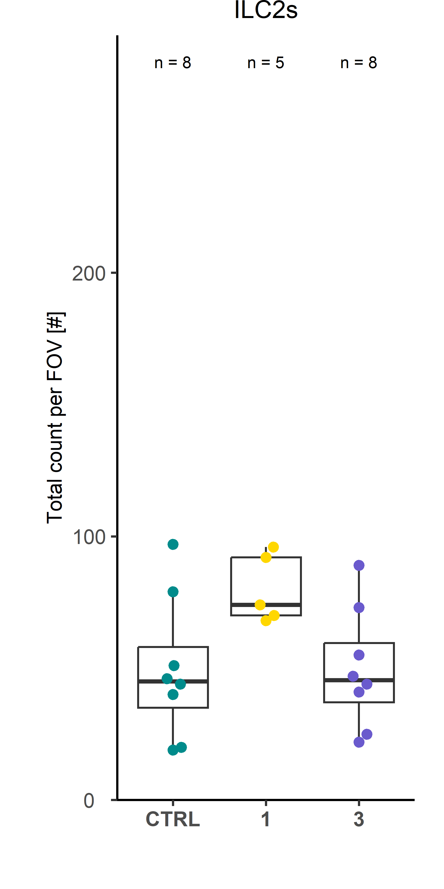

## Libraries


``` r
# remove.packages("rlang")
# remove.packages("dplyr")
# install.packages("rlang")
# install.packages("dplyr")

library(SeuratObject)
library(dplyr)
library(rstatix)
library(rlang)

if (!requireNamespace("Giotto", quietly = TRUE))
  devtools::install_github("drieslab/Giotto@suite")
if (!requireNamespace("VoltRon", quietly = TRUE))
  devtools::install_github("Artur-man/VoltRon")
if (!requireNamespace("Seurat", quietly = TRUE))
  install.packages("Seurat")
library(Giotto)
library(Seurat)
library(VoltRon)
library(ggplot2)
library(ggpubr)
library(readr)
library(ggbeeswarm)
library(stringr)
```

## Parameters


``` r
set.seed(123)

input_dir <- here::here("1_data_tidying", "Lung_SI_all_cells_all_ALs_files")

output_dir <- here::here("2_visualizations_for_figures", "Fig_8_quantification_spatial_analysis_SI_files")
dir.create(output_dir)


main_markers <- c(
  "EpCAM", "EMCN", "LYVE1", "PDPN", "PDGFRa", "CD8a", "CD4",
  "CD45", "CD3", "IRF4", "Kappa", "CD11c", "CD127", "GATA3eGFP", "RORgt"
)


immune_markers <- c(
 "CD3", "CD4", "CD8a", "Kappa", "IRF4", "CD11c",
  "CD127", "CD90", "EOMES", "GATA3eGFP", "RORgt", "Ki67",  "KLRG1", "NKp46", "CD117", "Areg", "CCR6", "CD44", "MHCII", "Sca1"
)

ilc_markers <- c(
  "CD3", "CD4", "CD8a",
  "CD127", "CD90", "EOMES", "GATA3eGFP", "RORgt", "KLRG1", "NKp46", "CD117", "CCR6", "MHCII", "Ki67", "Areg", "IRF4", "Sca1", "CD44"
)


cols_nat <- c("magenta", "cyan", "blue", "purple", "green", 
                       "red", "yellow", "olivedrab1", "slateblue1", 
                       "darkcyan", "gold","indianred1", "seagreen", "deeppink", 
                       "orange", "brown", "violet",
                       "deeppink4", "pink", 
                       "grey", "black", "lightgreen", 
                       "#FF0066",  
                       "lightblue", "#FFCC99", "#CC00FF", 
                       "blueviolet",  "goldenrod4", 
                       "navy", "olivedrab", "lightcyan", "seagreen2", "darkviolet", "lightpink", "slateblue4", "olivedrab2")

colfunc <- colorRampPalette(c("darkcyan", "green", "yellow", "magenta", "purple"))

cols_ilcs_lung <- c("darkcyan", "seagreen2", "deeppink4")
cols_ilcs_si <- c("slateblue", "seagreen2")

cols_treat <- c("darkcyan", "gold", "slateblue")

cols_organs <- c("indianred2", "seagreen", "navy")
cols_organs_si <- c("seagreen", "navy")
```

# Load data

## Proportions


``` r
df_villi <- read_csv(paste0(input_dir, "/si_villi_proportions.csv"), 
    col_types = cols(...1 = col_skip()))

df_ilf <- read_csv(paste0(input_dir, "/si_ilf_proportions.csv"), 
    col_types = cols(...1 = col_skip()))

# the FOV CTRL_FOV1_20210810 is falsely labeled as villi but is actually an ILF, so it must be changed in the metadata
df_correct <- df_villi %>%
  filter(Dataset == "CTRL_FOV1_20210810") %>%
  mutate(Tissue.area = "ILF")

df_ilf <- rbind(df_ilf, df_correct)

df_villi <- df_villi %>%
  filter(Dataset != "CTRL_FOV1_20210810")


df_lung <- read_csv(paste0(input_dir, "/lung_proportions.csv"), 
    col_types = cols(...1 = col_skip()))
```

## Spatial data for VoltRon and Giotto


``` r
# from import_Giotto.Rmd
gio_list <- readRDS(here::here("data", "Giotto_data_Villi.rds"))

# from import_VoltRon.Rmd
vr_list <- readRDS(here::here("data", "VoltRon_data_Villi.rds"))

# original data
metadatax <- read_csv(here::here("data", "SO_arcsinh_si_imputed_Villi.csv"))

metadatax <- metadatax %>% 
  filter(`Tissue area` == "Villi")

unique(metadatax$CellType)
```

```
##  [1] "Epithelia I"               "Epithelia II"              "Fibroblasts"               "Blood vessels"             "Lymphatics"                "Myeloid cells"             "B cells"                   "Plasma cells/Plasmablasts" "ILC2s"                     "CD8+ CD3- IEL"             "Unresolved"                "NK cells/ILC1s/ILC3s"      "T helper cells"            "T cytotox. cells"
```

``` r
vr_list_names <- unique(metadatax$Dataset)


cell_proximities_list <- list()
for(samp in vr_list_names){
  print(samp)
  cell_proximities_list[[samp]] <-cellProximityEnrichment(
    gobject = gio_list[[samp]],
    cluster_column = 'CellType',
    spatial_network_name = 'Delaunay_network',
    adjust_method = 'fdr',
    number_of_simulations = 1000)
  cell_proximities_list[[samp]] <- cell_proximities_list[[samp]]$enrichm_res
}
```

```
## [1] "CTRL_FOV1_20210706"
## [1] "CTRL_FOV1_20210730"
## [1] "CTRL_FOV2_20210706"
## [1] "CTRL_FOV2_20210730"
## [1] "CTRL_FOV2_20210810"
## [1] "CTRL_FOV3_20210706"
## [1] "CTRL_FOV3_20210709"
## [1] "CTRL_FOV3_20210730"
## [1] "D1_FOV1_20211025"
## [1] "D1_FOV2_20211025"
## [1] "D1_FOV2_20220505"
## [1] "D1_FOV3_20211025"
## [1] "D1_FOV3_20220505"
## [1] "D3_FOV1_20210701"
## [1] "D3_FOV1_20210806"
## [1] "D3_FOV2_20210625"
## [1] "D3_FOV2_20210701"
## [1] "D3_FOV2_20210806"
## [1] "D3_FOV3_20210625"
## [1] "D3_FOV3_20210701"
## [1] "D3_FOV3_20210806"
```

``` r
vr_merged <- merge(vr_list[[1]], vr_list[-1])
vrImageNames(vr_merged)
```

```
## [1] "image_1"
```

``` r
unique(vr_merged$CellType)
```

```
##  [1] "Epithelia I"               "Epithelia II"              "Fibroblasts"               "Blood vessels"             "Lymphatics"                "Myeloid cells"             "B cells"                   "Plasma cells/Plasmablasts" "ILC2s"                     "CD8+ CD3- IEL"             "Unresolved"                "NK cells/ILC1s/ILC3s"      "T helper cells"            "T cytotox. cells"
```

# Visualization

Define theme for plotting of boxplots and coenrichment plots:


``` r
# BOXPLOTS --------------------------------------------------------------------------------
theme_boxplots <-   function() {
  theme(plot.margin=margin(0,0.5,1,0.8,"cm"),
        axis.text.x = element_text(#angle = 45, 
                                   vjust = 1, size = 10, hjust = 0.5, face = "bold"),
        axis.text.y = element_text(hjust = 0.5, size = 10),
        axis.title.x = element_text(size = 11),
        axis.title.y = element_text(size = 10),
        plot.title = element_text(size =12, hjust = 0.5),
        legend.title = element_text(size =10),
        legend.text = element_text(size =10)
  )
  }

annot_text_size <- 8/.pt

# COENRICHMENT PLOTS ----------------------------------------------------------------------
theme_coenrich <-   function() {
  theme(axis.text.x = element_text(#angle = 50,
                                   vjust = 1, size = 10, hjust = 0.5, face = "bold"
                                   ),
        axis.text.y = element_text(hjust = 0.5, size = 10),
        axis.title.x = element_blank(),
        axis.title.y = element_text(size = 10),
        plot.title = element_text(size =12, hjust = 0.5),
        plot.margin = margin(0, 1, 0.5, 1, "cm"),
        legend.position = "none",
        strip.background=element_blank(),
        strip.background.x= element_blank(),
        strip.text.x = element_text(size = 1, color = "white"),
        panel.grid.major.y = element_line()
        )
}
```

## Fig. 8A-C - Total cell, immune cell, and ILC count in SI villi at conditions


``` r
# filter for CTRL and convert to longer format
df <- df_villi %>%
  select(Treatment, Dataset, TotalCellCountFOV, `Immune cells`, ILCs) %>%
  mutate(Treatment = factor(Treatment, level =c(
    "CTRL", "1", "3"
  )))

# TOTAL CELL COUNT -------------------------------------------------------------------
# Testing for normal distribution
shapiro.test(df$TotalCellCountFOV)
```

```
## 
## 	Shapiro-Wilk normality test
## 
## data:  df$TotalCellCountFOV
## W = 0.97144, p-value = 0.7647
```

``` r
# Kruskal-Wallis-test to check for significance between tested groups and effect size
res.kruskal <- df %>% kruskal_test(`TotalCellCountFOV` ~ Treatment)
res.kruskal
```

```
## # A tibble: 1 × 6
##   .y.                   n statistic    df       p method        
## * <chr>             <int>     <dbl> <int>   <dbl> <chr>         
## 1 TotalCellCountFOV    21      11.1     2 0.00388 Kruskal-Wallis
```

``` r
df %>% kruskal_effsize(`TotalCellCountFOV` ~ Treatment)
```

```
## # A tibble: 1 × 5
##   .y.                   n effsize method  magnitude
## * <chr>             <int>   <dbl> <chr>   <ord>    
## 1 TotalCellCountFOV    21   0.506 eta2[H] large
```

``` r
# Pairwise comparisons using Dunn's test
pwc <- df %>% 
  dunn_test(`TotalCellCountFOV` ~ Treatment, p.adjust.method = "bonferroni") 
pwc
```

```
## # A tibble: 3 × 9
##   .y.               group1 group2    n1    n2 statistic        p   p.adj p.adj.signif
## * <chr>             <chr>  <chr>  <int> <int>     <dbl>    <dbl>   <dbl> <chr>       
## 1 TotalCellCountFOV CTRL   1          8     5     -3.33 0.000872 0.00262 **          
## 2 TotalCellCountFOV CTRL   3          8     8     -1.33 0.184    0.551   ns          
## 3 TotalCellCountFOV 1      3          5     8      2.16 0.0306   0.0917  ns
```

``` r
# add N to plot
tab <- data.frame(xtabs(~ Treatment, data = df))
head(tab)
```

```
##   Treatment Freq
## 1      CTRL    8
## 2         1    5
## 3         3    8
```

``` r
# Add cell number per cluster to cluster labels
Labels = paste0("n = ", tab$Freq, "")


# Visualization: box plots with p-values
pwc <- pwc %>% add_xy_position(x = "Treatment")

plot_count_all <- ggplot(df, aes(x = Treatment, y = TotalCellCountFOV, fill = "Treatment"))+
  geom_boxplot(fill="white")+
  geom_beeswarm(aes(color = Treatment), size = 2, cex = 3)+
  scale_color_manual(values = cols_treat)+
  theme_classic2()+
  theme_boxplots()+
  stat_pvalue_manual(pwc,
                       hide.ns = TRUE, size = 6,
                       step.increase = 0.1, y.position = 2500) +
  xlab(NULL)+
  ylab("Total count per FOV [#]")+
  ggtitle("Total cells")+
  scale_y_continuous(expand = c(0, 0), limits = c(0,3000))+
  NoLegend()+
    annotate(geom = 'text',
           x=c(1, 2, 3),
           y=2900,
           label=Labels,
           #angle = 90,
           size = annot_text_size)


# IMMUNE -------------------------------------------------------------------
# Testing for normal distribution
shapiro.test(df$`Immune cells`)
```

```
## 
## 	Shapiro-Wilk normality test
## 
## data:  df$`Immune cells`
## W = 0.97373, p-value = 0.8133
```

``` r
# Kruskal-Wallis-test to check for significance between tested groups and effect size
res.kruskal <- df %>% kruskal_test(`Immune cells` ~ Treatment)
res.kruskal
```

```
## # A tibble: 1 × 6
##   .y.              n statistic    df      p method        
## * <chr>        <int>     <dbl> <int>  <dbl> <chr>         
## 1 Immune cells    21      8.67     2 0.0131 Kruskal-Wallis
```

``` r
df %>% kruskal_effsize(`Immune cells` ~ Treatment)
```

```
## # A tibble: 1 × 5
##   .y.              n effsize method  magnitude
## * <chr>        <int>   <dbl> <chr>   <ord>    
## 1 Immune cells    21   0.370 eta2[H] large
```

``` r
# Pairwise comparisons using Dunn's test
pwc <- df %>% 
  dunn_test(`Immune cells` ~ Treatment, p.adjust.method = "bonferroni") 
pwc
```

```
## # A tibble: 3 × 9
##   .y.          group1 group2    n1    n2 statistic       p  p.adj p.adj.signif
## * <chr>        <chr>  <chr>  <int> <int>     <dbl>   <dbl>  <dbl> <chr>       
## 1 Immune cells CTRL   1          8     5    -2.91  0.00359 0.0108 *           
## 2 Immune cells CTRL   3          8     8    -0.886 0.375   1      ns          
## 3 Immune cells 1      3          5     8     2.13  0.0328  0.0984 ns
```

``` r
# add N to plot
tab <- data.frame(xtabs(~ Treatment, data = df))
head(tab)
```

```
##   Treatment Freq
## 1      CTRL    8
## 2         1    5
## 3         3    8
```

``` r
# Add cell number per cluster to cluster labels
Labels = paste0("n = ", tab$Freq, "")


# Visualization: box plots with p-values
pwc <- pwc %>% add_xy_position(x = "Treatment")

plot_count_immune <- ggplot(df, aes(x = Treatment, y = `Immune cells`, fill = "Treatment"))+
  geom_boxplot(fill="white")+
  geom_beeswarm(aes(color = Treatment), size = 2, cex = 3)+
  scale_color_manual(values = cols_treat)+
  theme_classic2()+
  theme_boxplots()+
  stat_pvalue_manual(pwc,
                       hide.ns = TRUE, size = 6,
                       step.increase = 0.1, y.position = 1500) +
  xlab(NULL)+
  ylab("Total count per FOV [#]")+
  ggtitle("Immune cells")+
  scale_y_continuous(expand = c(0, 0), limits = c(0,1800))+
  NoLegend()+
    annotate(geom = 'text',
           x=c(1, 2, 3),
           y=1700,
           label=Labels,
           #angle = 90,
           size = annot_text_size)


# ILCs -------------------------------------------------------------------
# Testing for normal distribution
shapiro.test(df$ILCs)
```

```
## 
## 	Shapiro-Wilk normality test
## 
## data:  df$ILCs
## W = 0.96889, p-value = 0.7082
```

``` r
# Kruskal-Wallis-test to check for significance between tested groups and effect size
res.kruskal <- df %>% kruskal_test(`ILCs` ~ Treatment)
res.kruskal
```

```
## # A tibble: 1 × 6
##   .y.       n statistic    df       p method        
## * <chr> <int>     <dbl> <int>   <dbl> <chr>         
## 1 ILCs     21      10.3     2 0.00592 Kruskal-Wallis
```

``` r
df %>% kruskal_effsize(`ILCs` ~ Treatment)
```

```
## # A tibble: 1 × 5
##   .y.       n effsize method  magnitude
## * <chr> <int>   <dbl> <chr>   <ord>    
## 1 ILCs     21   0.459 eta2[H] large
```

``` r
# Pairwise comparisons using Dunn's test
pwc <- df %>% 
  dunn_test(`ILCs` ~ Treatment, p.adjust.method = "bonferroni") 
pwc
```

```
## # A tibble: 3 × 9
##   .y.   group1 group2    n1    n2 statistic       p   p.adj p.adj.signif
## * <chr> <chr>  <chr>  <int> <int>     <dbl>   <dbl>   <dbl> <chr>       
## 1 ILCs  CTRL   1          8     5      1.28 0.200   0.601   ns          
## 2 ILCs  CTRL   3          8     8     -2.08 0.0378  0.113   ns          
## 3 ILCs  1      3          5     8     -3.10 0.00192 0.00576 **
```

``` r
# add N to plot
tab <- data.frame(xtabs(~ Treatment, data = df))
head(tab)
```

```
##   Treatment Freq
## 1      CTRL    8
## 2         1    5
## 3         3    8
```

``` r
# Add cell number per cluster to cluster labels
Labels = paste0("n = ", tab$Freq, "")


# Visualization: box plots with p-values
pwc <- pwc %>% add_xy_position(x = "Treatment")

plot_count_ilc <- ggplot(df, aes(x = Treatment, y = ILCs, fill = "Treatment"))+
  geom_boxplot(fill="white")+
  geom_beeswarm(aes(color = Treatment), size = 2, cex = 3)+
  scale_color_manual(values = cols_treat)+
  theme_classic2()+
  theme_boxplots()+
  stat_pvalue_manual(pwc,
                       hide.ns = TRUE, size = 6,
                       step.increase = 0.1, y.position = 250) +
  xlab(NULL)+
  ylab("Total count per FOV [#]")+
  ggtitle("ILCs")+
  scale_y_continuous(expand = c(0, 0), limits = c(0,290))+
  NoLegend()+
    annotate(geom = 'text',
           x=c(1, 2, 3),
           y=280,
           label=Labels,
           #angle = 90,
           size = annot_text_size)


plot_ac <- ggarrange(plot_count_all, plot_count_immune, plot_count_ilc, ncol = 1, nrow = 3, labels = "AUTO")

plot_ac
```



## Fig. 8D-E - Immune and ILC frequency in SI villi


``` r
# filter for CTRL and convert to longer format
df <- df_villi %>%
  select(Treatment, Dataset, TotalCellCountFOV, `Immune cells`, ILCs) %>%
  mutate(Prop_immune = `Immune cells`/TotalCellCountFOV*100, 
         Prop_ilc = ILCs/`Immune cells`*100,
         Treatment = factor(Treatment, level =c(
           "CTRL", "1", "3"
  )))

# TOTAL CELL COUNT -------------------------------------------------------------------
# Testing for normal distribution
shapiro.test(df$Prop_immune)
```

```
## 
## 	Shapiro-Wilk normality test
## 
## data:  df$Prop_immune
## W = 0.90678, p-value = 0.04744
```

``` r
# Kruskal-Wallis-test to check for significance between tested groups and effect size
res.kruskal <- df %>% kruskal_test(`Prop_immune` ~ Treatment)
res.kruskal
```

```
## # A tibble: 1 × 6
##   .y.             n statistic    df      p method        
## * <chr>       <int>     <dbl> <int>  <dbl> <chr>         
## 1 Prop_immune    21      7.92     2 0.0191 Kruskal-Wallis
```

``` r
df %>% kruskal_effsize(`Prop_immune` ~ Treatment)
```

```
## # A tibble: 1 × 5
##   .y.             n effsize method  magnitude
## * <chr>       <int>   <dbl> <chr>   <ord>    
## 1 Prop_immune    21   0.329 eta2[H] large
```

``` r
# Pairwise comparisons using Dunn's test
pwc <- df %>% 
  dunn_test(`Prop_immune` ~ Treatment, p.adjust.method = "bonferroni") 
pwc
```

```
## # A tibble: 3 × 9
##   .y.         group1 group2    n1    n2 statistic       p  p.adj p.adj.signif
## * <chr>       <chr>  <chr>  <int> <int>     <dbl>   <dbl>  <dbl> <chr>       
## 1 Prop_immune CTRL   1          8     5     2.80  0.00513 0.0154 *           
## 2 Prop_immune CTRL   3          8     8     0.967 0.334   1      ns          
## 3 Prop_immune 1      3          5     8    -1.95  0.0511  0.153  ns
```

``` r
# add N to plot
tab <- data.frame(xtabs(~ Treatment, data = df))
head(tab)
```

```
##   Treatment Freq
## 1      CTRL    8
## 2         1    5
## 3         3    8
```

``` r
# Add cell number per cluster to cluster labels
Labels = paste0("n = ", tab$Freq, "")


# Visualization: box plots with p-values
pwc <- pwc %>% add_xy_position(x = "Treatment")

plot_freq_immune <- ggplot(df, aes(x = Treatment, y = Prop_immune, fill = "Treatment"))+
  geom_boxplot(fill="white")+
  geom_beeswarm(aes(color = Treatment), size = 2, cex = 3)+
  scale_color_manual(values = cols_treat)+
  theme_classic2()+
  theme_boxplots()+
  stat_pvalue_manual(pwc,
                       hide.ns = TRUE, size = 6,
                       step.increase = 0.1, y.position = 85) +
  xlab(NULL)+
  ylab("Frequency cells/total cells FOV [%]")+
  ggtitle("Immune cells")+
  scale_y_continuous(expand = c(0, 0), limits = c(40,100))+
  NoLegend()+
    annotate(geom = 'text',
           x=c(1, 2, 3),
           y=95,
           label=Labels,
           #angle = 90,
           size = annot_text_size)


# IMMUNE -------------------------------------------------------------------
# Testing for normal distribution
shapiro.test(df$`Prop_ilc`)
```

```
## 
## 	Shapiro-Wilk normality test
## 
## data:  df$Prop_ilc
## W = 0.88794, p-value = 0.02057
```

``` r
# Kruskal-Wallis-test to check for significance between tested groups and effect size
res.kruskal <- df %>% kruskal_test(`Prop_ilc` ~ Treatment)
res.kruskal
```

```
## # A tibble: 1 × 6
##   .y.          n statistic    df        p method        
## * <chr>    <int>     <dbl> <int>    <dbl> <chr>         
## 1 Prop_ilc    21      14.3     2 0.000797 Kruskal-Wallis
```

``` r
df %>% kruskal_effsize(`Prop_ilc` ~ Treatment)
```

```
## # A tibble: 1 × 5
##   .y.          n effsize method  magnitude
## * <chr>    <int>   <dbl> <chr>   <ord>    
## 1 Prop_ilc    21   0.682 eta2[H] large
```

``` r
# Pairwise comparisons using Dunn's test
pwc <- df %>% 
  dunn_test(`Prop_ilc` ~ Treatment, p.adjust.method = "bonferroni") 
pwc
```

```
## # A tibble: 3 × 9
##   .y.      group1 group2    n1    n2 statistic        p    p.adj p.adj.signif
## * <chr>    <chr>  <chr>  <int> <int>     <dbl>    <dbl>    <dbl> <chr>       
## 1 Prop_ilc CTRL   1          8     5      2.03 0.0425   0.128    ns          
## 2 Prop_ilc CTRL   3          8     8     -1.97 0.0484   0.145    ns          
## 3 Prop_ilc 1      3          5     8     -3.76 0.000170 0.000510 ***
```

``` r
# add N to plot
tab <- data.frame(xtabs(~ Treatment, data = df))
head(tab)
```

```
##   Treatment Freq
## 1      CTRL    8
## 2         1    5
## 3         3    8
```

``` r
# Add cell number per cluster to cluster labels
Labels = paste0("n = ", tab$Freq, "")


# Visualization: box plots with p-values
pwc <- pwc %>% add_xy_position(x = "Treatment")

plot_freq_ilc <- ggplot(df, aes(x = Treatment, y = `Prop_ilc`, fill = "Treatment"))+
  geom_boxplot(fill="white")+
  geom_beeswarm(aes(color = Treatment), size = 2, cex = 3)+
  scale_color_manual(values = cols_treat)+
  theme_classic2()+
  theme_boxplots()+
  stat_pvalue_manual(pwc,
                       hide.ns = TRUE, size = 6,
                       step.increase = 0.1, y.position = 35) +
  xlab(NULL)+
  ylab("Frequency cells/immune cells FOV [%]")+
  ggtitle("ILCs")+
  scale_y_continuous(expand = c(0, 0), limits = c(0,43))+
  NoLegend()+
    annotate(geom = 'text',
           x=c(1, 2, 3),
           y=40,
           label=Labels,
           #angle = 90,
           size = annot_text_size)


plot_de <- ggarrange(plot_freq_immune, plot_freq_ilc, ncol = 1, nrow = 2, labels = c("D", "E"))
plot_de
```


## Fig. 8F-G - Frequency of ILC subtypes in SI villi at different conditions


``` r
# filter for CTRL and convert to longer format
df <- df_villi %>%
  select(Treatment, Dataset, `Immune cells`, `NK cells/ILC1s/ILC3s`, ILC2s) %>%
  mutate(Prop_nk =  `NK cells/ILC1s/ILC3s`/`Immune cells`*100, 
         Prop_ilc = ILC2s/`Immune cells`*100,
         Treatment = factor(Treatment, level =c(
           "CTRL", "1", "3"
  )))

# TOTAL CELL COUNT -------------------------------------------------------------------
# Testing for normal distribution
shapiro.test(df$Prop_nk)
```

```
## 
## 	Shapiro-Wilk normality test
## 
## data:  df$Prop_nk
## W = 0.85973, p-value = 0.006277
```

``` r
# Kruskal-Wallis-test to check for significance between tested groups and effect size
res.kruskal <- df %>% kruskal_test(`Prop_nk` ~ Treatment)
res.kruskal
```

```
## # A tibble: 1 × 6
##   .y.         n statistic    df       p method        
## * <chr>   <int>     <dbl> <int>   <dbl> <chr>         
## 1 Prop_nk    21      12.6     2 0.00184 Kruskal-Wallis
```

``` r
df %>% kruskal_effsize(`Prop_nk` ~ Treatment)
```

```
## # A tibble: 1 × 5
##   .y.         n effsize method  magnitude
## * <chr>   <int>   <dbl> <chr>   <ord>    
## 1 Prop_nk    21   0.588 eta2[H] large
```

``` r
# Pairwise comparisons using Dunn's test
pwc <- df %>% 
  dunn_test(`Prop_nk` ~ Treatment, p.adjust.method = "bonferroni") 
pwc
```

```
## # A tibble: 3 × 9
##   .y.     group1 group2    n1    n2 statistic        p   p.adj p.adj.signif
## * <chr>   <chr>  <chr>  <int> <int>     <dbl>    <dbl>   <dbl> <chr>       
## 1 Prop_nk CTRL   1          8     5      1.00 0.316    0.947   ns          
## 2 Prop_nk CTRL   3          8     8     -2.62 0.00882  0.0265  *           
## 3 Prop_nk 1      3          5     8     -3.30 0.000965 0.00289 **
```

``` r
# add N to plot
tab <- data.frame(xtabs(~ Treatment, data = df))
head(tab)
```

```
##   Treatment Freq
## 1      CTRL    8
## 2         1    5
## 3         3    8
```

``` r
# Add cell number per cluster to cluster labels
Labels = paste0("n = ", tab$Freq, "")


# Visualization: box plots with p-values
pwc <- pwc %>% add_xy_position(x = "Treatment")

plot_freq_immune <- ggplot(df, aes(x = Treatment, y = Prop_nk, fill = "Treatment"))+
  geom_boxplot(fill="white")+
  geom_beeswarm(aes(color = Treatment), size = 2, cex = 3)+
  scale_color_manual(values = cols_treat)+
  theme_classic2()+
  theme_boxplots()+
  stat_pvalue_manual(pwc,
                       hide.ns = TRUE, size = 6,
                       step.increase = 0.1, y.position = 17) +
  xlab(NULL)+
  ylab("Frequency cells/immune cells FOV [%]")+
  ggtitle("NK cells/ILC1s/ILC3s")+
  scale_y_continuous(expand = c(0, 0), limits = c(0,23))+
  NoLegend()+
    annotate(geom = 'text',
           x=c(1, 2, 3),
           y=22,
           label=Labels,
           #angle = 90,
           size = annot_text_size)


# IMMUNE -------------------------------------------------------------------
# Testing for normal distribution
shapiro.test(df$`Prop_ilc`)
```

```
## 
## 	Shapiro-Wilk normality test
## 
## data:  df$Prop_ilc
## W = 0.9342, p-value = 0.167
```

``` r
# Kruskal-Wallis-test to check for significance between tested groups and effect size
res.kruskal <- df %>% kruskal_test(`Prop_ilc` ~ Treatment)
res.kruskal
```

```
## # A tibble: 1 × 6
##   .y.          n statistic    df       p method        
## * <chr>    <int>     <dbl> <int>   <dbl> <chr>         
## 1 Prop_ilc    21      11.2     2 0.00365 Kruskal-Wallis
```

``` r
df %>% kruskal_effsize(`Prop_ilc` ~ Treatment)
```

```
## # A tibble: 1 × 5
##   .y.          n effsize method  magnitude
## * <chr>    <int>   <dbl> <chr>   <ord>    
## 1 Prop_ilc    21   0.513 eta2[H] large
```

``` r
# Pairwise comparisons using Dunn's test
pwc <- df %>% 
  dunn_test(`Prop_ilc` ~ Treatment, p.adjust.method = "bonferroni") 
pwc
```

```
## # A tibble: 3 × 9
##   .y.      group1 group2    n1    n2 statistic       p   p.adj p.adj.signif
## * <chr>    <chr>  <chr>  <int> <int>     <dbl>   <dbl>   <dbl> <chr>       
## 1 Prop_ilc CTRL   1          8     5     3.22  0.00130 0.00390 **          
## 2 Prop_ilc CTRL   3          8     8     0.564 0.573   1       ns          
## 3 Prop_ilc 1      3          5     8    -2.72  0.00651 0.0195  *
```

``` r
# add N to plot
tab <- data.frame(xtabs(~ Treatment, data = df))
head(tab)
```

```
##   Treatment Freq
## 1      CTRL    8
## 2         1    5
## 3         3    8
```

``` r
# Add cell number per cluster to cluster labels
Labels = paste0("n = ", tab$Freq, "")


# Visualization: box plots with p-values
pwc <- pwc %>% add_xy_position(x = "Treatment")

plot_freq_ilc <- ggplot(df, aes(x = Treatment, y = `Prop_ilc`, fill = "Treatment"))+
  geom_boxplot(fill="white")+
  geom_beeswarm(aes(color = Treatment), size = 2, cex = 3)+
  scale_color_manual(values = cols_treat)+
  theme_classic2()+
  theme_boxplots()+
  stat_pvalue_manual(pwc,
                       hide.ns = TRUE, size = 6,
                       step.increase = 0.1, y.position = 15) +
  xlab(NULL)+
  ylab("Frequency cells/immune cells FOV [%]")+
  ggtitle("ILC2s")+
  scale_y_continuous(expand = c(0, 0), limits = c(0,23))+
  NoLegend()+
    annotate(geom = 'text',
           x=c(1, 2, 3),
           y=22,
           label=Labels,
           #angle = 90,
           size = annot_text_size)


plot_fg <- ggarrange(plot_freq_immune, plot_freq_ilc, ncol = 1, nrow = 2, labels = c("F", "G"))
plot_fg
```


``` r
plot_dg <- ggarrange(plot_de, plot_fg, ncol = 2, nrow = 1)

plot_ag <- ggarrange(plot_ac, plot_dg, ncol = 2, nrow = 1, widths = c(1, 2))

plot_ag
```


## Fig. 8H - Co-enrichment ILC2s localize with ILC2s and myeloid cells in the SI villi


``` r
# fine tune the co-enrichment plot
# ILC2s around ILC2s -----------------------------------------
interactions <- c("ILC2s--ILC2s")
unic <- "ILC2s"
interaction_celltypes <- NULL
for(samp in vr_list_names){
    cur_cell_proximities <- cell_proximities_list[[samp]]
    cur_cell_proximities <- cur_cell_proximities[cur_cell_proximities$unified_int %in% interactions,]
    sample <- unique(metadatax$Dataset[metadatax$Dataset==samp])
    if(nrow(cur_cell_proximities) > 0 & sample != "20210906_FOV3_D3"){
      interaction_celltypes <- rbind(interaction_celltypes,
                                     data.frame(cur_cell_proximities[cur_cell_proximities$unified_int %in% interactions,], 
                                                experiment = strsplit(sample, split = "_")[[1]][1], fov = strsplit(sample, split = "_")[[1]][2], condition = strsplit(sample, split = "_")[[1]][3]))
    }
  }
interaction_celltypes$p.adj <- ifelse(interaction_celltypes$enrichm > 0, interaction_celltypes$p.adj_higher, interaction_celltypes$p.adj_lower)
  # plot test results
  # sig_label <- as.character(ifelse(interaction_celltypes$p.adj < 0.1, paste0("p=",round(interaction_celltypes$p.adj,3)), ""))
  sig_label <- as.character(ifelse(interaction_celltypes$p.adj < 0.1, paste0("*"), ""))
    # print(sig_label)
plot_coenrichment_ilc2s <- ggplot(interaction_celltypes, aes(x = experiment, y = enrichm, fill = experiment)) +
  geom_bar(stat = "identity", position = position_dodge2(width=0.9, preserve = "single")) +
  facet_grid(.~experiment, scales = "free_x") +
  geom_text(aes(label=sig_label), position=position_dodge2(width=0.9, preserve = "single"), angle = 90, hjust = -0.02, size = 4) +
  ylim(-0.4,2.5)+
  NoLegend()+
  theme_classic2()+
  scale_fill_manual(values = cols_treat, name = "") +
  ggtitle(gsub("LYVE1 CD90 ", "", interactions)) +
  theme_coenrich()+
  NoLegend()+  
  ylab("Enrichment")

plot_coenrichment_ilc2s
```


``` r
# fine tune the co-enrichment plot
# ILC2s around Myeloid cells -----------------------------------------
interactions <- c("ILC2s--Myeloid cells")
unic <- "ILC2s"
interaction_celltypes <- NULL
for(samp in vr_list_names){
    cur_cell_proximities <- cell_proximities_list[[samp]]
    cur_cell_proximities <- cur_cell_proximities[cur_cell_proximities$unified_int %in% interactions,]
    sample <- unique(metadatax$Dataset[metadatax$Dataset==samp])
    if(nrow(cur_cell_proximities) > 0 & sample != "20210906_FOV3_D3"){
      interaction_celltypes <- rbind(interaction_celltypes,
                                     data.frame(cur_cell_proximities[cur_cell_proximities$unified_int %in% interactions,], 
                                                experiment = strsplit(sample, split = "_")[[1]][1], fov = strsplit(sample, split = "_")[[1]][2], condition = strsplit(sample, split = "_")[[1]][3]))
    }
  }
interaction_celltypes$p.adj <- ifelse(interaction_celltypes$enrichm > 0, interaction_celltypes$p.adj_higher, interaction_celltypes$p.adj_lower)
  # plot test results
  # sig_label <- as.character(ifelse(interaction_celltypes$p.adj < 0.1, paste0("p=",round(interaction_celltypes$p.adj,3)), ""))
  sig_label <- as.character(ifelse(interaction_celltypes$p.adj < 0.1, paste0("*"), ""))
    # print(sig_label)
plot_coenrichment_my <- ggplot(interaction_celltypes, aes(x = experiment, y = enrichm, fill = experiment)) +
  geom_bar(stat = "identity", position = position_dodge2(width=0.9, preserve = "single")) +
  facet_grid(.~experiment, scales = "free_x") +
  geom_text(aes(label=sig_label), position=position_dodge2(width=0.9, preserve = "single"), angle = 90, hjust = -0.02, size = 4) +
  ylim(-0.1,1.2)+
  NoLegend()+
  theme_classic2()+
  scale_fill_manual(values = cols_treat, name = "") +
  ggtitle(gsub("LYVE1 CD90 ", "", interactions)) +
  theme_coenrich()+
  NoLegend()+  
  ylab("Enrichment")

plot_coenrichment_my
```


## Fig. 8J - IF overlays ILC2s localize with ILC2s and myeloid cells in the SI villi

IF overlay with ILC2s and myeloid cells on top:


``` r
set_ptsize <- 1.5
cell_shape <- 18
set_alpha <- 0.8

# define cell type of interested that should be plotted on the overlay
celltype_of_interest <- c("Myeloid cells", "ILC2s")

ColorsCellTypeSingle <-  list(
  `Myeloid cells` = "magenta",
  `ILC2s` = "yellow")


# overlay 1 ------------------------------------------------------------
# define markers for the Overlay
# CYAN
marker1 <- "EpCAM"
# MAGENTA
marker2 <- "Sytox"
# YELLOW
marker3 <- "DAPI"

name_channel_key <- paste0(marker1, "-c_", marker2, "-m_", marker3, "-y_")
vr_merged <- combineChannels(vr_merged,
                             channels = c(marker1, marker2, marker3),
                             colors = c("white", "magenta", "yellow"),
                             channel_key = name_channel_key)


plot <- vrSpatialPlot(vr_merged, assay = paste0("Assay", 19), #2
                        group.by = "CellType", 
                        group.ids = celltype_of_interest,
                        alpha = set_alpha, 
                        background = c("image_1", name_channel_key), 
                        pt.size = set_ptsize, cell.shape = cell_shape)+
  guides(color = guide_legend(override.aes = list(size = 5)))+
  scale_color_manual(values = ColorsCellTypeSingle)+
  scale_fill_manual(values = ColorsCellTypeSingle)+
  theme_void()+ NoLegend()+ ggtitle(NULL)+
  theme(plot.title = element_blank(), 
        text = element_text(size = 12))


plot_if_2 <- plot +
  annotate("text", x=150, y=950, label= marker1,
           col="white", size=5, parse=TRUE) +
  annotate("segment", x = 680, xend = 985, y = 45, yend = 45, size = 1.6, 
  colour = "white")

plot_if_2
```


Combine subplots:


``` r
plot_coenrichments <- ggarrange(plot_coenrichment_my, plot_coenrichment_ilc2s, ncol = 1, nrow = 2, labels = c("H"))+
  theme(plot.margin = margin(0, 0.5, 0, 0, "cm"))

plot_si_ilc2s <- ggarrange(plot_coenrichments, plot_if_2, ncol = 2, nrow = 1, widths = c(1.5, 1), labels = c("", "I"), label.x = -0.05)

plot_si_ilc2s
```


## Fig. 8K - Co-enrichment of NK cells/ILC1s/ILC3s with epithelia II cells in SI villi


``` r
# fine tune the co-enrichment plot
# ILC2s around ILC2s -----------------------------------------
interactions <- c("Epithelia II--NK cells/ILC1s/ILC3s")
unic <- "Epithelia II"
interaction_celltypes <- NULL
for(samp in vr_list_names){
    cur_cell_proximities <- cell_proximities_list[[samp]]
    cur_cell_proximities <- cur_cell_proximities[cur_cell_proximities$unified_int %in% interactions,]
    sample <- unique(metadatax$Dataset[metadatax$Dataset==samp])
    if(nrow(cur_cell_proximities) > 0 & sample != "20210906_FOV3_D3"){
      interaction_celltypes <- rbind(interaction_celltypes,
                                     data.frame(cur_cell_proximities[cur_cell_proximities$unified_int %in% interactions,], 
                                                experiment = strsplit(sample, split = "_")[[1]][1], fov = strsplit(sample, split = "_")[[1]][2], condition = strsplit(sample, split = "_")[[1]][3]))
    }
  }
interaction_celltypes$p.adj <- ifelse(interaction_celltypes$enrichm > 0, interaction_celltypes$p.adj_higher, interaction_celltypes$p.adj_lower)
  # plot test results
  # sig_label <- as.character(ifelse(interaction_celltypes$p.adj < 0.1, paste0("p=",round(interaction_celltypes$p.adj,3)), ""))
  sig_label <- as.character(ifelse(interaction_celltypes$p.adj < 0.1, paste0("*"), ""))
    # print(sig_label)
plot_coenrichment <- ggplot(interaction_celltypes, aes(x = experiment, y = enrichm, fill = experiment)) +
  geom_bar(stat = "identity", position = position_dodge2(width=0.9, preserve = "single")) +
  facet_grid(.~experiment, scales = "free_x") +
  geom_text(aes(label=sig_label), position=position_dodge2(width=0.9, preserve = "single"), angle = 90, hjust = -0.02, size = 4) +
  ylim(-1.5,1)+
  NoLegend()+
  theme_classic2()+
  scale_fill_manual(values = cols_treat, name = "") +
  ggtitle(gsub("LYVE1 CD90 ", "", interactions)) +
  theme_coenrich()+
  NoLegend()+  
  ylab("Enrichment")

plot_coenrichment
```


## Fig. 8L - IF example image of re-distribution of NK cells/ILC1s/ILC3s after IL-33 application


``` r
ColorsCellType <-  list(
  #`NK cells/ILC1s/ILC3s` = "cyan", 
  `NK cells/ILC1s/ILC3s` = "magenta",
  #`ILC3s` = "magenta", 
  `Epithelia II` = "green")


cell_type_of_interest <- c("NK cells/ILC1s/ILC3s", "Epithelia II")

set_ptsize <- 1
cell_shape <- 18
set_alpha <- 1

plot <- vrSpatialPlot(vr_merged, assay = paste0("Assay", 6), 
                        group.by = "CellType", 
                        group.ids = cell_type_of_interest,
                        alpha = set_alpha, 
                        background = c("image_1", "EpCAM"), 
                        pt.size = set_ptsize, cell.shape = cell_shape)+
  guides(color = guide_legend(override.aes = list(size = 5)))+
  scale_color_manual(values = ColorsCellType)+
  scale_fill_manual(values = ColorsCellType)+
    theme(plot.title = element_text(size = 12), 
          legend.position = "bottom", 
          legend.text = element_text(size = 10),
          legend.title = element_text(size = 10),
          plot.margin = margin(0.5, 0, 0, 0, "cm"), 
          legend.key = element_blank())+
  ggtitle("CTRL")

plot_ctrl <- plot +
  annotate("text", x=200, y=920, label= marker1,
           col="white", size=5, parse=TRUE) +
  annotate("segment", x = 680, xend = 985, y = 45, yend = 45, size = 1.6, 
  colour = "white")


plot_ctrl
```


``` r
plot <- vrSpatialPlot(vr_merged, assay = paste0("Assay", 13), 
                        group.by = "CellType", 
                        group.ids = cell_type_of_interest,
                        alpha = set_alpha, 
                        background = c("image_1", "EpCAM"), 
                        pt.size = set_ptsize, cell.shape = cell_shape)+ 
  guides(color = guide_legend(override.aes = list(size = 5)))+
  scale_color_manual(values = ColorsCellType)+
  scale_fill_manual(values = ColorsCellType)+
    theme(plot.title = element_text(size = 12), 
          legend.position = "bottom", 
          legend.text = element_text(size = 10),
          legend.title = element_text(size = 10),
          plot.margin = margin(0.5, 0, 0, 0, "cm"), 
          legend.key = element_blank())+
  ggtitle("IL-33 Day 1")

plot_d1 <- plot +
  annotate("text", x=200, y=920, label= marker1,
           col="white", size=5, parse=TRUE) +
  annotate("segment", x = 680, xend = 985, y = 45, yend = 45, size = 1.6, 
  colour = "white")

plot_d1
```


Combine Spatial plots:


``` r
plot_if_nk <- ggarrange(plot_ctrl, plot_d1, common.legend = TRUE, ncol = 2, nrow = 1, legend = "bottom", labels = c("L", "M"))

plot_nk <- ggarrange( plot_coenrichment, plot_if_nk, ncol = 2, nrow = 1, widths = c(1.5, 2), labels = c("K"))

plot_hm <- ggarrange(plot_si_ilc2s, plot_nk, nrow = 2, ncol = 1, heights = c(3.5, 3.3))

plot_hm
```


## Combine figure


``` r
ggarrange(plot_ag, plot_hm, ncol = 1, nrow = 2, heights = c(5.5, 6.8))
```


## Session Information


``` r
save.image(paste0(output_dir, "/environment.RData"))
sessionInfo()
```

```
## R version 4.4.2 (2024-10-31 ucrt)
## Platform: x86_64-w64-mingw32/x64
## Running under: Windows 10 x64 (build 19045)
## 
## Matrix products: default
## 
## 
## locale:
## [1] LC_COLLATE=English_Germany.utf8  LC_CTYPE=English_Germany.utf8    LC_MONETARY=English_Germany.utf8 LC_NUMERIC=C                     LC_TIME=English_Germany.utf8    
## 
## time zone: Europe/Berlin
## tzcode source: internal
## 
## attached base packages:
## [1] stats     graphics  grDevices utils     datasets  methods   base     
## 
## other attached packages:
##  [1] stringr_1.5.1      ggbeeswarm_0.7.2   readr_2.1.5        ggpubr_0.6.0       ggplot2_3.5.1      VoltRon_0.2.0      Seurat_5.2.1       Giotto_4.2.1       GiottoClass_0.4.7  rlang_1.1.5        rstatix_0.7.2      dplyr_1.1.4        SeuratObject_5.0.2 sp_2.2-0          
## 
## loaded via a namespace (and not attached):
##   [1] RcppAnnoy_0.0.22            splines_4.4.2               later_1.4.1                 bitops_1.0-9                tibble_3.2.1                polyclip_1.10-7             fastDummies_1.7.5           lifecycle_1.0.4             rprojroot_2.0.4             vroom_1.6.5                 globals_0.17.0              lattice_0.22-6              MASS_7.3-61                 backports_1.5.0             magrittr_2.0.3              plotly_4.10.4               sass_0.4.10                 rmarkdown_2.29              jquerylib_0.1.4             yaml_2.3.10                 httpuv_1.6.15               sctransform_0.4.1           spam_2.11-1                 spatstat.sparse_3.1-0       reticulate_1.42.0           pbapply_1.7-2               cowplot_1.1.3               RColorBrewer_1.1-3          abind_1.4-8                 zlibbioc_1.52.0             Rtsne_0.17                  GenomicRanges_1.58.0        purrr_1.0.4                 BiocGenerics_0.52.0         RCurl_1.98-1.17             rgl_1.3.18                  GenomeInfoDbData_1.2.13     IRanges_2.40.1              S4Vectors_0.44.0            ggrepel_0.9.6               irlba_2.3.5.1               spatstat.utils_3.1-3       
##  [43] listenv_0.9.1               terra_1.8-42                goftest_1.2-3               RSpectra_0.16-2             spatstat.random_3.3-3       fitdistrplus_1.2-2          parallelly_1.43.0           Rvcg_0.25                   colorRamp2_0.1.0            codetools_0.2-20            DelayedArray_0.32.0         tidyselect_1.2.1            UCSC.utils_1.2.0            farver_2.1.2                spatstat.explore_3.4-2      matrixStats_1.5.0           stats4_4.4.2                base64enc_0.1-3             jsonlite_1.9.1              progressr_0.15.1            Formula_1.2-5               ggridges_0.5.6              survival_3.7-0              tools_4.4.2                 ica_1.0-3                   Rcpp_1.0.14                 glue_1.8.0                  gridExtra_2.3               SparseArray_1.6.2           here_1.0.1                  xfun_0.51                   MatrixGenerics_1.18.1       GenomeInfoDb_1.42.3         EBImage_4.48.0              withr_3.0.2                 fastmap_1.2.0               shinyjs_2.1.0               caTools_1.18.3              digest_0.6.37               R6_2.6.1                    mime_0.13                   colorspace_2.1-1           
##  [85] scattermore_1.2             tensor_1.5                  gtools_3.9.5                spatstat.data_3.1-6         jpeg_0.1-11                 utf8_1.2.4                  tidyr_1.3.1                 generics_0.1.3              data.table_1.17.0           httr_1.4.7                  htmlwidgets_1.6.4           S4Arrays_1.6.0              scatterplot3d_0.3-44        uwot_0.2.3                  pkgconfig_2.0.3             gtable_0.3.6                lmtest_0.9-40               GiottoVisuals_0.2.12        SingleCellExperiment_1.28.1 XVector_0.46.0              ids_1.0.1                   htmltools_0.5.8.1           carData_3.0-5               dotCall64_1.2               fftwtools_0.9-11            scales_1.3.0                Biobase_2.66.0              GiottoUtils_0.2.4           png_0.1-8                   SpatialExperiment_1.16.0    spatstat.univar_3.1-2       knitr_1.50                  rstudioapi_0.17.1           tzdb_0.4.0                  reshape2_1.4.4              rjson_0.2.23                uuid_1.2-1                  nlme_3.1-166                checkmate_2.3.2             cachem_1.1.0                zoo_1.8-13                  Polychrome_1.5.4           
## [127] KernSmooth_2.23-24          vipor_0.4.7                 parallel_4.4.2              miniUI_0.1.2                pillar_1.10.2               grid_4.4.2                  vctrs_0.6.5                 colorsGen_1.0.0             RANN_2.6.2                  gplots_3.2.0                promises_1.3.2              car_3.1-3                   xtable_1.8-4                cluster_2.1.6               beeswarm_0.4.0              evaluate_1.0.3              magick_2.8.6                cli_3.6.3                   locfit_1.5-9.12             compiler_4.4.2              crayon_1.5.3                future.apply_1.11.3         ggsignif_0.6.4              labeling_0.4.3              plyr_1.8.9                  stringi_1.8.4               deldir_2.0-4                viridisLite_0.4.2           munsell_0.5.1               lazyeval_0.2.2              tiff_0.1-12                 spatstat.geom_3.3-6         Matrix_1.7-1                RcppHNSW_0.6.0              hms_1.1.3                   patchwork_1.3.0             bit64_4.6.0-1               future_1.40.0               shiny_1.10.0                SummarizedExperiment_1.36.0 ROCR_1.0-11                 igraph_2.1.4               
## [169] broom_1.0.8                 bslib_0.9.0                 RCDT_1.3.0                  bit_4.6.0
```
