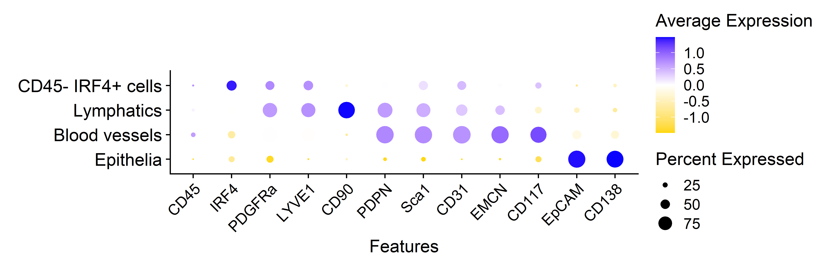
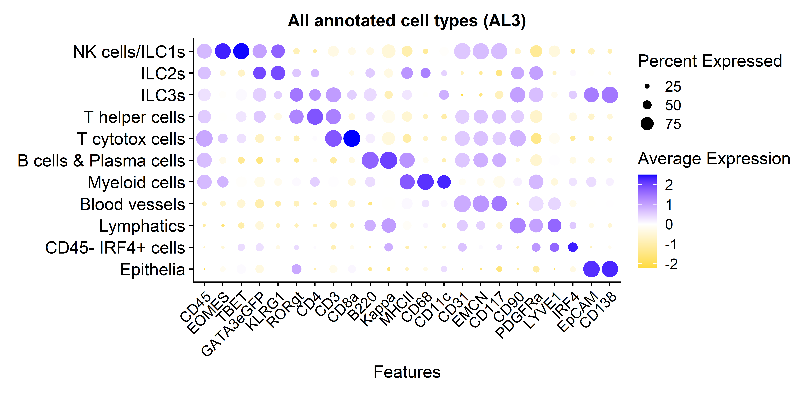

## Libraries


``` r
library(Seurat)
library(SeuratObject)
library(dplyr)
library(ggplot2)
# library(stringr)
# library(glue)
# library(here)
library(readr)
# library(lubridate)
# library(data.table)
# library(clustree)
# library(magrittr)
library(ggpubr)
# library(ggrepel)
# library(readxl)
# library(openxlsx)
```

## Parameters


``` r
set.seed(123)

input_dir <- here::here("1_data_tidying", "Lung_SI_all_cells_all_ALs_files")

output_dir <- here::here("2_visualizations_for_figures", "Supp_Fig_1_AL2_in_lung_files")
dir.create(output_dir)


main_markers <- c(
  "EpCAM", "EMCN", "LYVE1", "PDPN", "PDGFRa", "CD8a", "CD4",
  "CD45", "CD3", "IRF4", "Kappa", "CD11c", "CD127", "GATA3eGFP", "RORgt"
)


immune_markers <- c(
 "CD3", "CD4", "CD8a", "Kappa", "IRF4", "CD11c",
  "CD127", "CD90", "EOMES", "GATA3eGFP", "RORgt", "Ki67",  "KLRG1", "NKp46", "CD117", "Areg", "CCR6", "CD44", "MHCII", "Sca1"
)

ilc_markers <- c(
  "CD3", "CD4", "CD8a",
  "CD127", "CD90", "EOMES", "GATA3eGFP", "RORgt", "KLRG1", "NKp46", "CD117", "CCR6", "MHCII", "Ki67", "Areg", "IRF4", "Sca1", "CD44"
)


cols_nat <- c("magenta", "cyan", "blue", "purple", "green", 
                       "red", "yellow", "olivedrab1", "slateblue1", 
                       "darkcyan", "gold","indianred1", "seagreen", "deeppink", 
                       "orange", "brown", "violet",
                       "deeppink4", "pink", 
                       "grey", "black", "lightgreen", 
                       "#FF0066",  
                       "lightblue", "#FFCC99", "#CC00FF", 
                       "blueviolet",  "goldenrod4", 
                       "navy", "olivedrab", "lightcyan", "seagreen2", "darkviolet", "lightpink", "slateblue4", "olivedrab2")

colfunc <- colorRampPalette(c("darkcyan", "green", "yellow", "magenta", "purple"))
```

# Load data


``` r
SO.lung <- readRDS(paste0(input_dir, "/lung_all_cells_all_ALs.rds"))
dim(SO.lung)
```

```
## [1]    32 67537
```

``` r
SO.lung$AL1 <- gsub("Vessels", "Stromal cells", SO.lung$AL1)
SO.lung$AL2 <- gsub("LYVE1 CD90 |EMCN CD31 ", "", SO.lung$AL2)
SO.lung$AL2 <- gsub("LYVE1 CD31 vessels", "CD45- IRF4+ cells", SO.lung$AL2)
SO.lung$AL3 <- gsub("LYVE1 CD31 vessels", "CD45- IRF4+ cells", SO.lung$AL3)
```

# Visualization

## Dotplot AL2


``` r
SO.lung$AL2 <- factor(SO.lung$AL2, levels = c(
  "Epithelia",
  "Blood vessels",
  "Lymphatics",
  "CD45- IRF4+ cells"
))


dot_plot <- Seurat::DotPlot(subset(SO.lung, subset = AL1 != "Immune cells"), 
                group.by = "AL2",
                  features = c(
                    "CD45", 
                    "IRF4",
                    "PDGFRa", 
                    "LYVE1",
                    "CD90", 
                    "PDPN", 
                    "Sca1", 
                    "CD31", 
                    "EMCN", 
                    "CD117",
                    "EpCAM", 
                    "CD138" 
                  ), 
                cols ="RdBu", assay = "MELC")+   
    RotatedAxis()+
    # coord_flip()+
    theme(axis.text.x=element_text(size=12, angle = 45),
          axis.text.y=element_text(size=14), 
          plot.margin = margin(2, 0, 0.4, 0.5, "cm"), 
          axis.title.y = element_blank(), 
          plot.title = element_blank())+ 
  scale_color_gradient2(midpoint = 0, low = "gold", 
                            high = "blue", space = "Lab" )

dot_plot
```




``` r
SO.lung$AL3 <- factor(SO.lung$AL3, levels = c(
  "Epithelia",
  "CD45- IRF4+ cells",
  "Lymphatics",
  "Blood vessels", 
  "Myeloid cells", 
  "B cells & Plasma cells", 
  "T cytotox cells", 
  "T helper cells", 
  "ILC3s", 
  "ILC2s", 
  "NK cells/ILC1s"
))


dot_plot <- Seurat::DotPlot(SO.lung, 
                group.by = "AL3",
                  features = c(
                    "CD45", 
                    "EOMES", 
                    "TBET", 
                    "GATA3eGFP", 
                    "KLRG1", 
                    "RORgt",
                    "CD4", 
                    "CD3", 
                    "CD8a", 
                    "B220", 
                    "Kappa",
                    "MHCII", 
                    "CD68", 
                    "CD11c",
                    "CD31", 
                    "EMCN", 
                    "CD117",
                    "CD90", 
                    "PDGFRa", 
                    "LYVE1",
                    "IRF4",
                    "EpCAM", 
                    "CD138" 
                  ), 
                cols ="RdBu", assay = "MELC")+   
    RotatedAxis()+
  ggtitle("All annotated cell types (AL3)")+
    # coord_flip()+
    theme(axis.text.x=element_text(size=12, angle = 45),
          axis.text.y=element_text(size=14), 
          plot.margin = margin(0.4, 0, 0.4, 0.5, "cm"), 
          axis.title.y = element_blank(), 
          plot.title = element_text(size=14, hjust = 0.5))+ 
  scale_color_gradient2(midpoint = 0, low = "gold", 
                            high = "blue", space = "Lab" )

dot_plot
```



## Session Information


``` r
save.image(paste0(output_dir, "/environment.RData"))
sessionInfo()
```

```
## R version 4.4.2 (2024-10-31 ucrt)
## Platform: x86_64-w64-mingw32/x64
## Running under: Windows 10 x64 (build 19045)
## 
## Matrix products: default
## 
## 
## locale:
## [1] LC_COLLATE=English_Germany.utf8  LC_CTYPE=English_Germany.utf8    LC_MONETARY=English_Germany.utf8 LC_NUMERIC=C                     LC_TIME=English_Germany.utf8    
## 
## time zone: Europe/Berlin
## tzcode source: internal
## 
## attached base packages:
## [1] stats     graphics  grDevices utils     datasets  methods   base     
## 
## other attached packages:
## [1] ggpubr_0.6.0       readr_2.1.5        ggplot2_3.5.1      dplyr_1.1.4        Seurat_5.2.1       SeuratObject_5.0.2 sp_2.2-0          
## 
## loaded via a namespace (and not attached):
##   [1] RColorBrewer_1.1-3     rstudioapi_0.17.1      jsonlite_1.9.1         magrittr_2.0.3         spatstat.utils_3.1-3   farver_2.1.2           rmarkdown_2.29         vctrs_0.6.5            ROCR_1.0-11            spatstat.explore_3.4-2 rstatix_0.7.2          htmltools_0.5.8.1      broom_1.0.8            Formula_1.2-5          sass_0.4.10            sctransform_0.4.1      parallelly_1.43.0      KernSmooth_2.23-24     bslib_0.9.0            htmlwidgets_1.6.4      ica_1.0-3              plyr_1.8.9             plotly_4.10.4          zoo_1.8-13             cachem_1.1.0           igraph_2.1.4           mime_0.13              lifecycle_1.0.4        pkgconfig_2.0.3        Matrix_1.7-1           R6_2.6.1               fastmap_1.2.0          fitdistrplus_1.2-2     future_1.40.0          shiny_1.10.0           digest_0.6.37          colorspace_2.1-1       patchwork_1.3.0        rprojroot_2.0.4        tensor_1.5             RSpectra_0.16-2        irlba_2.3.5.1          labeling_0.4.3         progressr_0.15.1       spatstat.sparse_3.1-0  httr_1.4.7             polyclip_1.10-7        abind_1.4-8            compiler_4.4.2         here_1.0.1             withr_3.0.2           
##  [52] backports_1.5.0        carData_3.0-5          fastDummies_1.7.5      ggsignif_0.6.4         MASS_7.3-61            tools_4.4.2            lmtest_0.9-40          httpuv_1.6.15          future.apply_1.11.3    goftest_1.2-3          glue_1.8.0             nlme_3.1-166           promises_1.3.2         grid_4.4.2             Rtsne_0.17             cluster_2.1.6          reshape2_1.4.4         generics_0.1.3         gtable_0.3.6           spatstat.data_3.1-6    tzdb_0.4.0             tidyr_1.3.1            data.table_1.17.0      hms_1.1.3              car_3.1-3              spatstat.geom_3.3-6    RcppAnnoy_0.0.22       ggrepel_0.9.6          RANN_2.6.2             pillar_1.10.2          stringr_1.5.1          spam_2.11-1            RcppHNSW_0.6.0         later_1.4.1            splines_4.4.2          lattice_0.22-6         survival_3.7-0         deldir_2.0-4           tidyselect_1.2.1       miniUI_0.1.2           pbapply_1.7-2          knitr_1.50             gridExtra_2.3          scattermore_1.2        xfun_0.51              matrixStats_1.5.0      stringi_1.8.4          lazyeval_0.2.2         yaml_2.3.10            evaluate_1.0.3         codetools_0.2-20      
## [103] tibble_3.2.1           cli_3.6.3              uwot_0.2.3             xtable_1.8-4           reticulate_1.42.0      munsell_0.5.1          jquerylib_0.1.4        Rcpp_1.0.14            globals_0.17.0         spatstat.random_3.3-3  png_0.1-8              spatstat.univar_3.1-2  parallel_4.4.2         dotCall64_1.2          listenv_0.9.1          viridisLite_0.4.2      scales_1.3.0           ggridges_0.5.6         purrr_1.0.4            rlang_1.1.5            cowplot_1.1.3
```
