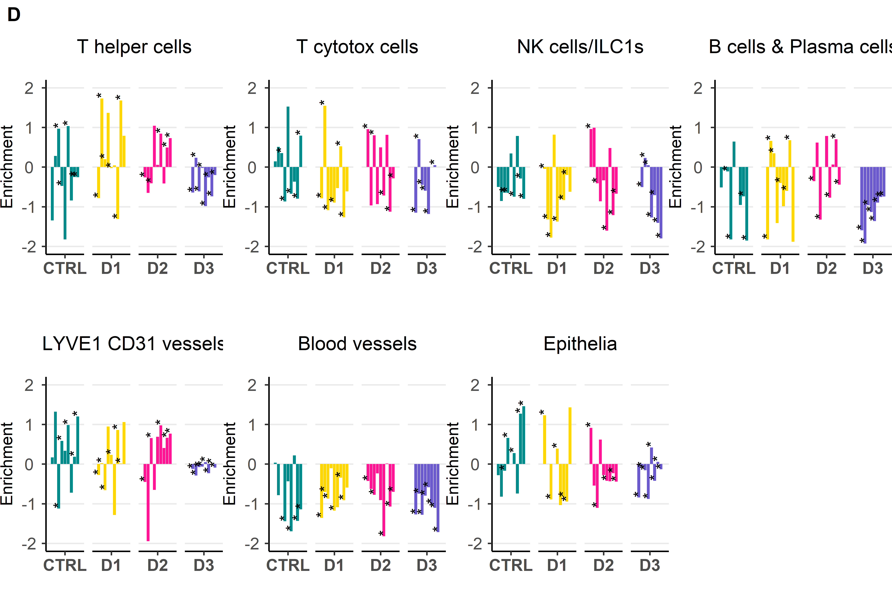
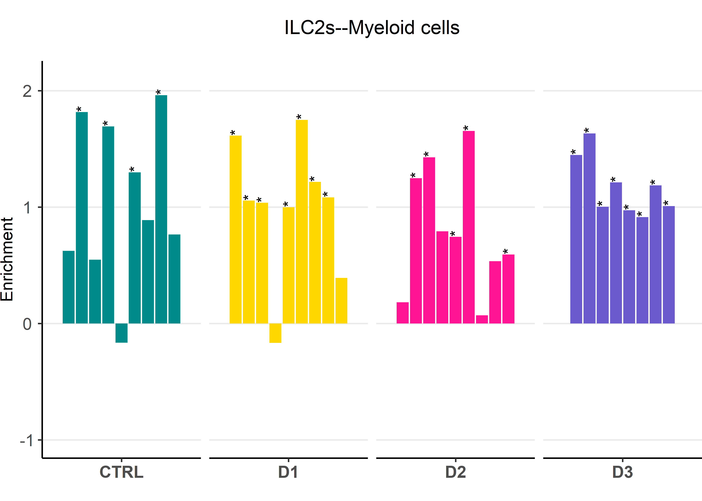
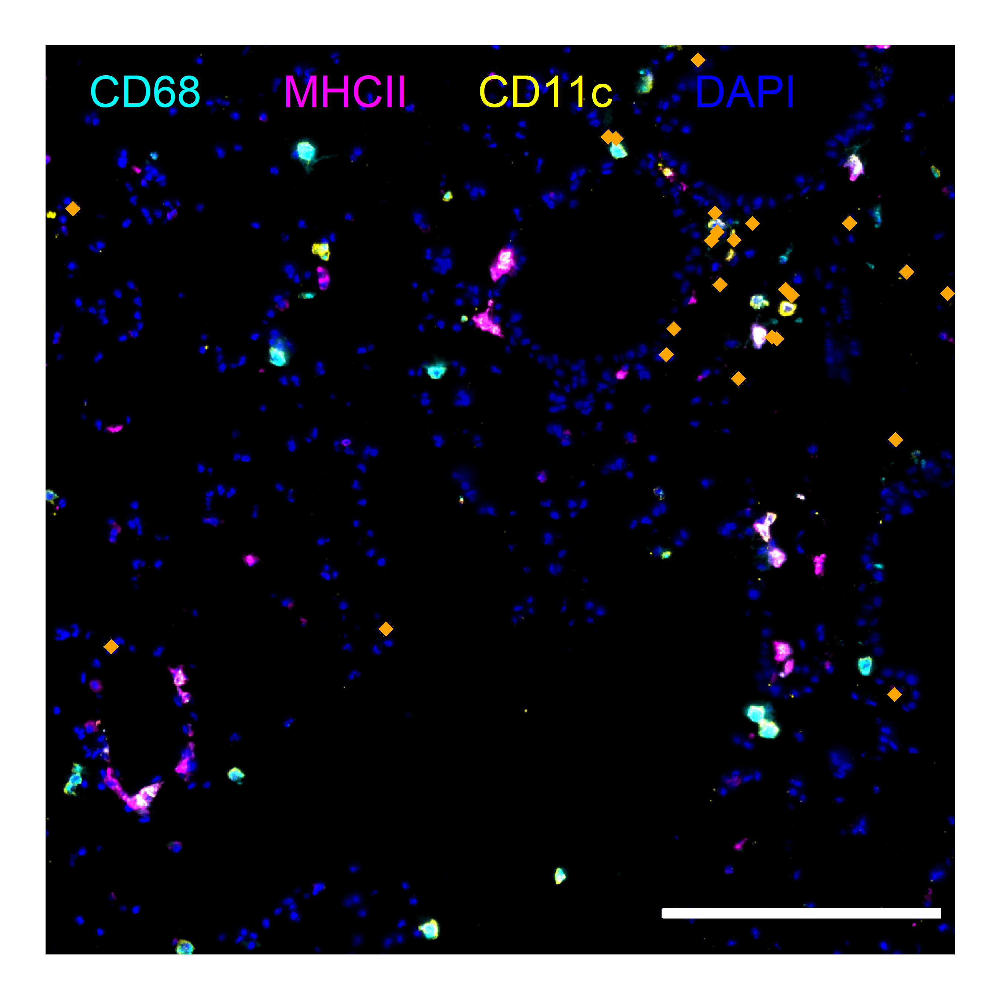
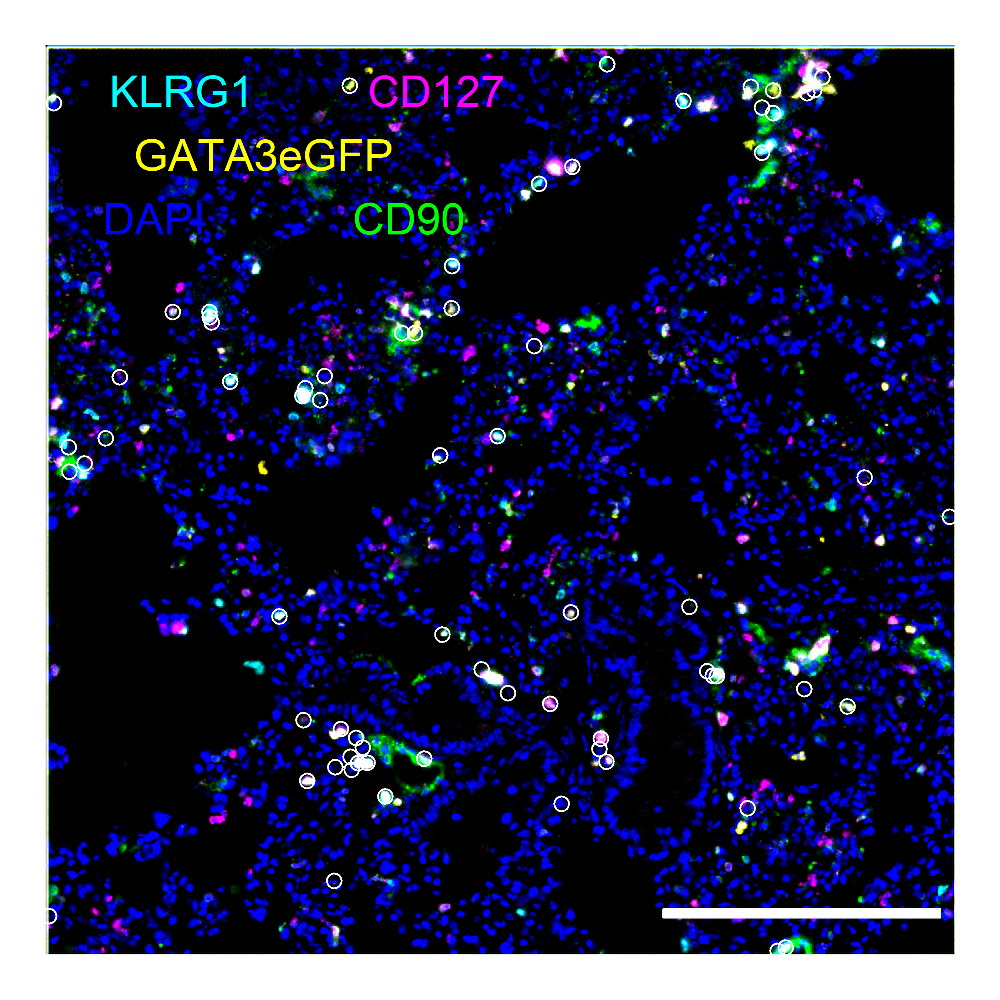
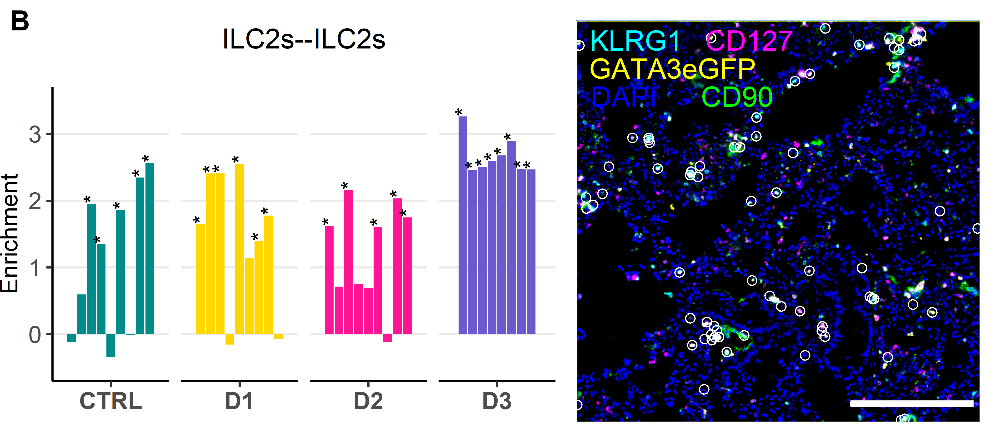
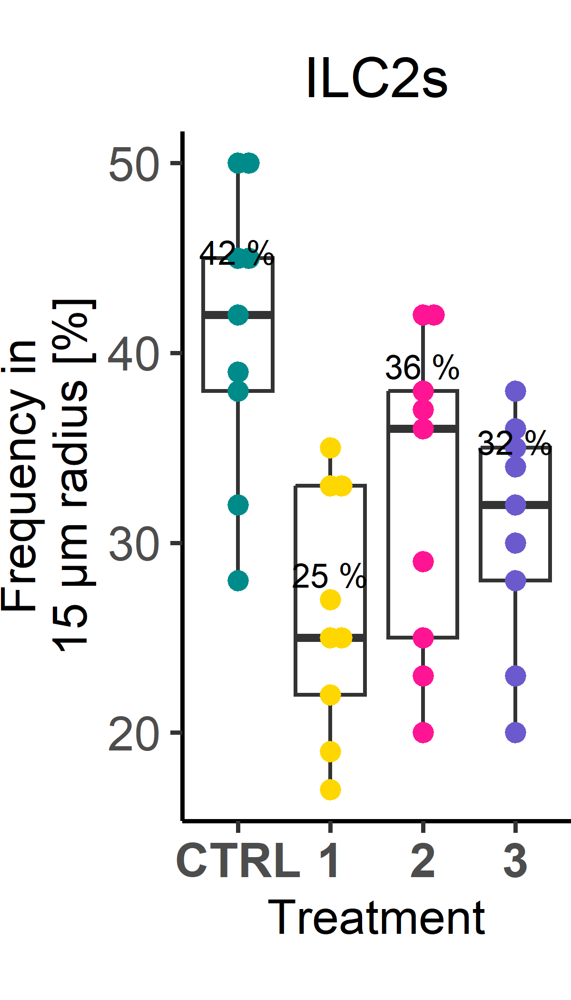
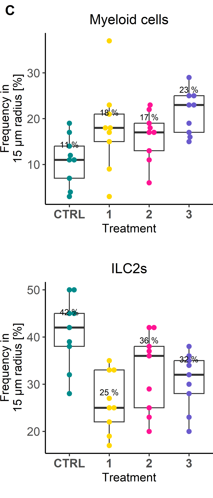
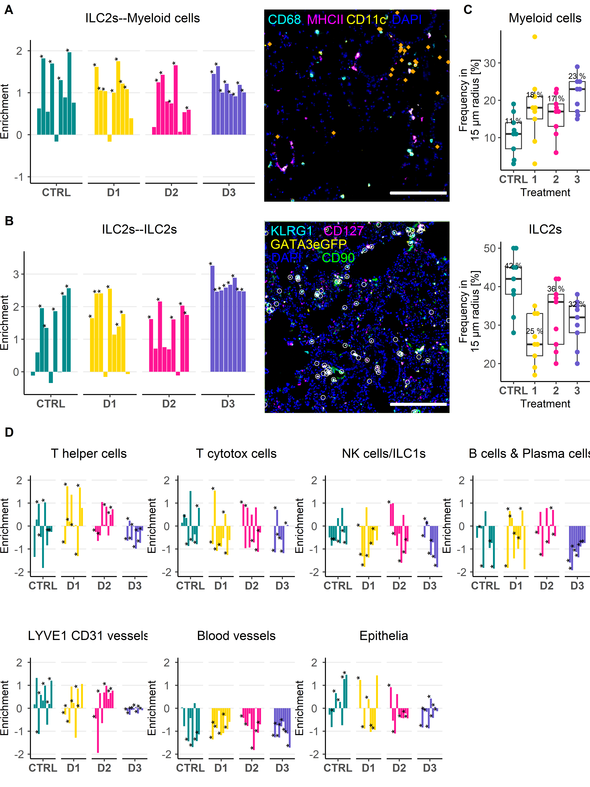
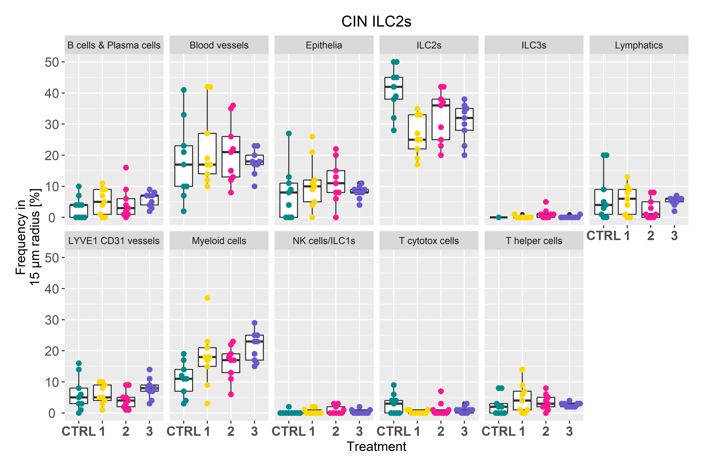

## Libraries


``` r
library(SeuratObject)
library(dplyr)
library(rstatix)

# remove.packages("rlang")
# remove.packages("dplyr")
# install.packages("rlang")
# install.packages("dplyr")
library(rlang)
library(dplyr)

if (!requireNamespace("Giotto", quietly = TRUE))
  devtools::install_github("drieslab/Giotto@suite")
if (!requireNamespace("VoltRon", quietly = TRUE))
  devtools::install_github("Artur-man/VoltRon")
if (!requireNamespace("Seurat", quietly = TRUE))
  install.packages("Seurat")
library(Giotto)
library(Seurat)
library(VoltRon)
library(ggplot2)
library(ggpubr)
library(readr)
library(ggbeeswarm)
library(stringr)
```

## Parameters


``` r
set.seed(123)

input_dir <- here::here("1_data_tidying", "Lung_SI_all_cells_all_ALs_files")

output_dir <- here::here("2_visualizations_for_figures", "Supp_Fig_2_spatial_analysis_ILC2s_lung_files")
dir.create(output_dir)


main_markers <- c(
  "EpCAM", "EMCN", "LYVE1", "PDPN", "PDGFRa", "CD8a", "CD4",
  "CD45", "CD3", "IRF4", "Kappa", "CD11c", "CD127", "GATA3eGFP", "RORgt"
)


immune_markers <- c(
 "CD3", "CD4", "CD8a", "Kappa", "IRF4", "CD11c",
  "CD127", "CD90", "EOMES", "GATA3eGFP", "RORgt", "Ki67",  "KLRG1", "NKp46", "CD117", "Areg", "CCR6", "CD44", "MHCII", "Sca1"
)

ilc_markers <- c(
  "CD3", "CD4", "CD8a",
  "CD127", "CD90", "EOMES", "GATA3eGFP", "RORgt", "KLRG1", "NKp46", "CD117", "CCR6", "MHCII", "Ki67", "Areg", "IRF4", "Sca1", "CD44"
)


cols_nat <- c("magenta", "cyan", "blue", "purple", "green", 
                       "red", "yellow", "olivedrab1", "slateblue1", 
                       "darkcyan", "gold","indianred1", "seagreen", "deeppink", 
                       "orange", "brown", "violet",
                       "deeppink4", "pink", 
                       "grey", "black", "lightgreen", 
                       "#FF0066",  
                       "lightblue", "#FFCC99", "#CC00FF", 
                       "blueviolet",  "goldenrod4", 
                       "navy", "olivedrab", "lightcyan", "seagreen2", "darkviolet", "lightpink", "slateblue4", "olivedrab2")

colfunc <- colorRampPalette(c("darkcyan", "green", "yellow", "magenta", "purple"))

cols_ilcs_lung <- c("darkcyan", "seagreen2", "deeppink4")

cols_treat <- c("darkcyan", "gold", "deeppink", "slateblue")
```

# Load data

## Giotto & VoltRon


``` r
# from import_Giotto.Rmd
gio_list <- readRDS(here::here("data", "Giotto_data_lung.rds"))

# from import_VoltRon.Rmd
vr_list <- readRDS(here::here("data", "VoltRon_data_lung.rds"))

# original data
metadatax <- read_csv(here::here("data", "MELC_data_murine_lung_CTRL_D1_D2_D3_withfolders.csv"))
metadatax <- metadatax %>%
  mutate(CellType = AL3)  %>%
  filter(Sample != "20210906_3_lu_d3")

unique(metadatax$CellType)
```

```
##  [1] "Epithelia"               "EMCN CD31 Blood vessels" "LYVE1 CD31 vessels"      "LYVE1 CD90 Lymphatics"   "Myeloid cells"           "B cells & Plasma cells"  "NK cells/ILC1s"          "ILC3s"                   "T cytotox cells"         "T helper cells"          "ILC2s"
```

``` r
vr_list_names <- unique(metadatax$Sample)


cell_proximities_list <- list()
for(samp in vr_list_names){
  print(samp)
  cell_proximities_list[[samp]] <-cellProximityEnrichment(
    gobject = gio_list[[samp]],
    cluster_column = 'CellType',
    spatial_network_name = 'Delaunay_network',
    adjust_method = 'fdr',
    number_of_simulations = 1000)
  cell_proximities_list[[samp]] <- cell_proximities_list[[samp]]$enrichm_res
}
```

```
## [1] "20210910_1_lu_ctrl"
## [1] "20210914_1_lu_ctrl"
## [1] "20210922_1_lu_ctrl"
## [1] "20210910_2_lu_ctrl"
## [1] "20210914_2_lu_ctrl"
## [1] "20210922_2_lu_ctrl"
## [1] "20210910_3_lu_ctrl"
## [1] "20210914_3_lu_ctrl"
## [1] "20210922_3_lu_ctrl"
## [1] "20220311_1"
## [1] "20220316_1"
## [1] "20220321_1"
## [1] "20220311_2"
## [1] "20220316_2"
## [1] "20220321_2"
## [1] "20220311_3"
## [1] "20220316_3"
## [1] "20220321_3"
## [1] "20220325_1"
## [1] "20220421_1"
## [1] "20220502_1"
## [1] "20220325_2"
## [1] "20220421_2"
## [1] "20220502_2"
## [1] "20220325_3"
## [1] "20220421_3"
## [1] "20220502_3"
## [1] "20210902_1_lu_d3"
## [1] "20210906_1_lu_d3"
## [1] "20210928_1_lu_d3"
## [1] "20210902_2_lu_d3"
## [1] "20210906_2_lu_d3"
## [1] "20210928_2_lu_d3"
## [1] "20210902_3_lu_d3"
## [1] "20210928_3_lu_d3"
```

``` r
vr_merged <- merge(vr_list[[1]], vr_list[-1])
vrImageNames(vr_merged)
```

```
## [1] "image_1"
```

``` r
unique(vr_merged$CellType)
```

```
##  [1] "Epithelia"               "EMCN CD31 Blood vessels" "LYVE1 CD31 vessels"      "LYVE1 CD90 Lymphatics"   "Myeloid cells"           "B cells & Plasma cells"  "NK cells/ILC1s"          "T cytotox cells"         "T helper cells"          "ILC2s"                   "ILC3s"
```

Calculate co-enrichment scores and plot them:


``` r
# FOVs for representative overview images
fovs <- vr_list_names

set_alpha <- 0.35
set_ptsize <- 2
set_nrows <- 1
set_ncols <- 3
cell_shape <- 20


cols_con <- c("darkcyan", "gold", "deeppink", 
                "slateblue")

cols_fov <- c("darkcyan", "gold", "deeppink", 
                "slateblue")

ColorsCellType <-  list(
  #`NK cells/ILC1s/ILC3s` = "cyan", 
  `ILC2s` = "magenta",
  #`ILC3s` = "magenta", 
  `EMCN CD31 Blood vessels` = "green")

uni_celltypes <- unique(vr_merged$CellType)
backgroundlist <- list("EpCAM","CD31","LYVE1","LYVE1","CD11c","B220","EOMES", "CD8a", "CD4", "GATA3eGFP", "RORgt")
names(backgroundlist) <- uni_celltypes
uni_celltypes <- uni_celltypes[!uni_celltypes %in% "ILC2s"]

g_master_list <- list()
for(unic in uni_celltypes){
  
    ### selected cell groups ####
  selected_celltypes <- c("ILC2s", unic)
  # interactions <- c("EMCN CD31 Blood vessels--ILC2s")
  interactions <- unique(cell_proximities_list[[vr_list_names[30]]]$unified_int)
  interactions <- interactions[grepl("ILC2s", interactions) & grepl(unic, interactions)]
  background_image <- backgroundlist[[unic]]
  if(length(interactions) > 0){
     ### get interaction results ####
    interaction_celltypes <- NULL
    for(samp in vr_list_names){
      cur_cell_proximities <- cell_proximities_list[[samp]]
      cur_cell_proximities <- cur_cell_proximities[cur_cell_proximities$unified_int %in% interactions,]
      sample <- unique(metadatax$FullInfo[metadatax$Sample==samp])
      if(nrow(cur_cell_proximities) > 0 & sample != "20210906_FOV3_D3"){
        interaction_celltypes <- rbind(interaction_celltypes,
                                       data.frame(cur_cell_proximities[cur_cell_proximities$unified_int %in% interactions,], 
                                                  experiment = strsplit(sample, split = "_")[[1]][1], fov = strsplit(sample, split = "_")[[1]][2], condition = strsplit(sample, split = "_")[[1]][3]))
      }
    }
    interaction_celltypes$p.adj <- ifelse(interaction_celltypes$enrichm > 0, interaction_celltypes$p.adj_higher, interaction_celltypes$p.adj_lower)

    
    sig_label <- as.character(ifelse(interaction_celltypes$p.adj < 0.1, paste0("*"), ""))

    g_test <- ggplot(interaction_celltypes, aes(x = condition, y = enrichm, fill = condition)) +
      geom_bar(stat = "identity", position = position_dodge2(width=0.9, preserve = "single")) +
      facet_grid(.~condition, scales = "free_x") +
      geom_text(aes(label=sig_label), position=position_dodge2(width=0.9, preserve = "single"), angle = 90, hjust = -0.02, size = 4) +
      ylim(-2,2)+
      NoLegend()+
      theme_classic2()+
      scale_fill_manual(values = cols_fov, name = "") +
      theme(axis.text.x = element_text(#angle = 50,
                                       vjust = 1, size = 12, hjust = 0.5, face = "bold"
                                       ),
            axis.text.y = element_text(hjust = 0.5, size = 12),
            # axis.title.x = element_blank(),
            axis.title.y = element_text(size = 12),
            plot.title = element_text(size =14, hjust = 0.5),
            plot.margin = margin(1, 1, 0.5, 0, "cm"),
            legend.position = "none",
            strip.background=element_blank(),
            strip.background.x= element_blank(),
            strip.text.x = element_text(size = 1, color = "white"),
            panel.grid.major.y = element_line())+
      NoLegend()+  
      ggtitle(gsub("LYVE1 CD90 |EMCN CD31 |ILC2s--|--ILC2s", "", interactions)) +
      ylab("Enrichment") +
      xlab("")
    
    
    g_master_list[[unic]] <- g_test+
    theme(plot.margin = margin(1, 1, 0, 0, "cm"))
  }
}

# ILC2s around ILC2s -----------------------------------------
interactions <- c("ILC2s--ILC2s")
unic <- "ILC2s"
background_image <- backgroundlist[["ILC2s"]]
interaction_celltypes <- NULL
for(samp in vr_list_names){
    cur_cell_proximities <- cell_proximities_list[[samp]]
    cur_cell_proximities <- cur_cell_proximities[cur_cell_proximities$unified_int %in% interactions,]
    sample <- unique(metadatax$FullInfo[metadatax$Sample==samp])
    if(nrow(cur_cell_proximities) > 0 & sample != "20210906_FOV3_D3"){
      interaction_celltypes <- rbind(interaction_celltypes,
                                     data.frame(cur_cell_proximities[cur_cell_proximities$unified_int %in% interactions,], 
                                                experiment = strsplit(sample, split = "_")[[1]][1], fov = strsplit(sample, split = "_")[[1]][2], condition = strsplit(sample, split = "_")[[1]][3]))
    }
  }
interaction_celltypes$p.adj <- ifelse(interaction_celltypes$enrichm > 0, interaction_celltypes$p.adj_higher, interaction_celltypes$p.adj_lower)
  # plot test results
  # sig_label <- as.character(ifelse(interaction_celltypes$p.adj < 0.1, paste0("p=",round(interaction_celltypes$p.adj,3)), ""))
  sig_label <- as.character(ifelse(interaction_celltypes$p.adj < 0.1, paste0("*"), ""))
    # print(sig_label)
g_test <- ggplot(interaction_celltypes, aes(x = condition, y = enrichm, fill = condition)) +
  geom_bar(stat = "identity", position = position_dodge2(width=0.9, preserve = "single")) +
  facet_grid(.~condition, scales = "free_x") +
  geom_text(aes(label=sig_label), position=position_dodge2(width=0.9, preserve = "single"), angle = 90, hjust = -0.02, size = 4) +
  ylim(-2,2)+
  NoLegend()+
  theme_classic2()+
  scale_fill_manual(values = cols_fov, name = "") +
  theme(axis.text.x = element_text(#angle = 50,
                                   vjust = 1, size = 12, hjust = 0.5, face = "bold"
                                   ),
        axis.text.y = element_text(hjust = 0.5, size = 12),
        # axis.title.x = element_blank(),
        axis.title.y = element_text(size = 12),
        plot.title = element_text(size =14, hjust = 0.5),
        plot.margin = margin(1, 0.5, 0, 0.5, "cm"),
        legend.position = "none",
        strip.background=element_blank(),
        strip.background.x= element_blank(),
        strip.text.x = element_text(size = 1, color = "white"),
        panel.grid.major.y = element_line())+
  NoLegend()+  
  ggtitle(gsub("LYVE1 CD90 |EMCN CD31 |ILC2s--|--ILC2s", "", interactions)) +
  ylab("Enrichment") +
      xlab("")


g_master_list[[unic]] <- g_test+
    theme(plot.margin = margin(1, 0.5, 0, 0.5, "cm"))
```

## CIN


``` r
library(stringr)

input_dir <- "C:/Users/NieHau/Desktop/Sandy/R/R_analysis_output/Niche_analysis_SPIAT_all_organs_CIN/Output/"

# List all radii calculated 
list_files_rad <- list.files(path="C:/Users/NieHau/Desktop/Sandy/R/R_analysis_output/Niche_analysis_SPIAT_all_organs_CIN/Output/Lung", 
                         pattern=NULL, all.files=FALSE,
                         full.names=FALSE)

list_files_rad
```

```
## [1] "10_micm" "15_micm" "20_micm" "25_micm"
```

``` r
df_cin_lung = data.frame()

tissuearea <- "Lung"

# define a dataframe to collect all data from one tissue area
df_radius <- data.frame()
for (defined_radius in list_files_rad) {
  print(defined_radius)
  list_files <- list.files(path=paste0(input_dir,
                                   tissuearea, 
                                   "/", 
                                   defined_radius, 
                                   "/"), 
                       pattern=NULL, all.files=FALSE,
                       full.names=FALSE)
  # define a dataframe to collect the data for all datasets of one 
  df_cin = data.frame()
  for (element in list_files) {
    dir <- paste0(input_dir,
                  tissuearea, 
                  "/", defined_radius, 
                  "/", element)
    df_sub <- read_csv(dir, 
      col_types = cols(...1 = col_skip()))
    df_sub$Filename <- paste0(tissuearea, 
                  "/", defined_radius, 
                  "/", element)
    df_cin <- rbind(df_cin, df_sub)
  }

  df_cin$Radius <- defined_radius
  df_radius <- rbind(df_radius, df_cin)
}
```

```
## [1] "10_micm"
```

```
## [1] "15_micm"
```

```
## [1] "20_micm"
```

```
## [1] "25_micm"
```

``` r
# collect data from current tissue area to datafram df_all_cin
df_cin_lung <- df_radius
df_cin_lung$Radius <- gsub("_micm", " \u03BCm", df_cin_lung$Radius)
df_cin_lung$Experiment <- str_sub(df_cin_lung$Dataset,-8,-1)
df_cin_lung$FOV <- str_sub(df_cin_lung$Dataset,-10,-10)  
df_cin_lung$Treatment <- str_extract(df_cin_lung$Dataset, "[^_]+")
df_cin_lung$ExpID <- paste0(df_cin_lung$Experiment, "_", df_cin_lung$FOV)
colnames(df_cin_lung) <- gsub("Reference cell", "Reference", 
                                colnames(df_cin_lung))

colnames(df_cin_lung) <- gsub("NK cells & ILC1s", "NK cells/ILC1s", 
                              colnames(df_cin_lung))
df_cin_lung$Reference <- gsub("NK cells & ILC1s", "NK cells/ILC1s",
                              df_cin_lung$Reference)
head(df_cin_lung)
```

```
## # A tibble: 6 × 21
##   Dataset          Epithelia `EMCN CD31 Blood vessels` `LYVE1 CD31 vessels` `LYVE1 CD90 Lymphatics` `Myeloid cells` `B cells & Plasma cells` `NK cells/ILC1s` ILC3s `T cytotox cells` `T helper cells` ILC2s Reference               Organ Tissue.area Filename                                               Radius Experiment FOV   Treatment ExpID     
##   <chr>                <dbl>                     <dbl>                <dbl>                   <dbl>           <dbl>                    <dbl>            <dbl> <dbl>             <dbl>            <dbl> <dbl> <chr>                   <chr> <chr>       <chr>                                                  <chr>  <chr>      <chr> <chr>     <chr>     
## 1 D3_FOV1_20210902        88                         4                    3                       1               3                        1                0     0                 0                0     0 Epithelia               Lung  Lung        Lung/10_micm/SPIAT_20210902_1_rad10_micm_Lung_freq.csv 10 μm  20210902   1     D3        20210902_1
## 2 D3_FOV1_20210902         2                        70                    6                       1               5                       11                1     0                 1                3     1 EMCN CD31 Blood vessels Lung  Lung        Lung/10_micm/SPIAT_20210902_1_rad10_micm_Lung_freq.csv 10 μm  20210902   1     D3        20210902_1
## 3 D3_FOV1_20210902         5                        18                   59                       2               7                        6                1     0                 1                2     1 LYVE1 CD31 vessels      Lung  Lung        Lung/10_micm/SPIAT_20210902_1_rad10_micm_Lung_freq.csv 10 μm  20210902   1     D3        20210902_1
## 4 D3_FOV1_20210902         5                        14                    8                      47              15                        8                0     0                 0                0     2 LYVE1 CD90 Lymphatics   Lung  Lung        Lung/10_micm/SPIAT_20210902_1_rad10_micm_Lung_freq.csv 10 μm  20210902   1     D3        20210902_1
## 5 D3_FOV1_20210902         5                        14                    6                       3              59                        4                1     0                 0                2     5 Myeloid cells           Lung  Lung        Lung/10_micm/SPIAT_20210902_1_rad10_micm_Lung_freq.csv 10 μm  20210902   1     D3        20210902_1
## 6 D3_FOV1_20210902         1                        27                    5                       1               3                       54                1     0                 2                4     1 B cells & Plasma cells  Lung  Lung        Lung/10_micm/SPIAT_20210902_1_rad10_micm_Lung_freq.csv 10 μm  20210902   1     D3        20210902_1
```

``` r
colnames(df_cin_lung)
```

```
##  [1] "Dataset"                 "Epithelia"               "EMCN CD31 Blood vessels" "LYVE1 CD31 vessels"      "LYVE1 CD90 Lymphatics"   "Myeloid cells"           "B cells & Plasma cells"  "NK cells/ILC1s"          "ILC3s"                   "T cytotox cells"         "T helper cells"          "ILC2s"                   "Reference"               "Organ"                   "Tissue.area"             "Filename"                "Radius"                  "Experiment"              "FOV"                     "Treatment"               "ExpID"
```

``` r
df_cin_lung$Treatment <- gsub("D", "", df_cin_lung$Treatment)

radius <- unique(df_cin_lung$Radius)[2]
```

# Visualization

## Coenrichment scores of ILCs and other cell types


``` r
enrichment_scores_all <- ggarrange(plotlist = g_master_list[c(9, 8, 7, 6, 3, 2, 1)], ncol = 4, nrow = 2, 
          labels = c("D"))

enrichment_scores_all
```



## 2A: Coenrichment ILC2s & myeloid cells


``` r
# fine tune the co-enrichment plot
# ILC2s around ILC2s -----------------------------------------
interactions <- c("ILC2s--Myeloid cells")
unic <- "Myeloid cells"
background_image <- backgroundlist[["Myeloid cells"]]
interaction_celltypes <- NULL
for(samp in vr_list_names){
    cur_cell_proximities <- cell_proximities_list[[samp]]
    cur_cell_proximities <- cur_cell_proximities[cur_cell_proximities$unified_int %in% interactions,]
    sample <- unique(metadatax$FullInfo[metadatax$Sample==samp])
    if(nrow(cur_cell_proximities) > 0 & sample != "20210906_FOV3_D3"){
      interaction_celltypes <- rbind(interaction_celltypes,
                                     data.frame(cur_cell_proximities[cur_cell_proximities$unified_int %in% interactions,], 
                                                experiment = strsplit(sample, split = "_")[[1]][1], fov = strsplit(sample, split = "_")[[1]][2], condition = strsplit(sample, split = "_")[[1]][3]))
    }
  }
interaction_celltypes$p.adj <- ifelse(interaction_celltypes$enrichm > 0, interaction_celltypes$p.adj_higher, interaction_celltypes$p.adj_lower)
  # plot test results
  # sig_label <- as.character(ifelse(interaction_celltypes$p.adj < 0.1, paste0("p=",round(interaction_celltypes$p.adj,3)), ""))
  sig_label <- as.character(ifelse(interaction_celltypes$p.adj < 0.1, paste0("*"), ""))
    # print(sig_label)
plot_coenrichment_myeloid <- ggplot(interaction_celltypes, aes(x = condition, y = enrichm, fill = condition)) +
  geom_bar(stat = "identity", position = position_dodge2(width=0.9, preserve = "single")) +
  facet_grid(.~condition, scales = "free_x") +
  geom_text(aes(label=sig_label), position=position_dodge2(width=0.9, preserve = "single"), angle = 90, hjust = -0.02, size = 4) +
  ylim(-1,2.1)+
  NoLegend()+
  theme_classic2()+
  scale_fill_manual(values = cols_fov, name = "") +
  ggtitle(gsub("LYVE1 CD90 ", "", interactions)) +
  theme(axis.text.x = element_text(#angle = 50,
                                   vjust = 1, size = 12, hjust = 0.5, face = "bold"
                                   ),
        axis.text.y = element_text(hjust = 0.5, size = 12),
        axis.title.x = element_blank(),
        axis.title.y = element_text(size = 12),
        plot.title = element_text(size =14, hjust = 0.5),
        plot.margin = margin(0.5, 1, 0.5, 1, "cm"),
        legend.position = "none",
        strip.background=element_blank(),
        strip.background.x= element_blank(),
        strip.text.x = element_text(size = 1, color = "white"),
        panel.grid.major.y = element_line())+
  NoLegend()+  
  ylab("Enrichment")

plot_coenrichment_myeloid
```



ILC2s on myeloid IF:


``` r
set_ptsize <- 2
cell_shape <- 18
set_alpha <- 1

# define markers for the Overlay

# CYAN
marker1 <- "CD68"
# MAGENTA
marker2 <- "MHCII"
# YELLOW
marker3 <- "CD11c"
# GREEN
marker4 <- "EpCAM"
# RED
marker5 <- "CD31"
# BLUE
marker6 <- "DAPI"

# define cell type of interested that should be plotted on the overlay
# celltype_of_interest <- c("ILC2s", "Myeloid cells")
celltype_of_interest <- "ILC2s"

ColorsCellTypeSingle <-  list(
  #`NK cells/ILC1s/ILC3s` = "cyan", 
  `ILC2s` = "orange"#,
  #`ILC3s` = "magenta", 
  # `Myeloid cells` = "orange"
  )


name_channel_key <- paste0(marker1, "-c_", marker2, "-m_", marker3, "-y_", 
                           # marker4, "-g_", 
                           # marker5, "-r" 
                           marker6, "-b" 
                           )
vr_merged <- combineChannels(vr_merged,
                             channels = c(marker1, marker2, marker3, 
                                          # marker4, 
                                          # marker5
                                          marker6
                                          ),
                             colors = c("cyan", "magenta", "yellow", 
                                        # "green",
                                        # "red"
                                        "blue"
                                        ),
                             channel_key = name_channel_key)


cell_type_of_interest <- "ILC2s"


# IL-33 D3 ------------------------------------------------------------
plot <- vrSpatialPlot(vr_merged, assay = paste0("Assay", 24), #2
                        group.by = "CellType", 
                        group.ids = celltype_of_interest,
                        alpha = set_alpha, 
                        background = c("image_1", name_channel_key), 
                        pt.size = set_ptsize, cell.shape = cell_shape)+
  guides(color = guide_legend(override.aes = list(size = 5)))+
  scale_color_manual(values = ColorsCellTypeSingle)+
  scale_fill_manual(values = ColorsCellTypeSingle)+
  theme_void()+ NoLegend()+ ggtitle(NULL)+
  # ggtitle("IL-33 day 3")+
  theme(plot.title = element_text(hjust = 0.5, size = 14), 
        text = element_text(size = 12))


plot_if_myeloid <- plot +
  annotate("text", x=100, y=950, label= marker1,
           col="cyan", size=5, parse=TRUE) +
  annotate("text", x=300, y=950, label= marker2,
           col="magenta", size=5, parse=TRUE) +
  annotate("text", x=500, y=950, label= marker3,
           col="yellow", size=5, parse=TRUE)+
  annotate("text", x=700, y=950, label= marker6,
           col="blue", size=5, parse=TRUE)+
  # annotate("text", x=305, y=920, label= marker4,
  #          col="green", size=3.5, parse=TRUE)+
  # annotate("text", x=70, y=920, label= marker5,
  #          col="red", size=3.5, parse=TRUE)+
  annotate("segment", x = 680, xend = 985, y = 45, yend = 45, size = 1.6, 
  colour = "white")

plot_if_myeloid
```



combine plots:


``` r
plot_2a <- ggarrange(plot_coenrichment_myeloid, plot_if_myeloid, ncol = 2, nrow = 1, widths = c(1.5, 2), labels = c("A"))

plot_2a
```


## 2B: Coenrichment ILC2s and ILC2s


``` r
# fine tune the co-enrichment plot
# ILC2s around ILC2s -----------------------------------------
interactions <- c("ILC2s--ILC2s")
unic <- "ILC2s"
background_image <- backgroundlist[["ILC2s"]]
interaction_celltypes <- NULL
for(samp in vr_list_names){
    cur_cell_proximities <- cell_proximities_list[[samp]]
    cur_cell_proximities <- cur_cell_proximities[cur_cell_proximities$unified_int %in% interactions,]
    sample <- unique(metadatax$FullInfo[metadatax$Sample==samp])
    if(nrow(cur_cell_proximities) > 0 & sample != "20210906_FOV3_D3"){
      interaction_celltypes <- rbind(interaction_celltypes,
                                     data.frame(cur_cell_proximities[cur_cell_proximities$unified_int %in% interactions,], 
                                                experiment = strsplit(sample, split = "_")[[1]][1], fov = strsplit(sample, split = "_")[[1]][2], condition = strsplit(sample, split = "_")[[1]][3]))
    }
  }
interaction_celltypes$p.adj <- ifelse(interaction_celltypes$enrichm > 0, interaction_celltypes$p.adj_higher, interaction_celltypes$p.adj_lower)
  # plot test results
  # sig_label <- as.character(ifelse(interaction_celltypes$p.adj < 0.1, paste0("p=",round(interaction_celltypes$p.adj,3)), ""))
  sig_label <- as.character(ifelse(interaction_celltypes$p.adj < 0.1, paste0("*"), ""))
    # print(sig_label)
plot_coenrichment_ilc2s <- ggplot(interaction_celltypes, aes(x = condition, y = enrichm, fill = condition)) +
  geom_bar(stat = "identity", position = position_dodge2(width=0.9, preserve = "single")) +
  facet_grid(.~condition, scales = "free_x") +
  geom_text(aes(label=sig_label), position=position_dodge2(width=0.9, preserve = "single"), angle = 90, hjust = -0.02, size = 4) +
  ylim(-0.5,3.5)+
  NoLegend()+
  theme_classic2()+
  scale_fill_manual(values = cols_fov, name = "") +
  ggtitle(gsub("LYVE1 CD90 ", "", interactions)) +
  theme(axis.text.x = element_text(#angle = 50,
                                   vjust = 1, size = 12, hjust = 0.5, face = "bold"
                                   ),
        axis.text.y = element_text(hjust = 0.5, size = 12),
        axis.title.x = element_blank(),
        axis.title.y = element_text(size = 12),
        plot.title = element_text(size =14, hjust = 0.5),
        plot.margin = margin(0.5, 1, 0.5, 1, "cm"),
        legend.position = "none",
        strip.background=element_blank(),
        strip.background.x= element_blank(),
        strip.text.x = element_text(size = 1, color = "white"),
        panel.grid.major.y = element_line())+
  NoLegend()+  
  ylab("Enrichment")

plot_coenrichment_ilc2s
```


Plot ILC2s on overlay:


``` r
set_ptsize <- 2
cell_shape <- 1
set_alpha <- 1

# define markers for the Overlay

# CYAN
marker1 <- "KLRG1"
# MAGENTA
marker2 <- "CD127"
# YELLOW
marker3 <- "GATA3eGFP"
# GREEN
marker4 <- "CD90"
# RED
marker5 <- "CD31"
# BLUE
marker6 <- "DAPI"

# define cell type of interested that should be plotted on the overlay
celltype_of_interest <- "ILC2s"

ColorsCellTypeSingle <-  list(
  #`NK cells/ILC1s/ILC3s` = "cyan", 
  `ILC2s` = "white",
  #`ILC3s` = "magenta", 
  `EMCN CD31 Blood vessels` = "green")


name_channel_key <- paste0(marker1, "-c_", marker2, "-m_", marker3, "-y_", 
                           marker4, "-g_",
                           # marker5, "-r" 
                           marker6, "-b"
                           )
vr_merged <- combineChannels(vr_merged,
                             channels = c(marker1, marker2, marker3,
                                          marker4,
                                          # marker5
                                          marker6
                                          ),
                             colors = c("cyan", "magenta", "yellow",
                                        "green",
                                        # "red"
                                        "blue"
                                        ),
                             channel_key = name_channel_key)


cell_type_of_interest <- "ILC2s"

plot <- vrSpatialPlot(vr_merged, assay = paste0("Assay", 34), 
                        group.by = "CellType", 
                        group.ids = celltype_of_interest,
                        alpha = set_alpha, 
                        background = c("image_1", name_channel_key), 
                        pt.size = set_ptsize, cell.shape = cell_shape)+
  guides(color = guide_legend(override.aes = list(size = 5)))+
  scale_color_manual(values = ColorsCellTypeSingle)+
  scale_fill_manual(values = ColorsCellTypeSingle)+
  theme_void()+ NoLegend()+ ggtitle(NULL)+
  theme(plot.title = element_blank())


plot_if_ilc2s_ov <- plot +
  annotate("text", x=100, y=950, label= marker1,
           col="cyan", size=5, parse=TRUE) +
  annotate("text", x=300, y=950, label= marker2,
           col="magenta", size=5, parse=TRUE) +
  annotate("text", x=600, y=950, label= marker3,
           col="yellow", size=5, parse=TRUE)+
  annotate("text", x=100, y=890, label= marker6,
           col="blue", size=5, parse=TRUE)+
  annotate("text", x=300, y=890, label= marker4,
           col="green", size=5, parse=TRUE)+
  # annotate("text", x=70, y=920, label= marker5,
  #          col="red", size=3.5, parse=TRUE)+
  annotate("segment", x = 680, xend = 985, y = 45, yend = 45, size = 1.6, 
  colour = "white")

plot_if_ilc2s_ov
```



Combine plots for 2B:


``` r
plot_2b <- ggarrange(plot_coenrichment_ilc2s, plot_if_ilc2s_ov, ncol = 2, nrow = 1, widths = c(1.5, 2), labels = c("B"))

plot_2b
```



## 2C: CIN ILC2s

Myeloid cells:


``` r
df_sub_lung <- df_cin_lung %>%
  filter(Reference == celltype_of_interest) %>%
  filter(Radius == radius) %>%
  select(Reference, Radius, Treatment, Dataset, `Myeloid cells`, Tissue.area)

head(df_sub_lung)
```

```
## # A tibble: 6 × 6
##   Reference Radius Treatment Dataset          `Myeloid cells` Tissue.area
##   <chr>     <chr>  <chr>     <chr>                      <dbl> <chr>      
## 1 ILC2s     15 μm  3         D3_FOV1_20210902              29 Lung       
## 2 ILC2s     15 μm  3         D3_FOV2_20210902              25 Lung       
## 3 ILC2s     15 μm  3         D3_FOV3_20210902              23 Lung       
## 4 ILC2s     15 μm  3         D3_FOV1_20210906              25 Lung       
## 5 ILC2s     15 μm  3         D3_FOV2_20210906              16 Lung       
## 6 ILC2s     15 μm  3         D3_FOV3_20210906              15 Lung
```

``` r
plot_data <- df_sub_lung

# Create lav´bels that depict mean value 
Labs = plot_data %>% 
  group_by(Treatment) %>%
  summarise(lab_text = paste0(round(median(`Myeloid cells`), 0), " %"), lab_pos = quantile(`Myeloid cells`)[3]+2
              )

plot_data$Treatment <- factor(plot_data$Treatment, levels = c("CTRL", "1", "2", "3"))
# create plot
plot_cin_myeloid <- ggplot(plot_data, aes(x = Treatment, y = `Myeloid cells`, fill = "Treatment"))+
  geom_boxplot(fill="white")+
  geom_beeswarm(aes(color = Treatment), size = 2, cex = 3)+
  scale_color_manual(values = cols_treat)+
  theme_classic2()+
  theme(axis.text.x = element_text(#angle = 50,
                                   vjust = 1, size = 12, hjust = 0.5, face = "bold"),
        axis.text.y = element_text(hjust = 0.5, size = 12),
        axis.title.x = element_text(size = 12),
        axis.title.y = element_text(size = 12),
        plot.title = element_text(size =14, hjust = 0.5),
        plot.margin = margin(0.5, 0.5, 0.5, 0.5, "cm"),
        legend.title = element_text(size =14),
        legend.text = element_text(size =12))+
  NoLegend()+
  ggtitle("Myeloid cells")+
  xlab("Treatment")+
  ylab("Frequency in\n15 µm radius [%]")+
  # scale_y_continuous(expand = c(0, 0), limits = c(10,40))+
  geom_text(aes(y = lab_pos, label = lab_text, vjust = -0.5), data = Labs,size=3)
plot_cin_myeloid
```


ILC2s:


``` r
df_sub_lung <- df_cin_lung %>%
  filter(Reference == celltype_of_interest) %>%
  filter(Radius == radius) %>%
  select(Reference, Radius, Treatment, Dataset, `ILC2s`, Tissue.area)

head(df_sub_lung)
```

```
## # A tibble: 6 × 6
##   Reference Radius Treatment Dataset          ILC2s Tissue.area
##   <chr>     <chr>  <chr>     <chr>            <dbl> <chr>      
## 1 ILC2s     15 μm  3         D3_FOV1_20210902    30 Lung       
## 2 ILC2s     15 μm  3         D3_FOV2_20210902    20 Lung       
## 3 ILC2s     15 μm  3         D3_FOV3_20210902    23 Lung       
## 4 ILC2s     15 μm  3         D3_FOV1_20210906    28 Lung       
## 5 ILC2s     15 μm  3         D3_FOV2_20210906    36 Lung       
## 6 ILC2s     15 μm  3         D3_FOV3_20210906    38 Lung
```

``` r
plot_data <- df_sub_lung

# Create lav´bels that depict mean value 
Labs = plot_data %>% 
  group_by(Treatment) %>%
  summarise(lab_text = paste0(round(median(`ILC2s`), 0), " %"), lab_pos = quantile(`ILC2s`)[3]+2
              )

plot_data$Treatment <- factor(plot_data$Treatment, levels = c("CTRL", "1", "2", "3"))
# create plot
plot_cin_ilc2s <- ggplot(plot_data, aes(x = Treatment, y = `ILC2s`, fill = "Treatment"))+
  geom_boxplot(fill="white")+
  geom_beeswarm(aes(color = Treatment), size = 2, cex = 3)+
  scale_color_manual(values = cols_treat)+
  theme_classic2()+
  theme(axis.text.x = element_text(#angle = 50,
                                   vjust = 1, size = 12, hjust = 0.5, face = "bold"),
        axis.text.y = element_text(hjust = 0.5, size = 12),
        axis.title.x = element_text(size = 12),
        axis.title.y = element_text(size = 12),
        plot.title = element_text(size =14, hjust = 0.5),
        plot.margin = margin(0.5, 0.5, 0.5, 0.5, "cm"),
        legend.title = element_text(size =14),
        legend.text = element_text(size =12))+
  NoLegend()+
  ggtitle("ILC2s")+
  xlab("Treatment")+
  ylab("Frequency in\n15 µm radius [%]")+
  # scale_y_continuous(expand = c(0, 0), limits = c(10,40))+
  geom_text(aes(y = lab_pos, label = lab_text, vjust = -0.5), data = Labs,size=3)
plot_cin_ilc2s
```



## Combine plots for figure


``` r
plot_2c <- ggarrange(plot_cin_myeloid, plot_cin_ilc2s, ncol = 1, nrow = 2, labels = c("C"))

plot_2c
```



Combine subplots A, B and C:


``` r
plot <- ggarrange(plot_2a, plot_2b, ncol = 1, nrow = 2)

plot_2 <- ggarrange(plot, plot_2c, ncol = 2, nrow = 1, widths = c(7, 3))

plot_2
```


## Additional visualizations


``` r
ggarrange(plot_2, enrichment_scores_all, ncol = 1, nrow = 2, heights = c(7, 5))
```




``` r
celltype_of_interest <- "ILC2s"

df_sub_lung <- df_cin_lung %>%
  filter(Reference == celltype_of_interest) %>%
  filter(Radius == radius) %>%
  select(1:12, 20)

df_sub_lung_long <- df_sub_lung %>%
  tidyr::pivot_longer(cols = -c(Dataset, Treatment), names_to = "CellType", values_to = "Percentage") %>%
  mutate(CellType = gsub("LYVE1 CD90 |EMCN CD31 ", "", CellType), 
         Treatment = factor(Treatment, level = c(
    "CTRL", "1", "2", "3"
  )))

ggplot(df_sub_lung_long, aes(x = Treatment, y = `Percentage`, fill = "Treatment"))+
  geom_boxplot(fill="white")+
  geom_beeswarm(aes(color = Treatment), size = 2, cex = 3)+
  scale_color_manual(values = cols_treat)+
  # theme_classic2()+
  theme(axis.text.x = element_text(#angle = 50,
                                   vjust = 1, size = 12, hjust = 0.5, face = "bold"),
        axis.text.y = element_text(hjust = 0.5, size = 12),
        axis.title.x = element_text(size = 12),
        axis.title.y = element_text(size = 12),
        plot.title = element_text(size =14, hjust = 0.5),
        plot.margin = margin(0.5, 0.5, 0.5, 0.5, "cm"),
        legend.title = element_text(size =14),
        legend.text = element_text(size =12))+
  NoLegend()+
  ggtitle("CIN ILC2s")+
  xlab("Treatment")+
  ylab("Frequency in\n15 µm radius [%]")+
  facet_wrap(~CellType, nrow = 2, ncol = 6)
```



CIN ILC2s all cells CTRL


``` r
df_long_ilc2s <- df_sub_lung_long %>%
  filter(Treatment == "CTRL") 


plot_data <- df_long_ilc2s

# # Create lav´bels that depict mean value 
# Labs = plot_data %>% 
#   group_by(CellType) %>%
#   summarise(lab_text = paste0(round(median(`Percentage`), 0), " %"), lab_pos = quantile(`Percentage`)[3]+2
#               )

plot_data$Treatment <- factor(plot_data$Treatment, levels = c("CTRL", "1", "2", "3"))
# create plot
plot_cin_ilc2s_all <- ggplot(plot_data, aes(x = CellType, y = `Percentage`, fill = "Treatment"))+
  geom_boxplot(fill="white")+
  geom_beeswarm(aes(color = CellType), size = 2, cex = 3)+
  scale_color_manual(values = ColorsCellType)+
  theme_classic2()+
  theme(axis.text.x = element_text(angle = 30,
                                   vjust = 0, size = 12, hjust = 0.5, face = "bold"),
        axis.text.y = element_text(hjust = 0.5, size = 12),
        axis.title.x = element_text(size = 12),
        axis.title.y = element_text(size = 12),
        plot.title = element_text(size =14, hjust = 0.5),
        plot.margin = margin(0.5, 0.5, 0.5, 0.5, "cm"),
        legend.title = element_text(size =14),
        legend.text = element_text(size =12))+
  NoLegend()+
  ggtitle("CTRL: CIN ILC2s")+
  xlab("Treatment")+
  ylab("Frequency in\n15 µm radius [%]")#+
  # scale_y_continuous(expand = c(0, 0), limits = c(10,40))+
  # geom_text(aes(y = lab_pos, label = lab_text, vjust = -0.5), data = Labs,size=3)
plot_cin_ilc2s_all
```


## Session Information


``` r
save.image(paste0(output_dir, "/environment.RData"))
sessionInfo()
```

```
## R version 4.4.2 (2024-10-31 ucrt)
## Platform: x86_64-w64-mingw32/x64
## Running under: Windows 10 x64 (build 19045)
## 
## Matrix products: default
## 
## 
## locale:
## [1] LC_COLLATE=English_Germany.utf8  LC_CTYPE=English_Germany.utf8    LC_MONETARY=English_Germany.utf8 LC_NUMERIC=C                     LC_TIME=English_Germany.utf8    
## 
## time zone: Europe/Berlin
## tzcode source: internal
## 
## attached base packages:
## [1] stats     graphics  grDevices utils     datasets  methods   base     
## 
## other attached packages:
##  [1] stringr_1.5.1      ggbeeswarm_0.7.2   readr_2.1.5        ggpubr_0.6.0       ggplot2_3.5.1      VoltRon_0.2.0      Seurat_5.2.1       Giotto_4.2.1       GiottoClass_0.4.7  rlang_1.1.5        rstatix_0.7.2      dplyr_1.1.4        SeuratObject_5.0.2 sp_2.2-0          
## 
## loaded via a namespace (and not attached):
##   [1] RcppAnnoy_0.0.22            splines_4.4.2               later_1.4.1                 bitops_1.0-9                tibble_3.2.1                polyclip_1.10-7             fastDummies_1.7.5           lifecycle_1.0.4             rprojroot_2.0.4             vroom_1.6.5                 globals_0.17.0              lattice_0.22-6              MASS_7.3-61                 backports_1.5.0             magrittr_2.0.3              plotly_4.10.4               sass_0.4.10                 rmarkdown_2.29              jquerylib_0.1.4             yaml_2.3.10                 httpuv_1.6.15               sctransform_0.4.1           spam_2.11-1                 spatstat.sparse_3.1-0       reticulate_1.42.0           pbapply_1.7-2               cowplot_1.1.3               RColorBrewer_1.1-3          abind_1.4-8                 zlibbioc_1.52.0             Rtsne_0.17                  GenomicRanges_1.58.0        purrr_1.0.4                 BiocGenerics_0.52.0         RCurl_1.98-1.17             rgl_1.3.18                  GenomeInfoDbData_1.2.13     IRanges_2.40.1              S4Vectors_0.44.0            ggrepel_0.9.6               irlba_2.3.5.1               spatstat.utils_3.1-3       
##  [43] listenv_0.9.1               terra_1.8-42                goftest_1.2-3               RSpectra_0.16-2             spatstat.random_3.3-3       fitdistrplus_1.2-2          parallelly_1.43.0           Rvcg_0.25                   colorRamp2_0.1.0            codetools_0.2-20            DelayedArray_0.32.0         tidyselect_1.2.1            UCSC.utils_1.2.0            farver_2.1.2                spatstat.explore_3.4-2      matrixStats_1.5.0           stats4_4.4.2                base64enc_0.1-3             jsonlite_1.9.1              progressr_0.15.1            Formula_1.2-5               ggridges_0.5.6              survival_3.7-0              tools_4.4.2                 ica_1.0-3                   Rcpp_1.0.14                 glue_1.8.0                  gridExtra_2.3               SparseArray_1.6.2           here_1.0.1                  xfun_0.51                   MatrixGenerics_1.18.1       GenomeInfoDb_1.42.3         EBImage_4.48.0              withr_3.0.2                 fastmap_1.2.0               shinyjs_2.1.0               caTools_1.18.3              digest_0.6.37               R6_2.6.1                    mime_0.13                   colorspace_2.1-1           
##  [85] scattermore_1.2             tensor_1.5                  gtools_3.9.5                spatstat.data_3.1-6         jpeg_0.1-11                 utf8_1.2.4                  tidyr_1.3.1                 generics_0.1.3              data.table_1.17.0           httr_1.4.7                  htmlwidgets_1.6.4           S4Arrays_1.6.0              scatterplot3d_0.3-44        uwot_0.2.3                  pkgconfig_2.0.3             gtable_0.3.6                lmtest_0.9-40               GiottoVisuals_0.2.12        SingleCellExperiment_1.28.1 XVector_0.46.0              ids_1.0.1                   htmltools_0.5.8.1           carData_3.0-5               dotCall64_1.2               fftwtools_0.9-11            scales_1.3.0                Biobase_2.66.0              GiottoUtils_0.2.4           png_0.1-8                   SpatialExperiment_1.16.0    spatstat.univar_3.1-2       knitr_1.50                  rstudioapi_0.17.1           tzdb_0.4.0                  reshape2_1.4.4              rjson_0.2.23                uuid_1.2-1                  nlme_3.1-166                checkmate_2.3.2             cachem_1.1.0                zoo_1.8-13                  Polychrome_1.5.4           
## [127] KernSmooth_2.23-24          vipor_0.4.7                 parallel_4.4.2              miniUI_0.1.2                pillar_1.10.2               grid_4.4.2                  vctrs_0.6.5                 colorsGen_1.0.0             RANN_2.6.2                  gplots_3.2.0                promises_1.3.2              car_3.1-3                   xtable_1.8-4                cluster_2.1.6               beeswarm_0.4.0              evaluate_1.0.3              magick_2.8.6                cli_3.6.3                   locfit_1.5-9.12             compiler_4.4.2              crayon_1.5.3                future.apply_1.11.3         ggsignif_0.6.4              labeling_0.4.3              plyr_1.8.9                  stringi_1.8.4               deldir_2.0-4                viridisLite_0.4.2           munsell_0.5.1               lazyeval_0.2.2              tiff_0.1-12                 spatstat.geom_3.3-6         Matrix_1.7-1                RcppHNSW_0.6.0              hms_1.1.3                   patchwork_1.3.0             bit64_4.6.0-1               future_1.40.0               shiny_1.10.0                SummarizedExperiment_1.36.0 ROCR_1.0-11                 igraph_2.1.4               
## [169] broom_1.0.8                 bslib_0.9.0                 RCDT_1.3.0                  bit_4.6.0
```
