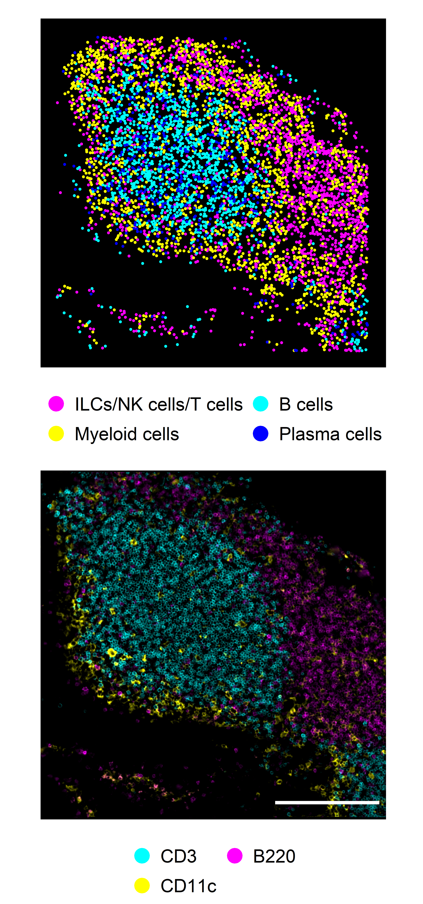

## Libraries


``` r
library(Seurat)
library(SeuratObject)
library(dplyr)
library(ggplot2)
# library(stringr)
# library(glue)
# library(here)
library(readr)
# library(lubridate)
# library(data.table)
# library(clustree)
# library(magrittr)
library(ggpubr)
# library(ggrepel)
# library(readxl)
# library(openxlsx)
```

## Parameters


``` r
set.seed(123)

input_dir <- here::here("1_data_tidying", "Lung_SI_all_cells_all_ALs_files")

output_dir <- here::here("2_visualizations_for_figures", "Supp_Fig_4_cell_type_annotation_SI_AL2_files")
dir.create(output_dir)


main_markers <- c(
  "EpCAM", "EMCN", "LYVE1", "PDPN", "PDGFRa", "CD8a", "CD4",
  "CD45", "CD3", "IRF4", "Kappa", "CD11c", "CD127", "GATA3eGFP", "RORgt"
)

immune_markers <- c(
 "CD3", "CD4", "CD8a", "Kappa", "IRF4", "CD11c",
  "CD127", "CD90", "EOMES", "GATA3eGFP", "RORgt", "Ki67",  "KLRG1", "NKp46", "CD117", "Areg", "CCR6", "CD44", "MHCII", "Sca1"
)

ilc_markers <- c(
  "CD3", "CD4", "CD8a",
  "CD127", "CD90", "EOMES", "GATA3eGFP", "RORgt", "KLRG1", "NKp46", "CD117", "CCR6", "MHCII", "Ki67", "Areg", "IRF4", "Sca1", "CD44"
)


cols_nat <- c("magenta", "cyan", "blue", "purple", "green", 
                       "red", "yellow", "olivedrab1", "slateblue1", 
                       "darkcyan", "gold","indianred1", "seagreen", "deeppink", 
                       "orange", "brown", "violet",
                       "deeppink4", "pink", 
                       "grey", "black", "lightgreen", 
                       "#FF0066",  
                       "lightblue", "#FFCC99", "#CC00FF", 
                       "blueviolet",  "goldenrod4", 
                       "navy", "olivedrab", "lightcyan", "seagreen2", "darkviolet", "lightpink", "slateblue4", "olivedrab2")

colfunc <- colorRampPalette(c("darkcyan", "green", "yellow", "magenta", "purple"))
```

# Load data


``` r
SO.si <- readRDS(paste0(input_dir, "/si_all_cells_all_ALs.rds"))
dim(SO.si)
```

```
## [1]    26 61207
```

``` r
SO.si$AL1 <- gsub("Epithelia & stroma", "Epithelia", SO.si$AL1)
colnames(SO.si@meta.data)
```

```
##  [1] "orig.ident"        "nCount_MELC"       "nFeature_MELC"     "Location_Center_X" "Location_Center_Y" "Treatment"         "FOV"               "Experiment"        "Organ"             "MELC.machine"      "Tissue.area"       "Dataset"           "CellID"            "MELC_snn_res.0.1"  "MELC_snn_res.0.15" "MELC_snn_res.0.2"  "MELC_snn_res.0.25" "MELC_snn_res.0.3"  "MELC_snn_res.0.35" "seurat_clusters"   "annotation_lvl1"   "MELC_snn_res.0.4"  "MELC_snn_res.0.45" "annotation_lvl2"   "MELC_snn_res.0.05" "annotation_lvl3"   "MELC_snn_res.0.5"  "annotation_lvl4"   "test_unresolved"   "AL1"               "AL2"               "AL3"               "MELC_snn_res.0.01"
```

# Visualization

## Compare annotation and IF overlay immune cells


``` r
SO.si.sub <- subset(SO.si, subset = AL1 == "Immune cells")
SO.si.sub$AL2 <- gsub("ILCs|CD8\\+ CD3- IEL|T helper cells|T cytotox. cells", "ILCs/NK cells/T cells", SO.si.sub$AL2)
SO.si.sub$AL2 <- factor(SO.si.sub$AL2, levels = c("ILCs/NK cells/T cells","Myeloid cells", "B cells",   "Plasma cells"))


fetched_data <- FetchData(SO.si.sub, 
                        vars = c("Dataset",
                                 "AL2",
                                 "AL3",
                                 "Location_Center_X", 
                                 "Location_Center_Y", 
                                 "UMAP_1", 
                                 "UMAP_2",
                                 "Treatment",
                                 "CellID", 
                                 "Experiment", 
                                 rownames(SO.si.sub)))

fetched_data <- as.data.frame(fetched_data)
df_fov <- fetched_data %>%
          filter(Dataset == "CTRL_FOV1_20210810")


plot_ann_2 <- ggplot()+ 
  geom_point(data = df_fov, 
                       aes(x= Location_Center_X, y= Location_Center_Y, 
                           color = AL2), 
                      size = 0.5)+
    ggplot2::guides(color=guide_legend(override.aes = list(size=5), ncol=3), 
                    fill=guide_legend(ncol = 1,byrow=TRUE))+
    theme(legend.position = "bottom", 
          plot.margin=margin(0.5,1,0,1,"cm"),
          text = element_blank(),
           axis.ticks = element_blank(),
         panel.grid =  element_blank(),
          legend.ticks = element_blank(),
         legend.title=element_blank(),
         legend.key = element_blank(),
        legend.text = element_text(size=14), 
         panel.background = element_rect(fill = 'black', 
                                         color = 'black', size = 1))+    
    scale_colour_discrete(name  ="Annotated cell types",
                          breaks=c("Immune cells",
                                                  "Vessels & stroma",
                                                  "Epithelia"),
                          labels=c("Immune cells",
                                                  "Vessels & stroma",
                                                  "Epithelia")) +
    scale_color_manual(values = c("magenta", "yellow", "cyan", "blue"))+ 
    ggplot2::guides(color=guide_legend(override.aes = list(size=5), ncol=2),
                  fill=guide_legend(ncol = 2,byrow=TRUE))+
  xlim(0, 2048)+
  ylim(0, 2048)

plot_ann_2
```


IF overlay


``` r
img <- png::readPNG(
    "D:/Sandy/Promotion/Dissertation/Figures/AL2/20210810_1_si_ctrl_B220-c_CD3-m_CD11c-y.png"
  )


my_colors <- c("cyan", "yellow", "magenta")

g <- grid::rasterGrob(img, interpolate=TRUE)


df_fov <- df_fov %>%
  filter(!AL2 %in% c("Plasma cells" )) %>%
  mutate(Labels = recode(
    AL2, 
    "Myeloid cells" = "CD11c",
    "B cells" = "B220",
    "ILCs/NK cells/T cells" = "CD3"
  ))

plot_if_1 <- ggplot()+ 
  geom_point(data = df_fov, 
                       aes(x= Location_Center_X, y= Location_Center_Y, color = Labels), 
                       size = 1)+
  annotation_custom(g, xmin=-Inf, xmax=Inf, ymin=-Inf, ymax=Inf)+
  theme(legend.title=element_blank())+ # exclude legend title
  scale_colour_discrete(name  ="MELC IF stainings",
                          breaks=c("CD45", "CD31", 
                                   "EpCAM"),
                          labels=c("CD45", "CD31", 
                                   "EpCAM")) +
  scale_color_manual(values = my_colors)+ 
    theme(legend.position = "bottom", 
          plot.margin=margin(0.5,1,0,1,"cm"),
          text = element_blank(),
           axis.ticks = element_blank(),
         panel.grid =  element_blank(),
          legend.ticks = element_blank(),
         legend.title=element_blank(),
         legend.key = element_blank(),
        legend.text = element_text(size=14), 
         panel.background = element_rect(fill = 'black', 
                                         color = 'black', size = 1))+    
  ggplot2::theme(legend.position = "bottom")+
  ggplot2::guides(color=guide_legend(override.aes = list(size=5), ncol=2),
                  fill=guide_legend(ncol = 2,byrow=TRUE))

plot_if_1
```


Combine both plots:


``` r
plot_immune <- ggarrange(plot_ann_2, plot_if_1, ncol = 1, nrow = 2, heights = c(1, 1))
plot_immune
```



## Compare annotation and IF overlay non-immune cells


``` r
fetched_data <- FetchData(SO.si, 
                        vars = c("Dataset",
                                 "AL2",
                                 "AL3",
                                 "Location_Center_X", 
                                 "Location_Center_Y", 
                                 "UMAP_1", 
                                 "UMAP_2",
                                 "Treatment",
                                 "CellID", 
                                 "Experiment", 
                                 rownames(SO.si.sub)))

fetched_data <- as.data.frame(fetched_data)
df_fov <- fetched_data %>%
          filter(Dataset == "CTRL_FOV2_20210706") %>%
  filter(AL3 == "Epithelia I"|AL3 == "Epithelia II"|AL3 == "Blood vessels"|AL3 == "Lymphatics"| AL3 == "Fibroblasts") %>%
  mutate(AL3 = factor(AL3, level = c(
    "Blood vessels",
    "Lymphatics",
    "Fibroblasts",
    "Epithelia I",
    "Epithelia II"
  )))


plot_ann_2 <- ggplot()+ 
  geom_point(data = df_fov, 
                       aes(x= Location_Center_X, y= Location_Center_Y, 
                           color = AL3), 
                      size = 0.5)+
    ggplot2::guides(color=guide_legend(override.aes = list(size=5), ncol=3), 
                    fill=guide_legend(ncol = 1,byrow=TRUE))+
    theme(legend.position = "bottom", 
          plot.margin=margin(0.5,1,0,1,"cm"),
          text = element_blank(),
           axis.ticks = element_blank(),
         panel.grid =  element_blank(),
          legend.ticks = element_blank(),
         legend.title=element_blank(),
         legend.key = element_blank(),
        legend.text = element_text(size=14), 
         panel.background = element_rect(fill = 'black', 
                                         color = 'black', size = 1))+    
    scale_colour_discrete(name  ="Annotated cell types",
                          breaks=c("Immune cells",
                                                  "Vessels & stroma",
                                                  "Epithelia"),
                          labels=c("Immune cells",
                                                  "Vessels & stroma",
                                                  "Epithelia")) +
    scale_color_manual(values = c("magenta", "yellow", "cyan", "green", "blue"))+ 
    ggplot2::guides(color=guide_legend(override.aes = list(size=5), ncol=3),
                  fill=guide_legend(ncol = 3,byrow=TRUE))+
  xlim(0, 2048)+
  ylim(0, 2048)

plot_ann_2
```


``` r
img <- png::readPNG(
    "D:/Sandy/Promotion/Dissertation/Figures/AL2/20210706_2_si_d3_CD31-r_EpCAM-g_FN-b_CD90-c_EMCN-m_LYVE1-y.png"
  )

#20210806_2_si_d3_CD31-r_EpCAM-g_PDPN-b_CD90-c_EMCN-m_LYVE1-y

my_colors <- c("magenta", "yellow", "cyan", "green", "blue", "red", "white")

g <- grid::rasterGrob(img, interpolate=TRUE)


df_fov <- fetched_data %>%
  filter(Dataset == "CTRL_FOV2_20210706") %>%
  filter(AL3 == "Epithelia I"|AL3 == "Epithelia II"|AL3 == "Blood vessels"|AL3 == "Lymphatics"| AL3 == "Fibroblasts"| AL3 == "Plasma cells") %>%
  mutate(AL3 = recode(
    AL3, 
    "Blood vessels" = "CD90",
    "Lymphatics" = "EMCN",
    "Fibroblasts" = "LYVE1",
    "Epithelia I" = "CD31",
    "Epithelia II" = "EpCAM", 
    "Plasma cells" = "FN"
  ), 
  AL3 = factor(AL3, c(
    "EMCN", "LYVE1", "CD90", "EpCAM", "FN", "CD31"
  )))

plot_if_1 <- ggplot()+ 
  geom_point(data = df_fov, 
                       aes(x= Location_Center_X, y= Location_Center_Y, color = AL3), 
                       size = 1)+
  annotation_custom(g, xmin=-Inf, xmax=Inf, ymin=-Inf, ymax=Inf)+
  theme(legend.title=element_blank())+ # exclude legend title
  # scale_colour_discrete(name  ="MELC IF stainings",
  #                         breaks=c("CD45", "CD31", 
  #                                  "EpCAM"),
  #                         labels=c("CD45", "CD31", 
  #                                  "EpCAM")) +
  scale_color_manual(values = my_colors)+ 
    theme(legend.position = "bottom", 
          plot.margin=margin(0.5,1,0,1,"cm"),
          text = element_blank(),
           axis.ticks = element_blank(),
         panel.grid =  element_blank(),
          legend.ticks = element_blank(),
         legend.title=element_blank(),
         legend.key = element_blank(),
        legend.text = element_text(size=14), 
         panel.background = element_rect(fill = 'black', 
                                         color = 'black', size = 1))+    
  ggplot2::theme(legend.position = "bottom")+
  ggplot2::guides(color=guide_legend(override.aes = list(size=5), ncol=3),
                  fill=guide_legend(ncol = 3,byrow=TRUE))+
  annotate("segment", x = 1400, xend = 2080, y = 9, yend = 9, size = 1.6, 
  colour = "white")

plot_if_1
```


Combine both plots:


``` r
plot_non <- ggarrange(plot_ann_2, plot_if_1, ncol = 1, nrow = 2)

plot_non
```


Combine subplots:


``` r
ggarrange(plot_immune, plot_non, ncol = 2, labels = c("A", "B"))
```


## Session Information


``` r
save.image(paste0(output_dir, "/environment.RData"))
sessionInfo()
```

```
## R version 4.4.2 (2024-10-31 ucrt)
## Platform: x86_64-w64-mingw32/x64
## Running under: Windows 10 x64 (build 19045)
## 
## Matrix products: default
## 
## 
## locale:
## [1] LC_COLLATE=English_Germany.utf8  LC_CTYPE=English_Germany.utf8    LC_MONETARY=English_Germany.utf8 LC_NUMERIC=C                     LC_TIME=English_Germany.utf8    
## 
## time zone: Europe/Berlin
## tzcode source: internal
## 
## attached base packages:
## [1] stats     graphics  grDevices utils     datasets  methods   base     
## 
## other attached packages:
## [1] ggpubr_0.6.1       readr_2.1.5        ggplot2_3.5.2      dplyr_1.1.4        Seurat_5.2.1       SeuratObject_5.1.0 sp_2.2-0          
## 
## loaded via a namespace (and not attached):
##   [1] RColorBrewer_1.1-3     rstudioapi_0.17.1      jsonlite_1.9.1         magrittr_2.0.3         spatstat.utils_3.1-3   farver_2.1.2           rmarkdown_2.29         vctrs_0.6.5            ROCR_1.0-11            spatstat.explore_3.4-2 rstatix_0.7.2          htmltools_0.5.8.1      broom_1.0.8            Formula_1.2-5          sass_0.4.10            sctransform_0.4.1      parallelly_1.45.0      KernSmooth_2.23-24     bslib_0.9.0            htmlwidgets_1.6.4      ica_1.0-3              plyr_1.8.9             plotly_4.11.0          zoo_1.8-13             cachem_1.1.0           igraph_2.1.4           mime_0.13              lifecycle_1.0.4        pkgconfig_2.0.3        Matrix_1.7-1           R6_2.6.1               fastmap_1.2.0          fitdistrplus_1.2-2     future_1.58.0          shiny_1.11.1           digest_0.6.37          colorspace_2.1-1       patchwork_1.3.1        rprojroot_2.0.4        tensor_1.5.1           RSpectra_0.16-2        irlba_2.3.5.1          labeling_0.4.3         progressr_0.15.1       spatstat.sparse_3.1-0  httr_1.4.7             polyclip_1.10-7        abind_1.4-8            compiler_4.4.2         here_1.0.1             withr_3.0.2           
##  [52] backports_1.5.0        carData_3.0-5          fastDummies_1.7.5      ggsignif_0.6.4         MASS_7.3-61            tools_4.4.2            lmtest_0.9-40          httpuv_1.6.15          future.apply_1.20.0    goftest_1.2-3          glue_1.8.0             nlme_3.1-166           promises_1.3.2         grid_4.4.2             Rtsne_0.17             cluster_2.1.6          reshape2_1.4.4         generics_0.1.4         gtable_0.3.6           spatstat.data_3.1-6    tzdb_0.4.0             tidyr_1.3.1            data.table_1.17.0      hms_1.1.3              car_3.1-3              spatstat.geom_3.3-6    RcppAnnoy_0.0.22       ggrepel_0.9.6          RANN_2.6.2             pillar_1.11.0          stringr_1.5.1          spam_2.11-1            RcppHNSW_0.6.0         later_1.4.1            splines_4.4.2          lattice_0.22-6         survival_3.7-0         deldir_2.0-4           tidyselect_1.2.1       miniUI_0.1.2           pbapply_1.7-2          knitr_1.50             gridExtra_2.3          scattermore_1.2        xfun_0.51              matrixStats_1.5.0      stringi_1.8.4          lazyeval_0.2.2         yaml_2.3.10            evaluate_1.0.4         codetools_0.2-20      
## [103] tibble_3.2.1           cli_3.6.3              uwot_0.2.3             xtable_1.8-4           reticulate_1.42.0      jquerylib_0.1.4        Rcpp_1.0.14            globals_0.18.0         spatstat.random_3.3-3  png_0.1-8              spatstat.univar_3.1-2  parallel_4.4.2         dotCall64_1.2          listenv_0.9.1          viridisLite_0.4.2      scales_1.4.0           ggridges_0.5.6         purrr_1.0.4            rlang_1.1.5            cowplot_1.2.0
```
