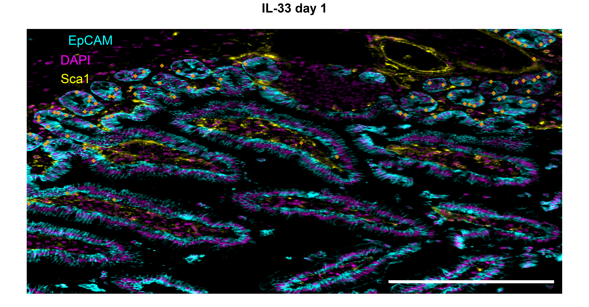
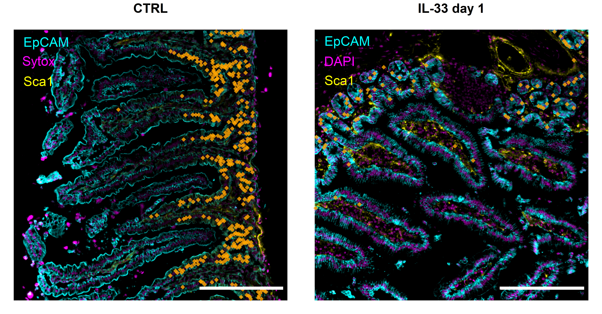

## Libraries


``` r
# remove.packages("rlang")
# remove.packages("dplyr")
# install.packages("rlang")
# install.packages("dplyr")

library(SeuratObject)
library(dplyr)
library(rstatix)
library(rlang)

if (!requireNamespace("Giotto", quietly = TRUE))
  devtools::install_github("drieslab/Giotto@suite")
if (!requireNamespace("VoltRon", quietly = TRUE))
  devtools::install_github("Artur-man/VoltRon")
if (!requireNamespace("Seurat", quietly = TRUE))
  install.packages("Seurat")
library(Giotto)
library(Seurat)
library(VoltRon)
library(ggplot2)
library(ggpubr)
library(readr)
library(ggbeeswarm)
library(stringr)
```

## Parameters


``` r
set.seed(123)

input_dir <- here::here("1_data_tidying", "Lung_SI_all_cells_all_ALs_files")

output_dir <- here::here("2_visualizations_for_figures", "Supp_Fig_8_epithelia_II_cells_si_villi_files")
dir.create(output_dir)


main_markers <- c(
  "EpCAM", "EMCN", "LYVE1", "PDPN", "PDGFRa", "CD8a", "CD4",
  "CD45", "CD3", "IRF4", "Kappa", "CD11c", "CD127", "GATA3eGFP", "RORgt"
)


immune_markers <- c(
 "CD3", "CD4", "CD8a", "Kappa", "IRF4", "CD11c",
  "CD127", "CD90", "EOMES", "GATA3eGFP", "RORgt", "Ki67",  "KLRG1", "NKp46", "CD117", "Areg", "CCR6", "CD44", "MHCII", "Sca1"
)

ilc_markers <- c(
  "CD3", "CD4", "CD8a",
  "CD127", "CD90", "EOMES", "GATA3eGFP", "RORgt", "KLRG1", "NKp46", "CD117", "CCR6", "MHCII", "Ki67", "Areg", "IRF4", "Sca1", "CD44"
)


cols_nat <- c("magenta", "cyan", "blue", "purple", "green", 
                       "red", "yellow", "olivedrab1", "slateblue1", 
                       "darkcyan", "gold","indianred1", "seagreen", "deeppink", 
                       "orange", "brown", "violet",
                       "deeppink4", "pink", 
                       "grey", "black", "lightgreen", 
                       "#FF0066",  
                       "lightblue", "#FFCC99", "#CC00FF", 
                       "blueviolet",  "goldenrod4", 
                       "navy", "olivedrab", "lightcyan", "seagreen2", "darkviolet", "lightpink", "slateblue4", "olivedrab2")

colfunc <- colorRampPalette(c("darkcyan", "green", "yellow", "magenta", "purple"))

cols_ilcs_lung <- c("darkcyan", "seagreen2", "deeppink4")
cols_ilcs_si <- c("slateblue", "seagreen2")

cols_treat <- c("darkcyan", "gold", "slateblue")
```

# Load data

## Proportions


``` r
df_villi <- read_csv(paste0(input_dir, "/si_villi_proportions.csv"), 
    col_types = cols(...1 = col_skip()))
df_ilf <- read_csv(paste0(input_dir, "/si_ilf_proportions.csv"), 
    col_types = cols(...1 = col_skip()))
df_lung <- read_csv(paste0(input_dir, "/lung_proportions.csv"), 
    col_types = cols(...1 = col_skip()))
```

## Spatial data for VoltRon and Giotto


``` r
# from import_Giotto.Rmd
gio_list <- readRDS(here::here("data", "Giotto_data_Villi.rds"))

# from import_VoltRon.Rmd
vr_list <- readRDS(here::here("data", "VoltRon_data_Villi.rds"))

# original data
metadatax <- read_csv(here::here("data", "SO_arcsinh_si_imputed_Villi.csv"))

metadatax <- metadatax %>% 
  filter(`Tissue area` == "Villi")

unique(metadatax$CellType)
```

```
##  [1] "Epithelia I"               "Epithelia II"              "Fibroblasts"               "Blood vessels"             "Lymphatics"                "Myeloid cells"             "B cells"                   "Plasma cells/Plasmablasts" "ILC2s"                     "CD8+ CD3- IEL"             "Unresolved"                "NK cells/ILC1s/ILC3s"      "T helper cells"            "T cytotox. cells"
```

``` r
vr_list_names <- unique(metadatax$Dataset)


cell_proximities_list <- list()
for(samp in vr_list_names){
  print(samp)
  cell_proximities_list[[samp]] <-cellProximityEnrichment(
    gobject = gio_list[[samp]],
    cluster_column = 'CellType',
    spatial_network_name = 'Delaunay_network',
    adjust_method = 'fdr',
    number_of_simulations = 1000)
  cell_proximities_list[[samp]] <- cell_proximities_list[[samp]]$enrichm_res
}
```

```
## [1] "CTRL_FOV1_20210706"
## [1] "CTRL_FOV1_20210730"
## [1] "CTRL_FOV2_20210706"
## [1] "CTRL_FOV2_20210730"
## [1] "CTRL_FOV2_20210810"
## [1] "CTRL_FOV3_20210706"
## [1] "CTRL_FOV3_20210709"
## [1] "CTRL_FOV3_20210730"
## [1] "D1_FOV1_20211025"
## [1] "D1_FOV2_20211025"
## [1] "D1_FOV2_20220505"
## [1] "D1_FOV3_20211025"
## [1] "D1_FOV3_20220505"
## [1] "D3_FOV1_20210701"
## [1] "D3_FOV1_20210806"
## [1] "D3_FOV2_20210625"
## [1] "D3_FOV2_20210701"
## [1] "D3_FOV2_20210806"
## [1] "D3_FOV3_20210625"
## [1] "D3_FOV3_20210701"
## [1] "D3_FOV3_20210806"
```

``` r
vr_merged <- merge(vr_list[[1]], vr_list[-1])
vrImageNames(vr_merged)
```

```
## [1] "image_1"
```

``` r
unique(vr_merged$CellType)
```

```
##  [1] "Epithelia I"               "Epithelia II"              "Fibroblasts"               "Blood vessels"             "Lymphatics"                "Myeloid cells"             "B cells"                   "Plasma cells/Plasmablasts" "ILC2s"                     "CD8+ CD3- IEL"             "Unresolved"                "NK cells/ILC1s/ILC3s"      "T helper cells"            "T cytotox. cells"
```

# Visualization

## IF overlay of epithelia II cells and EpCAM, Sca1, CD44, and Ki67, and DAPI


``` r
set_ptsize <- 2
cell_shape <- 18
set_alpha <- 0.8

# define cell type of interested that should be plotted on the overlay
celltype_of_interest <- "Epithelia II"

ColorsCellTypeSingle <-  list(
  #`NK cells/ILC1s/ILC3s` = "cyan", 
  `Epithelia II` = "orange")


# overlay 1 ------------------------------------------------------------
# define markers for the Overlay
# CYAN
marker1 <- "EpCAM"
# MAGENTA
marker2 <- "Sytox"
# YELLOW
marker3 <- "Sca1"

name_channel_key <- paste0(marker1, "-c_", marker2, "-m_", marker3, "-y_")
vr_merged <- combineChannels(vr_merged,
                             channels = c(marker1, marker2, marker3),
                             colors = c("cyan", "magenta", "yellow"),
                             channel_key = name_channel_key)


plot <- vrSpatialPlot(vr_merged, assay = paste0("Assay", 4), #2
                        group.by = "CellType", 
                        group.ids = celltype_of_interest,
                        alpha = set_alpha, 
                        background = c("image_1", name_channel_key), 
                        pt.size = set_ptsize, cell.shape = cell_shape)+
  guides(color = guide_legend(override.aes = list(size = 5)))+
  scale_color_manual(values = ColorsCellTypeSingle)+
  scale_fill_manual(values = ColorsCellTypeSingle)+
  theme_void()+ NoLegend()+ ggtitle(NULL)+
  theme(plot.title = element_blank(), 
        text = element_text(size = 12))


plot_if_1 <- plot +
  annotate("text", x=119, y=950, label= marker1,
           col="cyan", size=5, parse=TRUE) +
  annotate("text", x=91, y=880, label= marker2,
           col="magenta", size=5, parse=TRUE) +
  annotate("text", x=91, y=810, label= marker3,
           col="yellow", size=5, parse=TRUE)+
  annotate("segment", x = 680, xend = 985, y = 45, yend = 45, size = 1.6, 
  colour = "white")

# define markers for the Overlay
# CYAN
marker1 <- "EpCAM"
# MAGENTA
marker2 <- "DAPI"
# YELLOW
marker3 <- "Sca1"

name_channel_key <- paste0(marker1, "-c_", marker2, "-m_", marker3, "-y_")
vr_merged <- combineChannels(vr_merged,
                             channels = c(marker1, marker2, marker3),
                             colors = c("cyan", "magenta", "yellow"),
                             channel_key = name_channel_key)

plot <- vrSpatialPlot(vr_merged, assay = paste0("Assay", 13), #2
                        group.by = "CellType", 
                        group.ids = celltype_of_interest,
                        alpha = set_alpha, 
                        background = c("image_1", name_channel_key), 
                        pt.size = set_ptsize, cell.shape = cell_shape)+
  guides(color = guide_legend(override.aes = list(size = 5)))+
  scale_color_manual(values = ColorsCellTypeSingle)+
  scale_fill_manual(values = ColorsCellTypeSingle)+
  theme_void()+ NoLegend()+ ggtitle(NULL)+
  theme(plot.title = element_blank(), 
        text = element_text(size = 12))


plot_if_2 <- plot +
  annotate("text", x=119, y=950, label= marker1,
           col="cyan", size=5, parse=TRUE) +
  annotate("text", x=91, y=880, label= marker2,
           col="magenta", size=5, parse=TRUE) +
  annotate("text", x=91, y=810, label= marker3,
           col="yellow", size=5, parse=TRUE)+
  annotate("segment", x = 680, xend = 985, y = 45, yend = 45, size = 1.6, 
  colour = "white")


# second overlay ------------------------------------------------------------
# define markers for the Overlay
# CYAN
marker1 <- "CD44"
# MAGENTA
marker2 <- "DAPI"
# YELLOW
marker3 <- "Ki67"

name_channel_key <- paste0(marker1, "-c_", marker2, "-m_", marker3, "-y_")
vr_merged <- combineChannels(vr_merged,
                             channels = c(marker1, marker2, marker3),
                             colors = c("cyan", "magenta", "yellow"),
                             channel_key = name_channel_key)


plot <- vrSpatialPlot(vr_merged, assay = paste0("Assay", 4), 
                        group.by = "CellType", 
                        group.ids = celltype_of_interest,
                        alpha = set_alpha, 
                        background = c("image_1", name_channel_key), 
                        pt.size = set_ptsize, cell.shape = cell_shape)+
  guides(color = guide_legend(override.aes = list(size = 5)))+
  scale_color_manual(values = ColorsCellTypeSingle)+
  scale_fill_manual(values = ColorsCellTypeSingle)+
  theme_void()+ NoLegend()+ ggtitle(NULL)+
  theme(plot.title = element_blank(), 
        text = element_text(size = 12))


plot_if_3 <- plot +
  annotate("text", x=100, y=950, label= marker1,
           col="cyan", size=5, parse=TRUE) +
  annotate("text", x=91, y=880, label= marker2,
           col="magenta", size=5, parse=TRUE) +
  annotate("text", x=90, y=810, label= marker3,
           col="yellow", size=5, parse=TRUE)+
  annotate("segment", x = 680, xend = 985, y = 45, yend = 45, size = 1.6, 
  colour = "white")


plot <- vrSpatialPlot(vr_merged, assay = paste0("Assay", 13), 
                        group.by = "CellType", 
                        group.ids = celltype_of_interest,
                        alpha = set_alpha, 
                        background = c("image_1", name_channel_key), 
                        pt.size = set_ptsize, cell.shape = cell_shape)+
  guides(color = guide_legend(override.aes = list(size = 5)))+
  scale_color_manual(values = ColorsCellTypeSingle)+
  scale_fill_manual(values = ColorsCellTypeSingle)+
  theme_void()+ NoLegend()+ ggtitle(NULL)+
  theme(plot.title = element_blank(), 
        text = element_text(size = 12))


plot_if_4 <- plot +
  annotate("text", x=100, y=950, label= marker1,
           col="cyan", size=5, parse=TRUE) +
  annotate("text", x=91, y=880, label= marker2,
           col="magenta", size=5, parse=TRUE) +
  annotate("text", x=90, y=810, label= marker3,
           col="yellow", size=5, parse=TRUE)+
  annotate("segment", x = 680, xend = 985, y = 45, yend = 45, size = 1.6, 
  colour = "white")
```


``` r
plot_1 <- annotate_figure(plot_if_1,
               top = text_grob("CTRL", color = "black", face = "bold", size = 14))+
  theme(plot.margin = margin(0, 0, 0, 0, "cm"))

plot_2 <- annotate_figure(plot_if_2,
               top = text_grob("IL-33 day 1", color = "black", face = "bold", size = 14))+
  theme(plot.margin = margin(0, 0, 0, 0, "cm"))
plot_2
```



``` r
ggarrange(plot_1, plot_2, ncol = 2, nrow = 1)
```



## Session Information


``` r
save.image(paste0(output_dir, "/environment.RData"))
sessionInfo()
```

```
## R version 4.4.2 (2024-10-31 ucrt)
## Platform: x86_64-w64-mingw32/x64
## Running under: Windows 10 x64 (build 19045)
## 
## Matrix products: default
## 
## 
## locale:
## [1] LC_COLLATE=English_Germany.utf8  LC_CTYPE=English_Germany.utf8    LC_MONETARY=English_Germany.utf8 LC_NUMERIC=C                     LC_TIME=English_Germany.utf8    
## 
## time zone: Europe/Berlin
## tzcode source: internal
## 
## attached base packages:
## [1] stats     graphics  grDevices utils     datasets  methods   base     
## 
## other attached packages:
##  [1] stringr_1.5.1      ggbeeswarm_0.7.2   readr_2.1.5        ggpubr_0.6.0       ggplot2_3.5.1      VoltRon_0.2.0      Seurat_5.2.1       Giotto_4.2.1       GiottoClass_0.4.7  rlang_1.1.5        rstatix_0.7.2      dplyr_1.1.4        SeuratObject_5.0.2 sp_2.2-0          
## 
## loaded via a namespace (and not attached):
##   [1] RcppAnnoy_0.0.22            splines_4.4.2               later_1.4.1                 bitops_1.0-9                tibble_3.2.1                polyclip_1.10-7             fastDummies_1.7.5           lifecycle_1.0.4             rprojroot_2.0.4             vroom_1.6.5                 globals_0.17.0              lattice_0.22-6              MASS_7.3-61                 backports_1.5.0             magrittr_2.0.3              plotly_4.10.4               sass_0.4.10                 rmarkdown_2.29              jquerylib_0.1.4             yaml_2.3.10                 httpuv_1.6.15               sctransform_0.4.1           spam_2.11-1                 spatstat.sparse_3.1-0       reticulate_1.42.0           pbapply_1.7-2               cowplot_1.1.3               RColorBrewer_1.1-3          abind_1.4-8                 zlibbioc_1.52.0             Rtsne_0.17                  GenomicRanges_1.58.0        purrr_1.0.4                 BiocGenerics_0.52.0         RCurl_1.98-1.17             rgl_1.3.18                  GenomeInfoDbData_1.2.13     IRanges_2.40.1              S4Vectors_0.44.0            ggrepel_0.9.6               irlba_2.3.5.1               spatstat.utils_3.1-3       
##  [43] listenv_0.9.1               terra_1.8-42                goftest_1.2-3               RSpectra_0.16-2             spatstat.random_3.3-3       fitdistrplus_1.2-2          parallelly_1.43.0           Rvcg_0.25                   colorRamp2_0.1.0            codetools_0.2-20            DelayedArray_0.32.0         tidyselect_1.2.1            UCSC.utils_1.2.0            farver_2.1.2                spatstat.explore_3.4-2      matrixStats_1.5.0           stats4_4.4.2                base64enc_0.1-3             jsonlite_1.9.1              progressr_0.15.1            Formula_1.2-5               ggridges_0.5.6              survival_3.7-0              tools_4.4.2                 ica_1.0-3                   Rcpp_1.0.14                 glue_1.8.0                  gridExtra_2.3               SparseArray_1.6.2           here_1.0.1                  xfun_0.51                   MatrixGenerics_1.18.1       GenomeInfoDb_1.42.3         EBImage_4.48.0              withr_3.0.2                 fastmap_1.2.0               shinyjs_2.1.0               caTools_1.18.3              digest_0.6.37               R6_2.6.1                    mime_0.13                   colorspace_2.1-1           
##  [85] scattermore_1.2             tensor_1.5                  gtools_3.9.5                spatstat.data_3.1-6         jpeg_0.1-11                 tidyr_1.3.1                 generics_0.1.3              data.table_1.17.0           httr_1.4.7                  htmlwidgets_1.6.4           S4Arrays_1.6.0              scatterplot3d_0.3-44        uwot_0.2.3                  pkgconfig_2.0.3             gtable_0.3.6                lmtest_0.9-40               GiottoVisuals_0.2.12        SingleCellExperiment_1.28.1 XVector_0.46.0              ids_1.0.1                   htmltools_0.5.8.1           carData_3.0-5               dotCall64_1.2               fftwtools_0.9-11            scales_1.3.0                Biobase_2.66.0              GiottoUtils_0.2.4           png_0.1-8                   SpatialExperiment_1.16.0    spatstat.univar_3.1-2       knitr_1.50                  rstudioapi_0.17.1           tzdb_0.4.0                  reshape2_1.4.4              rjson_0.2.23                uuid_1.2-1                  nlme_3.1-166                checkmate_2.3.2             cachem_1.1.0                zoo_1.8-13                  Polychrome_1.5.4            KernSmooth_2.23-24         
## [127] vipor_0.4.7                 parallel_4.4.2              miniUI_0.1.2                pillar_1.10.2               grid_4.4.2                  vctrs_0.6.5                 colorsGen_1.0.0             RANN_2.6.2                  gplots_3.2.0                promises_1.3.2              car_3.1-3                   xtable_1.8-4                cluster_2.1.6               beeswarm_0.4.0              evaluate_1.0.3              magick_2.8.6                cli_3.6.3                   locfit_1.5-9.12             compiler_4.4.2              crayon_1.5.3                future.apply_1.11.3         ggsignif_0.6.4              labeling_0.4.3              plyr_1.8.9                  stringi_1.8.4               deldir_2.0-4                viridisLite_0.4.2           munsell_0.5.1               lazyeval_0.2.2              tiff_0.1-12                 spatstat.geom_3.3-6         Matrix_1.7-1                RcppHNSW_0.6.0              hms_1.1.3                   patchwork_1.3.0             bit64_4.6.0-1               future_1.40.0               shiny_1.10.0                SummarizedExperiment_1.36.0 ROCR_1.0-11                 igraph_2.1.4                broom_1.0.8                
## [169] bslib_0.9.0                 RCDT_1.3.0                  bit_4.6.0
```
