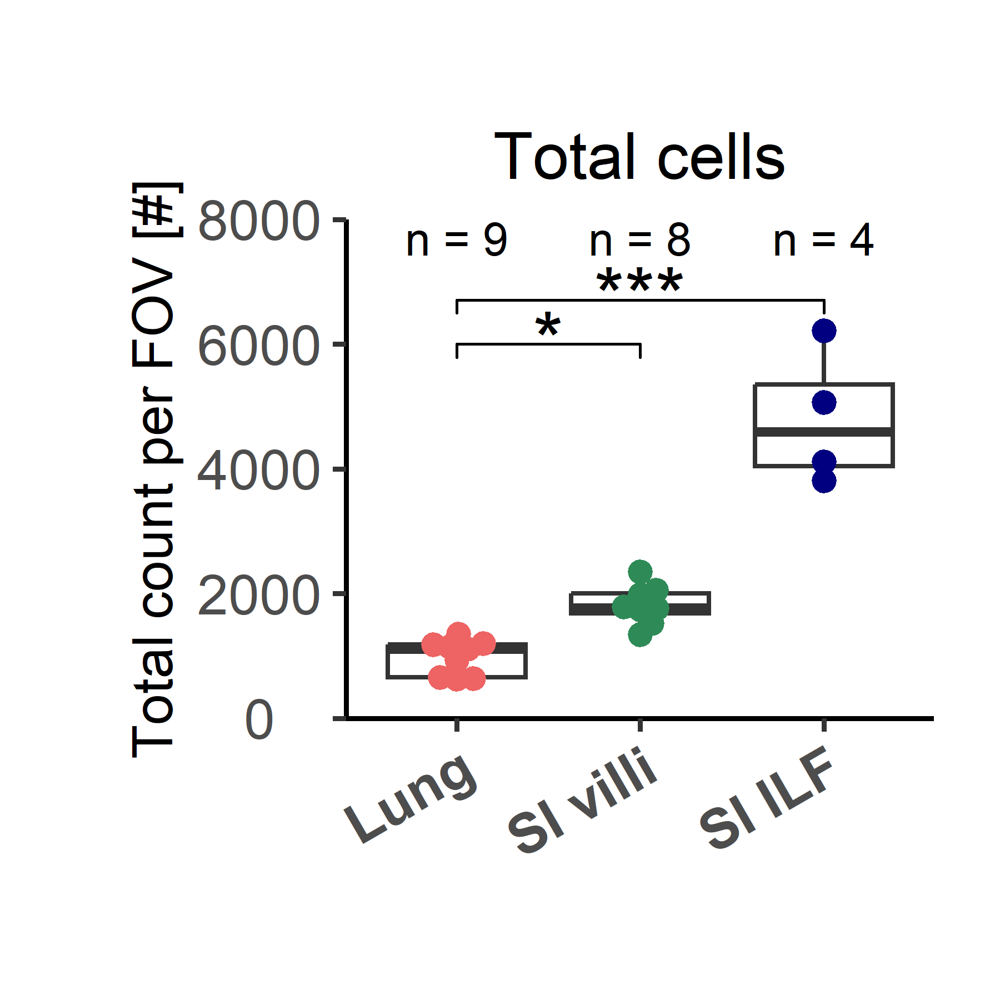
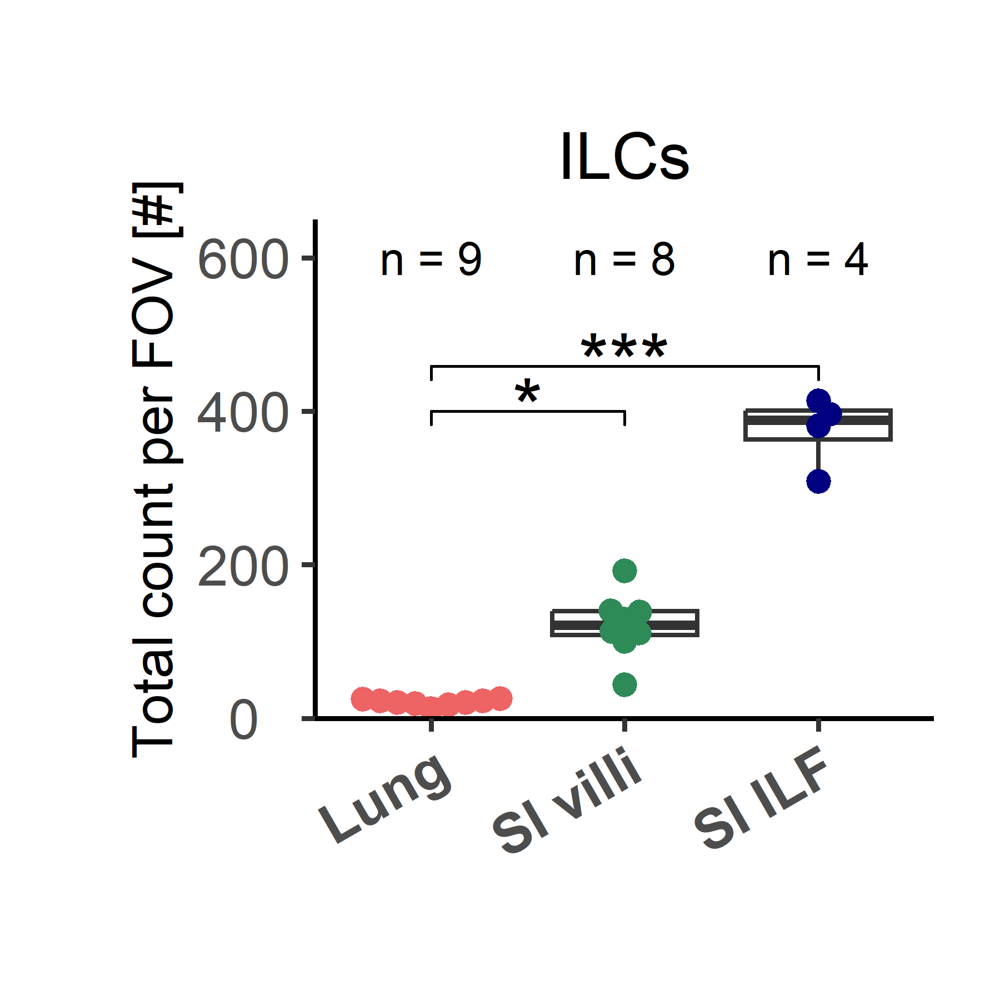
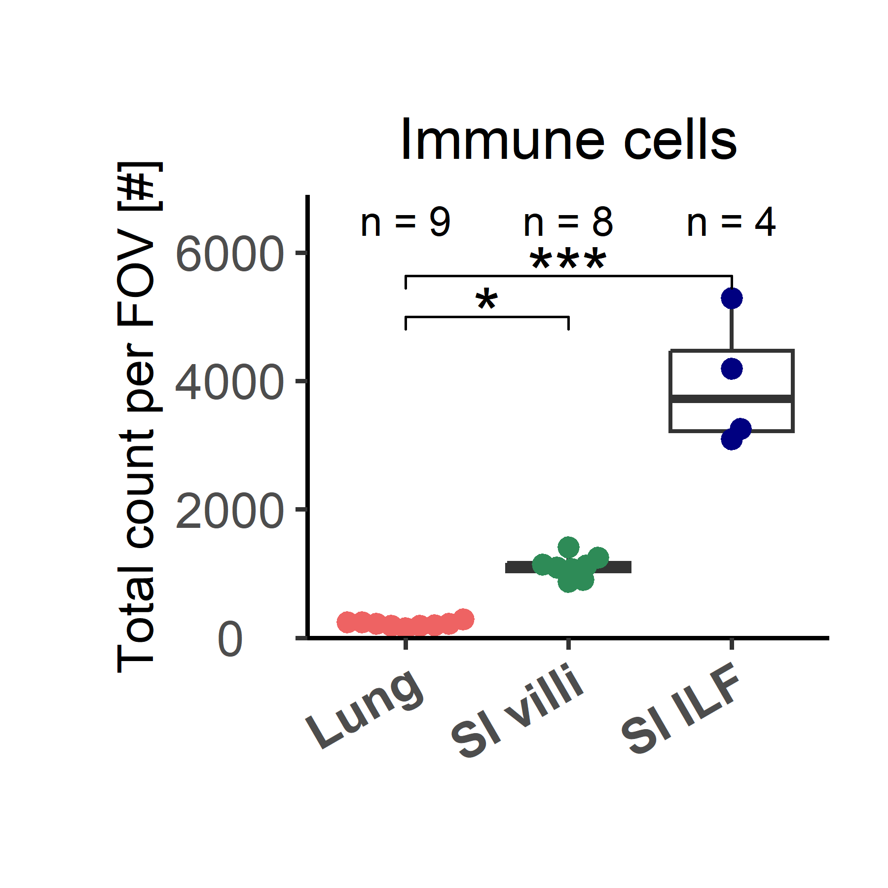
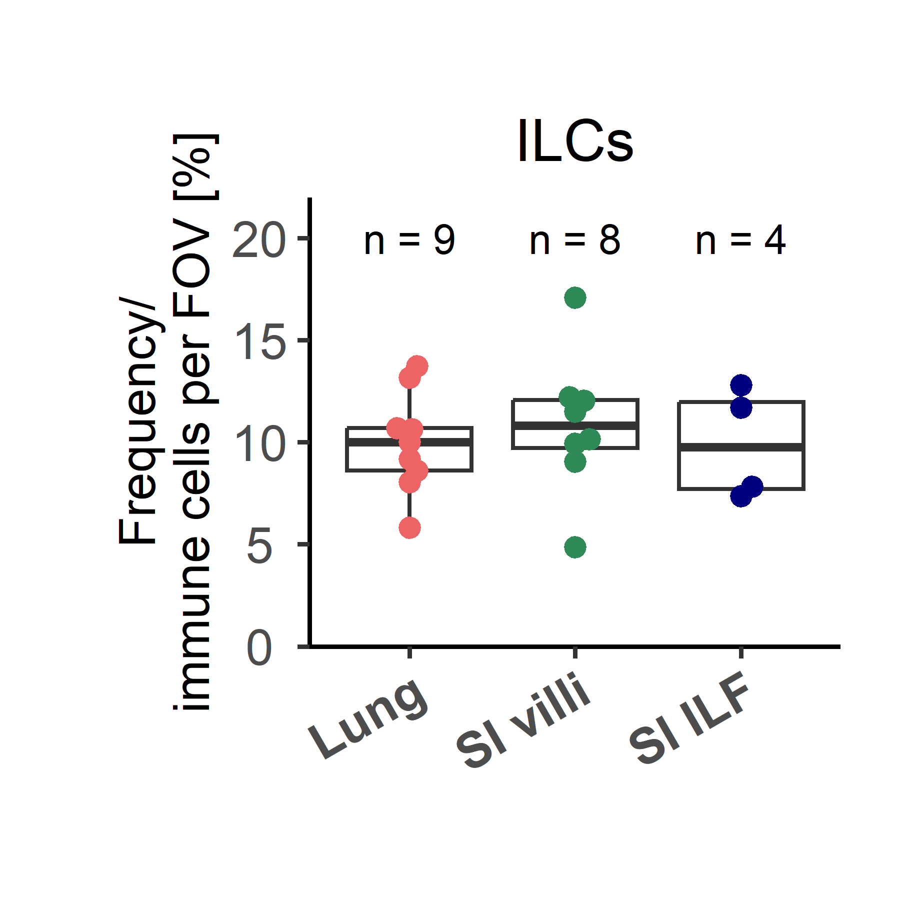
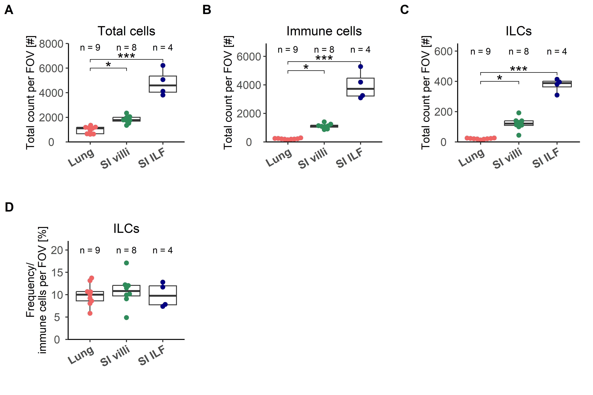
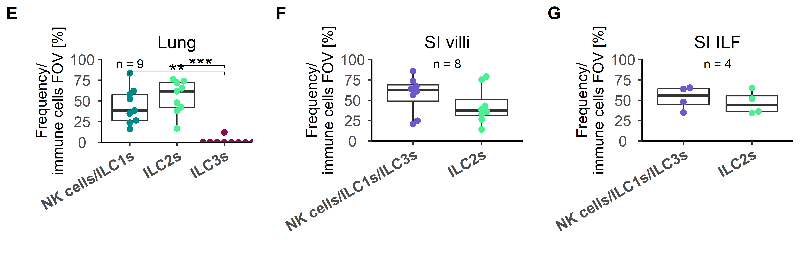
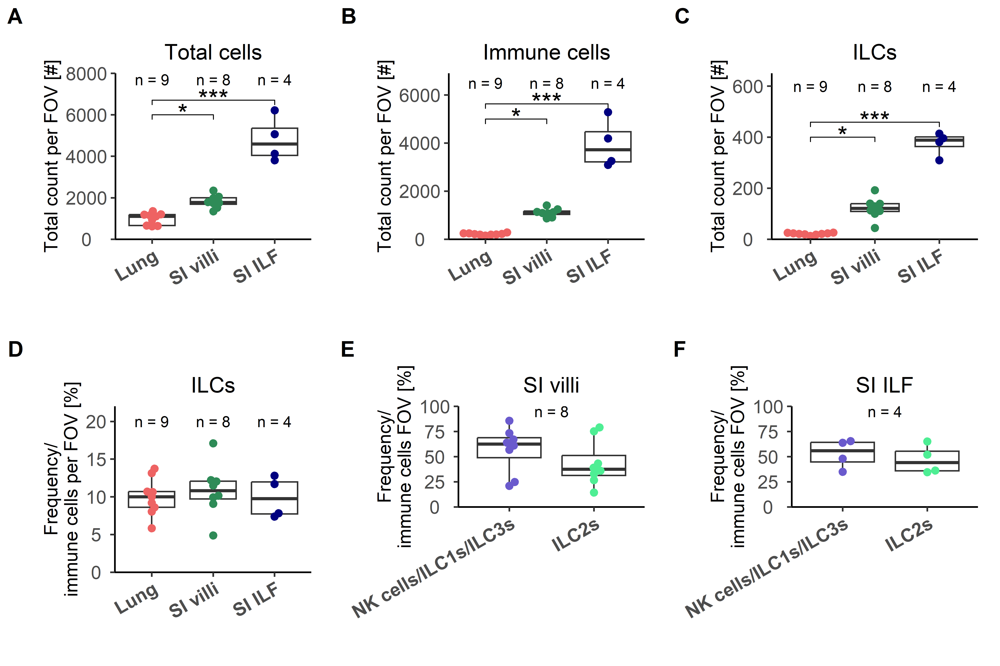

## Libraries


``` r
# remove.packages("rlang")
# remove.packages("dplyr")
# install.packages("rlang")
# install.packages("dplyr")

library(SeuratObject)
library(dplyr)
library(rstatix)
library(rlang)

if (!requireNamespace("Giotto", quietly = TRUE))
  devtools::install_github("drieslab/Giotto@suite")
if (!requireNamespace("VoltRon", quietly = TRUE))
  devtools::install_github("Artur-man/VoltRon")
if (!requireNamespace("Seurat", quietly = TRUE))
  install.packages("Seurat")
library(Giotto)
library(Seurat)
library(VoltRon)
library(ggplot2)
library(ggpubr)
library(readr)
library(ggbeeswarm)
library(stringr)
```

## Parameters


``` r
set.seed(123)

input_dir <- here::here("1_data_tidying", "Lung_SI_all_cells_all_ALs_files")

output_dir <- here::here("2_visualizations_for_figures", "Supp_Fig_9_quantification_spatial_analysis_SI_files")
dir.create(output_dir)


main_markers <- c(
  "EpCAM", "EMCN", "LYVE1", "PDPN", "PDGFRa", "CD8a", "CD4",
  "CD45", "CD3", "IRF4", "Kappa", "CD11c", "CD127", "GATA3eGFP", "RORgt"
)


immune_markers <- c(
 "CD3", "CD4", "CD8a", "Kappa", "IRF4", "CD11c",
  "CD127", "CD90", "EOMES", "GATA3eGFP", "RORgt", "Ki67",  "KLRG1", "NKp46", "CD117", "Areg", "CCR6", "CD44", "MHCII", "Sca1"
)

ilc_markers <- c(
  "CD3", "CD4", "CD8a",
  "CD127", "CD90", "EOMES", "GATA3eGFP", "RORgt", "KLRG1", "NKp46", "CD117", "CCR6", "MHCII", "Ki67", "Areg", "IRF4", "Sca1", "CD44"
)


cols_nat <- c("magenta", "cyan", "blue", "purple", "green", 
                       "red", "yellow", "olivedrab1", "slateblue1", 
                       "darkcyan", "gold","indianred1", "seagreen", "deeppink", 
                       "orange", "brown", "violet",
                       "deeppink4", "pink", 
                       "grey", "black", "lightgreen", 
                       "#FF0066",  
                       "lightblue", "#FFCC99", "#CC00FF", 
                       "blueviolet",  "goldenrod4", 
                       "navy", "olivedrab", "lightcyan", "seagreen2", "darkviolet", "lightpink", "slateblue4", "olivedrab2")

colfunc <- colorRampPalette(c("darkcyan", "green", "yellow", "magenta", "purple"))

cols_ilcs_lung <- c("darkcyan", "seagreen2", "deeppink4")
cols_ilcs_si <- c("slateblue", "seagreen2")

cols_treat <- c("darkcyan", "gold", "slateblue")

cols_organs <- c("indianred2", "seagreen", "navy")
cols_organs_si <- c("seagreen", "navy")
```

# Load data

## Proportions


``` r
df_villi <- read_csv(paste0(input_dir, "/si_villi_proportions.csv"), 
    col_types = cols(...1 = col_skip()))

df_ilf <- read_csv(paste0(input_dir, "/si_ilf_proportions.csv"), 
    col_types = cols(...1 = col_skip()))

# the FOV CTRL_FOV1_20210810 is falsely labeled as villi but is actually an ILF, so it must be changed in the metadata
df_correct <- df_villi %>%
  filter(Dataset == "CTRL_FOV1_20210810") %>%
  mutate(Tissue.area = "ILF")

df_ilf <- rbind(df_ilf, df_correct)

df_villi <- df_villi %>%
  filter(Dataset != "CTRL_FOV1_20210810")


df_lung <- read_csv(paste0(input_dir, "/lung_proportions.csv"), 
    col_types = cols(...1 = col_skip()))
```

# Visualization

## Suppl. Figure 9A - Total cell count between lung, Si villi and SI ILF at steady state


``` r
df_villi_sub <- df_villi %>%
  mutate(Tissue.area = gsub("Villi", "villi", Tissue.area), 
         Tissue.area = paste0("SI ", Tissue.area)) %>%
  select(Dataset, Treatment, TotalCellCountFOV, `Immune cells`, ILCs, Tissue.area)

df_lung_sub <- df_lung %>%
  mutate(Tissue.area = `Tissue area`) %>%
  select(Dataset, Treatment, TotalCellCountFOV, `Immune cells`, ILCs, Tissue.area)

df_ilf_sub <- df_ilf %>%
  mutate(Tissue.area = paste0("SI ", Tissue.area)) %>%
  select(Dataset, Treatment, TotalCellCountFOV, `Immune cells`, ILCs, Tissue.area)

df <- rbind(df_villi_sub, df_lung_sub, df_ilf_sub)

# filter for CTRL and convert to longer format
df <- df %>%
  filter(Treatment == "CTRL") %>%
  select(Tissue.area, Dataset, TotalCellCountFOV) %>%
  mutate(Tissue.area = factor(Tissue.area, level =c(
    "Lung", "SI villi", "SI ILF"
  )))

# Testing for normal distribution
shapiro.test(df$TotalCellCountFOV)
```

```
## 
## 	Shapiro-Wilk normality test
## 
## data:  df$TotalCellCountFOV
## W = 0.79041, p-value = 0.0004698
```

``` r
# Kruskal-Wallis-test to check for significance between tested groups and effect size
res.kruskal <- df %>% kruskal_test(`TotalCellCountFOV` ~ Tissue.area)
res.kruskal
```

```
## # A tibble: 1 × 6
##   .y.                   n statistic    df        p method        
## * <chr>             <int>     <dbl> <int>    <dbl> <chr>         
## 1 TotalCellCountFOV    21      16.8     2 0.000227 Kruskal-Wallis
```

``` r
df %>% kruskal_effsize(`TotalCellCountFOV` ~ Tissue.area)
```

```
## # A tibble: 1 × 5
##   .y.                   n effsize method  magnitude
## * <chr>             <int>   <dbl> <chr>   <ord>    
## 1 TotalCellCountFOV    21   0.821 eta2[H] large
```

``` r
# Pairwise comparisons using Dunn's test
pwc <- df %>% 
  dunn_test(`TotalCellCountFOV` ~ Tissue.area, p.adjust.method = "bonferroni") 
pwc
```

```
## # A tibble: 3 × 9
##   .y.               group1   group2      n1    n2 statistic        p    p.adj p.adj.signif
## * <chr>             <chr>    <chr>    <int> <int>     <dbl>    <dbl>    <dbl> <chr>       
## 1 TotalCellCountFOV Lung     SI villi     9     8      2.74 0.00613  0.0184   *           
## 2 TotalCellCountFOV Lung     SI ILF       9     4      3.86 0.000114 0.000342 ***         
## 3 TotalCellCountFOV SI villi SI ILF       8     4      1.61 0.107    0.321    ns
```

``` r
# add N to plot
tab <- data.frame(xtabs(~ Tissue.area, data = df))
head(tab)
```

```
##   Tissue.area Freq
## 1        Lung    9
## 2    SI villi    8
## 3      SI ILF    4
```

``` r
# Add cell number per cluster to cluster labels
Labels = paste0("n = ", tab$Freq, "")


# Visualization: box plots with p-values
pwc <- pwc %>% add_xy_position(x = "Tissue.area")

plot_count_all <- ggplot(df, aes(x = Tissue.area, y = TotalCellCountFOV, fill = "Tissue.area"))+
  geom_boxplot(fill="white")+
  geom_beeswarm(aes(color = Tissue.area), size = 2, cex = 3)+
  scale_color_manual(values = cols_organs)+
  theme_classic2()+
  theme(plot.margin=margin(1,0.5,1,1,"cm"),
        axis.text.x = element_text(angle = 30, 
                                   vjust = 1, size = 12, hjust = 1, face = "bold"),
         axis.text.y = element_text(hjust = 0.5, size = 12),
        axis.title.x = element_text(size = 12),
        axis.title.y = element_text(size = 12),
        plot.title = element_text(size =14, hjust = 0.5),
        legend.title = element_text(size =14),
        legend.text = element_text(size =12))+
  stat_pvalue_manual(pwc,
                       hide.ns = TRUE, size = 6,
                       step.increase = 0.1, y.position = 6000) +
  xlab(NULL)+
  ylab("Total count per FOV [#]")+
  ggtitle("Total cells")+
  scale_y_continuous(expand = c(0, 0), limits = c(0,8000))+
  NoLegend()+
    annotate(geom = 'text',
           x=c(1, 2, 3),
           y=7700,
           label=Labels,
           #angle = 90,
           size = 10/.pt)

plot_count_all
```



## Suppl. Figure 9B - Total ILC count between lung, SI villi and SI ILF


``` r
df_villi_sub <- df_villi %>%
  mutate(Tissue.area = gsub("Villi", "villi", Tissue.area), 
         Tissue.area = paste0("SI ", Tissue.area)) %>%
  select(Dataset, Treatment, TotalCellCountFOV, `Immune cells`, ILCs, Tissue.area)

df_lung_sub <- df_lung %>%
  mutate(Tissue.area = `Tissue area`) %>%
  select(Dataset, Treatment, TotalCellCountFOV, `Immune cells`, ILCs, Tissue.area)

df_ilf_sub <- df_ilf %>%
  mutate(Tissue.area = paste0("SI ", Tissue.area)) %>%
  select(Dataset, Treatment, TotalCellCountFOV, `Immune cells`, ILCs, Tissue.area)

df <- rbind(df_villi_sub, df_lung_sub, df_ilf_sub)

# filter for CTRL and convert to longer format
df <- df %>%
  filter(Treatment == "CTRL") %>%
  select(Tissue.area, Dataset, ILCs) %>%
  mutate(Tissue.area = factor(Tissue.area, level =c(
    "Lung", "SI villi", "SI ILF"
  )))

# Testing for normal distribution
shapiro.test(df$ILCs)
```

```
## 
## 	Shapiro-Wilk normality test
## 
## data:  df$ILCs
## W = 0.77858, p-value = 0.0003142
```

``` r
# Kruskal-Wallis-test to check for significance between tested groups and effect size
res.kruskal <- df %>% kruskal_test(`ILCs` ~ Tissue.area)
res.kruskal
```

```
## # A tibble: 1 × 6
##   .y.       n statistic    df       p method        
## * <chr> <int>     <dbl> <int>   <dbl> <chr>         
## 1 ILCs     21      17.2     2 0.00018 Kruskal-Wallis
```

``` r
df %>% kruskal_effsize(`ILCs` ~ Tissue.area)
```

```
## # A tibble: 1 × 5
##   .y.       n effsize method  magnitude
## * <chr> <int>   <dbl> <chr>   <ord>    
## 1 ILCs     21   0.847 eta2[H] large
```

``` r
# Pairwise comparisons using Dunn's test
pwc <- df %>% 
  dunn_test(`ILCs` ~ Tissue.area, p.adjust.method = "bonferroni") 
pwc
```

```
## # A tibble: 3 × 9
##   .y.   group1   group2      n1    n2 statistic         p    p.adj p.adj.signif
## * <chr> <chr>    <chr>    <int> <int>     <dbl>     <dbl>    <dbl> <chr>       
## 1 ILCs  Lung     SI villi     9     8      2.82 0.00479   0.0144   *           
## 2 ILCs  Lung     SI ILF       9     4      3.89 0.0000997 0.000299 ***         
## 3 ILCs  SI villi SI ILF       8     4      1.58 0.114     0.342    ns
```

``` r
# add N to plot
tab <- data.frame(xtabs(~ Tissue.area, data = df))
head(tab)
```

```
##   Tissue.area Freq
## 1        Lung    9
## 2    SI villi    8
## 3      SI ILF    4
```

``` r
# Add cell number per cluster to cluster labels
Labels = paste0("n = ", tab$Freq, "")


# Visualization: box plots with p-values
pwc <- pwc %>% add_xy_position(x = "Tissue.area")

plot_count_ilc <- ggplot(df, aes(x = Tissue.area, y = ILCs, fill = "Tissue.area"))+
  geom_boxplot(fill="white")+
  geom_beeswarm(aes(color = Tissue.area), size = 2, cex = 3)+
  scale_color_manual(values = cols_organs)+
  theme_classic2()+
  theme(plot.margin=margin(1,0.5,1,1,"cm"),
        axis.text.x = element_text(angle = 30, 
                                   vjust = 1, size = 12, hjust = 1, face = "bold"),
         axis.text.y = element_text(hjust = 0.5, size = 12),
        axis.title.x = element_text(size = 12),
        axis.title.y = element_text(size = 12),
        plot.title = element_text(size =14, hjust = 0.5),
        legend.title = element_text(size =14),
        legend.text = element_text(size =12))+
  stat_pvalue_manual(pwc,
                       hide.ns = TRUE, size = 6,
                       step.increase = 0.1, y.position = 400) +
  xlab(NULL)+
  ylab("Total count per FOV [#]")+
  ggtitle("ILCs")+
  scale_y_continuous(expand = c(0, 0), limits = c(0,650))+
  NoLegend()+
    annotate(geom = 'text',
           x=c(1, 2, 3),
           y=600,
           label=Labels,
           #angle = 90,
           size = 10/.pt)

plot_count_ilc
```



## Suppl. Figure 9C - Total immune cells in lung, SI villi, and SI ILF


``` r
df_villi_sub <- df_villi %>%
  mutate(Tissue.area = gsub("Villi", "villi", Tissue.area), 
         Tissue.area = paste0("SI ", Tissue.area)) %>%
  select(Dataset, Treatment, TotalCellCountFOV, `Immune cells`, ILCs, Tissue.area)

df_lung_sub <- df_lung %>%
  mutate(Tissue.area = `Tissue area`) %>%
  select(Dataset, Treatment, TotalCellCountFOV, `Immune cells`, ILCs, Tissue.area)

df_ilf_sub <- df_ilf %>%
  mutate(Tissue.area = paste0("SI ", Tissue.area)) %>%
  select(Dataset, Treatment, TotalCellCountFOV, `Immune cells`, ILCs, Tissue.area)

df <- rbind(df_villi_sub, df_lung_sub, df_ilf_sub)

# filter for CTRL and convert to longer format
df <- df %>%
  filter(Treatment == "CTRL") %>%
  select(Tissue.area, Dataset, `Immune cells`) %>%
  mutate(Tissue.area = factor(Tissue.area, level =c(
    "Lung", "SI villi", "SI ILF"
  )))

# Testing for normal distribution
shapiro.test(df$`Immune cells`)
```

```
## 
## 	Shapiro-Wilk normality test
## 
## data:  df$`Immune cells`
## W = 0.74795, p-value = 0.0001162
```

``` r
# Kruskal-Wallis-test to check for significance between tested groups and effect size
res.kruskal <- df %>% kruskal_test(`Immune cells` ~ Tissue.area)
res.kruskal
```

```
## # A tibble: 1 × 6
##   .y.              n statistic    df        p method        
## * <chr>        <int>     <dbl> <int>    <dbl> <chr>         
## 1 Immune cells    21      17.2     2 0.000181 Kruskal-Wallis
```

``` r
df %>% kruskal_effsize(`Immune cells` ~ Tissue.area)
```

```
## # A tibble: 1 × 5
##   .y.              n effsize method  magnitude
## * <chr>        <int>   <dbl> <chr>   <ord>    
## 1 Immune cells    21   0.846 eta2[H] large
```

``` r
# Pairwise comparisons using Dunn's test
pwc <- df %>% 
  dunn_test(`Immune cells` ~ Tissue.area, p.adjust.method = "bonferroni") 
pwc
```

```
## # A tibble: 3 × 9
##   .y.          group1   group2      n1    n2 statistic        p    p.adj p.adj.signif
## * <chr>        <chr>    <chr>    <int> <int>     <dbl>    <dbl>    <dbl> <chr>       
## 1 Immune cells Lung     SI villi     9     8      2.82 0.00480  0.0144   *           
## 2 Immune cells Lung     SI ILF       9     4      3.89 0.000100 0.000301 ***         
## 3 Immune cells SI villi SI ILF       8     4      1.58 0.114    0.343    ns
```

``` r
# add N to plot
tab <- data.frame(xtabs(~ Tissue.area, data = df))
head(tab)
```

```
##   Tissue.area Freq
## 1        Lung    9
## 2    SI villi    8
## 3      SI ILF    4
```

``` r
# Add cell number per cluster to cluster labels
Labels = paste0("n = ", tab$Freq, "")


# Visualization: box plots with p-values
pwc <- pwc %>% add_xy_position(x = "Tissue.area")

plot_count_immune <- ggplot(df, aes(x = Tissue.area, y = `Immune cells`, fill = "Tissue.area"))+
  geom_boxplot(fill="white")+
  geom_beeswarm(aes(color = Tissue.area), size = 2, cex = 3)+
  scale_color_manual(values = cols_organs)+
  theme_classic2()+
  theme(plot.margin=margin(1,0.5,1,1,"cm"),
        axis.text.x = element_text(angle = 30, 
                                   vjust = 1, size = 12, hjust = 1, face = "bold"),
         axis.text.y = element_text(hjust = 0.5, size = 12),
        axis.title.x = element_text(size = 12),
        axis.title.y = element_text(size = 12),
        plot.title = element_text(size =14, hjust = 0.5),
        legend.title = element_text(size =14),
        legend.text = element_text(size =12))+
  stat_pvalue_manual(pwc,
                       hide.ns = TRUE, size = 6,
                       step.increase = 0.1, y.position = 5000) +
  xlab(NULL)+
  ylab("Total count per FOV [#]")+
  ggtitle("Immune cells")+
  scale_y_continuous(expand = c(0, 0), limits = c(0,6900))+
  NoLegend()+
    annotate(geom = 'text',
           x=c(1, 2, 3),
           y=6500,
           label=Labels,
           #angle = 90,
           size = 10/.pt)

plot_count_immune
```



## Suppl. Figure 9D - Frequency of ILCs in lung, SI villi adn SI ILF


``` r
df_villi_sub <- df_villi %>%
  mutate(Tissue.area = gsub("Villi", "villi", Tissue.area), 
         Tissue.area = paste0("SI ", Tissue.area)) %>%
  select(Dataset, Treatment, TotalCellCountFOV, `Immune cells`, ILCs, Tissue.area)

df_lung_sub <- df_lung %>%
  mutate(Tissue.area = `Tissue area`) %>%
  select(Dataset, Treatment, TotalCellCountFOV, `Immune cells`, ILCs, Tissue.area)

df_ilf_sub <- df_ilf %>%
  mutate(Tissue.area = paste0("SI ", Tissue.area)) %>%
  select(Dataset, Treatment, TotalCellCountFOV, `Immune cells`, ILCs, Tissue.area)

df <- rbind(df_villi_sub, df_lung_sub, df_ilf_sub)

# filter for CTRL and convert to longer format
df <- df %>%
  filter(Treatment == "CTRL") %>%
  mutate(ILC_freq = ILCs/`Immune cells`*100) %>%
  select(Tissue.area, Dataset, ILC_freq) %>%
  mutate(Tissue.area = factor(Tissue.area, level =c(
    "Lung", "SI villi", "SI ILF"
  )))

# Testing for normal distribution
shapiro.test(df$ILC_freq)
```

```
## 
## 	Shapiro-Wilk normality test
## 
## data:  df$ILC_freq
## W = 0.98611, p-value = 0.9854
```

``` r
# Kruskal-Wallis-test to check for significance between tested groups and effect size
res.kruskal <- df %>% kruskal_test(`ILC_freq` ~ Tissue.area)
res.kruskal
```

```
## # A tibble: 1 × 6
##   .y.          n statistic    df     p method        
## * <chr>    <int>     <dbl> <int> <dbl> <chr>         
## 1 ILC_freq    21     0.358     2 0.836 Kruskal-Wallis
```

``` r
df %>% kruskal_effsize(`ILC_freq` ~ Tissue.area)
```

```
## # A tibble: 1 × 5
##   .y.          n effsize method  magnitude
## * <chr>    <int>   <dbl> <chr>   <ord>    
## 1 ILC_freq    21 -0.0912 eta2[H] moderate
```

``` r
# Pairwise comparisons using Dunn's test
pwc <- df %>% 
  dunn_test(`ILC_freq` ~ Tissue.area, p.adjust.method = "bonferroni") 
pwc
```

```
## # A tibble: 3 × 9
##   .y.      group1   group2      n1    n2 statistic     p p.adj p.adj.signif
## * <chr>    <chr>    <chr>    <int> <int>     <dbl> <dbl> <dbl> <chr>       
## 1 ILC_freq Lung     SI villi     9     8     0.479 0.632     1 ns          
## 2 ILC_freq Lung     SI ILF       9     4    -0.149 0.882     1 ns          
## 3 ILC_freq SI villi SI ILF       8     4    -0.526 0.599     1 ns
```

``` r
# add N to plot
tab <- data.frame(xtabs(~ Tissue.area, data = df))
head(tab)
```

```
##   Tissue.area Freq
## 1        Lung    9
## 2    SI villi    8
## 3      SI ILF    4
```

``` r
# Add cell number per cluster to cluster labels
Labels = paste0("n = ", tab$Freq, "")


# Visualization: box plots with p-values
pwc <- pwc %>% add_xy_position(x = "Tissue.area")

plot_freq_ilc <- ggplot(df, aes(x = Tissue.area, y = ILC_freq, fill = "Tissue.area"))+
  geom_boxplot(fill="white")+
  geom_beeswarm(aes(color = Tissue.area), size = 2, cex = 3)+
  scale_color_manual(values = cols_organs)+
  theme_classic2()+
  theme(plot.margin=margin(1,0.5,1,1,"cm"),
        axis.text.x = element_text(angle = 30, 
                                   vjust = 1, size = 12, hjust = 1, face = "bold"),
         axis.text.y = element_text(hjust = 0.5, size = 12),
        axis.title.x = element_text(size = 12),
        axis.title.y = element_text(size = 12),
        plot.title = element_text(size =14, hjust = 0.5),
        legend.title = element_text(size =14),
        legend.text = element_text(size =12))+
  stat_pvalue_manual(pwc,
                       hide.ns = TRUE, size = 6,
                       step.increase = 0.1, y.position = 15) +
  xlab(NULL)+
  ylab("Frequency/\nimmune cells per FOV [%]")+
  ggtitle("ILCs")+
  scale_y_continuous(expand = c(0, 0), limits = c(0,22))+
  NoLegend()+
    annotate(geom = 'text',
           x=c(1, 2, 3),
           y=20,
           label=Labels,
           #angle = 90,
           size = 10/.pt)

plot_freq_ilc
```



Combine plots:


``` r
ggarrange(plot_count_all, plot_count_immune, plot_count_ilc, plot_freq_ilc, ncol = 3, nrow = 2, labels = "AUTO")
```



## Suppl. Figure 9E - ILC subtypes in SI villi and SI ILF at steady state


``` r
df_villi_sub <- df_villi %>%
  mutate(Tissue.area = gsub("Villi", "villi", Tissue.area), 
         Tissue.area = paste0("SI ", Tissue.area)) %>%
  select(Dataset, Treatment, TotalCellCountFOV, `Immune cells`, ILCs, `NK cells/ILC1s/ILC3s`, ILC2s, Tissue.area) %>%
  #change from wide to long format
  tidyr::pivot_longer(names_to = "ILC_type", cols = c(`NK cells/ILC1s/ILC3s`, ILC2s))

df_ilf_sub <- df_ilf %>%
  mutate(Tissue.area = paste0("SI ", Tissue.area)) %>%
  select(Dataset, Treatment, TotalCellCountFOV, `Immune cells`, ILCs, `NK cells/ILC1s/ILC3s`, ILC2s, Tissue.area) %>%
  #change from wide to long format
  tidyr::pivot_longer(names_to = "ILC_type", cols = c(`NK cells/ILC1s/ILC3s`, ILC2s))

df_long <- rbind(df_villi_sub, df_ilf_sub)

# filter for CTRL and convert to longer format
df_long <- df_long %>%
  filter(Treatment == "CTRL") %>%
  select(Tissue.area, Dataset, ILC_type, value) %>%
  mutate(Tissue.area = factor(Tissue.area, level =c(
    "Lung", "SI villi", "SI ILF"
  )), 
  ILC_type = factor(ILC_type, level =c(
    "NK cells/ILC1s/ILC3s", "ILC2s"
  )))

# VILLI -----------------------------------------------------------------
df <- df_long %>%
  filter(Tissue.area == "SI villi")

# Testing for normal distribution
shapiro.test(df$value)
```

```
## 
## 	Shapiro-Wilk normality test
## 
## data:  df$value
## W = 0.91643, p-value = 0.1478
```

``` r
# Kruskal-Wallis-test to check for significance between tested groups and effect size
res.kruskal <- df %>% kruskal_test(`value` ~ ILC_type)
res.kruskal
```

```
## # A tibble: 1 × 6
##   .y.       n statistic    df     p method        
## * <chr> <int>     <dbl> <int> <dbl> <chr>         
## 1 value    16     0.893     1 0.345 Kruskal-Wallis
```

``` r
df %>% kruskal_effsize(`value` ~ ILC_type)
```

```
## # A tibble: 1 × 5
##   .y.       n  effsize method  magnitude
## * <chr> <int>    <dbl> <chr>   <ord>    
## 1 value    16 -0.00762 eta2[H] small
```

``` r
# Pairwise comparisons using Dunn's test
pwc <- df %>% 
  dunn_test(`value` ~ ILC_type, p.adjust.method = "bonferroni") 
pwc
```

```
## # A tibble: 1 × 9
##   .y.   group1               group2    n1    n2 statistic     p p.adj p.adj.signif
## * <chr> <chr>                <chr>  <int> <int>     <dbl> <dbl> <dbl> <chr>       
## 1 value NK cells/ILC1s/ILC3s ILC2s      8     8    -0.945 0.345 0.345 ns
```

``` r
# add N to plot
tab <- data.frame(xtabs(~ ILC_type, data = df))
head(tab)
```

```
##               ILC_type Freq
## 1 NK cells/ILC1s/ILC3s    8
## 2                ILC2s    8
```

``` r
# Add cell number per cluster to cluster labels
Labels = paste0("n = ", tab$Freq, "")


# Visualization: box plots with p-values
pwc <- pwc %>% add_xy_position(x = "ILC_type")

plot_villi_ilcs <- ggplot(df, aes(x = ILC_type, y = value, fill = "Tissue.area"))+
  geom_boxplot(fill="white")+
  geom_beeswarm(aes(color = ILC_type), size = 2, cex = 5)+
  scale_color_manual(values = cols_ilcs_si)+
  theme_classic2()+
  theme(plot.margin=margin(1,0.5,1,1,"cm"),
        axis.text.x = element_text(angle = 30, 
                                   vjust = 1, size = 12, hjust = 1, face = "bold"),
         axis.text.y = element_text(hjust = 0.5, size = 12),
        axis.title.x = element_text(size = 12),
        axis.title.y = element_text(size = 12),
        plot.title = element_text(size =14, hjust = 0.5),
        legend.title = element_text(size =14),
        legend.text = element_text(size =12))+
  stat_pvalue_manual(pwc,
                       hide.ns = TRUE, size = 6,
                       step.increase = 0.1, y.position = 150) +
  xlab(NULL)+
  ylab("Total count per FOV [#]")+
  ggtitle("SI villi")+
  scale_y_continuous(expand = c(0, 0), limits = c(0,310))+
  NoLegend()+
    annotate(geom = 'text',
           x=c(1.5),
           y=290,
           label=Labels[1],
           #angle = 90,
           size = 10/.pt)

# ILF -----------------------------------------------------------------
df <- df_long %>%
  filter(Tissue.area == "SI ILF")

# Testing for normal distribution
shapiro.test(df$value)
```

```
## 
## 	Shapiro-Wilk normality test
## 
## data:  df$value
## W = 0.77651, p-value = 0.01596
```

``` r
# Kruskal-Wallis-test to check for significance between tested groups and effect size
res.kruskal <- df %>% kruskal_test(`value` ~ ILC_type)
res.kruskal
```

```
## # A tibble: 1 × 6
##   .y.       n statistic    df     p method        
## * <chr> <int>     <dbl> <int> <dbl> <chr>         
## 1 value     8    0.0833     1 0.773 Kruskal-Wallis
```

``` r
df %>% kruskal_effsize(`value` ~ ILC_type)
```

```
## # A tibble: 1 × 5
##   .y.       n effsize method  magnitude
## * <chr> <int>   <dbl> <chr>   <ord>    
## 1 value     8  -0.153 eta2[H] large
```

``` r
# Pairwise comparisons using Dunn's test
pwc <- df %>% 
  dunn_test(`value` ~ ILC_type, p.adjust.method = "bonferroni") 
pwc
```

```
## # A tibble: 1 × 9
##   .y.   group1               group2    n1    n2 statistic     p p.adj p.adj.signif
## * <chr> <chr>                <chr>  <int> <int>     <dbl> <dbl> <dbl> <chr>       
## 1 value NK cells/ILC1s/ILC3s ILC2s      4     4    -0.289 0.773 0.773 ns
```

``` r
# add N to plot
tab <- data.frame(xtabs(~ ILC_type, data = df))
head(tab)
```

```
##               ILC_type Freq
## 1 NK cells/ILC1s/ILC3s    4
## 2                ILC2s    4
```

``` r
# Add cell number per cluster to cluster labels
Labels = paste0("n = ", tab$Freq, "")


# Visualization: box plots with p-values
pwc <- pwc %>% add_xy_position(x = "ILC_type")

plot_ilf_ilcs <- ggplot(df, aes(x = ILC_type, y = value, fill = "Tissue.area"))+
  geom_boxplot(fill="white")+
  geom_beeswarm(aes(color = ILC_type), size = 2, cex = 5)+
  scale_color_manual(values = cols_ilcs_si)+
  theme_classic2()+
  theme(plot.margin=margin(1,0.5,1,1,"cm"),
        axis.text.x = element_text(angle = 30, 
                                   vjust = 1, size = 12, hjust = 1, face = "bold"),
         axis.text.y = element_text(hjust = 0.5, size = 12),
        axis.title.x = element_text(size = 12),
        axis.title.y = element_text(size = 12),
        plot.title = element_text(size =14, hjust = 0.5),
        legend.title = element_text(size =14),
        legend.text = element_text(size =12))+
  stat_pvalue_manual(pwc,
                       hide.ns = TRUE, size = 6,
                       step.increase = 0.1, y.position = 150) +
  xlab(NULL)+
  ylab("Total count per FOV [#]")+
  ggtitle("SI ILF")+
  scale_y_continuous(expand = c(0, 0), limits = c(0,310))+
  NoLegend()+
    annotate(geom = 'text',
           x=c(1.5),
           y=290,
           label=Labels[1],
           #angle = 90,
           size = 10/.pt)
```

## Suppl. Figure 9F - ILC proportions in the 3 tissue areas/organs


``` r
# get all three organs/ tissue area data into long format
df_villi_sub <- df_villi %>%
  mutate(Tissue.area = gsub("Villi", "villi", Tissue.area), 
         Tissue.area = paste0("SI ", Tissue.area)) %>%
  select(Dataset, Treatment, ILCs, `NK cells/ILC1s/ILC3s`, ILC2s, Tissue.area) %>%
  #change from wide to long format
  tidyr::pivot_longer(names_to = "ILC_type", cols = c(`NK cells/ILC1s/ILC3s`, ILC2s)) %>%
  mutate(value = value/ILCs*100)


df_ilf_sub <- df_ilf %>%
  mutate(Tissue.area = gsub("Villi", "villi", Tissue.area), 
         Tissue.area = paste0("SI ", Tissue.area)) %>%
  select(Dataset, Treatment, ILCs, `NK cells/ILC1s/ILC3s`, ILC2s, Tissue.area) %>%
  #change from wide to long format
  tidyr::pivot_longer(names_to = "ILC_type", cols = c(`NK cells/ILC1s/ILC3s`, ILC2s)) %>%
  mutate(value = value/ILCs*100)


df_lung_sub <- df_lung %>%
  mutate(Tissue.area = `Tissue area`) %>%
  select(Dataset, Treatment, ILCs, `NK cells/ILC1s`, ILC2s, ILC3s, Tissue.area) %>%
  #change from wide to long format
  tidyr::pivot_longer(names_to = "ILC_type", cols = c(`NK cells/ILC1s`, ILC2s, ILC3s)) %>%
  mutate(value = value/ILCs*100)


df_long <- rbind(df_villi_sub, df_ilf_sub, df_lung_sub)

# filter for CTRL and convert to longer format
df_long <- df_long %>%
  filter(Treatment == "CTRL") %>%
  select(Tissue.area, Dataset, ILC_type, value) %>%
  mutate(Tissue.area = factor(Tissue.area, level =c(
    "Lung", "SI villi", "SI ILF"
  )), 
  ILC_type = factor(ILC_type, level =c(
    "NK cells/ILC1s",
    "NK cells/ILC1s/ILC3s", "ILC2s", "ILC3s"
  )))

# LUNG ----------------------------------------------------------------------------
df <- df_long %>%
  filter(Tissue.area == "Lung") %>%
  mutate(
    ILC_type = factor(ILC_type, level =c(
    "NK cells/ILC1s",
    "ILC2s", "ILC3s"
  )))

# Testing for normal distribution
shapiro.test(df$value)
```

```
## 
## 	Shapiro-Wilk normality test
## 
## data:  df$value
## W = 0.89455, p-value = 0.01006
```

``` r
# Kruskal-Wallis-test to check for significance between tested groups and effect size
res.kruskal <- df %>% kruskal_test(`value` ~ ILC_type)
res.kruskal
```

```
## # A tibble: 1 × 6
##   .y.       n statistic    df         p method        
## * <chr> <int>     <dbl> <int>     <dbl> <chr>         
## 1 value    27      18.5     2 0.0000974 Kruskal-Wallis
```

``` r
df %>% kruskal_effsize(`value` ~ ILC_type)
```

```
## # A tibble: 1 × 5
##   .y.       n effsize method  magnitude
## * <chr> <int>   <dbl> <chr>   <ord>    
## 1 value    27   0.686 eta2[H] large
```

``` r
# Pairwise comparisons using Dunn's test
pwc <- df %>% 
  dunn_test(`value` ~ ILC_type, p.adjust.method = "bonferroni") 
pwc
```

```
## # A tibble: 3 × 9
##   .y.   group1         group2    n1    n2 statistic         p    p.adj p.adj.signif
## * <chr> <chr>          <chr>  <int> <int>     <dbl>     <dbl>    <dbl> <chr>       
## 1 value NK cells/ILC1s ILC2s      9     9     0.812 0.417     1        ns          
## 2 value NK cells/ILC1s ILC3s      9     9    -3.25  0.00116   0.00347  **          
## 3 value ILC2s          ILC3s      9     9    -4.06  0.0000488 0.000146 ***
```

``` r
# add N to plot
tab <- data.frame(xtabs(~ ILC_type, data = df))
head(tab)
```

```
##         ILC_type Freq
## 1 NK cells/ILC1s    9
## 2          ILC2s    9
## 3          ILC3s    9
```

``` r
# Add cell number per cluster to cluster labels
Labels = paste0("n = ", tab$Freq, "")


# Visualization: box plots with p-values
pwc <- pwc %>% add_xy_position(x = "ILC_type")

plot_lung_ilcs <- ggplot(df, aes(x = ILC_type, y = value, fill = "Tissue.area"))+
  geom_boxplot(fill="white")+
  geom_beeswarm(aes(color = ILC_type), size = 2, cex = 5)+
  scale_color_manual(values = cols_ilcs_lung)+
  theme_classic2()+
  theme(plot.margin=margin(1,0.5,1.6,1,"cm"),
        axis.text.x = element_text(angle = 30, 
                                   vjust = 1, size = 12, hjust = 1, face = "bold"),
         axis.text.y = element_text(hjust = 0.5, size = 12),
        axis.title.x = element_text(size = 12),
        axis.title.y = element_text(size = 12),
        plot.title = element_text(size =14, hjust = 0.5),
        legend.title = element_text(size =14),
        legend.text = element_text(size =12))+
  stat_pvalue_manual(pwc,
                       hide.ns = TRUE, size = 6,
                       step.increase = 0.08, y.position = 85) +
  xlab(NULL)+
  ylab("Frequency/\nimmune cells FOV [%]")+
  ggtitle("Lung")+
  scale_y_continuous(expand = c(0, 0), limits = c(0,100))+
  NoLegend()+
    annotate(geom = 'text',
           x=c(1),
           y=95,
           label=Labels[1],
           #angle = 90,
           size = 10/.pt)

# SI VILLI ----------------------------------------------------------------------------
df <- df_long %>%
  filter(Tissue.area == "SI villi")

# Testing for normal distribution
shapiro.test(df$value)
```

```
## 
## 	Shapiro-Wilk normality test
## 
## data:  df$value
## W = 0.94111, p-value = 0.3628
```

``` r
# Kruskal-Wallis-test to check for significance between tested groups and effect size
res.kruskal <- df %>% kruskal_test(`value` ~ ILC_type)
res.kruskal
```

```
## # A tibble: 1 × 6
##   .y.       n statistic    df     p method        
## * <chr> <int>     <dbl> <int> <dbl> <chr>         
## 1 value    16     0.706     1 0.401 Kruskal-Wallis
```

``` r
df %>% kruskal_effsize(`value` ~ ILC_type)
```

```
## # A tibble: 1 × 5
##   .y.       n effsize method  magnitude
## * <chr> <int>   <dbl> <chr>   <ord>    
## 1 value    16 -0.0210 eta2[H] small
```

``` r
# Pairwise comparisons using Dunn's test
pwc <- df %>% 
  dunn_test(`value` ~ ILC_type, p.adjust.method = "bonferroni") 
pwc
```

```
## # A tibble: 1 × 9
##   .y.   group1               group2    n1    n2 statistic     p p.adj p.adj.signif
## * <chr> <chr>                <chr>  <int> <int>     <dbl> <dbl> <dbl> <chr>       
## 1 value NK cells/ILC1s/ILC3s ILC2s      8     8    -0.840 0.401 0.401 ns
```

``` r
# add N to plot
tab <- data.frame(xtabs(~ ILC_type, data = df))
head(tab)
```

```
##               ILC_type Freq
## 1       NK cells/ILC1s    0
## 2 NK cells/ILC1s/ILC3s    8
## 3                ILC2s    8
## 4                ILC3s    0
```

``` r
# Add cell number per cluster to cluster labels
Labels = paste0("n = ", tab$Freq, "")


# Visualization: box plots with p-values
pwc <- pwc %>% add_xy_position(x = "ILC_type")

plot_villi_ilcs <- ggplot(df, aes(x = ILC_type, y = value, fill = "Tissue.area"))+
  geom_boxplot(fill="white")+
  geom_beeswarm(aes(color = ILC_type), size = 2, cex = 5)+
  scale_color_manual(values = cols_ilcs_si)+
  theme_classic2()+
  theme(plot.margin=margin(1,0.5,1,1,"cm"),
        axis.text.x = element_text(angle = 30, 
                                   vjust = 1, size = 12, hjust = 1, face = "bold"),
         axis.text.y = element_text(hjust = 0.5, size = 12),
        axis.title.x = element_text(size = 12),
        axis.title.y = element_text(size = 12),
        plot.title = element_text(size =14, hjust = 0.5),
        legend.title = element_text(size =14),
        legend.text = element_text(size =12))+
  stat_pvalue_manual(pwc,
                       hide.ns = TRUE, size = 6,
                       step.increase = 0.1, y.position = 50) +
  xlab(NULL)+
  ylab("Frequency/\nimmune cells FOV [%]")+
  ggtitle("SI villi")+
  scale_y_continuous(expand = c(0, 0), limits = c(0,100))+
  NoLegend()+
    annotate(geom = 'text',
           x=c(1.5),
           y=95,
           label=Labels[2],
           #angle = 90,
           size = 10/.pt)

# SI ILF ----------------------------------------------------------------------------
df <- df_long %>%
  filter(Tissue.area == "SI ILF")

# Testing for normal distribution
shapiro.test(df$value)
```

```
## 
## 	Shapiro-Wilk normality test
## 
## data:  df$value
## W = 0.83865, p-value = 0.07295
```

``` r
# Kruskal-Wallis-test to check for significance between tested groups and effect size
res.kruskal <- df %>% kruskal_test(`value` ~ ILC_type)
res.kruskal
```

```
## # A tibble: 1 × 6
##   .y.       n statistic    df     p method        
## * <chr> <int>     <dbl> <int> <dbl> <chr>         
## 1 value     8     0.333     1 0.564 Kruskal-Wallis
```

``` r
df %>% kruskal_effsize(`value` ~ ILC_type)
```

```
## # A tibble: 1 × 5
##   .y.       n effsize method  magnitude
## * <chr> <int>   <dbl> <chr>   <ord>    
## 1 value     8  -0.111 eta2[H] moderate
```

``` r
# Pairwise comparisons using Dunn's test
pwc <- df %>% 
  dunn_test(`value` ~ ILC_type, p.adjust.method = "bonferroni") 
pwc
```

```
## # A tibble: 1 × 9
##   .y.   group1               group2    n1    n2 statistic     p p.adj p.adj.signif
## * <chr> <chr>                <chr>  <int> <int>     <dbl> <dbl> <dbl> <chr>       
## 1 value NK cells/ILC1s/ILC3s ILC2s      4     4    -0.577 0.564 0.564 ns
```

``` r
# add N to plot
tab <- data.frame(xtabs(~ ILC_type, data = df))
head(tab)
```

```
##               ILC_type Freq
## 1       NK cells/ILC1s    0
## 2 NK cells/ILC1s/ILC3s    4
## 3                ILC2s    4
## 4                ILC3s    0
```

``` r
# Add cell number per cluster to cluster labels
Labels = paste0("n = ", tab$Freq, "")


# Visualization: box plots with p-values
pwc <- pwc %>% add_xy_position(x = "ILC_type")

plot_ilf_ilcs <- ggplot(df, aes(x = ILC_type, y = value, fill = "Tissue.area"))+
  geom_boxplot(fill="white")+
  geom_beeswarm(aes(color = ILC_type), size = 2, cex = 5)+
  scale_color_manual(values = cols_ilcs_si)+
  theme_classic2()+
  theme(plot.margin=margin(1,0.5,1,1,"cm"),
        axis.text.x = element_text(angle = 30, 
                                   vjust = 1, size = 12, hjust = 1, face = "bold"),
         axis.text.y = element_text(hjust = 0.5, size = 12),
        axis.title.x = element_text(size = 12),
        axis.title.y = element_text(size = 12),
        plot.title = element_text(size =14, hjust = 0.5),
        legend.title = element_text(size =14),
        legend.text = element_text(size =12))+
  stat_pvalue_manual(pwc,
                       hide.ns = TRUE, size = 6,
                       step.increase = 0.1, y.position = 50) +
  xlab(NULL)+
  ylab("Frequency/\nimmune cells FOV [%]")+
  ggtitle("SI ILF")+
  scale_y_continuous(expand = c(0, 0), limits = c(0,100))+
  NoLegend()+
    annotate(geom = 'text',
           x=c(1.5),
           y=95,
           label=Labels[2],
           #angle = 90,
           size = 10/.pt)

ggarrange(plot_lung_ilcs, plot_villi_ilcs, plot_ilf_ilcs, ncol = 3, nrow = 1, labels = c("E", "F", "G"))
```



## Combine plots


``` r
ggarrange(plot_count_all, plot_count_immune, plot_count_ilc, plot_freq_ilc, plot_villi_ilcs, plot_ilf_ilcs, ncol = 3, nrow = 2, labels = "AUTO")
```



## Session Information


``` r
save.image(paste0(output_dir, "/environment.RData"))
sessionInfo()
```

```
## R version 4.4.2 (2024-10-31 ucrt)
## Platform: x86_64-w64-mingw32/x64
## Running under: Windows 10 x64 (build 19045)
## 
## Matrix products: default
## 
## 
## locale:
## [1] LC_COLLATE=English_Germany.utf8  LC_CTYPE=English_Germany.utf8    LC_MONETARY=English_Germany.utf8 LC_NUMERIC=C                     LC_TIME=English_Germany.utf8    
## 
## time zone: Europe/Berlin
## tzcode source: internal
## 
## attached base packages:
## [1] stats     graphics  grDevices utils     datasets  methods   base     
## 
## other attached packages:
##  [1] stringr_1.5.1      ggbeeswarm_0.7.2   readr_2.1.5        ggpubr_0.6.0       ggplot2_3.5.1      VoltRon_0.2.0      Seurat_5.2.1       Giotto_4.2.1       GiottoClass_0.4.7  rlang_1.1.5        rstatix_0.7.2      dplyr_1.1.4        SeuratObject_5.0.2 sp_2.2-0          
## 
## loaded via a namespace (and not attached):
##   [1] RcppAnnoy_0.0.22            splines_4.4.2               later_1.4.1                 bitops_1.0-9                tibble_3.2.1                polyclip_1.10-7             fastDummies_1.7.5           lifecycle_1.0.4             rprojroot_2.0.4             vroom_1.6.5                 globals_0.17.0              lattice_0.22-6              MASS_7.3-61                 backports_1.5.0             magrittr_2.0.3              plotly_4.10.4               sass_0.4.10                 rmarkdown_2.29              jquerylib_0.1.4             yaml_2.3.10                 httpuv_1.6.15               sctransform_0.4.1           spam_2.11-1                 spatstat.sparse_3.1-0       reticulate_1.42.0           pbapply_1.7-2               cowplot_1.1.3               RColorBrewer_1.1-3          abind_1.4-8                 zlibbioc_1.52.0             Rtsne_0.17                  GenomicRanges_1.58.0        purrr_1.0.4                 BiocGenerics_0.52.0         RCurl_1.98-1.17             rgl_1.3.18                  GenomeInfoDbData_1.2.13     IRanges_2.40.1              S4Vectors_0.44.0            ggrepel_0.9.6               irlba_2.3.5.1               spatstat.utils_3.1-3       
##  [43] listenv_0.9.1               terra_1.8-42                goftest_1.2-3               RSpectra_0.16-2             spatstat.random_3.3-3       fitdistrplus_1.2-2          parallelly_1.43.0           Rvcg_0.25                   colorRamp2_0.1.0            codetools_0.2-20            DelayedArray_0.32.0         tidyselect_1.2.1            UCSC.utils_1.2.0            farver_2.1.2                spatstat.explore_3.4-2      matrixStats_1.5.0           stats4_4.4.2                base64enc_0.1-3             jsonlite_1.9.1              progressr_0.15.1            Formula_1.2-5               ggridges_0.5.6              survival_3.7-0              tools_4.4.2                 ica_1.0-3                   Rcpp_1.0.14                 glue_1.8.0                  gridExtra_2.3               SparseArray_1.6.2           here_1.0.1                  xfun_0.51                   MatrixGenerics_1.18.1       GenomeInfoDb_1.42.3         EBImage_4.48.0              withr_3.0.2                 fastmap_1.2.0               shinyjs_2.1.0               caTools_1.18.3              digest_0.6.37               R6_2.6.1                    mime_0.13                   colorspace_2.1-1           
##  [85] scattermore_1.2             tensor_1.5                  gtools_3.9.5                spatstat.data_3.1-6         jpeg_0.1-11                 utf8_1.2.4                  tidyr_1.3.1                 generics_0.1.3              data.table_1.17.0           httr_1.4.7                  htmlwidgets_1.6.4           S4Arrays_1.6.0              scatterplot3d_0.3-44        uwot_0.2.3                  pkgconfig_2.0.3             gtable_0.3.6                lmtest_0.9-40               GiottoVisuals_0.2.12        SingleCellExperiment_1.28.1 XVector_0.46.0              ids_1.0.1                   htmltools_0.5.8.1           carData_3.0-5               dotCall64_1.2               fftwtools_0.9-11            scales_1.3.0                Biobase_2.66.0              GiottoUtils_0.2.4           png_0.1-8                   SpatialExperiment_1.16.0    spatstat.univar_3.1-2       knitr_1.50                  rstudioapi_0.17.1           tzdb_0.4.0                  reshape2_1.4.4              rjson_0.2.23                uuid_1.2-1                  nlme_3.1-166                checkmate_2.3.2             cachem_1.1.0                zoo_1.8-13                  Polychrome_1.5.4           
## [127] KernSmooth_2.23-24          vipor_0.4.7                 parallel_4.4.2              miniUI_0.1.2                pillar_1.10.2               grid_4.4.2                  vctrs_0.6.5                 colorsGen_1.0.0             RANN_2.6.2                  gplots_3.2.0                promises_1.3.2              car_3.1-3                   xtable_1.8-4                cluster_2.1.6               beeswarm_0.4.0              evaluate_1.0.3              magick_2.8.6                cli_3.6.3                   locfit_1.5-9.12             compiler_4.4.2              crayon_1.5.3                future.apply_1.11.3         ggsignif_0.6.4              labeling_0.4.3              plyr_1.8.9                  stringi_1.8.4               deldir_2.0-4                viridisLite_0.4.2           munsell_0.5.1               lazyeval_0.2.2              tiff_0.1-12                 spatstat.geom_3.3-6         Matrix_1.7-1                RcppHNSW_0.6.0              hms_1.1.3                   patchwork_1.3.0             bit64_4.6.0-1               future_1.40.0               shiny_1.10.0                SummarizedExperiment_1.36.0 ROCR_1.0-11                 igraph_2.1.4               
## [169] broom_1.0.8                 bslib_0.9.0                 RCDT_1.3.0                  bit_4.6.0
```
