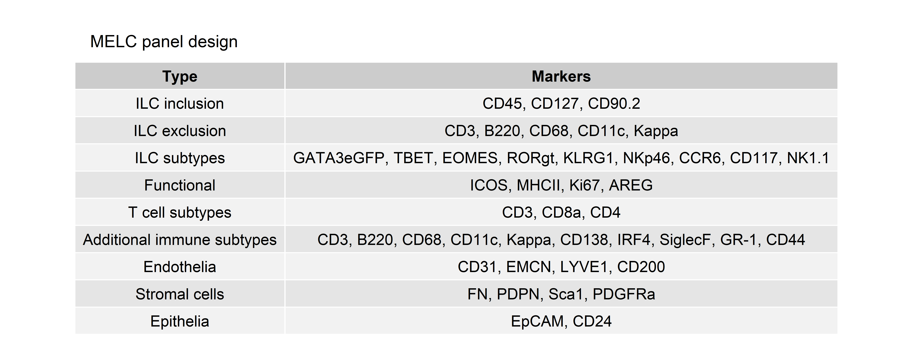

## Libraries


``` r
library(dplyr)
# library(ggplot2)
# library(stringr)
# library(glue)
# library(here)
library(readr)
# library(lubridate)
# library(data.table)
library(ggpubr)
# library(ggrepel)
# library(readxl)
library(readxl)
library(tidyr)
library(here)
```

## Parameters


``` r
set.seed(123)
output_dir <- here::here("2_visualizations_for_figures", "Table_1_files")
dir.create(output_dir)
```

# Loading data tables


``` r
df <- data.frame(
  `Type` = c(
    "ILC inclusion", 
    "ILC exclusion", 
    "ILC subtypes", 
    "Functional", 
    "T cell subtypes",
    "Additional immune subtypes", 
    "Endothelia", 
    "Stromal cells", 
    "Epithelia"
  ), 
  `Markers` = c(
    "CD45, CD127, CD90.2",
    "CD3, B220, CD68, CD11c, Kappa", 
    "GATA3eGFP, TBET, EOMES, RORgt, KLRG1, NKp46, CCR6, CD117, NK1.1", 
    "ICOS, MHCII, Ki67, AREG",
    "CD3, CD8a, CD4",
    "CD3, B220, CD68, CD11c, Kappa, CD138, IRF4, SiglecF, GR-1, CD44",
    "CD31, EMCN, LYVE1, CD200", 
    "FN, PDPN, Sca1, PDGFRa",
    "EpCAM, CD24"
  )
)
```

# Plot data table


``` r
df %>%
  ggtexttable(rows = NULL) %>%
  tab_add_title(
  "MELC panel design",
  face = NULL,
  size = 12,
  color = NULL,
  family = NULL,
  # padding = unit(1.5, "line"),
  just = "left",
  hjust = NULL,
  vjust = NULL
)
```



# Session Information


``` r
sessionInfo()
```

```
## R version 4.4.2 (2024-10-31 ucrt)
## Platform: x86_64-w64-mingw32/x64
## Running under: Windows 10 x64 (build 19045)
## 
## Matrix products: default
## 
## 
## locale:
## [1] LC_COLLATE=English_Germany.utf8  LC_CTYPE=English_Germany.utf8    LC_MONETARY=English_Germany.utf8 LC_NUMERIC=C                     LC_TIME=English_Germany.utf8    
## 
## time zone: Europe/Berlin
## tzcode source: internal
## 
## attached base packages:
## [1] stats     graphics  grDevices utils     datasets  methods   base     
## 
## other attached packages:
## [1] here_1.0.1    tidyr_1.3.1   readxl_1.4.5  ggpubr_0.6.0  ggplot2_3.5.1 readr_2.1.5   dplyr_1.1.4  
## 
## loaded via a namespace (and not attached):
##  [1] gtable_0.3.6       jsonlite_1.9.1     compiler_4.4.2     ggsignif_0.6.4     tidyselect_1.2.1   gridExtra_2.3      jquerylib_0.1.4    scales_1.4.0       yaml_2.3.10        fastmap_1.2.0      R6_2.6.1           generics_0.1.4     Formula_1.2-5      knitr_1.50         backports_1.5.0    tibble_3.2.1       car_3.1-3          rprojroot_2.0.4    bslib_0.9.0        pillar_1.10.2      RColorBrewer_1.1-3 tzdb_0.4.0         rlang_1.1.5        broom_1.0.8        cachem_1.1.0       xfun_0.51          sass_0.4.10        cli_3.6.3          withr_3.0.2        magrittr_2.0.3     digest_0.6.37      grid_4.4.2         rstudioapi_0.17.1  hms_1.1.3          cowplot_1.1.3      lifecycle_1.0.4    vctrs_0.6.5        rstatix_0.7.2      evaluate_1.0.4     glue_1.8.0         cellranger_1.1.0   farver_2.1.2       abind_1.4-8        carData_3.0-5      rmarkdown_2.29     purrr_1.0.4        tools_4.4.2        pkgconfig_2.0.3    htmltools_0.5.8.1
```

``` r
version
```

```
##                _                                
## platform       x86_64-w64-mingw32               
## arch           x86_64                           
## os             mingw32                          
## crt            ucrt                             
## system         x86_64, mingw32                  
## status                                          
## major          4                                
## minor          4.2                              
## year           2024                             
## month          10                               
## day            31                               
## svn rev        87279                            
## language       R                                
## version.string R version 4.4.2 (2024-10-31 ucrt)
## nickname       Pile of Leaves
```
