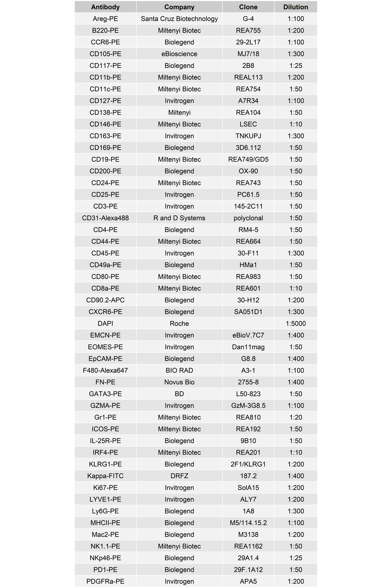
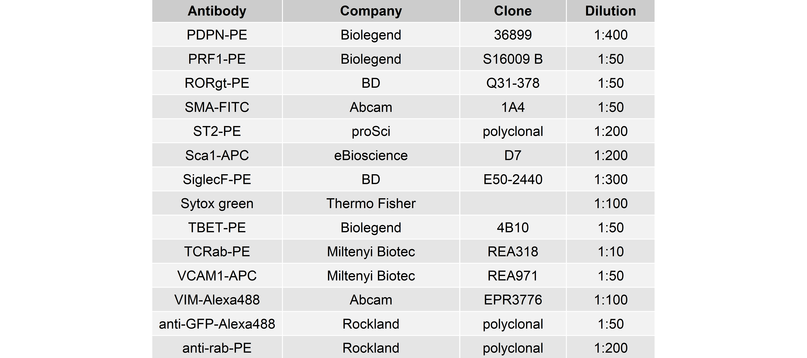

## Libraries


``` r
library(dplyr)
# library(ggplot2)
# library(stringr)
# library(glue)
# library(here)
library(readr)
# library(lubridate)
# library(data.table)
library(ggpubr)
# library(ggrepel)
# library(readxl)
library(readxl)
library(tidyr)
library(here)
```

## Parameters


``` r
set.seed(123)
output_dir <- here::here("2_visualizations_for_figures", "Table_3_files")
dir.create(output_dir)
```

# Loading data tables


``` r
df <- read_excel(paste0(here::here(), "/data/Antibody_panel_MELC.xlsx"))
```

# Tidying

Delete last column and order alphabetically:


``` r
df <- df %>%
  select(-c(`...5`, `...6`, `...7`)) %>%
  arrange(Antibody) %>%
  mutate(Clone = ifelse(is.na(Clone), "", Clone))
```

# Plot data table


``` r
df %>%
  ggtexttable(rows = NULL) 
```


``` r
# 1. Find the row number where the Antibody is "LYVE1-PE"
# The [1] ensures that if there are multiple matches, it takes the first one
split_index <- which(df$Antibody == "PDGFRa-PE")[1]


colnames(df) <- c("       Antibody       ", "             Company             ",  "       Clone       ",    "   Dilution   ")


# 2. Split the data frame into upper and lower based on that index
df_upper <- df[1:split_index, ]
df_lower <- df[(split_index + 1):nrow(df), ]
```


``` r
df_upper %>%
  ggtexttable(rows = NULL)
```




``` r
df_lower %>%
  ggtexttable(rows = NULL)
```



# Session Information


``` r
sessionInfo()
```

```
## R version 4.5.2 (2025-10-31 ucrt)
## Platform: x86_64-w64-mingw32/x64
## Running under: Windows 11 x64 (build 26200)
## 
## Matrix products: default
##   LAPACK version 3.12.1
## 
## locale:
## [1] LC_COLLATE=German_Germany.utf8  LC_CTYPE=German_Germany.utf8    LC_MONETARY=German_Germany.utf8 LC_NUMERIC=C                    LC_TIME=German_Germany.utf8    
## 
## time zone: Europe/Berlin
## tzcode source: internal
## 
## attached base packages:
## [1] stats     graphics  grDevices utils     datasets  methods   base     
## 
## other attached packages:
## [1] here_1.0.2    tidyr_1.3.1   readxl_1.4.5  ggpubr_0.6.2  ggplot2_4.0.1 readr_2.1.6   dplyr_1.1.4  
## 
## loaded via a namespace (and not attached):
##  [1] sass_0.4.10        generics_0.1.4     rstatix_0.7.3      hms_1.1.4          digest_0.6.38      magrittr_2.0.4     evaluate_1.0.5     grid_4.5.2         RColorBrewer_1.1-3 fastmap_1.2.0      rprojroot_2.1.1    cellranger_1.1.0   jsonlite_2.0.0     backports_1.5.0    Formula_1.2-5      gridExtra_2.3      purrr_1.2.0        scales_1.4.0       jquerylib_0.1.4    abind_1.4-8        cli_3.6.5          rlang_1.1.6        cowplot_1.2.0      withr_3.0.2        cachem_1.1.0       yaml_2.3.10        otel_0.2.0         tools_4.5.2        tzdb_0.5.0         ggsignif_0.6.4     broom_1.0.12       vctrs_0.6.5        R6_2.6.1           lifecycle_1.0.5    car_3.1-5          pkgconfig_2.0.3    pillar_1.11.1      bslib_0.10.0       gtable_0.3.6       glue_1.8.0         xfun_0.56          tibble_3.3.0       tidyselect_1.2.1   rstudioapi_0.18.0  knitr_1.51         dichromat_2.0-0.1  farver_2.1.2       htmltools_0.5.8.1  rmarkdown_2.30     carData_3.0-6      compiler_4.5.2     S7_0.2.0
```

``` r
version
```

```
##                _                                
## platform       x86_64-w64-mingw32               
## arch           x86_64                           
## os             mingw32                          
## crt            ucrt                             
## system         x86_64, mingw32                  
## status                                          
## major          4                                
## minor          5.2                              
## year           2025                             
## month          10                               
## day            31                               
## svn rev        88974                            
## language       R                                
## version.string R version 4.5.2 (2025-10-31 ucrt)
## nickname       [Not] Part in a Rumble
```
