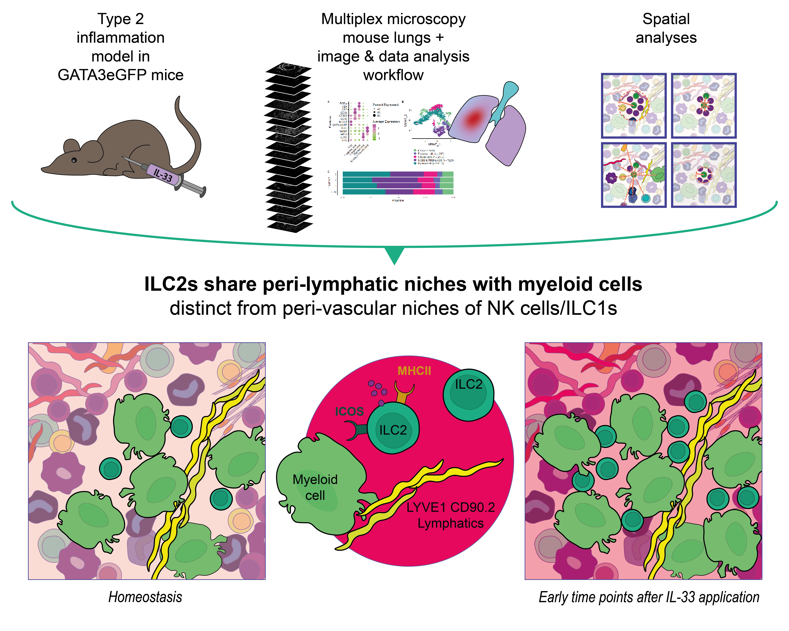

# Spatial analysis of the ILC2 Niche in Murine Lung

## Overview

This repository contains the data analysis workflows and R Markdown scripts for the publication ***Spatial and phenotypic heterogeneity of ILC Subsets in Mouse Lung Under Type 2 Inflammatory Conditions*** (Kroh et al., 2026).

The project focuses on characterizing the spatial architecture of innate lymphoid cells (ILCs) in the mouse lung. By combining a systemic IL-33-driven type 2 inflammation model with high-dimensional cyclic multiplex microscopy, we optimized a workflow to map rare GATA3eGFP+ ILC2 subsets. Our spatial analysis reveals a conserved peri-lymphatic microenvironment where ILC2s were coenriched with myeloid cells and lymphatics across early time points of IL-33-mediated inflammation.

## Key Features

-   **Cyclic Multiplex Microscopy Analysis:** Workflows for processing and analyzing high-dimensional multi epitope ligand cartography (MELC) data.
-   **Spatial Analyses:** Scripts to compute niche analysis, cells in neighborhood (CIN) analysis, minimum distances, and spatial coenrichment analysis of ILC2s
-   **Biological findings:**
    -   ILC2s localize in peri-lymphatic niches together with myeloid cells, and LYVE1+ lymphatics.
    -   The ILC2 niche is conserved across early time points of IL-33 mediated type 2 inflammation.
    -   The peri-lymphatic ILC2 niche is distinct from the peri-vascular niche of NK cells/ILC1s in the parenchyma at early time points of IL-33-mediated inflammation.

## Data availability

To reproduce the figures from the manuscript: 1. Clone this repository: \`\`\`bash git clone <https://github.com/mikrohscopist/Murine_ILC_niches_lung_SI_IL-33.git>

## MELC data analysis

For a detailed description of the analysis workflow, please view our publications. Main steps of the data analysis comprised:

### Image acquisition

### Image pre-processing

### Pixel classification

Pixel classification was done using Ilastik:

-   Berg S, Kutra D, Kroeger T, Straehle CN, Kausler BX, Haubold C et al. ilastik: interactive machine learning for (bio)image analysis. Nat Methods 2019; 16(12):1226–32.

### Segmentation & feature extraction

Probability maps created with Ilastik and 16-bit greyscale images were used as input for segmentation of nuclei and cells as well as feature extraction and data export using CellProfiler 4.0:

-   Stirling DR, Swain-Bowden MJ, Lucas AM, Carpenter AE, Cimini BA, Goodman A. CellProfiler 4: improvements in speed, utility and usability. BMC Bioinformatics 2021; 22(1):433.

### Data analysis

Feature matrix of extracted MELC data from mouse lung samples at homeostasis and at day 1, 2, and 3 (D1, D2, D3 respectively) with cell type annotations of levels 1-3, metadata for conditions and filenames used for quantification and spatial analyses are publicly available here:

<https://zenodo.org/records/20309278>

### Spatial analysis

*Niche analysis, Minimum cell distance* and *Cell in neighborhood (CIN) analysis* was done using the SPIAT package:

-   Yang T, Ozcoban V, Pasam A, Kocovski N, Pizzolla A, Huang Y-K et al. SPIAT: An R package for the Spatial Image Analysis of Cells in Tissues; 2020.

Measured frequencies of the CIN analysis within a 10 µm radius around reference cells are available here: <https://zenodo.org/records/20327671>.

*Coenrichment analysis* was done using the Giotto and VoltRon package:

-   Dries R, Zhu Q, Dong R, Eng C-HL, Li H, Liu K et al. Giotto: a toolbox for integrative analysis and visualization of spatial expression data. Genome Biol 2021; 22(1):78.

-   Manukyan A, Bahry E, Wyler E, Becher E, Pascual-Reguant A, Plumbom I et al. VoltRon: A Spatial Omics Analysis Platform for Multi-Resolution and Multi-omics Integration using Image Registration; 2023.

## Citation

If you use this workflow or data in your research, please cite our publication:

> Kroh, S., et al. (2026). *Spatial and phenotypic heterogeneity of ILC Subsets in Mouse Lung Under Type 2 Inflammatory Conditions*. European Journal of Immunology.

## Contact

For questions regarding the spatial analysis workflow, please contact Sandy Kroh at: sandy.kroh\@charite.de
